# ODS 早餐要来你的城市了！巴黎，还有…

> 原文：<https://towardsdatascience.com/ods-breakfast-is-coming-to-your-city-paris-and-562b1244febd?source=collection_archive---------25----------------------->

## …这取决于你！

这篇文章是对巴黎开放数据科学(ODS)早餐会的庆祝，这是一个关于数据科学和生活的非正式聚会，周六在 Malongo 咖啡馆(靠近圣米歇尔广场)举行。

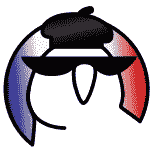

Thanks for the logo to Yulia Dembitskaya

开放数据科学早餐不仅在巴黎提供，在世界各地的许多城市都有。在数据科学早餐会上，你可以和一位数据科学家同事边喝咖啡边谈论数据科学和其他任何事情。

在巴黎的数据科学早餐会上，你可以遇到来自工业界和学术界的人。你会发现数据科学及其他领域的各种专业知识。总的来说，我们拥有数学和物理、计算机科学、量化金融和交易、神经科学、尖峰神经网络、深度学习、优化、统计、网络科学、推荐系统、DevOps、软件和机器学习工程等方面的知识。

请继续阅读，了解你可以从 ODS 早餐中获得的各种健脑食物，并学习社区建设课程。

# 一切开始的地方

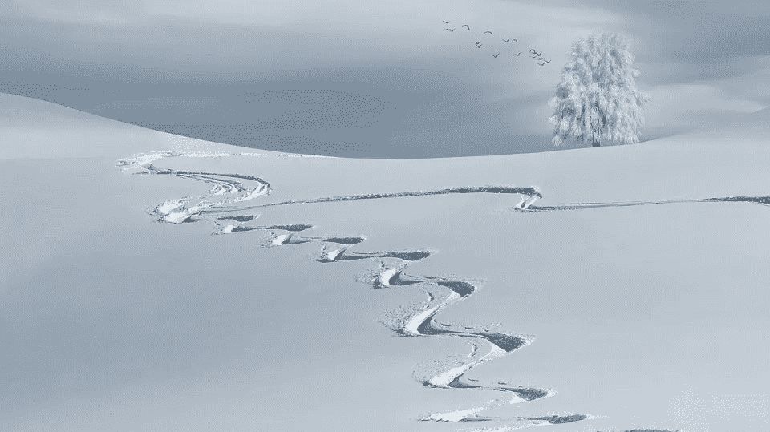

# 来自俄罗斯的爱

数据科学早餐的传统大约始于 2013 年的莫斯科。人们聚在一起吃早餐，在工作前谈论数据科学和生活。数据科学早餐传统传播到俄罗斯和其他国家的其他城市。

数据科学早餐由强大的国际社区——开放数据科学(ODS)提供支持。ODS 团结了数据科学和相关领域的所有研究人员、工程师和开发人员。

引用[https://ods.ai/en/](https://ods.ai/en/)的话来说，该社区的目标是:

🔥创建令人敬畏的项目、事件和教育课程
💪分享经验，发展彼此的技能
📈促进开放数据科学，推动该领域向前发展

除了开放式数据科学早餐会，ODS 还在俄罗斯国内外组织了多项活动。

ODS slack 是俄语的，但是内容质量太好了，以至于很多不会说俄语的人都是带翻译来看的。幸运的是，有一个英语电报频道【https://t.me/opendatascience 聚合了主要的数据科学新闻(这仍然是你在 slack 上能找到的一小部分)。

巴黎的 ODS 早餐在 https://t.me/opendatascience[和 http://opendatascience.slack.com/](https://t.me/opendatascience)的 ODS slack[上公布，在#_meetings_france 频道的](http://opendatascience.slack.com/)[https://ods.ai/en/](https://ods.ai/en/)获得邀请。你可以在[https://data-science-breakfast-in-paris.github.io/](https://data-science-breakfast-in-paris.github.io/)找到关于巴黎早餐的各种信息，还可以提出下次早餐[https://data-science-breakfast-in-paris.github.io/feedback/](https://data-science-breakfast-in-paris.github.io/feedback/)要讨论的话题。

# **在巴黎:开始、成长和未来**

混乱办一直在国际上扩展它的触角，一路走来，把全世界的人都变成了数据科学教的忠实追随者。

这一切都是从 ODS 的一名积极分子度假路过巴黎时开始的，他于 2019 年 1 月 5 日在 Malongo 咖啡馆组织了第一次早餐，并在[https://t.me/opendatascience](https://t.me/opendatascience)上宣布。

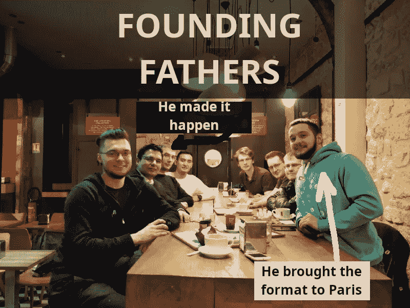

The first Parisian ODS breakfast

他告诉我“你应该继续组织它，让它成为一个传统”。我很高兴我说“当然”，因为早餐吸引了许多聪明有趣的人。

有高潮也有低谷，但总的来说早餐是成功的。出现了低出席率和沉默的情况，但早餐一直在加速。对于标题中有数据的帖子来说，这种说法太定性了。当然，你想要更定量的东西。现在…你一直在等待的…女王陛下…数据。Telegram group 有 90 人，其中大多数至少参加过一次早餐会，而且人数还在增加:

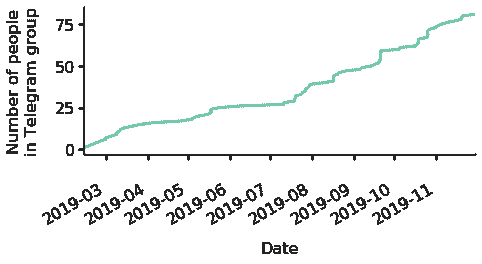

Breakfast is growing. The sky is the limit?

**为什么 DS 早餐社区增长如此稳定？**

1.  **社区。它得到了非常强大的国际社会的支持，并通过其强大的渠道公布。**
2.  **聚会的好形式，**经验证明，世界各地的人都觉得 DS 早餐是一种好形式。
3.  **坚持**。我懂得了坚持的重要性。在第一次有 8 个人参加的早餐后，我组织了第二次，只有我和约翰内斯·蒂勒。多么低谷啊！然而，这只是一个开始；我们只是向前看，这是值得的。在我三月底休假期间，也就是四月的前几周，我们有一段不太活跃的时期，但是我们重新变得更强了。我们不仅吃了早餐，还在其他聚会上见过面，还有两次课后活动。如果你现在来吃早餐，你极不可能只看到两个人。最有可能的是，我们会在 7 点左右(查看下面的整个分布)。
4.  **激活社交网络中的一个枢纽**，被激活的枢纽会带来新的社区成员。猜猜我们最应该感谢谁？对，是国父基里尔给电报集团加了最多的人(见下文)。我在这场比赛中获得了第二名，第三名被[柳波夫·图皮基纳](https://liubovkmatematike.wordpress.com/)获得。柳波夫为社区建设贡献良多。她是一名研究人员，也是社交网络的枢纽。有趣的巧合是，她恰好发表了网络科学方面的科学论文。

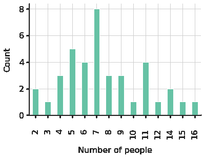

Distribution of the number of people

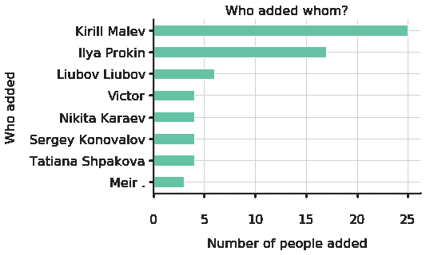

We should thank them for community development

下面，你可以看到谁会出现在巴黎数据早餐会上。

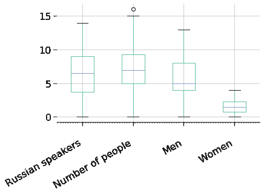

Demographics that is going to evolve

你很可能会看到俄罗斯人，但几乎总是有不讲俄语的人(至少一个)，我们都讲英语，所以每个人都包括在内。我们可以通过吸引更多女性和不会说俄语的人来改进，您也可以加入我们=)

尽管说俄语的人约占 80%(见下图)，但我们坚持说英语，总的来说，早餐服务员至少会说 11 种语言:俄语、英语、法语、德语、汉语、西班牙语、拉脱维亚语、葡萄牙语、芬兰语、吉尔吉斯语、阿拉伯语(如果我忘了什么，请原谅，我肯定忘了)。

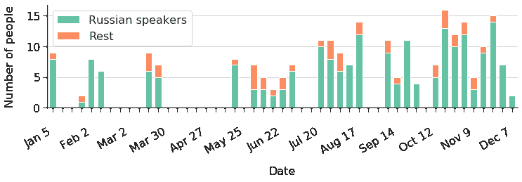

We still have some work to do on diversity. If you don’t speak Russian, please come

ODS 为它的起源感到自豪，但我们有很大的国际野心，我们想吸引更多的非俄语人士。

We want you to join us!

对于一个技术社区来说，我们在性别平等方面做得并不差(大约 20%的女性)，我怀疑我们的一些女性参与者正在策划在 ML meetup 中渗透巴黎女性，并使一些女士皈依 Data 山达基。

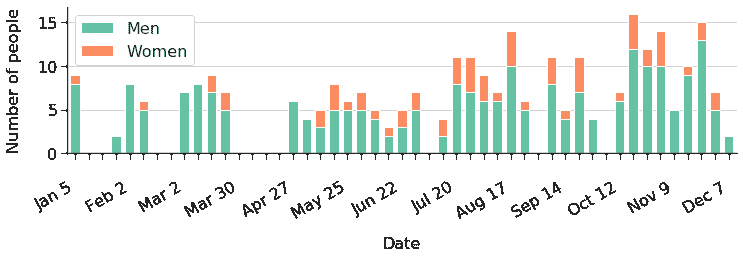

Gender balance that is going to evolve

最初，我们不太擅长记住拍集体照，但随着时间的推移，我们已经提高了我们的拍照纪律，并最终养成了稳定的拍照习惯。

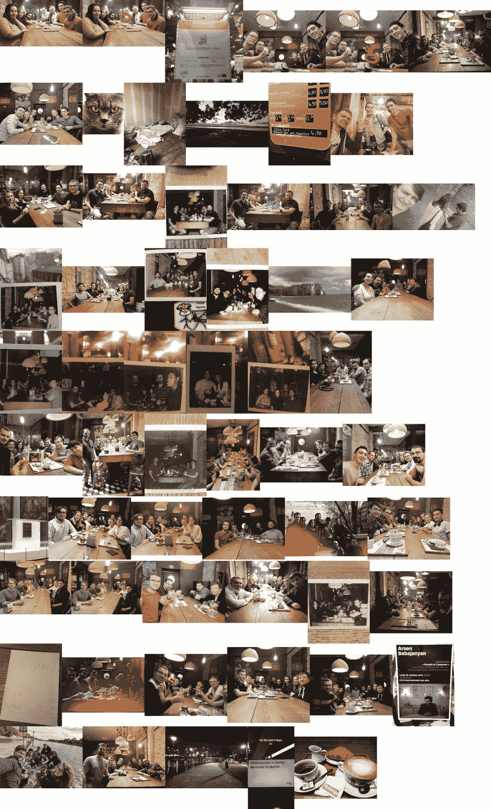

Do you see this nice looking coffee on the bottom-right? It tastes very good as well.

坚持住，伙计们！让我们吸引新的聪明人加入我们的数据科学教派:)

# 这一切将走向何方

早餐的未来是光明的，这取决于社区的集体意志(取决于你！).

前段时间做了一个调查问卷，了解人们的需求。结果如下:

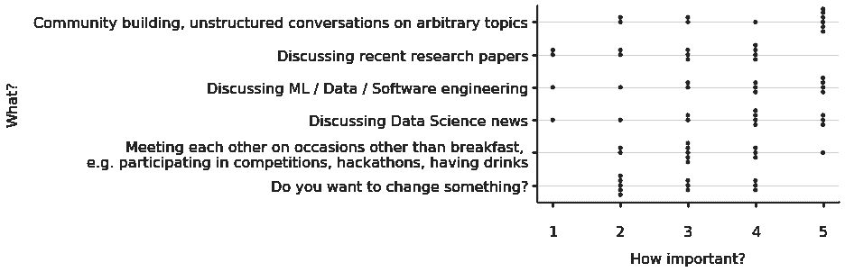

我感谢所有通过填写调查问卷或私下讨论提出想法的人。以下是综合结果:

*   在一周内准备的，可选的不超过 3 DS 的相关主题列表，以供讨论:新闻，论文，我们一些人面临的问题(为人们提供一种简单的方式来提出一周内的主题，以便人们可以在早餐前投票和思考它)。[搞定](https://data-science-breakfast-in-paris.github.io/feedback/)。
*   构建关于社区、社区内服务的信息
*   DS 活动:演讲、黑客马拉松等
*   尝试用周六早餐代替晚上的活动(啤酒？)
*   职业发展相关活动:面试问题、模拟面试等

未来是光明的，来加入我们在 Malongo 咖啡馆。下周六 10:30 见。

# 如果您有兴趣在您的城市设立每周 ODS 早餐，请联系我们:【https://t.me/malev 