# 的支持，正则化和套索的特征选择器！

> 原文：<https://towardsdatascience.com/of-suppandi-regularization-and-lasso-the-feature-selector-2a09acfdbc1b?source=collection_archive---------18----------------------->

Suppandi

可以说，没有与印度常青树漫画英雄苏潘迪的会面，任何印度童年都是不完整的。苏潘迪是典型主角的反面角色，几乎每一项分配给他的任务都搞砸了。大多数关于苏潘迪的故事都是从他得到一条建议开始的，然后苏潘迪只是把这条建议应用到一个例子中，他把事情搞砸了，看起来很愚蠢，尽管他在故事的开始学到了新的知识。我认为没有什么比 Suppandi 的故事更好地解释了机器学习算法中的过度拟合问题。

Suppandi 的故事的第一部分几乎相当于机器学习算法的训练阶段，第二部分是测试阶段，他试图应用他的学习，但却完全错误。这就是当 ML 算法试图从每一个数据点学习而不进行归纳时会发生的情况。

## 过度拟合

在我的[上一篇文章](https://www.analyticsindiamag.com/the-world-of-cost-functions%e2%80%8a-%e2%80%8ainclusivity-majoritarianism-and-oligarchy/)中，我谈到了曲线拟合问题中代价函数的选择。当代表性曲线复杂且曲线参数的数量/值较大时，成本函数往往会过度拟合训练样本，如下图所示。那么，我们如何制作“拟合曲线”,既能从训练数据中学习广泛的模式，又能稳健地应用于看不见的数据呢？实现这个看似难以置信的任务的技术被称为[正则化](https://en.wikipedia.org/wiki/Regularization_(mathematics))。

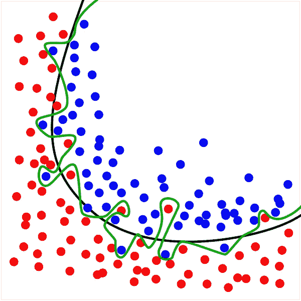

The green line represents the Overfitting Problem ([Image credits](https://commons.wikimedia.org/wiki/File:Overfitting.svg))

文献中谈到了三种正则化技术，它们与我们在上一篇文章中看到的[Lp-范数](https://www.analyticsindiamag.com/the-world-of-cost-functions%e2%80%8a-%e2%80%8ainclusivity-majoritarianism-and-oligarchy/)有着很深的联系。我们将看到这些正则化函数及其性质背后的直觉，甚至看到它们如何成立的一些数学证明。

How many features are needed for humans to predict price of a house?

所有的正则化技术都是为了减少对太多变量的依赖。回到[经典住房问题](https://www.kaggle.com/alphaepsilon/housing-prices-dataset#test.csv)，输入因子或变量在 80 左右。我们知道，使用所有 80 个特征来预测房价是一种矫枉过正。作为人类，我们最多会考虑 10-20 个因素来估算价格。正则化的作用完全相同-尝试将观察到的样本拟合到曲线，但使曲线函数依赖于较少数量的变量。和前面一样，**我们将使用线性回归的例子来更好地理解这一点**。

# 岭正则化

实现这一点最简单的方法是干预成本函数。请记住，在上一篇文章中，我们了解到，由于 L₂范数的包容性和可微性，它可能是成本函数的最佳选择。让我们回忆一下 L₂范数成本函数是什么样子的:

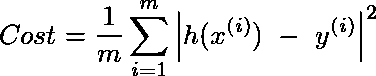

m 指的是我们观察到的总数。还记得 h(x)是基于各种输入因子 x 的线性函数。

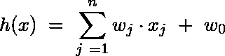

现在，我们希望曲线受尽可能少的因素影响，而不出现误差激增。因此，我们可以修改成本函数，称为岭成本函数，如下所示:

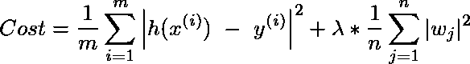

在这个节骨眼上，你们很多人可能还记得，我们在上一篇文章中看到的新求和项的 L₂范数性质。这样做的目的是尽可能降低 xⱼ的权重或系数，并在此过程中降低这些变量的影响。λ的值越高，对正则化的关注就越大。

看待这个问题的另一种方法是最小化以下成本

符合以下标准(山脊函数)

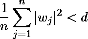

换句话说，在上述项中，系数取值有上限。

**一个有趣的问题出现了，这是否会减少无关因素的影响或完全消除无关变量**。为了回答这个问题，我还想介绍另一种正则化技术和对比，正如你将看到的，将更好地揭示这个问题。

## 套索正则化

这种正则化技术被隐晦地称为 Lasso(“最小绝对收缩和选择算子”)，它将成本函数修改如下:

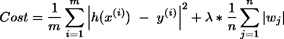

如你所见，山脊和套索的区别就是 L2 范数和 L1 范数的区别。

这个问题可以重新表述为最小化下列成本

符合以下标准(套索功能)

## 哪个更好？

原来 Lasso 顾名思义是一个选择操作符。因此，从减少对太多因素的依赖和聚焦于最重要信号的角度来看，这样做更好。事实上，当脊函数降低了不相关信号的系数时，Lasso 将它们归零。这是如何发生的——让我们试着看看背后的数学原理。

## 套索和山脊功能的可视化

让我们先画出这些函数，以便更好地形象化。假设只有两个参数 w1 和 w2。

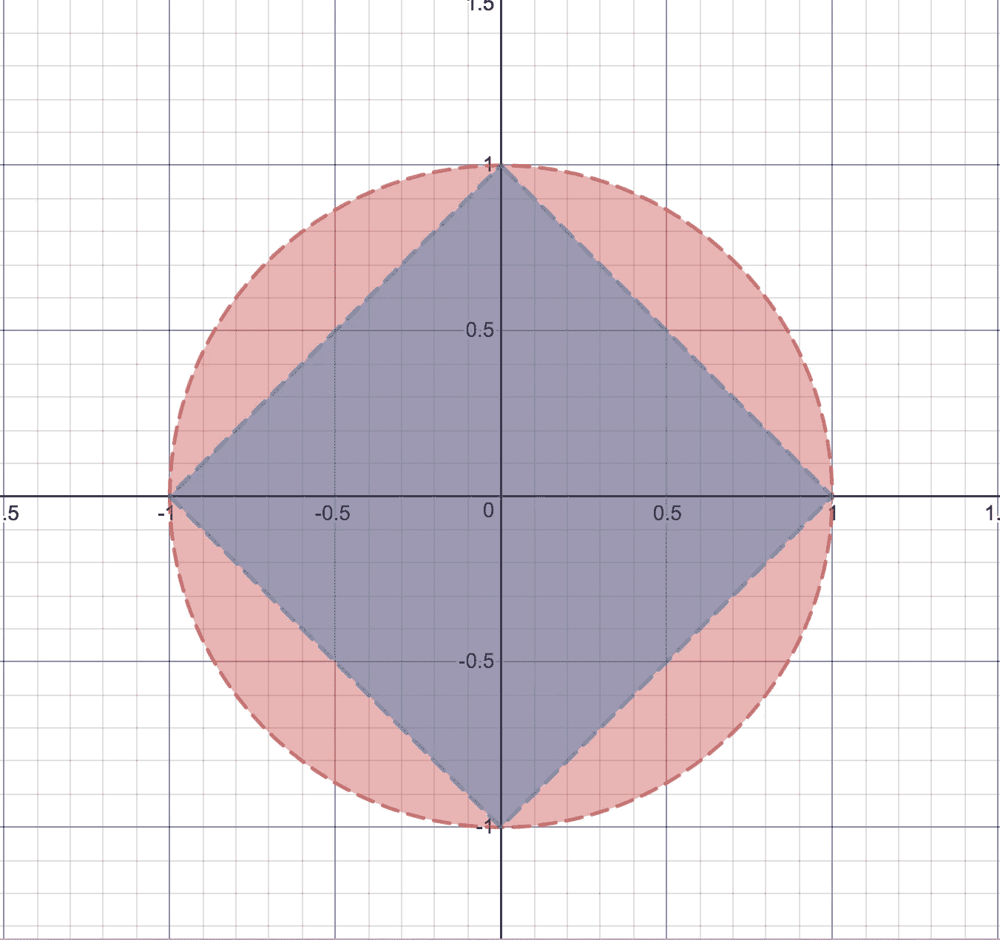

山脊函数显示为由圆形包围的区域，而套索函数显示为由菱形包围的区域。为了清楚起见，脊函数如下:

在这种情况下(两个变量)

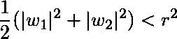

注意，r 是脊圆的半径。

套索函数的公式如下:

在我们两个变量的例子中，套索图基于以下函数:

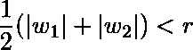

正如我们将要看到的，这两个函数的几何在它们的特征选择能力中起着重要作用。

此时，需要注意的是 ***圆和菱形与轴的交点是导致特征选择的点。***

## 成本函数的等高线

现在让我们画出成本函数的等高线——共享相同成本的点(w1，w2)。

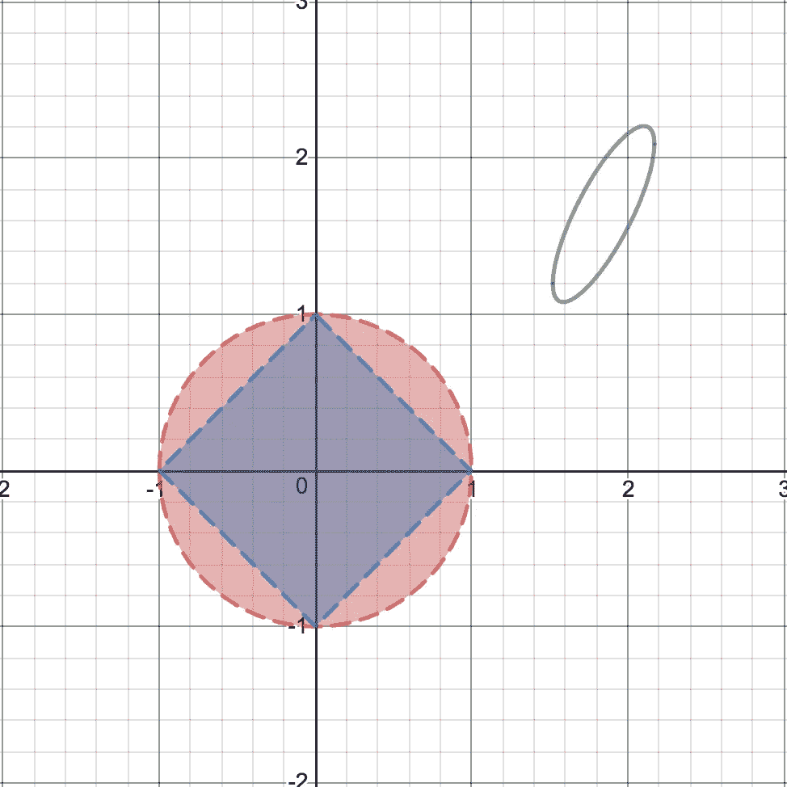

绿色椭圆是特定成本值的成本函数的轮廓。回想一下，成本函数如下:

根据轮廓的定义，椭圆边界中的所有点将具有相同的成本值。

在较高的成本值下，轮廓椭圆将会扩展并向山脊/套索功能移动。等值线椭圆与山脊/套索函数的交点将是满足山脊/套索条件的最低成本值。

## 特征选择-动画

请花一分钟时间观看下面的视频，看看等高线如何与山脊和套索图相交。

如视频所示，轮廓在轴外的一点接触脊圆。然而**轮廓在轴上接触套索菱形，导致特征选择发生！**

这就把我们带到了一个问题——我的十字路口视频只是一个“被操纵的用例”来突出套索的特征选择吗？这种可能性有多大？

## Lasso 多久做一次特征选择？

假设一个随机的椭圆轮廓函数有一个概率 p 在一个特定的轴上相切于脊圆。

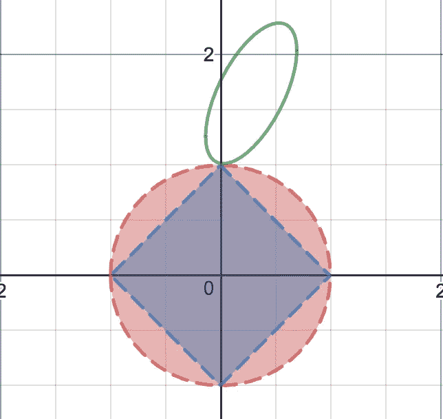

Let probability of ellipse tangential to Ridge circle be “p”

这表明脊函数已经完成了特征选择。换句话说，让脊函数的特征选择概率(P_r)为 P。

根据套索函数的几何结构，套索函数的特征选择概率(P_l)

> P_l > P_r => P_l > p

(套索正方形完全位于脊圆内，因此与圆相切的椭圆也将与正方形相切)

让我们考虑在轴上与脊圆相交但不相切的椭圆。

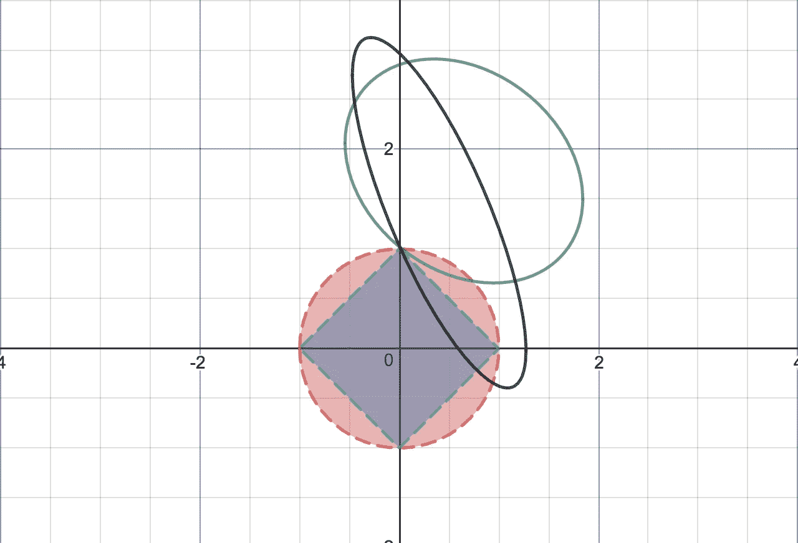

Elliptical countours that intersect at the axes

椭圆轮廓与脊线圆以非相切方式相交的概率= 1 - p

请注意，非相切椭圆可能会像上图中的绿色椭圆或黑色椭圆一样相交。

绿色椭圆仍然是套索正方形的切线，但黑色椭圆不是！这意味着除了 p，Lasso 有一个额外的概率来自这样的椭圆。所以问题如下:

> *椭圆与正方形相切但不与脊线圆相切的概率是多少？*

这取决于椭圆的任何部分是否落在蓝色区域内。

蓝色区域的面积由下式给出

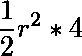

因为蓝色区域由围绕原点的 4 个直角三角形组成。

圆的面积由下式给出

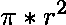

随机椭圆的一部分落入蓝色区域的概率由下式给出

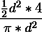

这等于

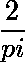

大约是 0.6366

这意味着与脊圆相交的非相切椭圆与套索正方形相切的概率为= 1–0.6366 = 0.3634

> P_l = p + 0.3634 (1 — p)

这意味着，即使 P 是零，P_l 也是 0.3634。换句话说，套索方法保证至少在 36%的情况下进行特征选择！

所以给定 Lasso 和 Ridge 是 L-p 范数，学习可以更一般化。我们看到，在删除要素时，Ridge 比 Lasso 更保守一些。随着 p 的降低，特征选择发生了——不太重要的特征开始被丢弃。还想提到的是，有一些技术如[弹性网](https://en.wikipedia.org/wiki/Elastic_net_regularization)试图在这两者之间取得平衡，我不会在本文中详细讨论。

现在已经学会了套索，我们不禁想，如果我们能给可怜的苏潘迪配备一个套索特征选择器，并帮助他避免在应用阶段的那些尴尬！唉，那样的话，印度不仅会失去一个童年时代的漫画英雄，还会失去一个在我们生命的早期就教导我们需要正规化的人，而我们会从他的错误中吸取教训！苏潘迪虽然成了嘲笑的对象，但毕竟是我们的老师。

首次出现在[印度分析杂志](https://www.analyticsindiamag.com/childhood-comic-hero-suppandi-meets-machine-learning-applying-lessons-to-regularisation-functions/)上。