# 去参加比赛

> 原文：<https://towardsdatascience.com/off-to-the-races-f53c95354c07?source=collection_archive---------41----------------------->

## 靠近赛马场如何影响佛罗里达州禁止赛狗的投票

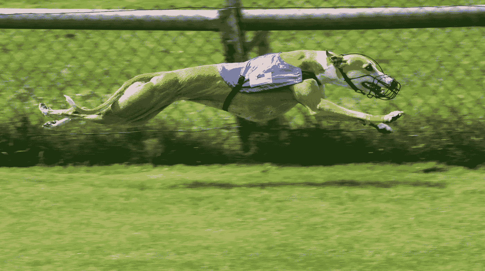

A greyhound in flight. ([Wikipedia](https://commons.wikimedia.org/wiki/File:Greyhound_Racing_2_amk.jpg): [AngMoKio](https://commons.wikimedia.org/wiki/User:AngMoKio))

2018 年 11 月 6 日，佛罗里达州选民以压倒性多数决定禁止一项近 90 年来合法且有利可图的活动:灰狗赛跑。最初于 1931 年合法化的第 13 号修正案将该州所有赛狗活动的截止日期定为 2020 年 1 月。

在当今这个极度极化的时代，该修正案是为数不多的实际上获得两党支持的提案之一:该修正案由时任州司法部长、共和党人帕姆·邦迪(Pam Bondi)提出，并得到了佛罗里达州民主进步党团、前阿肯色州州长迈克·哈克比(Mike Huckabee)、女性选民联盟(League of Women Voters)、该州年轻的共和党党团的支持——[名单在](https://ballotpedia.org/Florida_Amendment_13,_Ban_on_Wagering_on_Dog_Races_Amendment_(2018))上。那些支持禁令的人聚集在一个核心问题上:动物的福利。灵缇非常轻盈和敏捷，能够在跑道上以堪比汽车的速度翱翔。但是，与汽车不同的是，当他们撞到一起或撞到墙上时，没有安全气囊。[自 2013 年](https://www.nytimes.com/2018/11/09/us/greyhound-racing-florida-adoption.html)有记录以来，数百只动物在佛罗里达州的赛道上被记录死亡。[1]即使它们没有在致命的事故中死亡，也经常发现狗被注射了兴奋剂；类固醇，促红细胞生成素，甚至安非他命和可卡因也经常出现在他们的血液中。

另一方面，所有者和轨道运营商大声争辩说，这些只是少数害群之马。他们声称，关闭铁路会扼杀他们的生计，对他们的社区和国家造成经济影响，并结束一个可以追溯到近一个世纪的传统。另外，他们声称，灰狗被培育成工作犬；据他们说，他们能为狗做的最好的事情就是让它们在安全、可控的环境中比赛。其他人，比如坦帕湾时报认为灰狗赛跑已经过时了。大多数歌曲都没有盈利，而且已经有一段时间没有盈利了；人们已经对赛狗失去了兴趣。他们的观点是，我们还不如等着经济窒息而死。

然而，到了最后，这些争论似乎都没有说服选民。超过 69%的人对这项措施投了赞成票，轻松超过了成为该州宪法一部分所需的 60%的门槛。

## 这太酷了！但是为什么呢？

作为一名专门研究政治行为的社会科学家，我经常发现自己在观察社会世界的事物时会想“哦，这太酷了！…但是为什么呢？”这次投票是其中的一次，在几个层面上对我来说很有趣。

首先，我注意到围绕这个问题的大部分报道都是关于动物权利的争议以及饲养者和赛道所有者的抵制。虽然这很有价值，但并没有太多关于什么激励了**选民**———540 万去投票的人声称他们希望这种做法结束。是什么因素激发了他们的立场？为什么他们去投票，为什么这么多人投赞成票？对于许多不同类型的人来说，这显然是一个重要的问题。我认为仅仅从这个角度再深入一点是值得的。

但是当我思考这个问题的时候，我越来越意识到这个问题有一个微妙的角度，这个角度挖掘了选民参与和选择的经典理论的核心。虽然他们的观点遭到了强烈的驳斥(可能是因为他们是多么赤裸裸的自私)，但饲养者和所有者在一件事上是正确的:这些赛道可能会给它们周围的地区带来相当可观的经济利益。对于住在附近的人来说，有一种“理性”的动机让他们愿意留在身边。有人研究过选民对在附近修建体育场的投票提案的反应，但据我所知，还没有任何研究关注与*现有*资源的接近程度如何影响围绕*保留*资源的投票。

# 在思考了这些事情之后，有两个问题显得既重要又容易解决:

1.  **靠近铁轨如何影响人们对第 13 修正案的选择？**
2.  **靠近铁轨是如何影响人们投票决定第 13 修正案的？**

# 游戏中的一些皮毛

为了透明起见，我不能完全声称对这个话题完全没有偏见。还有一个原因让我想到了轨道如何影响选民选择和参与的问题。我在这场游戏中得到一些皮毛。

当选举日到来时，我在第 13 修正案的选票上留了空白，因为我不认为这个问题应该以某种方式成为我们宪法的一部分；这是一个政策问题，我认为，政策应该通过立法机构通过，而不是成为国家基本宪章的一部分而变得顽固不化。然而，我的妻子对这项禁令投了赞成票。当我读到通过这项法律意味着成千上万的狗将无家可归时，我坚持我们应该收养一只。毕竟，我们的家庭对他们的状况负有部分责任--至少我们可以向至少一个人敞开心扉。(无论如何，这可能符合也可能不符合我收养一只狗的长期愿望……)。

长话短说:见见我们的灰狗，那家伙(或简称为“家伙”)。

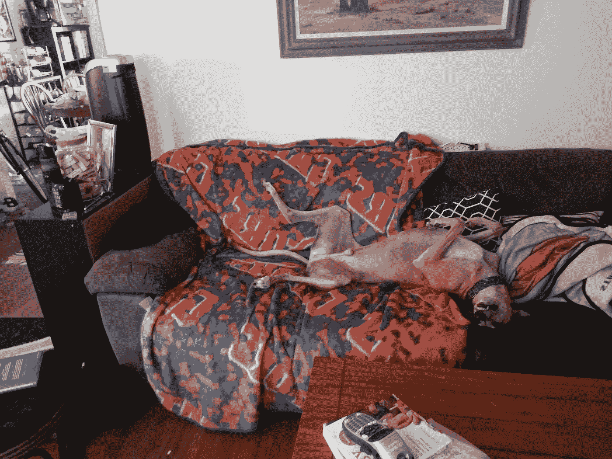

Such magnificent animals…

花花公子以“[飞行骁龙](https://www.trackinfo.com/dog.jsp?runnername=FLYIN%20SNAPDRAGON)的名字参赛了近 3 年。“在那段时间里，他参加了 167 场比赛，赢得了其中的近 10%。投票后一个月，他就退休了，尽管不管结果如何，这很可能会发生。赛狗通常在两岁到五岁之间比赛；这家伙上一场比赛只差不到 4.5 英里。

除了为了赌徒的利益而追踪的稀疏指标之外，我们对他头四年半的生活知之甚少。我们知道他可以(现在仍然可以)在三步之内达到将近 40 英里的时速。我们知道他喜欢鸡爪和兔肉干；我们在教他如何上下楼梯时利用了这一点。我们知道他在来我们家之前，到福斯特家的时候就有了他的第一个玩具。我们知道他的腹部和臀部已经秃顶——可能是不可挽回的，最有可能的原因是被迫在没有衬垫的表面上重复躺了太长时间。我们知道他仍然知道发射枪的声音；他僵硬地站着，他的肌肉明显绷紧，就像一个压缩的弹簧在努力解开，无论何时他听到任何声音，从一个散落的烟花到消声器回火。

我们知道他是一个快乐、深情的男孩，他正在享受退休生活。我们知道他很受宠爱，他再也不会缺少玩具和舒适的床上用品了。

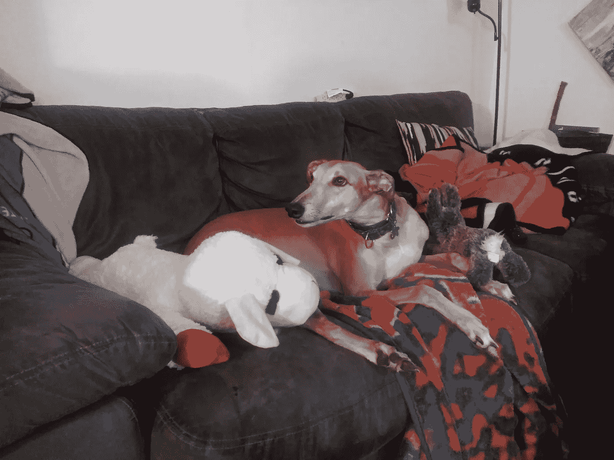

我不想暗示所有参赛和拥有这些狗的人都是无情或邪恶的。我知道他们中的许多人非常关心他们的动物，并对他们可能会伤害它们的暗示犹豫不决。但在我看来，这是一个有问题的行业，充满了不正当的激励。我尽最大努力不让这种观点影响我的定量分析，但我不会在处理数据的时候假装自己神奇地破解了它，从而侮辱任何人的智慧。毕竟，它的存在是显而易见的，事实上我甚至选择了首先研究这个主题。我所能做的就是在我分析的每一步中尽可能的坦率和透明。

# 靠近灰狗赛道会如何影响选民投票率和偏好？

## 靠近心脏还是太近而不舒服？

一方面，我们可能认为住在铁轨附近(并投票)的人更喜欢让铁轨敞开着。这些赛道产生了大量的金钱，人们可能不想从它们身上获得有价值的经济资源。这与钱袋投票的经典理论相一致:人们投票支持符合自身经济利益的事情。

**另一方面，住在铁轨附近的人可能*不太支持*保持铁轨畅通。**在选举期间靠得更近([由于积极分子更活跃，反对这项运动的信息更容易获得)可能会让他们不愿意支持如此接近的争议性事物。毕竟，没有人喜欢觉得自己是虐待动物的同谋；身体上的接近可能会使责任感难以合理化。即使赛道附近的选民支持整个行业，并对动物权利活动家的说法持怀疑态度，他们可能也不希望赛道及其所有争议靠近他们的居住地。简而言之，他们可能不介意灰狗赛跑作为一项事业，但他们可能会优先考虑自己的感受。](https://grey2kusa.org/pdf/2016.03.19_Naples_Daily_News.pdf)

## 鼓舞人心还是令人沮丧的投票率？

就像投票选择一样，*是否投票的决定可以通过两种方式由赛道的接近度决定。**那些离赛道更近的人可能会对问题更感兴趣**，这可能会让他们更有可能就此投票。**但这种接近可能意味着他们更加矛盾，在邻避感、经济利益和一系列其他因素之间更加矛盾。**矛盾心理意味着人们不会对这个或那个问题有更强烈的感受；如果人们没有强烈地倾向于一个选项而不是另一个，他们一般不太可能就这个问题投票。*

简而言之，靠近铁轨可能会以几种不同的方式影响选民在 2018 年的行为。我决定进行调查，如果有的话，经得起审查。在对选民投票率和投票数据进行空间分析后，我发现，平均而言，靠近灰狗赛道会使人们更有可能支持第 13 号修正案，但他们不太可能投票。

接下来的两节详细介绍了我的方法以及如何构造数据。任何仅对结果感兴趣的人都应该跳到**分析**标题。

# 我是如何进行分析的

## 方法

我有几个方法可以解决这个问题。理想情况下，我们可以查看该州每个人如何投票的记录，并将他们居住的地方与最近的赛马场进行比较。如果统计理论是我们唯一的考虑，那至少是理想的。一如既往，它不是。最大、最明显的问题是，这将违反无记名投票。一般来说，人们不希望每个人都知道他们是如何投票的——这对于这种方法是必要的。

另一种可能性是委托对从该州选民档案中随机选择的人进行调查，并询问他们如何投票。然而，虽然调查数据在试图充实*人们为什么会这样做*时非常有用(我为我的研究设计、实施和分析了调查；你永远也不会听到我大规模地说它们的坏话)，当要求人们回忆一年前他们是如何投票的时候，它们可能没有太大的帮助。人们往往会忘记他们的实际立场，并合理化他们投票给了实际获胜的选项。

相反，我使用我为 [*VEST*](https://dataverse.harvard.edu/dataverse/electionscience) (投票和选举科学团队)构建的数据，这些数据从每个县(主要由不屈不挠的 [Brian Amos](https://brianamos.com/) 收集和构建)获取选区级形状文件，合并 2018 年每个州级竞选的选区级投票数，并将它们聚合成一个单一的全州文件。这让我可以看到佛罗里达州大约 6000 个选区中每个选区对第 13 修正案的支持程度和投票率，也可以看到它们离该州开放的灰狗赛道有多近。然后，我使用计算社会科学和机器学习中的常用工具线性回归[4]来估计邻近性对选区一级选民行为的影响，并看看这种影响在统计上是否显著。我在 R 中做了这个分析，并在我的 [Github](https://github.com/prlitics) 中发布了我曾经这么做的所有代码——尽管我也会在整篇文章中发布代码来展示我是如何得出我的结论的。

## 数据来源

*   [2018 年佛罗里达州全州选举的背心形状文件](https://github.com/prlitics/MediumAnalyses/blob/master/GreyHoundVoting/VESTFL18StateWide.zip)
*   [该州开放灰狗赛马场的位置](https://github.com/prlitics/MediumAnalyses/blob/master/GreyHoundVoting/dogtracks.csv)

## r 分析所需的软件包

```
library(ggmap)
library(tidyverse)
library(sf)
```

# 准备数据

## 狗道位置

为了弄清楚靠近该州的灰狗赛道如何影响政治行为，首先可能有助于弄清楚 2018 年各州赛道在哪里。强调过去时态。根据你阅读的对象，2018 年有 [11](https://www.nytimes.com/2018/11/09/us/greyhound-racing-florida-adoption.html) 、 [12](https://www.grey2kusa.org/about/states/fl3.php) 或 [13](https://www.actionnewsjax.com/news/local/greyhound-racing-ban-would-mean-loss-of-400k-in-education-funding/733758022) 首曲目在运营。2019 年，这一数字已经减少到[六(在撰写本报告时)](https://www.grey2kusa.org/about/states/fl.php)。令人震惊的是，没有一篇新闻报道附有这些痕迹所在位置的详细经纬度坐标。面对这些困惑，我决定去查阅̶t̶h̶e̶̶a̶l̶l̶-̶k̶n̶o̶w̶i̶n̶g̶̶o̶r̶a̶c̶l̶e̶维基百科。具体来说，我查阅了他们关于美国灰狗赛跑的文章，以获得该州所有记录在案的赛道名称。然后，我在谷歌上搜索这些名字，看看是否有任何日期在 2018 年 11 月之前的新闻文章谈到赛道关闭。如果选举的时候铁轨还在运行，我就数了一下。这让我在 2018 年有了 13 条活跃的赛道。[5]然后，我通过谷歌地图找到并记录下了*地点的经纬度坐标。这些可以在上面的链接中找到，并通过阅读 csv 加载。*

```
tracks <- read_csv("dogtracks.csv",col_names = T)
```

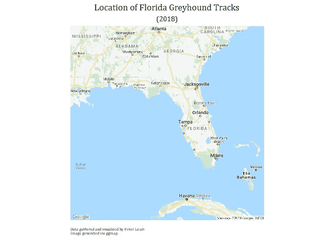

## 辖区地图

一旦我们确定了 2018 年该州有多少条赛道(以及它们位于何处)，我们就可以继续加载佛罗里达州的选区形状文件。如上所述，我使用了`sf`库中的`st_read`函数。因为背心数据不记录 z 坐标(询问一个选区的海拔高度和询问单手鼓掌的声音一样有意义)，所以我让 R 知道我们不需要担心这个特定的维度。

```
FL.2018.Precs <- st_read("VEST18Gen.shp")FL.2018.Precs<-st_zm(FL.2018.Precs, what = "ZM")
```

然而，我们*所做的*需要担心的是，我们如何将灰狗赛道(一个点)的位置与投票区(一个多边形——而且通常是怪异的、看起来不规则的多边形)进行比较。我选择实现的解决方案是测量从选区中心(也称为[质心](https://en.wikipedia.org/wiki/Centroid))到最近轨道的距离。这归结为假设选区质心代表住在那里的选民的平均家庭地址。严格地说，这不是 100%真实的。有时质心暗示人们正生活在一个无人居住的区域的正中央，像一个湖，一个森林，或者——以真正佛罗里达人的方式——一个沼泽。但是，没有人口普查数据或地理参考州选民登记文件中的每一项记录，这是一个有用的假设，反映了我们能够合理做到的最好情况。

幸运的是,`st`包也有`st_centroid`函数，正如它的名字所暗示的那样:寻找数据帧中所有空间对象的质心。

```
prec.cents<- st_centroid(FL.2018.Precs)
```

使用`ggplot`和`geom_sf`的组合，我们可以浏览一下所有这些质心的位置。

```
cent.pic<-ggplot()+geom_sf(data = FL.2018.Precs, fill = "#E8EAE8")+
  geom_sf(data = prec.cents, color= "#0856AF", size = .7)+theme_nothing()+
  ggtitle("Centroids of Florida's 2018 Election Precincts")+
  theme(plot.title = element_text(hjust = .5, size = 14))

cent.pic
```

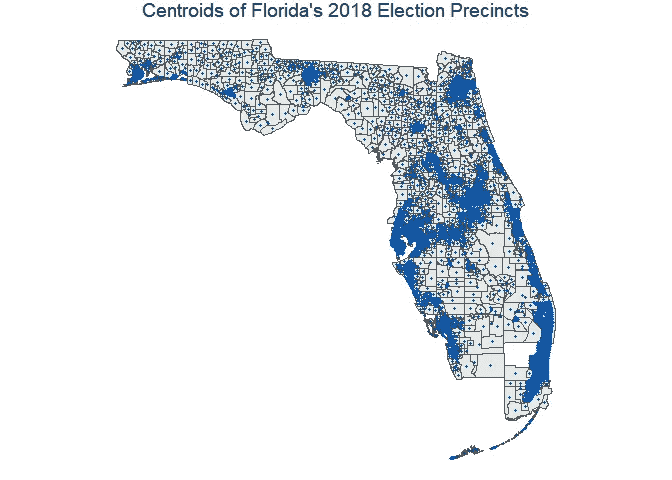

这些点融化成无定形斑点的地方显示了许多选区紧密聚集在一起的区域。非巧合的是，这些也是该州人口最稠密的地区。

## 质心和狗轨迹之间的距离

现在我们已经有了选区的中心和该州狗的足迹的位置，我们正准备比较两者之间的距离。首先，我们必须让 R 知道`tracks`数据帧应该作为一个空间对象而不是一个标准数据帧来读取。

如果我们查看我收集的关于该州的轨迹的信息，我们可以看到地理信息以两列表示:经度(**长**)和纬度(**纬度**)。`st_as_sf`函数将使用这两列将其转换成空间数据。

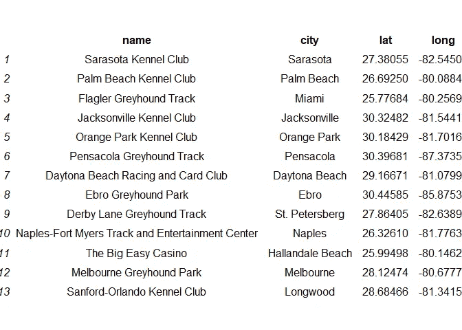

```
tracks<- st_as_sf(tracks, coords = c("long","lat"),crs = 4269)
```

您会注意到，我为一串看似随机的数字设置了一个名为“crs”的选项。CRS 代表 **C** 坐标 **R** 参考 **S** 系统——是试图将一个 3D 球体展平为一个 2d 矩形的必然结果。卡尔·弗里德里希·高斯是第一个明确证明球体不可能在没有某种扭曲的情况下变成平面的人。[6]CRS 指定了我们正在使用的许多普遍的、方便的变形中的哪一种。4269 将其设置为联邦政府的标准 NAD83。我们需要将轨道的 CRS 设置为与区域质心相同，否则我们将无法充分比较它们之间的距离。

```
prec.cents.crs<-st_crs(prec.cents) #CRS for the Precinct Centroids

tracks.right.crs<-st_transform(tracks,prec.cents.crs) #Transforms the tracks spatial data to the right coordinate system.
```

现在数据可以相互关联了，我使用`st_distance`函数来测量区域质心和狗轨迹之间的距离。这创建了一个大矩阵(我将其命名为`track.cent.dists`)，其中每行代表一个选区的质心，每列代表一条灰狗路线。该值是它们之间的距离，单位为米([m])。我将`track.cent.dists`转换成一个数据帧(我称之为`dists.df`)。我放了前五列和前五行的快照，让大家对它有个大概的了解。

```
track.cent.dists<-st_distance(prec.cents,tracks.right.crs) #Distance matrix

dists.df<-as.data.frame(track.cent.dists) #Converts into dataframe
```

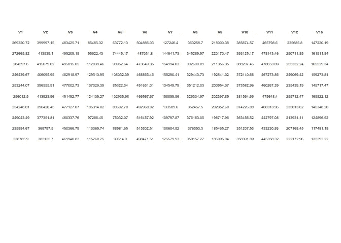

## 选区质心和狗轨迹之间的最短距离

shapefile 中大约 6100 个区域中的每一个都与 13 个距离相关联；每个状态 13 对应一个距离，然后运行轨道。虽然这些信息很有趣，但我只对最近的轨道的距离感兴趣:也就是说，最小的*距离。如果我只使用`mutate`并基于所有列(V1，V2，V3...V12，V13)像这样:*

```
dist.min<-dists.df %>%
  mutate(mindist =  min(V1,V2,V3,V4,V5,V6,V7,V8,V9,V10,V11,V12,V13))%>%
  select(mindist)
```

这会给我 6100 行 330.274 米的长度——这是投票区和赛狗场之间最短的距离。相反，我需要逐行选择最小值。tidyverse 中有一个非常方便的函数`rowwise`可以让我做到这一点。(我还将这个数字除以 1609 米，得到更符合美国标准的英里数)。[7]

```
dist.min<-dists.df %>%
  rowwise()%>%
  mutate(mindist =  min(V1,V2,V3,V4,V5,V6,V7,V8,V9,V10,V11,V12,V13)/1609) %>%
  select(mindist)
```

因为每个分区是按照它在质心数据帧中列出的顺序进行评估的，所以我们可以恢复使用`cbind`分配的分区标识符 VEST。

```
dist.min.ids<-cbind(dist.min, Pct_std = as.character(prec.cents$Pct_std))
```

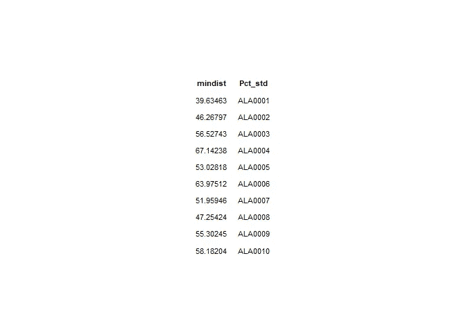

然后，我们可以使用这些 id 与原始辖区状态文件中的数据合并。(在处理空间数据时，注意使用`sp::merge`而不是普通的`merge`！)

```
Spatial.Doggies <- sp::merge(x = FL.2018.Precs, y = dist.min.ids, by = "Pct_std")
```

## 投票选择和投票率

准备数据进行分析的最后一步是构建我的选区级投票选择和投票率的衡量标准。对于这些，我依靠最初在背心数据中发现的变量，这些变量现在在我称为`Spatial.Doggies`的数据框架中。对于投票选择，我将对第 13 号修正案的赞成票(`G18AM13Yes`)除以对该修正案的总票数(`G18AM13Sum`)。对于投票率，我将第 13 修正案的投票数除以该地区登记人数(`SumRegis`)。我将这个值编码为 1(相当于 100%的投票率),以说明除了那些在选区登记的人之外，还有哪些县计算了在选区投票的人。[8]我还删除了一个不包含任何数据的选区名称，它似乎被棕榈滩县用来指定空选区(`PAL00NP`)。

```
Spatial.Doggies <- Spatial.Doggies %>%
  mutate(per.yes = G18AM13Yes/G18AM13Sum,
         doggy.turnout = G18AM13Sum/SumRegis,
         doggy.turnout = case_when(
           doggy.turnout > 1 ~ 1,
           TRUE ~ doggy.turnout
         ))%>%
  filter(!(Pct_std == "PAL00NP"))
```

# 分析

## 第一眼

使用我们构建的数据和`ggplot`，我们可以看到距离如何影响投票选择和投票率。下图显示了距离如何影响第 13 号修正案的区级支持(左)和投票率(右)。

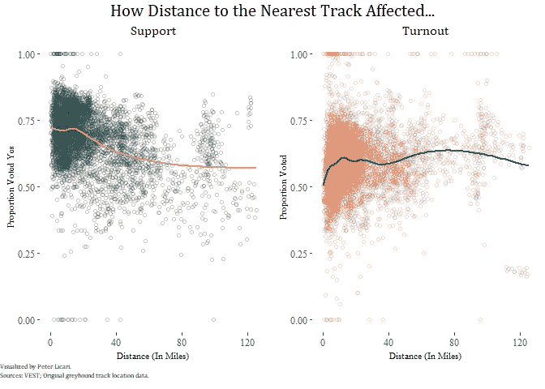

总的来说，该州的大多数选区都非常支持这项措施:平均支持率为 68.5%，与该州 69.0%的总体水平非常接近。在该州 75%以上的选区，它清除了成为该州宪法一部分所需的 60%的门槛。然而，即使有这种普遍的支持，橙色趋势线也显示了一个非常清晰的模式:该辖区越靠近灰狗赛道，支持禁止它们的投票者就越多。

投票率的情况要稍微复杂一些。2018 年的选举投票率非常高；自第一次世界大战前以来，我们还没有过这么高的中期投票率。这也让很多人——至少相对而言——对灰狗事件进行了投票；全州平均每个选区的投票率为 59.4%。但是越靠近铁轨的选区，投票率反而越高，估计投票率最低。数据显示了一种曲线模式，当我们远离最接近的位置时，投票率会上升，但一旦我们超过一个临界点，投票率就会开始下降。这可能是因为附近的人对赛道感到矛盾，阻止他们投票，而远处的人距离太远，无法强烈感受到这种或那种方式。

## 更精致的外观

虽然这很有启发性，但故事肯定会更加复杂。回顾该州赛马场所在的地方，似乎只有距离这些赛道 120 英里以外的地方是相当偏远的。狗和跑道的主人声称比赛是他们传统的一部分；这可能是一个更容易被该州农村地区的人们接受的论点，因为从历史上看，该州这些地区的居民往往不屑于政府对他们遗产的干预。另外，可能还有其他混淆因素。也许这个辖区更自由？即使该修正案是由该州当时的共和党司法部长提出的，动物权利也往往是自由主义者和进步人士更热衷的一项事业。也许他们更有可能支持修正案，因为他们已经参加了该州的州长或参议员竞选？赛狗可能不是人们特意去投票的事情，但如果他们已经出来了，为什么不去做呢？

**这就是 OLS 回归派上用场的地方。**OLS 越来越多地用于数据科学中(也是近半个世纪以来定量社会科学中的主力)，它使研究人员能够估计特定变量的独立影响，同时保持模型中包含的所有其他变量不变。它有一些奇妙的统计属性，让它做到这一点(至少当一切正常时[9])——但对于这项研究的意图和目的，我们需要知道的是，它让我们看到当我们控制其他相关因素时，距离的影响是否仍然显著。

可惜这方面马甲数据欠缺。通常对于投票率和投票选择的研究，最好的做法是控制年龄、种族、性别、党派 ID、性别、教育水平、对政治的兴趣、对问题的感受，或者至少尽可能多的控制这些事情(以及其他事情)。背心数据没有任何心理变量——这有点超出了项目的范围——也没有任何描述性变量。理论上，应该可以从 2018 年开始获取该州的选民登记文件，并估计选区级别的特征。事实上，这实际上是项目的下一个计划步骤，我可以节省几个小时。有一些可行的替代概念，为理论提供了一个体面的测试。具体来说，选区面积(乡村性的代表)、注册选民的数量(选区人口的代表)、注册选民和选区面积的商(人口密度)、投票给民主党州长候选人 Andrew Gillum 的选区百分比(选区级政党 ID)以及州长竞选的投票率(向下投票刺激)。接下来的几行代码将这些变量添加到`Spatial.Doggies`数据帧中。

```
Spatial.Doggies <- Spatial.Doggies %>%
mutate(area = st_area(Spatial.Doggies),
      voter.density = SumRegis/area,
      gperc = G18GOVDGil/G18GOVSum,
      gturn = G18GOVSum/SumRegis,
      gturn = case_when(
        gturn > 1 ~ 1,
        TRUE ~ gturn
      ))
```

下一步是构建一组线性回归，将选区一级的投票选择和投票率作为结果变量。

```
choice.reg <- lm(data = Spatial.Doggies, per.yes ~ mindist + area + voter.density + gperc+ gturn +SumRegis)

turnout.reg <- lm(data = Spatial.Doggies, doggy.turnout ~ mindist + area + voter.density + gperc+ gturn +SumRegis)
```

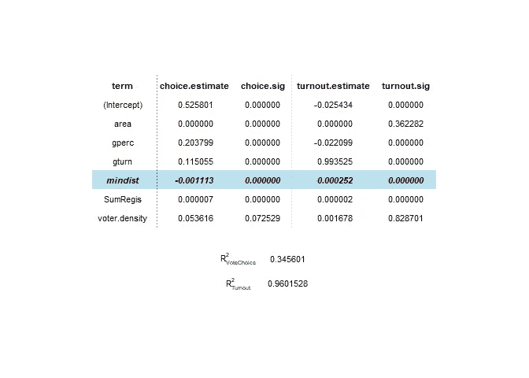

上表显示了回归模型的结果和变量的统计显著性。(对于那些不熟悉回归模型的人:估计列中的正数意味着该数字的增加与结果变量的增加有关；阴性结果与结果的减少有关。**符号**显著性栏中的数字越小，表示统计显著性程度越高)。在解释选区的支持水平和投票人数时，离铁轨的距离具有统计学意义。一个选区距离最近的轨道每 10 英里，该措施的平均支持率就会下降约 1.1 个百分点。这与选民希望铁轨远离他们的隐喻后院的想法是一致的——从这一分析中还不清楚是因为越来越多的关注还是仅仅为了避免头痛。每 10 英里的距离，该选区的投票率预计会高出 0.2 个百分点。这与选民在这个问题上更加矛盾的想法是一致的；他们很可能受到迫使他们投赞成票和反对票的担忧的交叉压力，所以他们选择根本不投票。这两个值很容易超过传统的统计意义水平；我们可以很有信心，最近的赛道里程的影响不是零。这些数字看起来并不多，但当考虑到关于说服和投票效果的文献时，这是正常的高端——尽管这通常专注于个人水平，而不是投票区，所以这有点像苹果和橘子。

(作为一个有点书呆子气的统计题外话:即使我没有我喜欢的所有变量，模型仍然在解释结果方面做得很好。道岔模型的 *R* 为 2 . 36— —这实际上对社会科学研究来说相当不错——而道岔模型中的 *R* 2 约为 0 . 95，这是非常高且极其罕见的。这些数字意味着我的模型分别解释了结果中 36%和 95%的差异——这意味着即使是这些简单的模型也能很好地解释选区一级的投票选择和投票率。它总是可以改进的，但我相当有信心，这里观察到的关系至少是在正确的大方向上。)

为了总结我的分析，我决定将该州的每个选区可视化，基于它们相对于该州其他地区是否有低、中、高投票率以及低、中、高支持度[10]。我正在为另一个帖子保存我是如何制作这张地图的，但我认为它实在太酷了，不能不分享。

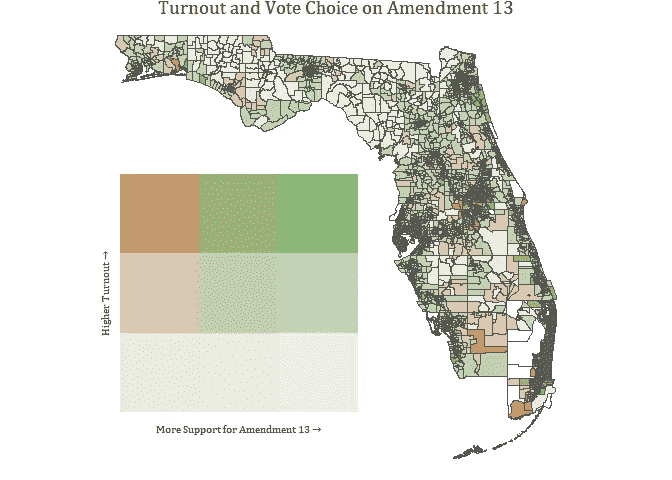

# 灰狗的下一步是什么？

尽管投票本身已经成为历史，但这个故事还远未结束。赛道和狗主人目前正在起诉该州，声称该州的宪法修订委员会违反宪法针对他们的行业。他们认为，至少，他们应该得到他们的动物和/或财产的价值补偿。一位主人声称他们的每只[狗价值高达 5 万美元](https://www.orlandosentinel.com/news/os-ne-greyhound-lawsuit-racing-ban-20190805-364ybd7njveedf4svtpkjmvike-story.html)。如果是这样的话，那我们就有一个绝对便宜的家伙了。我们只花了 300 美元就从我们的[本地灰狗救援美国分会](http://www.gpagainesville.org/Intro/Available_for_Adoption.html)领养了它，它给我们生活带来的快乐让这 5 万美元看起来微不足道。(相信我，考虑到我的学生贷款，我不会轻易这么说……)

## 也就是说，大多数观察家(包括我自己)认为，这些所有者从政府那里获得接近这一数额的可能性非常小。2018 年绝大多数选民发出信号，他们不希望灰狗赛跑在该州继续进行；这些资金将直接来自他们的税收，这可能会激怒他们。

很难争取到这些人真正想要的支持:废除死刑。在投票率很高的一年里，第 13 号修正案在该州大部分地区以压倒性的支持获得通过。甚至和其中一条赛道在同一个选区的选民也不倾向于投票让它们继续开放。这可能不一定是因为他们不同意赛狗的想法——来自辖区一级的投票率的证据与我们在附近的人高度矛盾的情况下看到的一致——但在离家这么近的地方有争议的事情是有代价的。

至少在佛罗里达，灰狗赛跑已经走到了尽头。

Peter R. Licari 是佛罗里达大学政治学博士生，专攻美国政治行为和政治方法论。所表达的意见是他自己的。在[*YouTube*](https://www.youtube.com/channel/UCuCCVkVbWmYmgg7W9x2Y30g)*和推特(*[*@ PRLPoliSci*](https://twitter.com/PRLPoliSci)*)上也能找到他。剩下的一点点业余时间都花在了长跑上，和他耐心的妻子斯蒂芬妮玩电子游戏，遛狗，和他的猫亚洲进行奇怪的富有成效的单边对话。*

[1]也很少有证据表明这些数据是完整的。事实上，缺乏一丝不苟的记录是动物保护主义者的抱怨之一

[2](总之，这取决于体育场会在多大程度上扰乱他们的生活和生计。)

[3]选区是由郡维持的地区，以便更好地管理选举。一般来说，人们根据选民登记中列出的地址被分配到特定的选区投票。每个选区可能有几个到几千人登记投票。

[4]我选择了线性回归而不是逻辑回归，因为尽管我使用了比例，但我无法获得潜在值的模式(由于无记名投票)。我可以想象使用 tobit 回归，但是没有审查的证据——价值观通常受到合理的约束。

[5]顺便说一句，这也让我拼凑出了歧义，因为即使是维基百科也注意到了 2018 年的 11 首歌曲。几条赛道由同一家公司运营，位于杰克逊维尔地区之外。对我的分析来说，重要的是人们在狗赛跑的地方附近--所以我坚持 13 这个数字。

[6]地图的应用显而易见，但由于地球不是一个完美的球体，这变得更加复杂。

[7]现任和前任田径运动员们，没错:一英里不是 1600 米。是 1609 以上的一毛。事实证明，很少有人真正记录过一英里赛跑的时间，而不是 1600 英里。这可能看起来很迂腐，但这意味着比世界纪录慢了 1.3 秒。

[8]在任何人过早行动之前(双关语):这并不意味着人们在错误的选区投票就犯了欺诈罪。有些县在允许人们投票的地方比其他县更宽松。人们很少去错误的地方——选民欺诈更是少之又少——所以这是数据中一个不幸但微不足道的错误。

[9]出于好奇，我还运行了控制误差项中地理聚类的模型。结果基本相似。

[10]我把低和高都定义为偏离平均值超过一个标准偏差。中等，然后，在 1 个标准偏差差异之内