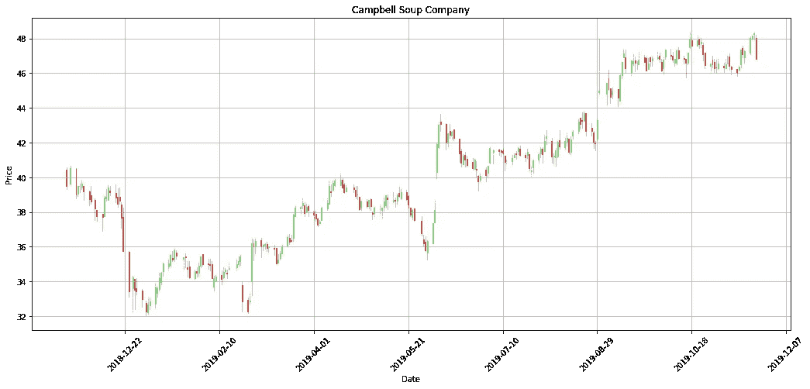
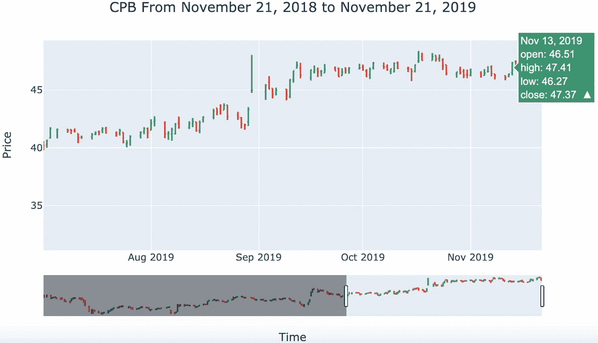
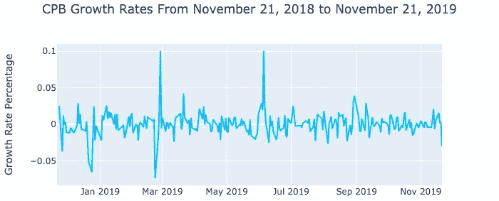
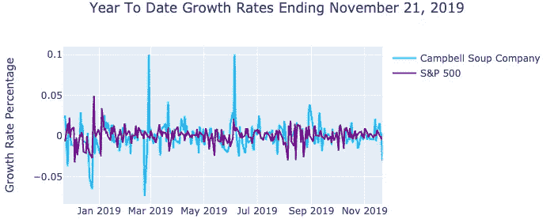

# 带有 Python 库的 OHLC 图表

> 原文：<https://towardsdatascience.com/ohlc-charts-with-python-libraries-c58c1ff080b0?source=collection_archive---------17----------------------->

Python 程序员可以使用几个图形库。最流行的两个是 [Matplotlib](https://matplotlib.org/) 和 [Plotly](https://plot.ly/) 。选对库要看你的情况。我在两个库中重新创建了 OHLC ( [开盘-盘高-盘低-收盘](https://en.wikipedia.org/wiki/Open-high-low-close_chart))图来突出这些差异，并包含了下面的代码。

# Matplotlib

Matplotlib 是我开始用 Python 编程时学会使用的第一个图形和绘图库。这是一个高度可定制的库，这既是它的优势也是它的弱点。您可以为您的特定目的制作强大的可视化，但是有大量可定制的代码需要调整。

Matplotlib 的[财务模块](https://matplotlib.org/api/finance_api.html)已被弃用，并被移至`mpl_finance`模块。许多在线教程没有反映出这一变化，但是，该补丁相对容易用 PIP 包安装工具实现。我专门为这个练习创建了一个新环境，因为我不想在我的主环境中使用这个模块。该模块以 zip 文件的形式位于 Matplotlib 的 GitHub profile 上，命令如下:

`!pip install [https://github.com/matplotlib/mpl_finance/archive/master.zip](https://github.com/matplotlib/mpl_finance/archive/master.zip)`

我决定绘制金宝汤公司(CPB)的年初至今(YTD) OHLC 图，截至 2019 年 11 月 21 日。数据是从[雅虎财经](https://finance.yahoo.com/quote/CPB/history?p=CPB&.tsrc=fin-srch)下载的。

Plotting the YTD OHLC chart for the Campbell Soup Company with Matplotlib. The data came from Yahoo Finance and the tutorial was made by Harrison Kinsley.

主要的困难是解开熊猫数据框的行，并将日期字符串转换成 Matplotlib 的[浮点数格式](https://matplotlib.org/3.1.1/api/dates_api.html)。我的日期是字符串格式的，所以我可以使用 Matplotlib 的`datestr2num()`方法。

The Campbell Soup Company YTD chart created with Matplotlib

# Plotly

Plotly 提供了许多产品，包括一个用于 Python 语言的开源图形库。Plotly 提供了许多交互式图表，包括几个特定于金融的图表。我重新创建了坎贝尔 OHLC 年初至今图表如下。

The code for a Plotly OHLC chart with a rangeslider for the Campbell Soup Company

Plotly 在熊猫数据框中运行良好。这些柱子可以直接使用，不需要拆开它们。在 Plotly 的 OHLC 图表部分有几个可用的选项。这段代码生成了一个带有 rangeslider 和 hovertext 的交互式图表。rangeslider 允许您放大特定时间段，悬停文本提供有关该数据点的更多信息。该图表的静态图像如下:

An image of the interactive Campbell OHLC chart produced with Plotly. The rangeslider below allows you to zoom in on a time period.

A zoomed in version of the Plotly chart with a rangeslider and hovertext window open.

# 增长率

我用熊猫和 Plotly 制作了两个增长率图表。Pandas 的`pct_change()`方法计算行条目之间的百分比变化。我利用 Plotly 的[线和分散](https://plot.ly/python/line-and-scatter/)函数创建了这个图表，代码如下:

The code for a Plotly growth rate line chart

您也可以向图中添加多条轨迹。我比较了 Campbells 的增长率和标准普尔 500 指数的增长率:

The Campbell Soup Company YTD growth chart with Plotly

The Campbell Soup Company and S&P 500 growth chart with Plotly

# 比较和总结

Matplotlib 和 Plotly 在数据科学家的工具包中都有它们的位置。Matplotlib 是高度可定制的，但是需要更多的编码和数据准备，这是非常耗时的。Plotly 用相对较少的代码创建了强大的交互式可视化。我更喜欢用 Plotly 制作 OHLC 图表。您可以根据自己的目的决定需要哪个库。