# 啤酒节:使用 Pandas、Matplotlib 和 Plotly 进行快速分析

> 原文：<https://towardsdatascience.com/oktoberfest-quick-analysis-using-pandas-matplotlib-and-plotly-79778367a4c?source=collection_archive---------4----------------------->

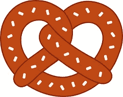

**啤酒节** 2019 已经开始了！**慕尼黑啤酒节**是世界上最大的啤酒节，自 1810 年以来每年在**慕尼黑**举行。它从 9 月中旬或下旬持续到 10 月的第一个周日，持续时间为 16 至 18 天，每年有超过 600 万游客。🍺 🍺

Munchen.de 是慕尼黑市的官方门户网站 **Munich** 包含 140 多个数据集，涵盖经济、交通、旅游或文化等广泛主题。目前，越来越多的欧洲城市提供了开放的数据门户，允许公司、市民、研究人员和其他公共机构利用生成的数据。对于本文，我们使用了从 1985 年至今的慕尼黑啤酒节的数据。虽然大部分年份都没有(记得 1810 年开始的啤酒节！)，该数据集提供了关于该节日在过去 30 年中如何演变的宝贵见解。

 [## 慕尼黑啤酒节-慕尼黑啤酒节 1985 - 2018 -开放数据门户

### 十月节的日期是十月节的最后一天，也是十月节的最后一天…

www.opengov-muenchen.de](https://www.opengov-muenchen.de/tr/dataset/oktoberfest/resource/e0f664cf-6dd9-4743-bd2b-81a8b18bd1d2) 

让我们开始吧！🍻

# 关于图书馆的信息

为了评估数据集，我们使用三个不同的 Python 库:Pandas、Matplotlib 和 Plotly。

*   [**Pandas**](https://pandas.pydata.org/?source=post_page---------------------------) 是一个用于**数据科学**的 **Python** 开源库，允许我们轻松处理结构化数据，例如 **csv 文件**、 **SQL 表**或 **Excel 电子表格**。它提供了以不同格式读写数据、执行探索性分析和清理数据(重塑数据集、处理缺失数据或合并数据集)的工具。
*   [**Matplotlib**](https://matplotlib.org/)**是一个 Python 2D 绘图库，可用于 **Python** 脚本、 **Jupyter 笔记本**和**IPython**shell 等环境中，生成高质量的图形。Matplotlib 提供了广泛的可视化，如直方图，条形图，散点图，箱线图，或饼图。**
*   **[**Plotly Python**](https://plot.ly/python/) 图形库作为 Matplotlib 提供了广泛的可视化。但是，与 **Matplotlib** 不同的是， **Plotly** 提供的可视化是交互式的，更加直观。😉**

**在概述了本分析中使用的库之后，我们准备开始下一步:探索性数据分析和数据清理。**

# **探索性数据分析和数据清理**

****探索性数据分析**包括分析数据集的主要特征，通常采用**可视化方法**和**汇总统计**。目标是理解数据，发现模式和异常，并在我们执行进一步评估之前检查假设。**

**从 **Munchen.de** 下载 csv 文件后，我们可以使用[**Pandas . read _ CSV**](https://pandas.pydata.org/pandas-docs/stable/reference/api/pandas.read_csv.html)函数将其加载到 Pandas 数据框中，并使用 [**pandas 可视化前 5 行。data frame . head**](https://pandas.pydata.org/pandas-docs/stable/reference/api/pandas.DataFrame.head.html)**方法。****

****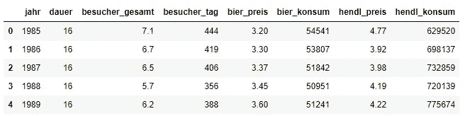****

****数据集包含 8 列:(1)年份，(2)持续时间，(3)游客总数，(4)每日游客数，(5)啤酒价格，(6)啤酒消费量，(7)鸡肉价格，(8)鸡肉消费量。****

****数据类型不合适和缺少值是数据集最常见的问题。我们可以用 [**熊猫轻松分析这两者。data frame . info**方法。该方法打印关于数据帧的信息，包括列类型、非空值的数量和内存使用情况。](https://pandas.pydata.org/pandas-docs/stable/reference/api/pandas.DataFrame.info.html)****

****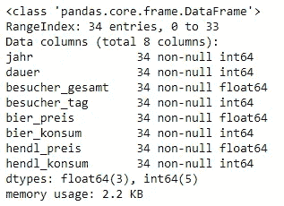****

****检查数据集中是否有空条目的其他方法如下:****

****我们还可以使用**熊猫来评估数据类型。DataFrame.dtypes** 属性。这将返回包含每列数据类型的序列。****

****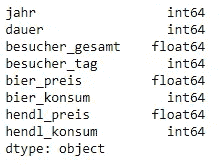****

****数据集不包含空值，并且数据类型是预期的类型，因此不需要重要的清理任务；但是，我们可以执行一些小的更改，以便于进一步分析数据集。****

1.  ****删除 besucher_tag(每日访客数)列，因为我们不会在评估中使用它。****
2.  ****将列名翻译成英语。****
3.  ****将年份设置为数据框的索引。以便于访问不同年份的信息。****

****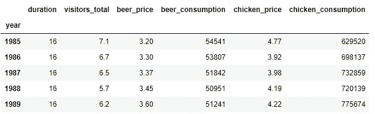****

****执行更改后，我们可以使用数据轻松地得出结论。💪 🍻我们开始吧！▶️****

# ****回答问题并得出结论****

******探索性数据分析**和**数据清理**是让我们对数据集有所了解的步骤，并让数据集准备好使用它轻松得出结论。现在！我们准备使用数据集回答以下问题。****

## ******在过去的 33 年里，啤酒价格是如何变化的？还有鸡肉价格？有倾向吗？******

****正如我们在下面的图中看到的，**从 1985 年到 2018 年，价格稳步上升**，2018 年的价格比 1985 年高出约三倍。****

****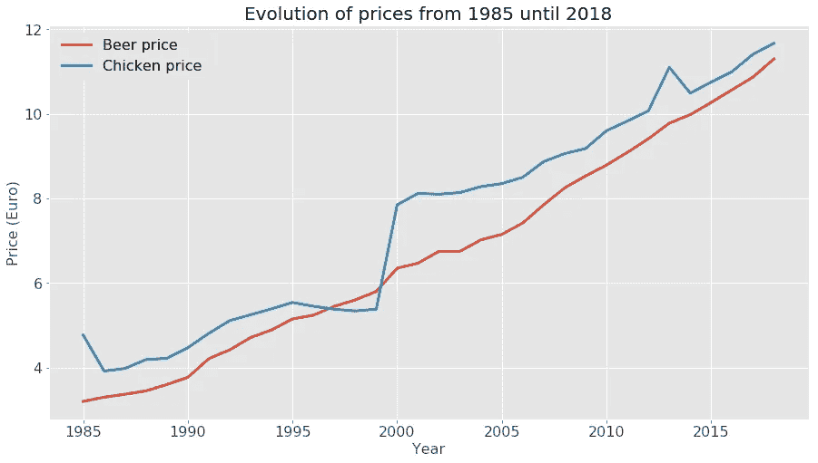****

****1985 年，我们只需 7.97 欧元就可以在啤酒节享用一餐。三十年后，我们需要几乎三倍多的钱才能在节日里享用一餐。💰****

****我们还可以使用 **Plotly** 创建一个交互式价格图！💚****

****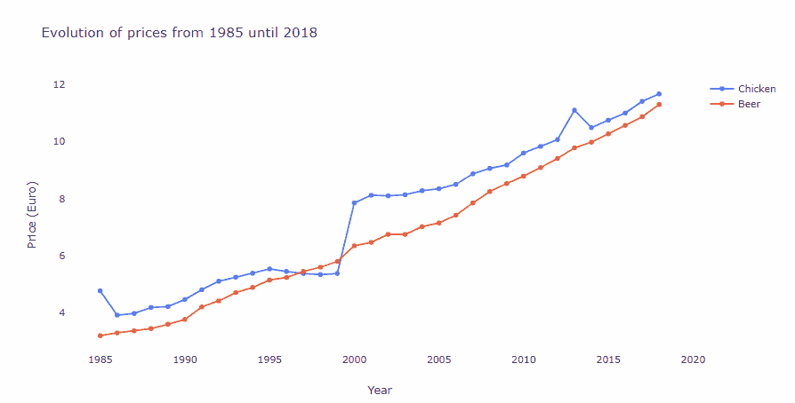****

****我们可以观察到价格可以用一个线性关系来近似(在啤酒的情况下更准确)。稍后，我们将使用简单的线性回归来预测 2030 年的价格！****

## ****从 1985 年到 2018 年，啤酒消费量如何变化？还有鸡肉消费？有倾向吗？****

****下面的图表显示了从 1985 年到现在的啤酒消费量。****

****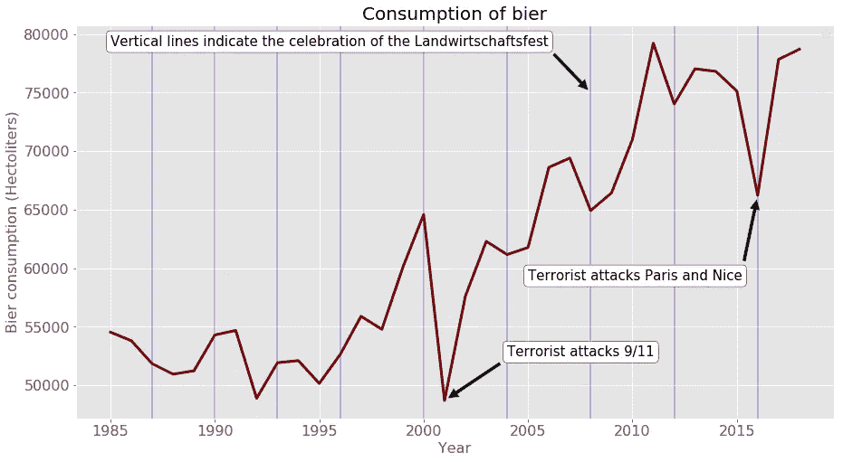****

****正如我们所观察到的，啤酒的**消费量呈现出**增长趋势**。竖线表示啤酒节与德国经济节的庆祝时间一致。自 1996 年以来，这个节日每四年在 Theresienwiesen 啤酒节的同一时间举行一次。我们可以看到，2004 年、2008 年和 2012 年的小幅下降可能与庆祝这一节日有关。相反，2001 年和 2016 年啤酒消费量的显著下降可能与 2001 年的 9·11 恐怖袭击、2015 年 11 月的巴黎恐怖袭击和 2016 年的尼斯卡车袭击有关。游客数量在那些年(2001 年和 2016 年)有所下降，呈现 1985 年以来的最低值。******

**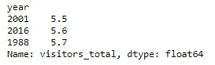**

**下面的图代表了从 1985 年到 2018 年的鸡肉消费量。我们不难观察到，鸡肉的**消费量呈现**下降趋势**，同时也受到了 2001 年和 2016 年恐怖袭击的影响。****

**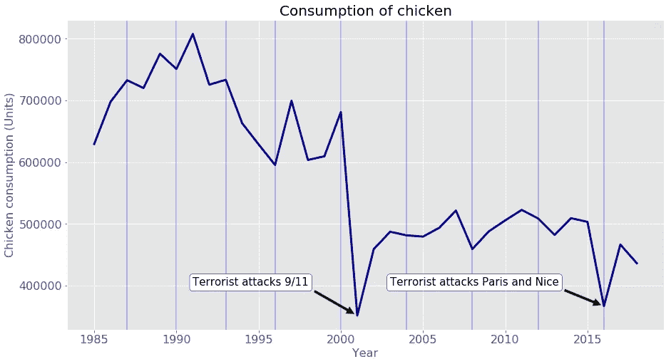**

## **从 1985 年到 2018 年，游客数量是如何变化的？有倾向吗？**

**我们可以很容易地使用折线图来分析访问者的数量。正如我们所观察到的，访问者的数量没有遵循任何趋势，从 5.5 到 7.1 不等。**

**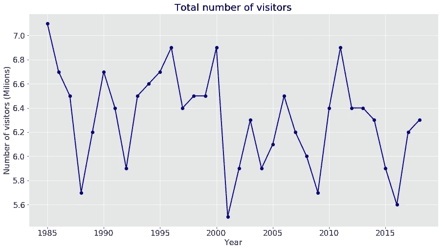**

**所以，啤酒的消费并不是因为节日有更多的游客而增加，而是因为人们喝得更多。😆 🍻**

## **巴伐利亚其他民间节日啤酒价格是否也在上涨？**

**啤酒节可能是巴伐利亚最著名的民间节日，但当然不是唯一的！🍻巴伐利亚人知道如何恰当地庆祝，他们在巴伐利亚的许多城市组织节日，不仅仅是在慕尼黑❤️！现在我们就来分析一下巴伐利亚其他著名民间节日的物价演变。在过去的几年里，价格也稳步上升了吗？▶️让我们看看！**

**为了进行这种分析，我们使用下面文章中的啤酒价格。**

** [## 因此，他参加了巴伐利亚州的群众大会

### bier preis-brems 在维也纳？慕尼黑-讨论了一个两人的问题

www.merkur.de](https://www.merkur.de/bayern/so-viel-kostet-mass-auf-bayerischen-volksfesten-7428217.html) 

这篇文章包含了巴伐利亚 8 个不同的民间节日的信息。我们可以通过使用如下的 [**pandas.read_html**](https://pandas.pydata.org/pandas-docs/version/0.23.4/generated/pandas.read_html.html) 函数轻松下载文章中的表格:

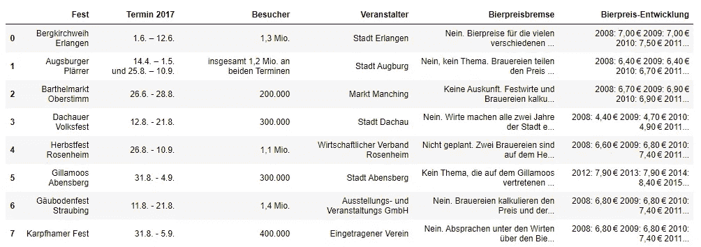

该表包括:(1)节日名称，(2)节日日期，(3)游客数量，(4)组织者，(5)啤酒价格信息，以及(6)从 2008 年到 2016 年的啤酒价格演变。不好意思，文章是德语的！😊

我们只对分析啤酒价格感兴趣，因此我们可以创建一个只包含最后一列中的价格的数据框。这些价格必须在不同的列中，因为整齐的数据集包含放在自己单元格中的每个值。为了提取年份和价格，我们使用正则表达式和 [**re.findall( *模式*，*字符串*， *flags=0* )**](https://docs.python.org/2/library/re.html#) 函数。该函数将一个*字符串*中*模式*的所有匹配作为一个字符串列表返回。然后，我们为每个节日创建一个字典，其中的键包含年份，值包含啤酒的价格。创建词典后，我们可以将它们放在一个列表中。最后，我们用这个字典列表作为 [**熊猫的论据。DataFrame**](https://pandas.pydata.org/pandas-docs/stable/reference/api/pandas.DataFrame.html) 函数，获得如下数据帧。

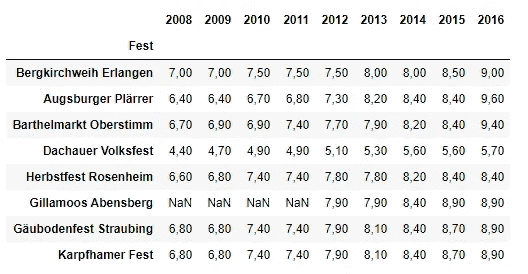

在将数据框可视化之前，我们必须对其进行一些修改。首先，我们必须修改所有列的数据类型，因为它们必须包含浮点数而不是字符串。然后，我们必须转置数据框，因为默认情况下，数据框索引是绘图的 x 轴，数据框的每一列代表可视化中的不同线。最后，我们包括 2008 年至 2016 年啤酒节的啤酒价格。

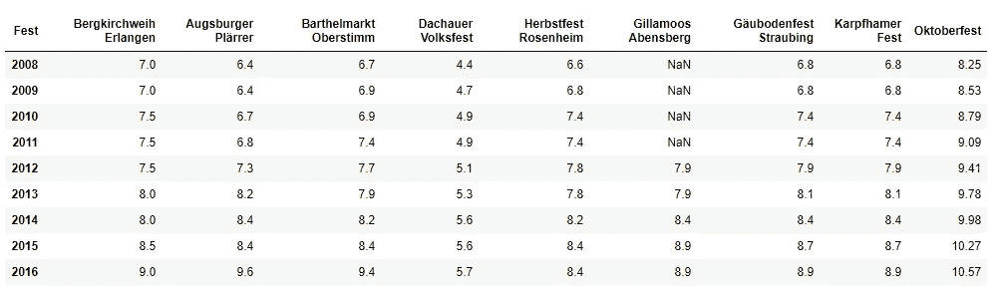

现在，我们已经准备好可视化巴伐利亚州不同节日的**价格**演变。正如我们所观察到的，巴伐利亚其他节日的啤酒价格也在上涨。然而，**啤酒节**的价格比其他民间节日要高，是**达绍尔大众节**最经济的一个。

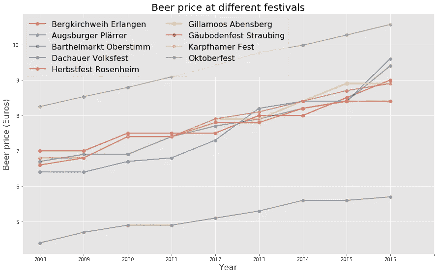

大多数节日里啤酒的价格都很相似；因此，使用 matplotlib 进行清晰的可视化是不可能的。或者，我们可以像以前一样使用 plotly 库。这个库可以进行交互式绘图，允许悬停在点上，选择和取消选择线，以及放大/缩小。

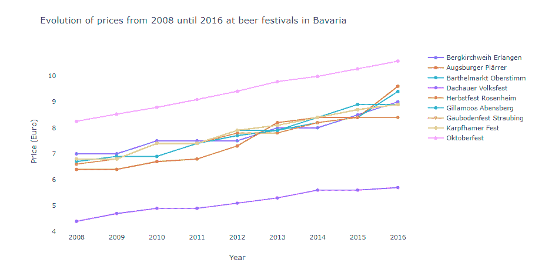

我们还可以计算出不同年份和前几年啤酒价格的变化百分比。

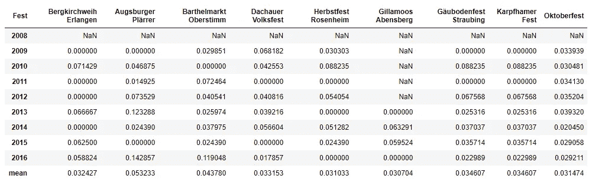

该表显示，与其他民俗节日相比，啤酒节的价格上涨更加均匀，每年大约上涨 3%。其他民俗节日呈现不太统一的价格增量；然而，有些年份的增量比啤酒节的增量大得多。

**plottly**允许在地图上制作**动画散点图**，这样我们不仅可以看到不同年份的啤酒价格，还可以看到不同民间节日所在的地方。首先，我们必须在数据框架中包含庆祝节日的城市的纬度和经度。包含节日场地的准确纬度和经度会更准确，但是对于这个可视化来说，城市的纬度和经度是一个很好的近似值。

为了获得城市的纬度和经度，我们使用了 geopy。获得城市的位置后，我们将该信息包含在之前创建的数据框中。我们必须再次转置数据帧，因为我们希望节日成为帧的索引。

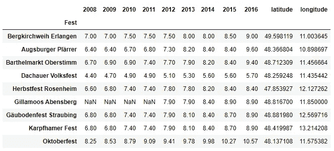

根据我们想要显示的可视化效果，数据框应该有这样或那样的形状。要使用[**Plotly Express**](https://plot.ly/python/plotly-express/)函数 **px.scatter_mapbox** ，我们必须首先融化我们的数据框，将年份显示为一个变量。我们可以看一下 [**pandas.melt**](https://pandas.pydata.org/pandas-docs/version/0.23.4/generated/pandas.melt.html) 文档来了解它是如何工作的。👌

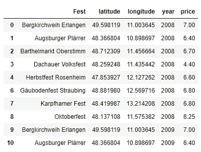

现在，我们有了一个整洁的数据框来使用 **px.scatter_mapbox 创建散点图。**我再次鼓励你阅读 [**文档**](https://www.plotly.express/plotly_express/#plotly_express.scatter_mapbox) 来理解提供给函数的参数。

瞧！我们有散点图，在这里我们不仅可以看到价格，还可以看到从 2008 年到 2016 年的节日地点。💪

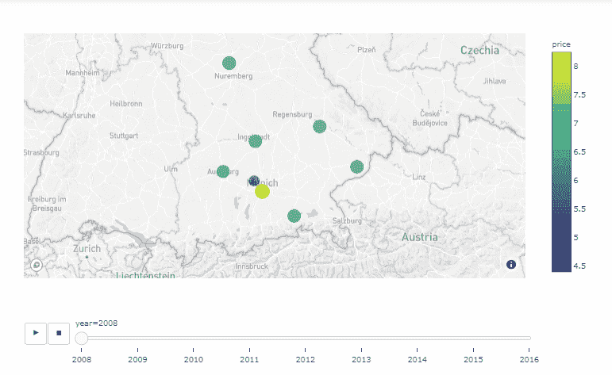

## **今年最受欢迎的帐篷里的啤酒价格是多少？**

该信息再次从网页上获得。清理数据后，我们获得一个数据集，其中包含 2018 年和 2019 年的价格以及价格的百分比变化。

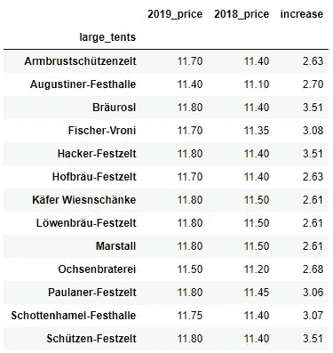

下图显示了价格的递增顺序。正如我们所观察到的，啤酒价格在 **11.4** 和 **11.8** 欧元之间，其中 **Augustiner** 更经济。

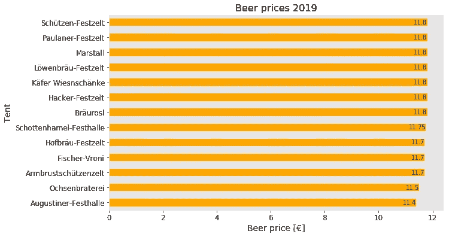

## 2030 年价格预测

价格上涨遵循线性趋势(啤酒价格更准确)。因此，我们可以创建一个线性回归模型来预测 2030 年的两种价格(鸡肉和啤酒)。为此，我们可以使用 scikit-learn 库中的 [**线性回归模型**](https://scikit-learn.org/stable/modules/generated/sklearn.linear_model.LinearRegression.html) ，如下所示:

根据线性预测模型，10 年后在啤酒节吃一顿饭将花费 28.33 €😮

# 关键要点

*   在过去的 30 年里，啤酒节上啤酒和鸡肉的价格稳步上升。
*   游客多喝少吃。啤酒的**消费量**呈现出**逐年增长的趋势**。相反，**鸡肉**的消耗是**减少**。消费受到 2001 年和 2016 年恐怖袭击的影响。那些年，很少有人参观这个节日。
*   **访客数量**没有任何趋势，范围从 **5.5** 到 **7.1** 。
*   巴伐利亚其他民间节日的啤酒价格也在上涨。Dachauer Volksfest 的价格是啤酒节的一半。如果你想喝醉，不想破产，就去达豪吧。😆它在慕尼黑附近！
*   自 2008 年以来，啤酒节上的啤酒价格每年上涨约 3%。巴伐利亚其他民间节日的价格增长不太一致；然而，有些年份的增量比啤酒节要大得多。
*   ****啤酒节**上的大帐篷**今年提供的啤酒价格在 **11.4€** 和 **11.8€** 之间。
*   如果价格继续上涨，到 2030 年，啤酒节(啤酒+鸡肉)一餐的价格将在 28€左右。

感谢阅读🍀**