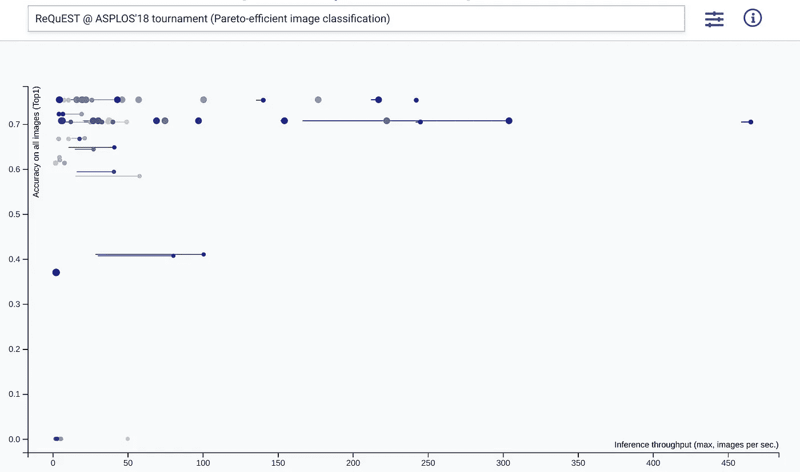
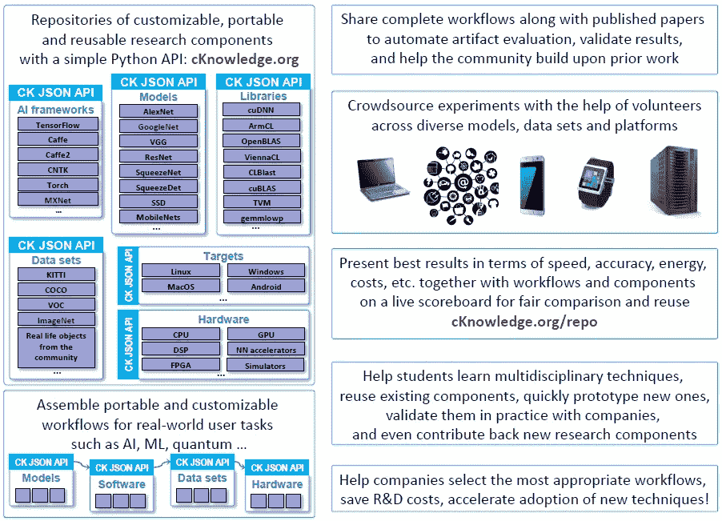

# 全方位基准图像分类(以及更多)

> 原文：<https://towardsdatascience.com/omni-benchmarking-image-classification-and-much-more-5e0d08bb2a7?source=collection_archive---------37----------------------->

Performance/accuracy exploration of image classification models on hardware ranging from IoT-class to server-class platforms from the submissions to the 1st [ACM ReQuEST tournament at ASPLOS’18](http://cknowledge.org/request-cfp-asplos2018.html).

图像分类是研究最大似然模型的效率/质量权衡的流行领域。例如，[最先进的](https://paperswithcode.com/sota/image-classification-on-imagenet) [FixResNeXt-101](https://arxiv.org/abs/1906.06423) 模型在 [ImageNet](http://image-net.org/) 验证集上达到了 86.4%的前 1 准确率，但 829M 参数仅适用于[集群使用](https://github.com/facebookresearch/FixRes#cluster-settings)。作为另一个例子，适用于移动设备[的](https://github.com/tensorflow/models/tree/master/research/slim/nets/mobilenet#imagenet--checkpoints) [MobileNets-v2](https://arxiv.org/abs/1801.04381) 型号系列的 Top-1 精度范围从 6.1M 参数的 75.0%到 1.7M 参数的 45.5%。

请注意，“集群”和“移动”之间的区别纯粹是*定性的*。就功耗而言，差异很容易达到一千倍或一百万倍。然而，执行 [*定量*](https://www.sigarch.org/artifact-evaluation-for-reproducible-quantitative-research/) 评估可能相当棘手。

诚实地回答你自己，你上一次能够在几分钟甚至几小时内拿着一份令人兴奋的新报纸转一圈是什么时候？我们的意思是，*对于真正的*:下载所有的工件(代码、数据等)。)，安装所有依赖项(如 TensorFlow)和依赖项的依赖项(如 Java 和 Bazel)，移植到新平台(Android，有人吗？)、用新数据集测试等等？

从来没有发生在我们身上。一百万年后也不会。我们最多能在几天内完成。更常见的是，几周之内。即使假设这张纸真的有藏物。(令人失望的是，7 中只有 [1 毫升的纸有。)](https://medium.com/atlas-ml/state-of-deep-learning-h2-2018-review-cc3e490f1679)

现在，想象一下打开一篇论文，描述一种在移动设备上进行图像分类的新方法，这种方法很方便地带有一个工件。想象一下，您可以在阅读介绍的同时，在几分钟内安装并定制该神器，并在手机上再现实验，同时得出结论？只需点击一个图，就可以与社区共享您的结果，并立即看到任何异常和异常值，这可能需要进一步的调查。

是的，这听起来像是一场梦。然而，我们相信快速的工件和知识共享对于加速 ML/系统的研究和开发是至关重要的。今天，我们描述了我们与社区一起朝着这个梦想迈出的一小步。

# ACM ReQueEST:可再生质量/高效系统锦标赛

2018 年，我们[在](https://portalparts.acm.org/3230000/3229762/fm/frontmatter.pdf) [ASPLOS](https://asplos-conference.org/) 联合举办了第一届[ACM ReQuEST 锦标赛](http://cknowledge.org/request)，我们[邀请社区](/acm-request-1st-open-and-reproducible-tournament-to-co-design-pareto-efficient-deep-learning-ea8e5a13d777)提交论文，并附上完整的工件(代码、数据、脚本等)。).[我们的目标](https://portalparts.acm.org/3230000/3229762/fm/frontmatter.pdf)是让每一个提交的工件通过完善的[工件评估](http://ctuning.org/ae/reviewing.html)过程。换句话说，我们关注的是[实际的定量再现性](https://www.sigarch.org/artifact-evaluation-for-reproducible-quantitative-research/)而不是提交材料的纯粹新颖性。

我们对提交的涵盖所有级别的 ML/软件/硬件堆栈(一位分析师[称之为](https://twitter.com/jameskobielus/status/994175022586613760) *全方位基准*)的多样性感到非常惊讶:

*   **型号:** MobileNets，ResNet-18，ResNet-50，Inception-v3，VGG16，AlexNet。
*   **框架和库:** TensorFlow，Caffe，MXNet，Keras， [Arm 计算库](https://github.com/ARM-software/ComputeLibrary/)，cuDNN， [TVM](https://tvm.ai/) ，NNVM。
*   **平台:** Xilinx Pynq-Z1 FPGA，Arm Cortex CPUs 和 Arm Mali gp GPU(Linaro hikey 960 和 T-Firefly RK3399)，树莓 Pi 设备的农场，NVIDIA Jetson TX1 和 TX2，以及亚马逊、微软和谷歌云中的英特尔至强服务器。
*   **数据类型:** 8 位整数，16 位浮点(半)，32 位浮点(浮点)。

对于每一个工件，我们都创建了一个自动化的、可定制的、可重复的[集体知识](https://github.com/ctuning/ck)工作流，以统一评估准确性、延迟(每张图像的秒数)、吞吐量(每秒图像数)、峰值功耗(瓦特)、价格和其他指标。然后我们在 [GitHub](https://github.com/ctuning/ck-request-asplos18-results) 上发布了统一的工作流程，并在 [ACM 数字图书馆](https://dl.acm.org/citation.cfm?doid=3229762)上添加了快照。

我们决定在一个公开的[交互式仪表盘](http://cknowledge.org/dashboard/request.asplos18)上显示所有结果，而不是宣布一个获胜者或者[点名羞辱](https://en.wikipedia.org/wiki/Name_and_shame)。使用仪表板，您可以应用自己的标准来探索解决方案空间，并寻找[帕累托最优](https://en.wikipedia.org/wiki/Pareto_efficiency)解决方案(例如，找到达到所需精确度的最节能的解决方案)。基本上，如何通过自己的喜好和要求解读结果，就看你自己了！

# 视力

从纯粹的基准测试角度来看， [ReQuEST](http://cknowledge.org/request) 可以被视为 [MLPerf](https://www.mlperf.org/) 开放部门的先驱，在这里提交者对他们使用的工作负载和系统没有限制，只要他们的提交是可复制的。

然而，我们的长期目标是创建[可重用 ML/SW/HW 组件的开放库](https://reuseresearch.com/components)。这将允许研究人员在他们的可复制和交互式论文中建立这样的组件，同时最终解决跨最新软件和硬件的基准测试技术的棘手问题。

我们预计，最终社区将对完整的 ML/SW/HW 堆栈进行众包基准测试、共同设计和优化(例如，参见[我们的 Android 众包基准测试演示](http://cknowledge.org/android-apps.html))，这反过来将大大减少现实产品所需的工作和上市时间。

[如果你想了解更多，请联系](http://cknowledge.org/contacts.html)并加入[我们成长中的社区](http://cknowledge.org/partners.html)！

# 作者

[安东·洛克莫托夫](https://towardsdatascience.com/@dividiti?source=follow_footer--------------------------follow_footer-)是[divideti](http://dividiti.com)的联合创始人兼首席执行官。研究员、工程师和企业家，热衷于优化使用宝贵的资源，如计算机系统…和人才。

Grigori Fursin 是 CodeReef.ai 的联合创始人兼首席技术官。开源贡献者和可复制性专家，清理人工智能创新中的混乱。