# 全方位基准目标检测

> 原文：<https://towardsdatascience.com/omni-benchmarking-object-detection-b390cc4114cd?source=collection_archive---------10----------------------->

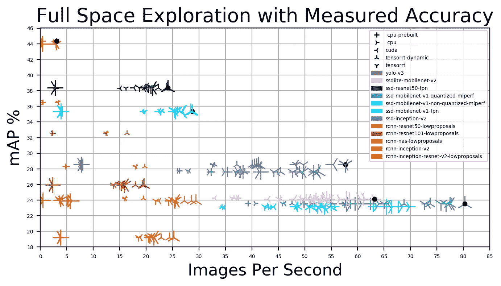

Performance/accuracy exploration with 12 object detection models, 5 TensorFlow backends and 6 batch sizes.

ML/systems 社区对研究效率/质量权衡非常感兴趣。在 CVPR 2017 年的一篇综合论文中，谷歌研究人员专注于探索最先进的物体检测卷积方法的速度/精度权衡。相当有益的是，研究人员还发布了几十个经过训练的模型，作为 TensorFlow 模型动物园的[部分。这些模型很容易运行和评估，因为它们有标准化的输入和输出张量。](https://github.com/tensorflow/models/blob/master/research/object_detection/g3doc/detection_model_zoo.md)

虽然我们发现对象检测动物园是我们系统设计和优化工作的一个很好的起点，但我们不禁想知道我们无法从动物园的自述文件或论文中提取的几个方面。

首先，自述文件提供了在*和* NVIDIA TITAN X 卡上的执行时间。然而，多年来 NVIDIA 已经发布了 TITAN X 的几个版本*。虽然我们可以从论文时间表中猜测该卡是基于 Maxwell 架构的，但也有各种其他关于 GPU 驱动程序、CUDA 版本、TensorFlow 版本、使用的批量大小等的猜测。最重要的是，*我们现在主要感兴趣的是我们自己的硬件上最新软件的性能*，而不是(ML/SW/HW)考古！这包括运行在 CPU 与 MKL 和 GPU 与 TensorRT 进行比较。*

其次，自述文件提供了 COCO 2014 验证集(“minival”)子集的准确性，而*我们感兴趣的是 COCO 2017 验证集*(例如，在 MLPerf 中使用)的准确性。此外，一些最精确模型的“低建议”变体比基线模型快 1.3-3.4 倍。然而，由于没有提供准确性，所以不清楚权衡是什么。

我们意识到同样的问题对更广泛的 ML/systems 社区有很大的兴趣，我们想提供帮助。我们不仅仅是满足自己的好奇心，而是更热衷于让我们的方法*可被他人复制和扩展*，这样社区就可以*众包*跨其他平台、模型、数据集、批量等的评估。这就是我们所说的*全方位标杆管理*。

上面绘制的是我们对 12 个对象检测模型、5 个 TensorFlow 后端和 6 个批次大小的性能/精度探索的结果。这篇文章是关于我们如何获得它们的。

# 型号选择

我们意识到我们没有时间测试动物园中的所有型号，所以我们选择了 11 种不同的型号，从快速的 SSD-MobileNet 到准确的 Faster-RCNN-NAS。我们选择了 5 个基于 fast-RCNN 的模型:4 个可用的“lowproposals”变体，以及 fast-RCNN-Inception-v2。我们还选择了 6 种基于 SSD 的型号:SSD-ResNet50-FPN、SSD-Inception-v2、SSD-MobileNet-v1 的 3 种变体(非量化、量化、FPN)和 SSDLite-MobileNet-v2(适用于移动设备的更轻版本的 SSD)。根据自述文件，通过这种选择，动物园模型的地图精度在 18%和 43%之间，执行时间在 30 毫秒和 540 毫秒之间。最后，我们添加了一个 YOLO-v3 的[重新实现。](https://github.com/YunYang1994/tensorflow-yolov3)

# 可定制性

为了以统一的方式评估模型，我们设计了一个模块化和可定制的 Python 应用程序:用户可以插入不同的数据集和模型(可能带有定制的预处理和后处理)，并选择一个受支持的后端(CPU、CUDA、TensorRT)。

应用程序提供了支持特定模型功能的“钩子”。我们发现了四个这样的挂钩:

*   预处理:将图像加载到张量中，并为推理准备张量(转换、整形、调整大小)。
*   加载模型:加载一个冻结的模型图(如果需要，转换为 TensorRT)，并准备一个会话进行推理。
*   获取张量:获取给定模型的输入/输出张量名称。
*   后处理:将图形的输出转换为检测(边界框和对象)。

对于动物园的标准化模型，我们实现了一些默认使用的功能。然而，对于 YOLO-v3 模型，我们创建了带有[特定接口](https://github.com/ctuning/ck-object-detection/tree/master/package/model-tf-yolo-v3-coco)的定制函数。我们还实现了批处理，包括将图像调整到特定于模型的大小。

# 实验设计空间

我们感兴趣的是测量被检查模型的准确性([地图和召回](https://medium.com/@jonathan_hui/map-mean-average-precision-for-object-detection-45c121a31173)在 COCO 2017 验证数据集上的 5000 张图像)和性能(执行时间或每秒图像)。

我们沿着*两个*维度评估绩效:

*   *tensor flow 的后端配置*:

1.  为 CPU 预建(通过 pip 安装)，它抱怨不支持 AVX2 FMA 指令。
2.  基于支持 AVX2 的 CPU 资源构建。
3.  使用 CUDA 从 GPU 的源代码中构建。
4.  根据 GPU 的源代码构建，TensorRT 配置为静态构建优化图形(即不知道图像大小)。
5.  根据 GPU 的源代码构建，TensorRT 配置为动态构建优化图形(即，一旦给出第一幅图像)。

*   *批次大小* : 1(无批次)，每批次 2、4、8、16 和 32 张图像。

# 再现性

我们使用自动化、可移植和可定制的[集体知识](https://cknowledge.org) (CK)工作流程来使我们的实验具有可重复性和可扩展性。

首先，CK 安装所有的先决条件:具有不同后端的 TensorFlow(见上文)、模型和数据集，同时解析所有的依赖项(例如，当从源构建 TensorFlow 时，使用 Java 和 Bazel)。因为 CK 负责所有的先决条件并跟踪它们的版本，所以很容易将整个实验设置移植到不同的机器上。

其次，CK 单独配置每个实验:模型、后端配置和批量大小。因为 CK 存储实验配置(先决条件、环境变量的值等)。)除了统一 JSON 格式的实验结果，我们还可以使用 [Jupyter](https://jupyter.org/) 、 [pandas](https://pandas.pydata.org/) 等流行工具方便地分析和可视化实验结果。

第三，我们编写 CK 脚本来执行所有实验参数的笛卡尔乘积。在我们的研究中，这导致了 360 个性能实验(12 个模型，5 个后端，6 个批处理大小)和 24 个准确性实验(12 个模型，1 个 CUDA 后端，模型内部调整大小和批处理所需的外部调整大小)。

# 易用性

我们创建了一个封装了所有安装步骤的 [Docker 容器](https://github.com/ctuning/ck-object-detection/blob/master/docker/object-detection-tf-py.tensorrt.ubuntu-18.04/README.md)(因为即使 CK 处理了整个实验设置，按照自述文件进行安装也会非常乏味)。虽然容器化引入了一些开销，但我们发现它们对于我们的目的来说是可以接受的(我们将在以后的文章中报告)。

重要的是，将 CK 和 Docker 结合起来使用，任何人都可以通过几个步骤开始运行实验，使它们真正具有可移植性和可重复性。

# 结果

下面，我们分三部分介绍我们的一些结果:

*   首先，我们在 COCO 2017 验证数据集上展示了受检模型的**精度**。
*   其次，我们使用不同的后端和批量大小来分析**性能**。
*   第三，我们展示了一个综合的**设计空间探索**图，其中最佳性能/精度权衡位于[帕累托边界](https://en.wikipedia.org/wiki/Pareto_efficiency#Pareto_frontier)。

(全部结果可在 [Jupyter 笔记本](https://nbviewer.jupyter.org/urls/dl.dropbox.com/s/5yqb6fy1nbywi7x/medium-object-detection.20190923.ipynb)中获得。)

我们的实验平台是一个[惠普 Z640 工作站](http://h20195.www2.hp.com/v2/default.aspx?cc=ie&lc=en&oid=7528701)，配有一个[英特尔至强处理器 E5–2650 v3](https://ark.intel.com/products/81705/Intel-Xeon-Processor-E5-2650-v3-25M-Cache-2_30-GHz)CPU(2014 年第三季度推出)，以及一个 NVIDIA GeForce gtx 1080 GPU(2016 年在 Q2 推出)。[我们的 Docker 镜像](https://hub.docker.com/r/ctuning/object-detection-tf-py.tensorrt.ubuntu-18.04)是基于[来自 NVIDIA 的 TensorRT 19.07 镜像](https://docs.nvidia.com/deeplearning/sdk/tensorrt-container-release-notes/rel_19-07.html)，带有 [CUDA](https://developer.nvidia.com/cuda-zone) 10.1 和[tensort](https://developer.nvidia.com/tensorrt)5 . 1 . 5，以及 TensorFlow 1.14。

## 准确(性)

首先，我们展示了整个贴图，以及大、中、小物体的贴图，假设只对输入图像进行了内部尺寸调整(稍后会详细介绍)。

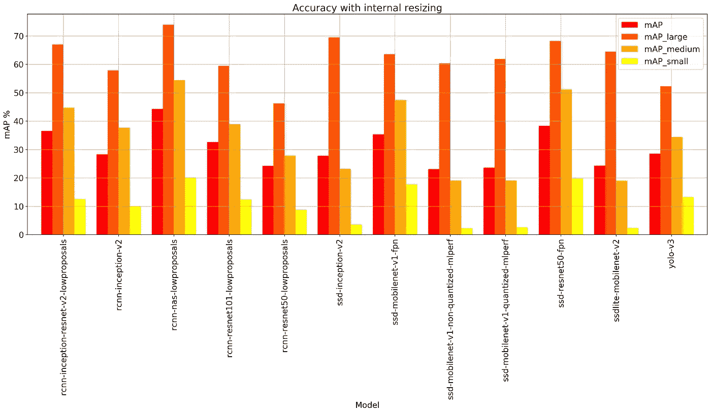

最准确的模型是 Faster-RCNN-NAS，达到了 44%的整体图。通常，一个具有良好整体贴图的模型在所有三个对象类别中都表现良好。然而，也有一些例外:SSD-Inception-v2 在大型对象上有第二好的成绩，但在中型和小型对象上表现相当差；相反，YOLO-v3 在大型物体上得分第二差，但在小型物体上排名第四，在中型物体上表现良好。

在小对象上表现不佳是基于 SSD 的模型的一个众所周知的问题。然而，具有[特征金字塔网络](https://arxiv.org/abs/1612.03144) (FPN)特征的 SSD-ResNet50 和 SSD-MobileNet-v1 型号在小型物体上处于第二和第三位(总体上处于第二和第四位)。

由于 COCO 数据集中的图像具有不同的形状和大小，因此需要调整它们的大小以适应模型输入大小。动物园中的所有模型都在图形中嵌入了调整大小功能。然而，为了实现批处理，图像必须在图形之外调整大小(因为一个批处理中的所有图像必须具有相同的大小)。这可能会损害准确性，如下所示:

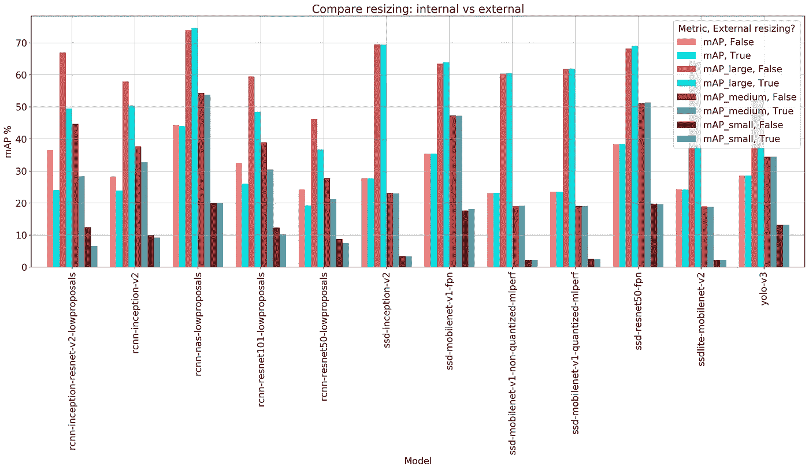

SSD、YOLO 和 fast-RCNN-NAS 模型都包括一个 *fixed_shape* 调整大小层。使用此图层的大小进行外部调整大小对精度几乎没有影响(在某些情况下，地图会有所改善)。

然而，其他基于更快 RCNN 的模型包括一个 *keep_aspect_ratio* 调整大小层。对这些模型强制进行“固定形状”外部尺寸调整会对精度产生不利影响(在某些情况下，地图下降超过 10%)。(如果您知道如何解决这个问题，我们很乐意听取您的意见！)

## 表演

我们将性能报告为每秒处理的图像(或帧)数量(FPS)。每个实验我们做 10 次。在柱形图中，柱形图显示 10 次运行的平均 FPS，而触须显示标准差。(络腮胡子紧说明性能稳定。)

首先，我们展示了 12 种型号和 6 种批量的 CUDA 后端性能:

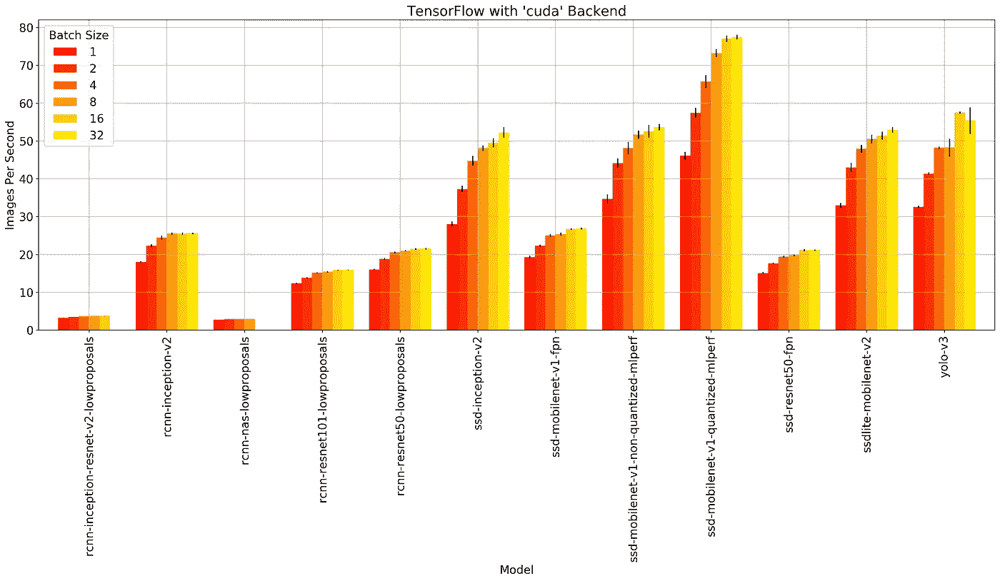

毫不奇怪，最准确的模型 Faster-RCNN-NAS 也是最慢的，为 3 FPS。速度最快的模型是 MLPerf 推理中使用的量化 SSD-MobileNet，根据批量大小，它比 fast-RCNN-NAS 快 15-25 倍。这表明我们基于 Pascal 的 GPU 比基于 Maxwell 的 GPU 大约快两倍，后者用于获得自述文件中提供的性能数据。然而，如果性能优势并不主要归因于体系结构的改进呢？

通常，批量越大，性能越高。但是，对于某些模型，批处理可能会对性能造成不利影响。例如，CPU 上的 Faster-RCNN-NAS 速度最快，批处理大小为 1，这可能是因为内存需求高:

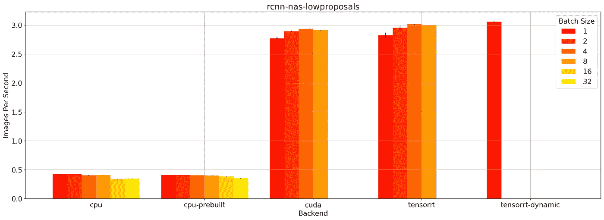

事实上，这个模型甚至无法在批处理大小为 16 和 32 的 GPU 上运行。(这个 GPU 只有 8 GB RAM。)而且 TensorRT-Dynamic 后端只能以批处理大小 1 运行。

非量化 SSD-MobileNet 型号在 CPU 上运行速度更快:

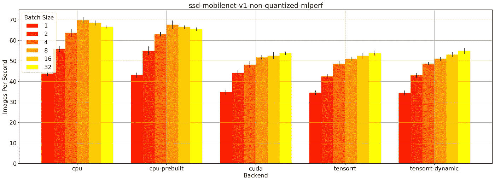

然而，量化的 SSD-MobileNet 模型在 GPU 上的运行速度更快(比非量化模型快近 1.5 倍):

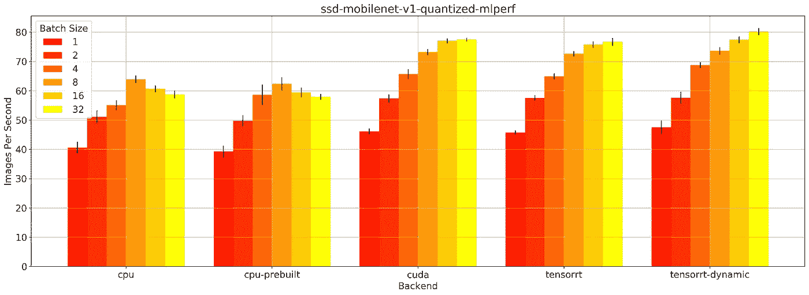

这两个模型都包含在 MLPerf 推理 v0.5 中，都是在 32 位浮点中执行的。量化模型可能受益于 GPU 内存中更好的数据组织。

对于所检查的模型，我们发现在静态模式下使用 TensorRT 几乎没有比使用 CUDA 更好的效果。我们认为这是因为静态模式下的 tensort 通常会退回到 CUDA，因为它不知道张量形状。[然而，一旦给出第一幅图像，动态模式](https://docs.nvidia.com/deeplearning/frameworks/tf-trt-user-guide/index.html#static-dynamic-mode)中的 TensorRT 会在运行时创建一个优化的图形。在下图中，红/蓝条代表 CUDA/TensorRT-批量逐渐增加时的动态性能:

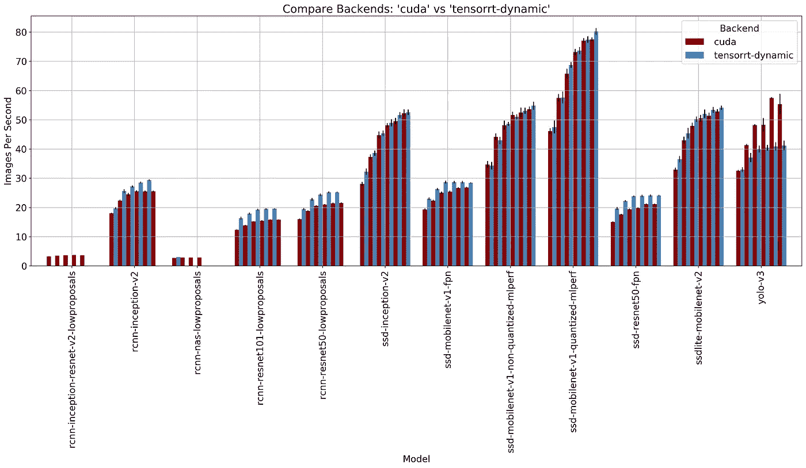

一般来说，TensorRT 比 CUDA 快，但 YOLO v3 是个例外。我们猜测这是因为它是一个更新的型号，NVIDIA 尚未针对 TensorRT 进行优化。我们还注意到，对于最慢的模型，TensorRT-Dynamic 几乎总是失败(返回内存不足错误)。

## 探测

最后，我们在一个图上展示了性能和精度:

不同的颜色代表不同的型号。不同的标记代表不同的后端。标记的大小表示从 1(最小)到 32(最大)的批次大小。

请注意，对于大多数基于更快 RCNN 的模型，由于批处理的外部调整大小，精度会有所下降。我们可以用内部调整大小获得的“理想”精度来绘制相同的数据点:

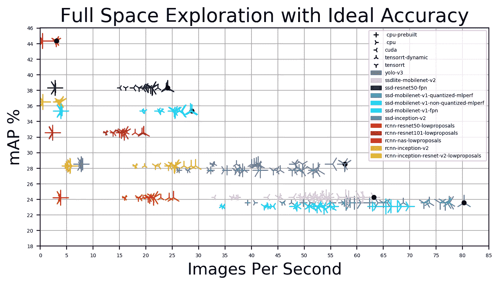

黑点显示的是帕累托边界:最准确最慢的模型更快——RCNN-NAS 在左上角；最快的是右下角的量化 SSD-MobileNet-v1(无论是性能还是精度，都要优于非量化 SSD-MobileNet-v1)。

如果我们考虑小对象的 mAP，情况会发生变化，其中基于 SSD 的 FPN 模型几乎与 Faster-RCNN-NAS 一样好，但其他基于 SSD 的模型在 mAP 低于 4%的情况下表现极差:

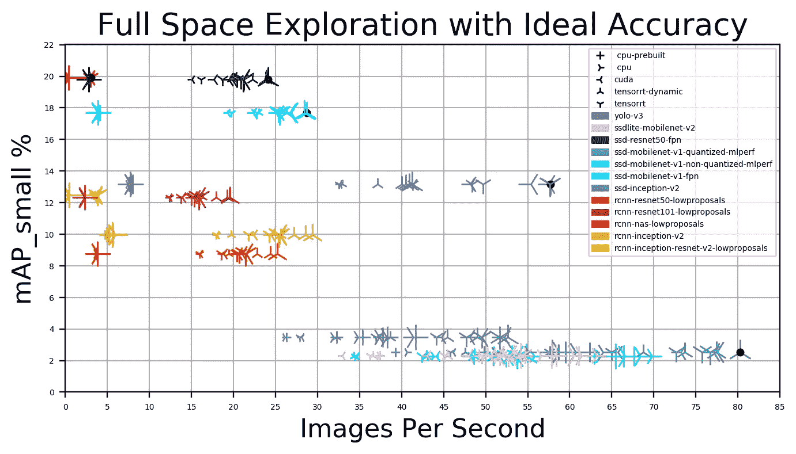

对于大型对象，SSD-Inception-v2 和 SSDLite-MobileNet-v2 达到了帕累托边界:

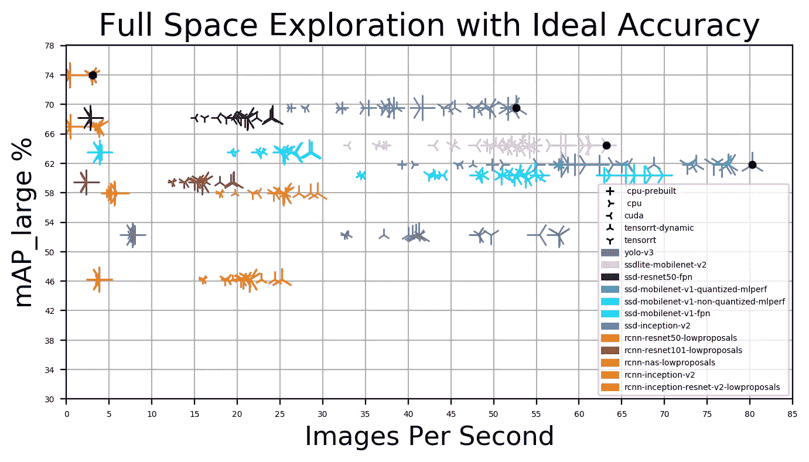

# 结论

我们已经展示了我们的*全方位基准测试* 12 个流行的对象检测模型的结果，这些模型使用 5 个 TensorFlow 后端和 6 个批量大小，适用于小型、中型和大型对象。

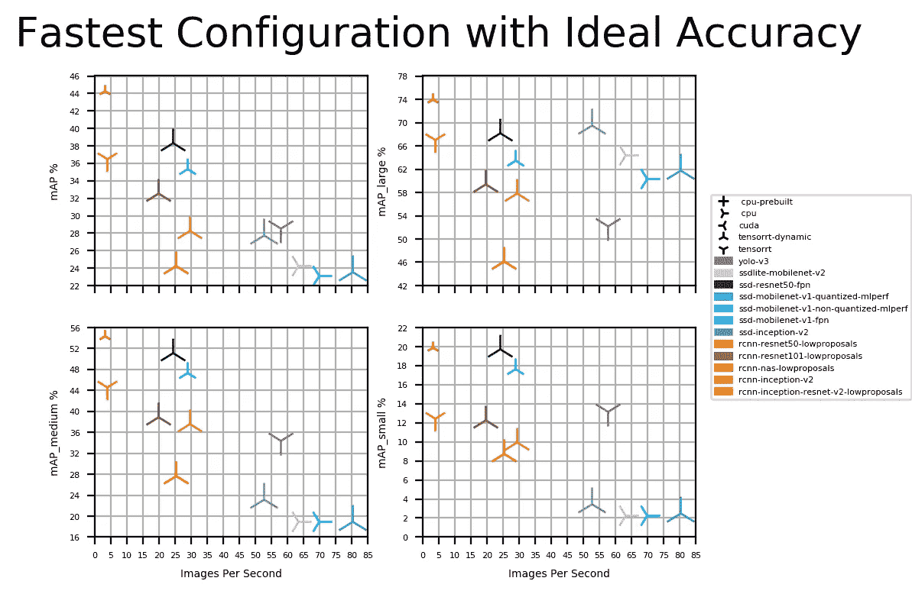

很明显，没有一种适合所有人的最佳配置。甚至 CPU 有时也比 GPU 快(对于 SSDLite-MobileNet-v2 和非量化 SSD-MobileNet-v1)。较大的批处理大小并不总是保证更好的性能(1 是更快的 RCNN-NAS 的最佳值)。最后，最佳模型选择可能取决于所选择的精度度量和实时约束。

这就是为什么我们相信 omni-benchmark 对于设计高效可靠的计算机系统是非常有价值的！已经[为第一届](http://bit.ly/ob-ic) [ACM 请求](http://cknowledge.org)锦标赛进行了 omni 基准图像分类，我们愿意合作来对任何其他 ML 任务进行 omni 基准测试。

[如果你想了解更多，请联系](http://cknowledge.org/contacts.html)并加入[我们正在成长的社区](http://cknowledge.org/partners.html)！

# 作者

伊曼纽·维塔利是意大利米兰理工大学大学的博士生。他的研究兴趣包括硬件架构和异构系统上的应用程序自动调优。

Anton Lokhmotov 博士是 dividiti 的创始人之一。他致力于优化利用宝贵的计算资源和人才。