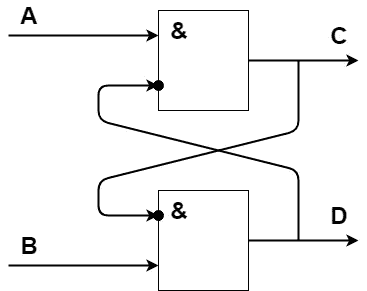
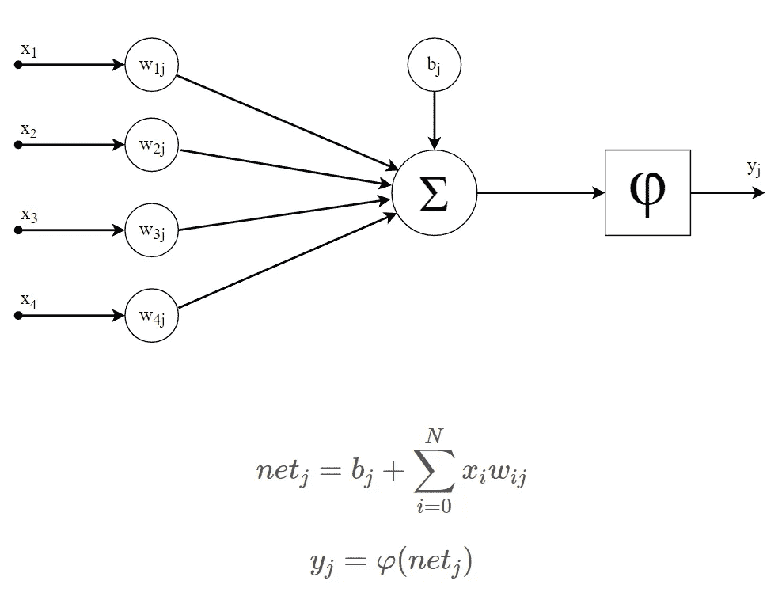
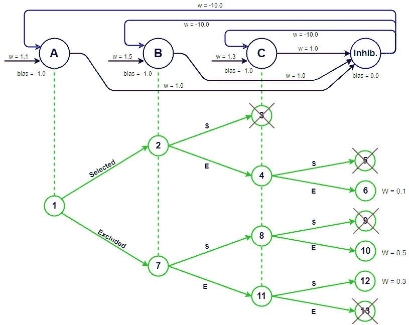

# 向神经网络添加负反馈突触

> 原文：<https://towardsdatascience.com/on-adding-negative-recurrent-synapses-to-a-neural-network-25a28409a6f2?source=collection_archive---------9----------------------->

## **深度神经网络中的缺失环节**

向神经网络添加负向循环突触的特殊之处在于，它们在网络中引入了内部状态。

以这个简单的触发器电路为例:

如果两个输入端 **A** 和 **B** 都有效，那么在这个电路中可能存在两种互斥状态——或者 **C** 有效而 **D** 无效，或者相反。该示例取决于是 **A** 还是 **B** 先被激活。但是如果我们不让时间决定哪个状态被激活呢？如果一个[目标函数](https://en.wikipedia.org/wiki/Loss_function)测量每个状态的强度会怎样？这样，我们可以系统地搜索网络中的最佳整体状态。

那有什么好处呢？如果我们仔细观察通常输入神经网络的数据，如文本或图像，我们会注意到这种状态出现得非常频繁。例如，句子'*米像沙子一样飞'*，它允许两种同样可能的解释，或者下面的图像显示一个年轻或年老的女人取决于你当前的解释。

基本上，对最高等级状态的搜索可以被视为对文本或图像的最有意义的解释的搜索。这非常类似于语法分析器执行的搜索。然而，与语法分析器相反，神经网络能够处理文本中包含的任何类型的信息，而不局限于句法信息。神经网络的另一个优点是，它们能够总结许多微弱的提示和信息，并使用它们来提高预测。

那么这样一个目标函数会是什么样子呢？如果我们可以促进我们的神经元的激活值来确定目标函数呢？如果我们简单地将每个兴奋性神经元的活化值相加，我们就可以比较网络中不同的状态，看看哪一个是最理想的。请注意，对于纯粹基于逻辑的电路，这是不可能的，因为没有渐进的权重来增加正确状态的选择。这是大多数[基于非单调逻辑的](http://www.informatik.uni-leipzig.de/~brewka/papers/NMchapter.pdf)方法面临的一个大问题。
在我们继续看解释搜索之前，我们必须首先更仔细地检查一些网络属性。我们首先需要的是我们神经元的激活函数φ，它对于所有的负激活值都是无效的；否则我们将无法真正抑制神经元的激活。我们可以使用 [ReLU](https://en.wikipedia.org/wiki/Rectifier_(neural_networks)) 函数或者 [tanh](https://en.wikipedia.org/wiki/Hyperbolic_function#Hyperbolic_tangent) 函数的正半部分。

这个网络的另一个特征是它需要两种类型的神经元。第一种是兴奋性神经元，本质上是连接的，能够通过等待一整套输入特征的联合激活来识别模式。兴奋性神经元也是允许接收负输入突触的神经元，因此可能被其他神经元抑制。第二种神经元类型是抑制性神经元，本质上是分离的。他们能够将兴奋性神经元分组。如果这些抑制性神经元的输出通过一个负性循环突触反馈给它所有的输入兴奋性神经元，那么组内所有的兴奋性神经元就会互相抑制。注意，在这种循环反馈回路中，兴奋性神经元不允许抑制自己。这类似于深度神经网络中的 softmax 层；只是我们现在有了一个明确的突触模型，它明确地说明了哪些神经元受到了哪些神经元的抑制。

# 搜索

那么，实际的解释搜索是什么样子的呢？因为只有兴奋性神经元被允许有负反馈突触，我们只需要在搜索时考虑那些。然而，在我们进行真正的搜寻之前，我们必须将兴奋性神经元分类，以保留所有非周期性突触的相依性。在搜索过程中，我们将需要对我们尚不知道其状态的循环连接的未来神经元做出假设。所以对于每个兴奋性神经元，我们将在假设所有循环输入对当前神经元具有最积极的影响(选择)或最消极的影响(排除)的情况下计算和传播激活值。这也是我们搜索树中每个节点的两个可能的分支。当回溯到父节点时，当然必须恢复网络的先前状态。

现在，你可能认为搜索空间的大小很容易失控，但事实并非如此。实际上，数据中并没有多少不同的状态。当然，您需要确保不会一次又一次地评估相同的状态，但是这可以通过缓存以前的决策来轻松防止。只有当缓存的决策所依赖的神经元状态之一被修改时，缓存的决策才需要失效。如果网络的各个部分不相互依赖，它们也可以相互独立地进行评估。这种搜索的另一个优点是，突触权重提供了大量关于哪些状态应该被评估以及哪些状态应该被忽略的启发性信息。

目前，我们正在一个拥有约 2000 万个神经元的网络上使用这种算法，对于一个给定的文档，平均有几千个神经元被激活。一份文件的处理时间约为 100 毫秒至 200 毫秒。当然，如何训练这种类型的网络仍然是一个悬而未决的问题。目前，我们使用的是一个手工制作的模型，该模型来自于大量的命名实体和短语，但当然，这个网络需要一个真正的训练算法。然而，在我看来，这种训练算法不应该使用梯度下降或反向传播。误差信号在通过几层神经元后变得过于模糊。训练算法的一个更好的起点可能是 [Kullback-Leibler 散度](https://en.wikipedia.org/wiki/Kullback%E2%80%93Leibler_divergence)，它应该允许我们通过最大化关于给定神经元的输入数据的信息增益 来 [**训练兴奋性神经元。这种方法的一个优点是它完全不受监督，因此不依赖于标记数据。**](/using-information-gain-for-the-unsupervised-training-of-excitatory-neurons-e069eb90245b)

这个算法是作为 [**AIKA**](http://aika.network) 开源项目的一部分实现的。来源可以在 [**GitHub**](https://github.com/aika-algorithm/aika) 上找到。实现这个例子的 JUnit 测试用例可以在这里 找到 [**。这篇文章所遗漏的是对文本或图像的关系结构的处理。如果你想了解更多关于培训这种类型的网络，看看这篇**](https://github.com/aika-algorithm/aika/blob/master/src/test/java/network/aika/network/MutualExclusionTest.java) **[**文章**](/using-meta-neurons-to-learn-facts-from-a-single-training-example-781ca0b7424d) 。**