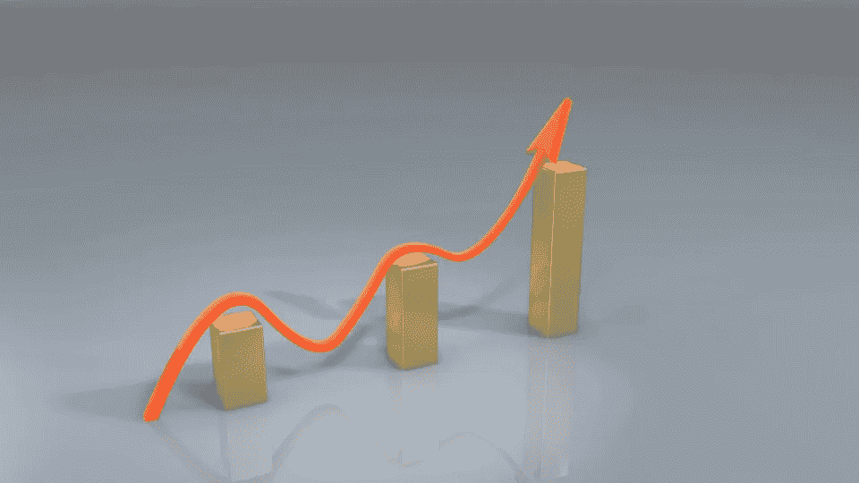

# 成为“更好的”数据科学家

> 原文：<https://towardsdatascience.com/on-becoming-better-data-scientists-47c257b0df3d?source=collection_archive---------20----------------------->

我最近读了阿图尔·加万德的书 *Better* ，他在书中用医学故事提供了如何在工作中做得更好的见解。在这里，我试图将 Gawande 的见解放在数据科学的背景下，因为我相信它们同样适用于我们的领域。

Source: [pixabay](https://pixabay.com/illustrations/business-success-winning-chart-163464/)

加万德将医学上的成功归因于三个核心品质——d*的智慧*、*的正确*和*的独创性*。他用几个个人故事和观察来说明这些品质。例如，为了证明勤奋的重要性，他讲述了一个关于一个人在印度寻求根除脊髓灰质炎的故事。2003 年，在印度南部地区发现了一例脊髓灰质炎病例，该地区被认为通过免疫接种消除了脊髓灰质炎。唯一可行的选择似乎是扫荡行动，该地区所有易感儿童都需要接种疫苗。这包括组织 41000 名医疗专业人员和 18000 名疫苗携带者在 3 天内为 420 万儿童接种疫苗！Gawande 将这场看似不可能的运动的成功归功于参与运动的人们的勤奋。

为了说明第二个品质——做正确的事情——Gawande 讨论了诉讼和保险纠纷是如何让医生在美国的工作变得非常困难的。他认为，如果医生屈服于这些困难，那么他们作为医疗专业人员做有意义工作的动机就不复存在了。Gawande 还涵盖了死刑注射使用的敏感问题。一些参与处决的医生感到有义务安慰被处决的囚犯。Gawande 承认这种推理的有效性，他认为这些专业人员更多地是代表政府而不是囚犯的利益行事，因为囚犯没有权利拒绝医生的治疗。

关于独创性的话题，他举了一个维珍尼亚·阿普伽的例子，他发明了一种有意义的技术，用简单的 10 分制来衡量新生儿的状况。阿普加的创新最终导致了“产科包”,大大降低了婴儿死亡率。独创性不仅在于发明更好的技术，还在于开发更好的方法来利用这些技术。为了阐述这一点，Gawande 向我们讲述了 Warren Warwick 的故事。Warwick 是一名儿科医生，他利用囊性纤维化(CF)研究的结果，将 CF 患者的护理提高到了一个新的水平。Warwick 的设施帮助患者比美国任何其他 CF 设施活得更长，他们通过持续监控和改进帮助患者的方式来实现这一点。

Gawande 认为在医学领域表现优异的三个品质同样适用于其他职业。下面，我在应用人工智能/数据科学的背景下讨论这些品质。直到最近，人工智能一直生活在研究实验室中，但现在它正在学术界以外受到关注。现在，将人工智能研究转化为可用产品和服务的重任落在了数据科学家的肩上。我相信数据科学家可以从 Gawande 的书中学到知识，以加速和保证该领域的成功。

**论勤奋**:

我看到了印度根除脊髓灰质炎的故事和数据科学家在工作中被期望完成的事情之间的相似之处。在这两种情况下，资源是稀缺的，时间是最重要的。今天的数据科学家背负着沉重的期望。人们期待他们改革医疗保健，革新交通运输，改善教学。这些是几个世纪以来社会面临的挑战。他们很难相处！它们似乎和根除脊髓灰质炎的目标一样遥不可及，而成功完成这些任务的唯一途径就是勤奋和有远大的抱负。

**论做对**:

我分享两个故事，说明为什么“做正确的事”在数据科学领域至关重要。第一个故事是关于一个叫做 COMPAS 的风险评估软件。COMPAS 是一个人工智能系统，可用于预测罪犯从惩教机构释放后犯下新罪行的可能性。它被美国各地的法院用来通知保释决定。2015 年，ProPublica 发表了一项研究，发现 COMPAS 对非洲裔美国人有偏见。研究发现，COMPAS 高估了非洲裔美国人再次被捕的可能性，而低估了白人再次犯罪的可能性。

第二个故事是关于科技巨头亚马逊在 2014 年开发的一款招聘工具。该工具的目的是自动扫描收到的简历，并选择最佳雇员。它是通过观察过去 10 年的候选人建立起来的。路透社报道称，到 2015 年，亚马逊意识到该工具存在性别偏见。它一贯偏爱男性候选人，而不是女性候选人。

这两个故事展示了当前基于人工智能的工具的缺点。这种工具旨在帮助人们完成决策任务。他们通过从历史数据中学习人类行为来做到这一点。然而，在学习明确的与任务相关的人类行为的同时，这些工具也学习历史数据中存在的隐含偏见。例如，由于亚马逊在过去 10 年中雇用的男性可能多于女性，招聘工具建议招聘经理继续这样做。这些故事也清楚地表明，数据科学家的技术能力不足以让他们发挥最佳水平。为了“做正确的事”，他们还需要意识到社会中存在的偏见。这种偏见将不可避免地出现在人工智能工具使用的数据中。了解社会偏见的数据科学家能够更好地从这些工具中检测和消除偏见。

**论匠心**:

我分享吴恩达的故事。正如我们大多数人所知，安德鲁是人工智能领域最有影响力的人之一。在这里，我讨论一下他在领导谷歌大脑团队时，在谷歌推广深度学习的策略。安德鲁在他的人工智能转型剧本中分享了这个故事。那是谷歌和其他公司怀疑深度学习技术的时候。安德鲁的策略是通过寻找对公司有意义但不是最重要的项目来推动新技术的发展。他希望他早期的项目成功，而不是最有价值。这一巧妙的策略帮助谷歌大脑团队展示了深度学习在谷歌语音和谷歌地图应用中的成功。这一成功导致了深度学习在谷歌其他产品中的采用，并影响了该技术在世界其他地区的广泛采用。

人工智能现在已经开始在学术实验室和技术公司之外建立自己的地位。安德鲁向我们展示了一个在我们各自的行业中率先采用人工智能的战略。我真的相信，数据科学家可以从 Gawande 的书中学到知识，以加速和保证该领域的成功。要做到这一点，我们需要勤奋来应对来自社会的巨大期望，我们需要独创性来为我们在公司中导航。此外，我们需要意识到我们的数据和算法中存在的偏见，以提供道德、伦理和无偏见的产品和服务。