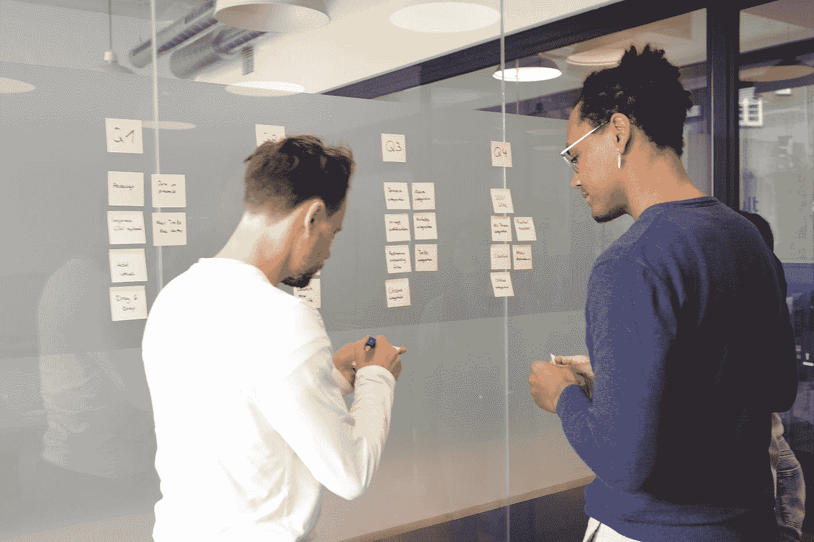

# 成为一名数据科学产品经理

> 原文：<https://towardsdatascience.com/on-being-a-data-science-product-manager-5c8baf42e0a7?source=collection_archive---------8----------------------->

## 来自一位数据科学家同事的七条建议

Photo by [airfocus](https://unsplash.com/@airfocus?utm_source=medium&utm_medium=referral) on [Unsplash](https://unsplash.com?utm_source=medium&utm_medium=referral)

几个月前，我辞去了 Nulogy 数据科学家的工作，Nulogy 是一家位于多伦多的 SaaS 公司。在我过去的 6 个月里，数据科学团队从 POC 阶段过渡到实际构建公司的第一个机器学习产品。与任何产品团队一样，我们需要一个人来帮助管理我们的数据产品生命周期的剩余部分。也就是说，我们需要一个数据科学产品经理(DS PM)。而且，由于当时组织的不同变化，我不得不暂时戴上那顶帽子。以下是我对如何成为一名成功的 DS PM 的学习。

## 1.培养对机器学习的理解

我有一个朋友，最近在加拿大魁北克开始工作。魁北克是该国说法语的省份，作为一个只会说英语的加拿大人，他很难适应，直到他学会了法语！我想你明白我的意思了…

作为一名 DS PM，您必须能够识别可以利用机器学习的机会。此外，您需要能够与您的数据科学家和工程师就他们的日常工作进行对话。如果不理解机器学习的构建模块，就很难与你的团队建立共鸣，也很难为你的团队辩护。幸运的是，网络上有无数的免费资源可以帮助你快速上手(coursera、medium、youtube 等。).

## 2.了解模型评估

选择正确的模型评估度量和最小可接受误差是机器学习中最具挑战性的两项任务。手头任务的极高精度可能是不必要的(甚至是不可能的)。另一方面，高误差幅度对企业来说可能是非常昂贵的。因此，您不能脱离这些对话，应该主动了解评估指标和可接受的误差范围。例如，如果 ML 产品正在替代一个已经存在的过程，您可以使用当前的过程误差率作为基线。

总的来说，评估标准将由可用的数据、使用的模型和手边的应用决定。要更详细地了解评估指标，请阅读这篇[文章](https://medium.com/usf-msds/choosing-the-right-metric-for-machine-learning-models-part-1-a99d7d7414e4)。

## 3.对实验持开放态度

决定机器学习产品何时准备好发货是一项具有挑战性的任务。当测试误差较低且不存在过度拟合时，我们是否应该发运模型？在宣布模型可供所有客户使用之前，我们是否应该先在生产环境中用客户群的样本测试模型？我真的没有答案(如果有人看这篇文章有，请在评论里分享)，很可能要在时间、成本和准确性之间做出权衡。这里的现实是，机器学习产品的生命周期依赖于大量的实验，所以我的建议是你在产品路线图中包括实验时间。

## 4.首先考虑一次试运行

因为很难确定机器学习产品是否已准备好发货，所以首先考虑试运行。一顿软午餐对于发现盲点非常有用，比如[无声特征](http://martin.zinkevich.org/rules_of_ml/rules_of_ml.pdf#page=8&zoom=100,0,476)，或者收集顾客的反馈。

B2B 环境中的试运行可能与 B2C 环境中的非常不同。在 B2B 环境中，您可以使用客户群的代表性样本来测试 ML 产品。在这里，您可以与您的客户建立合作伙伴关系，请求产品反馈，以换取发布时的 SaaS 折扣。另一方面，在 B2C 环境中，你可以进行 A/B 测试来验证你的产品是否产生了预期的结果。

## 5.当你发货的时候，你还没有完成

你已经建立了你的机器学习产品。干得好！然而，你还远远没有完成。除了您传统的部署后 PM 职责之外，还有一些事情您应该知道。

首先，你需要有一个应急计划。确保设置了监控和警报系统，以便在您的模型性能开始下降(是的，它会下降)时向您和您的团队发出警告。如果您有一个更通用的(尽管可能不太准确)备份模型，甚至是一个基于规则的系统，准备在预测失败时部署来代替您选择的模型，这可能是理想的。其次，围绕模型性能、误差和延迟，为客户设定明确的预期。您的 SLA 也应该反映这一点。最后，您需要确定模型需要多长时间重新培训一次以维持它的 SLA，以及升级重新培训的模型需要多长时间。如果您预见到应用程序停机的需要，这一点尤其重要。查看这个[资源](http://martin.zinkevich.org/rules_of_ml/rules_of_ml.pdf#page=8&zoom=100,0,476)以更全面地了解 ML 工程最佳实践。

## 6.采用敏捷思维，而不是特定的敏捷框架

Scrum 或类似的方法在软件社区相当流行。然而，并非机器学习周期的所有阶段都接受定时或 t 恤大小的用户故事。至少，在研究或 POC 阶段，大量的实验是必要的，并且在该阶段采用限制较少的敏捷框架(如看板)可能是理想的。

## 7.你仍然是首相

除了熟悉机器学习概念和[机器学习产品生命周期](https://resources.observepoint.com/blog/machine-learning-project-lifecycle)之外，你作为 DS PM 的角色与普通 PM 没有太大区别。您仍然需要构建一个 backlog，提交发布计划，开发业务案例，并作为您的团队与内部和外部涉众的接口。

## 将这一切结合在一起

如果你想从这篇文章中学到什么，那就是你需要对你的 DS 团队的不同成员的角色和职责有一定程度的理解和共鸣。不用说，在传统的软件环境中也是如此。如果你理解你的同事正在经历什么，你就会开始思考如何帮助他们取得成功。也就是说，你不必一个人去做。如果你表现出你在努力学习，你在团队里，他们会回报你，在你前进的每一步都在你身边。祝你好运！