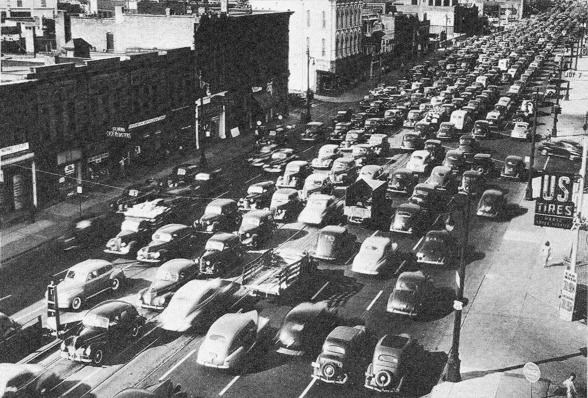
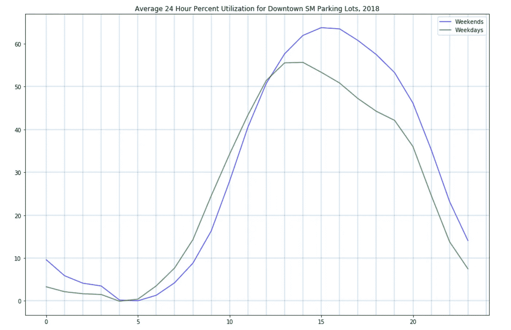
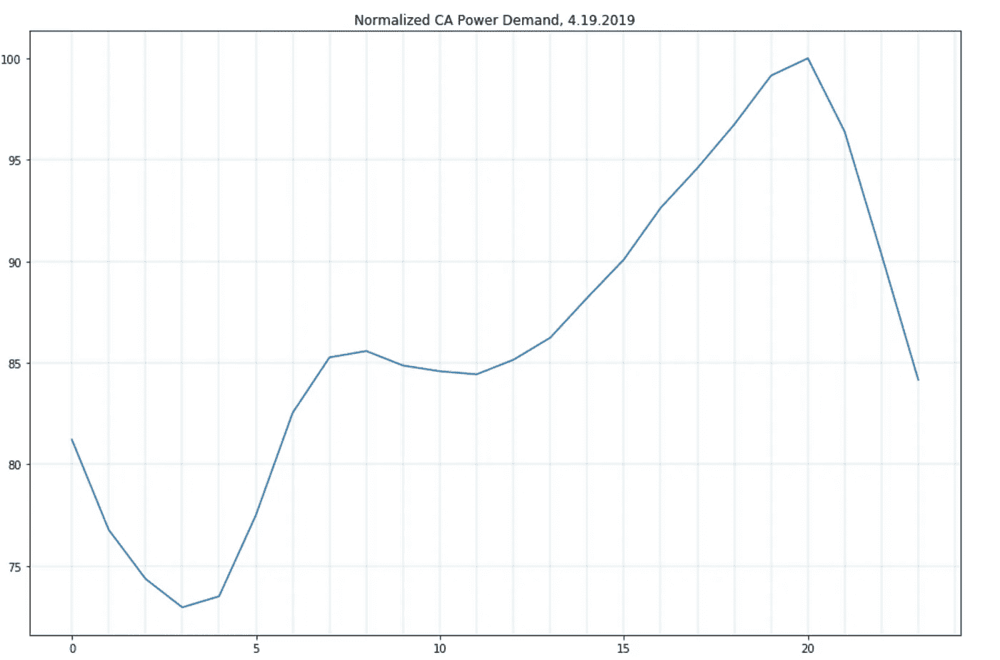
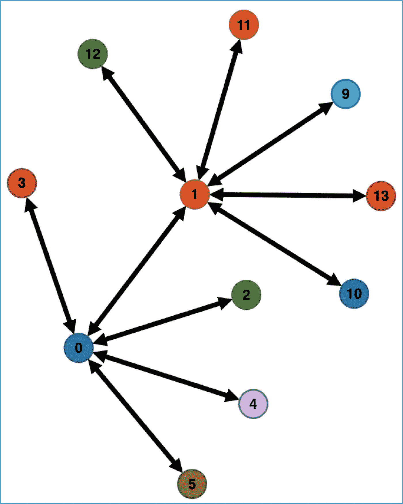
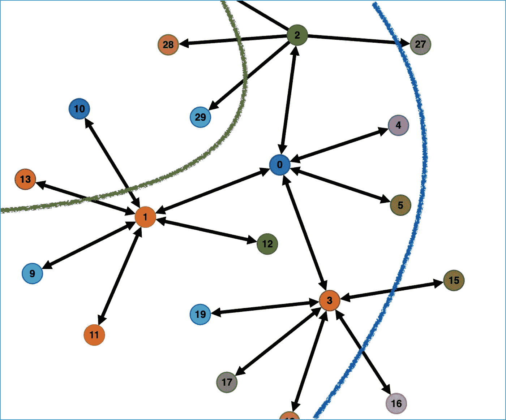
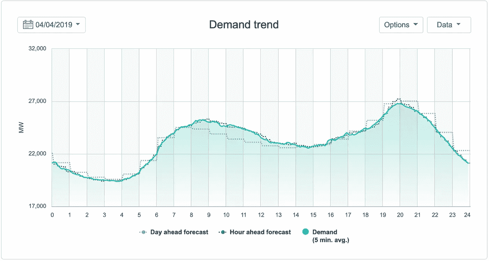
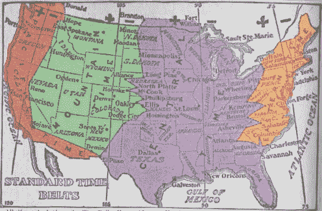

# 关于减少高峰时间

> 原文：<https://towardsdatascience.com/on-eliminating-rush-hours-cdadd3fddcc3?source=collection_archive---------22----------------------->

## 改变三种社会制度如何能带来更轻松、更环保的生活

Rush Hour along Detroit’s Gratiot Avenue in the 1940s

在讨论全球变暖时，每个人都谈到系统性变化；很少有人提出实际操作的方法。在这里，我展示了我在过去几个月里从事的一些研究的结果，这是重新思考我们需要参与的那种社会系统的初步步骤，以减轻气候变化的冲击。

简而言之:交通夺走了我们所有神圣的东西。当我们的道路系统无法处理高峰需求和非高峰使用之间的差异时，就会发生这种情况。无论是工作日还是周末的高峰时段，交通拥堵的一个原因是我们的社会通常按照标准的时间表运行。有趣的是，在我们的电网中也有类似的问题。这两种类型的拥堵都是高峰需求问题的两个具体例子，高峰需求源于两件事:许多人一起生活在同一地区，以及缺乏明智的协调。

降低不同社会系统高峰需求的一个方法是重新划分我们集体安排时间表的时间和空间。

在重新划分时间方面，我们可以通过让人们自愿在周五到周六、周六到周日和周日到周一之间循环度过周末来减少周末的拥挤。通过明确抵消人们在 10 分钟或 15 分钟内“朝九晚五”的工作时间，我们可以减少每天的高峰时间。

就重新划分空间而言，当城市通过一系列半小时或 15 分钟宽的“微时区”开始一天的工作时，抵消可能会减少电网的峰值需求——我对 15 分钟电力负荷概况数据的初步分析支持了这一结论。虽然还需要进一步的研究，但对这些系统性时间表调整的讨论和实施有可能形成一个我们都可以参与的基层气候变化努力。最后，就实施而言，大学校园可能是检验这些想法的理想缩影。

**更长的插图版本:**

*1。简介*

交通是城市生活中最突出、最令人头疼的现实之一，在地球上的每个城市中心都很常见。我们都知道，道路拥堵不仅仅局限于每天的高峰时段——周末交通也困扰着城市居民。

例如，湾区居民经常在夏天开车去纳帕、索诺玛或约塞米蒂，在冬天去太浩湖度周末。他们不仅发现他们的目的地很拥挤，回来的路上交通也很糟糕。虽然从旧金山到太浩湖的旅程在不堵车的情况下大约需要 3.5 小时，但在堵车的情况下可能需要 12 个小时。

在我们的道路系统中，每日高峰时间和周末交通是“高峰需求拥挤”的实例；从抽象的层面来说，这是每个社会系统的问题。类似的事情也发生在我们的电网、供水和排污网络、公共交通系统、海滩和博物馆停车场等等。大多数人在相似的时间以相似的方式使用社会系统，这意味着所讨论的系统必须被设计为处理高峰和非高峰使用之间的巨大差异。

*2。各种系统中的峰值需求示例*

考虑一个停车场每天对停车位的需求。以下是 2018 年圣莫尼卡市中心停车场平均 24 小时利用率的图表，按周末和工作日分列:

Average relative 2018 Downtown Santa Monica hourly parking lot demand. The X-axis is “hours from midnight” and the Y-axis is “percent full.”

常识、经验和这个图表告诉我们两件事。首先，当圣莫尼卡停车系统有能力处理它的高峰时间版本时，它是工作的。其次，这座城市同时受到激励，在最拥挤的日子里拥有足够的容量来处理大部分人群，同时避免建设过多的额外容量。

以电力系统中的“高峰时间”为例，下面是 2019 年 4 月 29 日加州电网的需求图。再次注意最高点和最低点之间的差异:

Unlike fixed-supply parking structures, electrical supply can be adjusted to meet changes in demand, provided the infrastructure can handle the load. CA partially relies on solar (and wind) power during sunny (and windy) hours; it buys electricity from non-renewable sources in the evenings.

在英国，电网高峰需求拥堵的一种类型被称为“[电视接收](https://en.wikipedia.org/wiki/TV_pickup)当许多人观看同一电视节目或体育赛事，并利用广告时间打开冰箱泡茶时，就会发生这种情况。

British TV Pickups during a 1990 Semifinal Soccer / Football match. [Source](http://cmuscm.blogspot.com/2014/10/forecasting-tv-pickups-in-britain.html).

高峰需求成为一个问题的原因是，最昂贵的电力是在需求高的时候从燃煤和燃气[调峰电厂](https://en.wikipedia.org/wiki/Peaking_power_plant)购买的

相当于高峰时间的拥堵影响的不仅仅是市政道路和电力系统。我们都熟悉下班后或周日下午杂货店里的长队，或者当几架国际航班都计划在五分钟内起飞时，海关的队伍变得非常非常长。截至 2012 年，美国人每年花费大约 370 亿小时排队等候。从某种意义上来说，拥挤是居住在人口稠密地区最不希望出现的情况之一。

有趣的是，需求高峰发生的一个原因是，我们都出生在一个围绕 a)一个时间表和 b)同一个时钟建立的系统中。我们认为这种安排是可行的，所以我们微笑着忍受它，尽管前一种假设并不是绝对必要的，更好的解决方案也是可能的。

*3。重新定义问题*

首先，我想说一下为什么我们会有现在这个系统。我们都在同一时间表的主要原因的一种说法是，这样我们每个人都可以像我们想见的人一样休息相同的时间。另一种说法是我们使用或工作的服务、机构和空间(银行、餐馆、舞厅、打字机修理店、糕点店等)。)都是根据彼此的时间表建立的。但考虑到这些事情是由人来管理或参与的，在某种程度上，第二个短语使用不同的词来表达与第一个短语相同的事情。

为了便于说明，请允许我将事情过于简单化。让我们假设我的社交网络仅由五个非常亲近的人组成——我的父母、一个浪漫的伴侣和一个最好的朋友。在下面的可视化中，我是人“0”

我希望所有人和我的五个联系人有相同的休息时间，所以我们都协调工作相同的时间。很好，到目前为止，没问题。当我们把这种礼貌扩展到我的五个人的五个关系中的每一个时，问题就出现了。

在这个简化的社会中，每个人都严格地与另外五个人联系在一起，我们可以很快让数百万人分布在数千平方英里的范围内，他们似乎都必须按照相同的时间表工作。如果一个人想改变他们的时间表，那么整个网络，锁在一起，将被迫立即改变。然而，庞大的网络规模确保没有人会自己改变，整个网络的同步性是高峰时间的主要原因。

正如我所提到的，减少拥堵和高峰时间包括寻找放松网络锁步的方法。

形象地说，如果有办法划分小组(用绿色和蓝色的线表示)并给他们分配不同的“时间表”，高峰时间可以减少。在下面的图表中，绿线左边的所有人都有弹性工作，做服务员，周一和周二休息。也许蓝线右边的人都从 7:30 工作到 3:30，帮助缓解高峰时间。

The more we can break up the synchronicity across the network, the more rush hours will be reduced.

*4。通过调整周末减少每周交通流量*

“Saint Monday, or the people’s holiday — №2\. — A picnic at Hampton Court” ([Source](https://www.antiquemapsandprints.com/hampton-court-st-monday-the-peoples-holiday-a-picnic-antique-print-1855-146294-p.asp).)

200 年前，官方的西方周末只有一天:人们周日休息，以便去教堂做礼拜。非正式地，[许多人(包括本杰明·富兰克林)第二天也翘班](https://www.theatlantic.com/magazine/archive/1991/08/waiting-for-the-weekend/376343/)，并称这种做法为“守圣·星期一”

从企业主的角度来看，也许真正重要的是他们的员工平均每周工作五天，而不一定是五天。假设这是真的，那么就有可能改变周末的时间，从而减少交通以及工作日和周末的拥堵。然而，我们仍然想保留周末的一个主要功能，那就是和其他人有相同的休息时间。

考虑下面的循环时间表模式:6 天工作周和 2 天周末，接着是 4 天工作周和 2 天周末，然后是 5 天工作周和 2 天周末，接着又是 6 天工作周，等等。

Each group follows the 6–4–5 workday pattern offset by one “week,” just like singing a round.

为了便于讨论，让我们假设一个理论城市的一半人自愿开始六天工作周，另一半人自愿开始五天工作周。每三个周末，两组都有相同的两天假期，在另外两个周末，他们有一天的重叠。这种轮流重叠让每组中的每个人都有机会见到他们的朋友。

有了这个计划，两组人总是在周日休息，每三个周末休息两天。更重要的是，三分之二的周一和三分之二的周五，开车上班的人减少了 50%。理论上，每个人周末的一半时间，也就是三分之二的时间，可能是一半拥挤。

从零售商、餐馆、剧院、主题公园、购物中心和其他目的地的角度来看，周末有效地扩大了:在三天分开的周末，它们都变得不那么拥挤，但它们没有看到参观它们的总人数减少。从个人的角度来看，这些地方仍然受欢迎，但不是拥挤不堪。周末和工作日交通减少，通勤更容易，每个人都有更多的自由时间和安心。事实上，如果一部分人保留传统的周一至周五的工作周，这个计划实际上更有利。

也没有必要严格定义小组成员，一旦你自愿加入其中一个时间表，你就不能切换到另一个混乱的时间表，或者正常的 M-F 时间表。相反，人们可以在每个三周的期末四处走动:重要的是，我们把自己的时间表调得恰到好处。

没错，围绕人们的需求和义务(比如他们孩子学校的时间表)工作将会是障碍。然而，如果交替学校或年级是在这两个时间表之一，送孩子上学可能不那么令人担忧。

一旦对周末的假设有了正确的认识，下一个问题就是最佳的作息时间和休息日。使用点( )表示非工作日，除了 6 4 5 和 5 6 4 重复日程之外，第三组可以遵循 4 5 6 重复日程。这个更极端一点，但是保留了“周日休息”的成分，进一步减少了周末的拥堵。将这些放在当前的 5 5 时间表之上，所有 9-5 人的工作，现在有四个潜在的时间表。每一个额外的时间表都有助于缓解拥堵。[1]

*5。通过多班制减少每日高峰时间*

在上一节中，我探讨了如果我们放弃周末必须与周六和周日联系在一起的假设，我们会有什么样的可能性。然而，尽管“洗牌式周末”旨在缓解某些日子的普遍拥堵，但它们并没有专门解决每天的高峰时间。

同样的调整时间表的原则，但是在不同的规模上，可以帮助我们。以下工作或银行营业时间等的“轮班”。在文化上可以接受:8:45-4:45，9:00-5:00，9:15-5:15，9:30-5:30，等等，直到 10:30-6:30。

实际上，并不是每个全职工作的人都严格遵循“朝九晚五”的时间表。如果德国或其他国家认真实施 32 小时工作制，那么他们就有更多的自由来调整“班次”，进一步减少交通和拥堵。

*6。交通需求管理的实证研究*

调整周末和多班制的策略有助于缓解日常交通的紧张。(点击此处查看[交通需求管理概述](https://www.vtpi.org/tdm/tdm15.htm))。我回顾的实证研究发现，这两种想法都行得通。

具体来说，在 1970 年，纽约和新泽西的港务局成功地实施了高峰需求减少，以及交通拥堵的各种措施(地铁站中的人、等待电梯的人的高峰量等。)都减少了。[2]

这两种策略通常都包含在研究人员所谓的“压缩工作周”(CW)中，并且已经发现 CWs 可以改善通勤并减少燃料消耗。[3，4]注意 CWs 通常只是将每个人的周末延长到三天。

2002 年 4 月和 5 月，菲律宾政府为公务员实施了一个有限版本的“混合周末”计划。虽然个人报告减少了通勤时间，但不幸的是，没有收集到适当的数据，留下了“有希望，但需要进一步研究”的证据。[5]

最后，在 1988 年，檀香山市对这一想法进行了有限的“两班制”实验，发现通勤时间平均减少了-4.6%到 14.33 %。那些在预期工作时间自愿选择转移的人喜欢这个项目；令人惊讶的是，那些被迫参与的人并不喜欢。[6]

鉴于有希望的经验证据，我的结论是，没有人足够广泛地实施这些想法——通常，这是一个具有前瞻性思维的个人公司或工厂，而不是当地社会。此外，虽然研究人员研究了与交通相关的指标，但据我所知，没有人量化人们对实际城市生活的整体体验是如何改善的。(正如我上面提到的，大学校园或小镇可能是测试这些想法的理想场所，人们可以看看杂货店的排队情况，人们在邮局获得服务所需的时间，等等。)

许多人和个体公司利用非传统的时间安排来避免高峰时间的交通；它已在许多地方成功实施。从社会角度来说，这已经在暗中进行了。似乎我们会从明确这类事情中获益，这让我得出两个结论性的想法。

首先。据我所知，没有任何研究团队对这些想法进行过足够彻底的分析或模拟，而支持 GPS 的智能手机的广泛采用提供了一个诱人的途径，通过它可以量化这些提议的优势。

第二。最初的证据表明，这些时间表建议应该是人们如何看待世界的共同词汇的一部分。如果这样的时间表变得像我们现在对“周末”的概念一样平常，它将会有最大的好处，而不是一个混乱的时间表只是一个进步的雇主做的一件古怪的事情。

想想看，西方社会对一周中的几天和一年中的几个月都有名字；其他文化有小时的名称和年份的名称。缺少的是各种工作模式/周末和工作时间轮班的常用名称。

*6。通过微时区降低电网峰值需求*

到目前为止，我已经建议我们重新思考我们如何划分我们的社会时间概念，以此来打破导致交通系统拥堵的同步性。但是正如我在引言中提到的，除了交通系统，还有其他系统会受到高峰需求的负面影响，其中一个特别相关的就是电网。

如果实施的话，调整周末和工作时间可能会产生减少碳排放的次级效应，但减少我们对发电厂的需求将会产生更大的效应。正如我提到的，实现这一点的一个方法是重新审视我们如何划分物理空间的概念，在这个空间中，我们都保持相同的时间表，或者更简单地说，我们称之为时区。

为了唤起你的记忆，这里有另一个图表，说明了加州电网的需求，这次是从 2019 年 4 月 4 日开始的:

[Click here](http://www.caiso.com/TodaysOutlook/Pages/default.aspx) for more CA data. The dip in the middle of the day is due to behind-the-meter solar panels circumventing buildings from drawing from the grid at large.

换句话说，这个图表表明，在一天结束的时候，几乎每个加利福尼亚人下班或放学回家，几乎同时开灯、做饭和看电视。尽管在整个加州，太阳不会在同一时间落下:位于加州北部东部边界的太浩湖位于洛杉矶的西面。

其中一个主要原因是因为(在美国)，铁路公司既要负责采用标准化时钟，也要负责让城市转换到标准化时区。1883 年 11 月 18 日，“ *600 条铁路线放弃了他们一直使用的 53 个任意时间……定义了四个新时区的时间——东部时区、中部时区、山区时区和太平洋时区。大多数美国大城市都效仿铁路公司，采用时区作为自己的使用时间……*"[7]35 年后，美国联邦政府正式承认了四个时区(做了一些修改)，并签署成为法律。

A colorized 1913 map of the original US timezones. The jagged points along each timezone boundary reflect the fact that the Railroads kept the same time along a track until they reached a certain destination. [Source](https://commons.wikimedia.org/wiki/File:Time_zone_map_of_the_United_States_1913_(colorized).png).

采用时区的一个影响是，电力高峰需求是一个比其他情况下更大的问题，另一个影响是，住在时区的西部边缘[会对你的健康产生负面影响](https://www.washingtonpost.com/business/2019/04/19/how-living-wrong-side-time-zone-can-be-hazardous-your-health/?utm_term=.308f01a2518f)。仅仅“铁路便利”是一个历史上有意义但越来越不相关的原因，让数百万人保持类似的工作时间。[8]因此，减少高峰需求的一个解决办法是让人们(以及工厂等)参与进来。)来改变他们的时间表，就好像他们在一个微时区(我简称为“μ时区”)。

美国西南海岸有调峰发电厂的一个原因是旧金山、萨克拉门托、拉斯维加斯和洛杉矶都保持相同的营业时间，尽管这些地区之间存在很大的东西差异。美国东海岸也是如此，亚特兰大和波士顿保持着相同的社会建构的营业时间。

为印度国家提出了类似的解决方案，其目前根据一个官方时区。电气工程教授 Amlan Chakrabarti 博士开发的模型表明，如果在印度次大陆引入三个一小时宽的时区，整个印度电网的**效率将提高 5%。*【9，10】*

*但是，如果问题是减少高峰需求，而不是铁路计时，为什么要停在一个小时宽的时区呢？如果你将每个小时的时区划分为 4 个，或者让人们将他们的时间表移动 15-45 分钟，效果将是进一步消除“高峰时段当量”(即高峰需求)对电网的影响。重要的是，时钟不需要移动；从电网的角度来看，商店和服务机构开门营业时的转移*就好像时钟发生了转移*一样。*

*在加州实现此解决方案的一种方法是使用以下边界作为绘制 15 分钟μ时区偏移量的指南:*

**

*The red star represents the approximate location of Las Vegas. Note that actually changing the time on local clocks is not necessary; all that is needed is for people to behave as if their clocks were offset by 15–45 min. Original visualization by [Mike Bockstock](https://bl.ocks.org/mbostock/5562380).*

*此外，您可能希望将这些μ时区与北部的州和南部的墨西哥联系起来，当您这样做时，您还可以了解整个美国:*

**

*Clearly, these lines would be adjusted around population centers and county lines. Send policy wonks, stat.*

*我已经对微时区对高峰需求的影响做了一些初步建模，基于中西部公共事业单位的 475 名客户的数据，以 15 分钟为增量。[11]我分析了全年数据中需求最高的一天，并模拟了将相同的人口分配到四个不同的μ时区，1000 个不同的时间。以下是随后的负载曲线:*

**

*Real and simulated electricity loads for the peak day, at the end of July, in the tiny 475 customer dataset. The black line is the actual load, the green lines represent 1000 simulations of assigning the population to 4 different 15-minute offset timezones. The blue line is the average of all of the green lines.*

*在全年模拟将客户分配到不同时区 3000 次后，数据支持两个结论:第一，高峰需求确实减少了，第二，四个 15 分钟μ时区比两个 30 分钟μ时区更好。在 4μ时区的场景中，我发现峰值 15 分钟间隔的平均净减少量约为 1390 千瓦时，每个客户平均减少 2.9 千瓦时。*

*目前，还不能说这种推广达到了什么程度——如果每个客户的平均减少量保持不变，那么当扩展到数百万客户时，节省的成本将是巨大的。然而，数据很难获得，并且假设行为是峰值需求的主要驱动力，而不是温度之类的东西。与此同时，平滑到达需求高峰顶部的“斜坡”可能有更多的好处，我的理解是，更平滑的斜坡意味着高压输电线路更少的拥塞和电力基础设施更少的磨损。*

*这些结果、上图以及 Chakrabarti 教授的工作都表明，问题不在于μ时区是否会降低峰值需求，而是会降低多少。这个想法的下一步可能涉及研究人员或学术实验室获取更多的数据并扩大分析。鉴于这样的系统可能会减少电厂的建设，电力对消费者来说可能会更便宜，最终电力公司会更有利可图。*

**6。结论**

*高峰需求问题影响着地球上每一个具有一定规模的城市。即使我们[殖民火星](https://www.theatlantic.com/technology/archive/2018/06/could-colonizing-mars-be-the-most-important-project-in-human-history/564041/)(比方说，为了应对气候变化)，只要我们保持同样的调度传统，交通、拥堵和高峰需求问题仍然会存在。相反，一旦我们真正在一个地方解决了这些问题，我们将知道如何在任何地方解决它们。*

*在我看来，有三个步骤可以实现让当地文化改变和调整他们的时间表的更大目标。*

*首先，研究人员、经济学家、交通工程师和政策专家需要更彻底地探索上面提出的时间表变化的类型。应该回答的问题包括:这些解决方案将在主要城市减少多少不同的高峰时间？这些计划可能会带来哪些具体的环境效益？穿过城镇通勤会容易多少？电价会有怎样的变化？有没有可以预见的意想不到的后果？如果我在这里概述的所有建议都得以实施，对于每个邮编的人们来说，这意味着什么样的日程安排变化？我将利用我所拥有的资源来寻找这些问题的答案；在未来的几天和几周内，我将寻求学术伙伴关系，以进一步这些研究。*

*第二，我们所有人都可以做的一件切实可行的事情就是开始互相介绍这些想法，从而融入我们的文化。我们都需要讨论这些提议，看看我们是否能适应它们，并努力说服我们的老板、校长、董事会、市政官员等等，让他们通过。*

*值得讨论的问题包括:如果你镇上的每个人都同意改变工作日应该开始的时间，你认为自己会跟着改变吗？怎样才能让你在一个混乱的周末工作？有多少和你有关系的人也需要改变他们的想法？*

*改变时间表有可能减少交通流量和降低电价；代价是协调会议和社交聚会可能需要更多的计划。虽然让大量的人改变他们的行为是很重要的，但这些减少峰值需求的提议有可能形成一场我们所有人都可以参与的草根气候变化运动。*

*与此同时，永远不要坐在车流中，看着你的电费账单，或者让全球变暖进入你的脑海，避免思考事情如何才能再次变得更好。*

*____________*

*尾注/引文:*

*[1]敏锐的读者还会认识到，基于相同的 4，6，5 结构，还有另一种可能的时间表:4，6，5。为了确保每个计划总是在周日休息，这将需要抵消一天，并在周二开始。*

*读者可能还会注意到增加时间表的数量如何有助于更好地消除拥挤(通过将人群分布到不同的日子)和从仅仅音准到均等音律调音系统的转变(其中“误差”均等地分布到所有键)之间的联系。)*

*[2]欧玛利，布伦丹·w . .[改变工作计划以减少高峰运输需求](http://onlinepubs.trb.org/Onlinepubs/sr/sr153/153.pdf#page=175)*特别报告-国家研究委员会运输研究委员会* 153 (1974): 166。*

*[3]洪，鲁迪。"[利用压缩工作周来减少通勤](https://www.sciencedirect.com/science/article/pii/0965856495000127)"运输研究 A 部分:政策与实践 30.1(1996):11–19。*

*[4]马尔科·佩尔科科。《工作时间对公共车队燃料消耗和二氧化碳排放的影响:来自政策实验的证据》*交通政策*71(2018):126–129。*

*[5] Sundo，Marloe B .，和 Satoshi Fujii。压缩的工作周对通勤者日常活动模式的影响。"*运输研究 A 部分:政策与实践*39.10(2005):835–848。*

*[6] [*交通管理错时上下班案例*](http://onlinepubs.trb.org/Onlinepubs/trr/1990/1280/1280-006.pdf) (第 1280 卷)。朱利亚诺(1990 年)。加州大学欧文分校交通研究所。*

**铁路的发明时间，伊恩·r·巴克提，《铁路史》，第 138 卷，第 13 页。**

**[8]随着铁路逐渐把美国连接起来，他们发现适应每个城市的当地时间成了一件麻烦事。除了使他们自己和旅行者更容易，他们采用“标准铁路时间”的另一个原因是由于一小群人的努力。这个小组包括查尔斯·多德，克利夫兰“气象局之父”阿贝，他想让人们在美国不同地区的同一时间进行天气和天文观测；桑福德·弗莱明是一位加拿大铁路工程师，他看到了标准时间的好处；威廉·f·艾伦是通用时间会议的秘书，他敦促铁路公司“在我们之间解决这个问题，而不是把它托付给……州立法机关的无限智慧。标准时间的采用，Ian R. Barkty，技术与文化，第 30 卷，第 1 期，第 25–56 页。**

**[9]a . Chakrabarti 和 C. K. Chanda，第五届能源研究进展国际会议，摘要集。**

**[10]通过时区划分减少高峰需求，Amlan Chakrabarti，[《工程师学会杂志》(印度):B 辑](https://doi.org/10.1007/s40031-014-0091-2)，第 95 卷，第 3 期，第 219-230 页。**

**[11]支持 Solar 公司向我提供这些数据。**

**最后，非常感谢 Karoun Kasraie、莎伦·刘、Sachu Constantine、Jamie Levhic、Malini Kannan 和 Amlan Chakrabarti 博士对这些想法的反馈。**