# 生物医学文献中的撤稿现象

> 原文：<https://towardsdatascience.com/on-retractions-in-biomedical-literature-1565e773559e?source=collection_archive---------7----------------------->

学术界的激烈竞争和急于发表，很多时候导致科学出版物中有缺陷的结果和结论。虽然其中一些是诚实的错误，但另一些是故意的科学不端行为。根据一项研究，76%的撤稿是由于从特定期刊撤稿的论文中的科学不端行为。2012 年的另一项研究发现，约 67%的撤回可以归因于不当行为。这种弊端贬低了进行科学的根本目的——追求真理。此外，这样的研究是浪费纳税人的钱。对于作者来说，论文撤稿虽然是正当的，但可能会带来削弱性的后果，如资助资金枯竭、合作者消失、缺少初级同事和学生来协助运行实验室。受到生物医学文献中几篇撤回新闻的激励，我决定进行更深入的调查。

我所有的分析都基于来自 PubMed 的数据，这是一个免费的生命科学和生物医学出版物搜索引擎。我在 2019 年 2 月使用 Eutilities 收集了这些数据，Eutilities 是一种用于访问国家生物技术信息中心(NCBI)数据库(包括 PubMed)的 API(应用程序编程接口)。在这篇文章中，我将讨论所有的参与者——作者、期刊和国家，它们都参与了科学管理、科学评论和出版，以及资助和支持科学。PubMed 的数据可能是不完整的，因为网站上可能不会记录所有关于被撤回出版物的信息，但我假设这些结果在统计上仍然有效，并将推广到真实情况。

# 生物医学文献中撤回论文数量的增加

根据 PubMed 的数据，截至 2019 年 2 月 5 日，共有 6，485 篇出版物被撤回。在和一位生物学家朋友讨论这个数字时，她的第一反应是“哇！那是小的！我原以为数字会更大”。有这种想法的不止她一个人。根据《自然》杂志的一项调查，近 70%的被调查生物学家未能复制他人的实验，根据这些被调查生物学家中的 50%，他们认为至多 70%的研究是可复制的。根据最近发表在《分子和细胞 Biology⁴》上的一项研究，大约有 35，000 篇论文因不适当的图像重复而有资格被撤回，这只是撤回的众多原因之一。其他原因包括剽窃、数据捏造、不可靠的数据、重复发表、没有伦理认可以及虚假的同行评议等等。因此，6845 份被收回的出版物可能只是冰山一角。

我们不是最近才开始收回出版物的。第一篇被撤回的生物学论文(在我的数据集中)发表在 1959 年的《生物物理和生物化学细胞学杂志》上，题为《论核 RNA 合成的初级位点》。然而，每年撤回的数量正在增加。而 2000 年发表的论文撤稿率为每万篇论文 1.8 篇，2015 年已增至每万篇论文 4 篇。乍一看，这可能是一个很小的数字，但想象一下，就影响他人的研究而言，一篇论文可能会造成多大的破坏，特别是当它声称是该领域的一项突破时，或者如果这篇论文涉及临床试验或医学治疗时。此外，请记住，虽然我们只考虑被撤回的论文，但很可能有许多其他论文应该被撤回，但没有被撤回。

下面是一个条形图，显示了在给定年份发表并在后来被撤稿的论文数量，显示了《科学》杂志撤稿的增加趋势(图 1)。

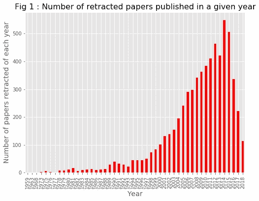

接下来，我检查了给定年份中有多少出版物被收回，而不管它们的出版年份。这表明在 2000 年代中期到后期，撤回数量急剧增加，在最近几年达到最大值。(图二)。

从出版日期中减去收回日期，提供收回所用的年数。从图 3 中可以看出，虽然最大的撤销发生在一年之内，但有些人却花了 27 年之久(图 3)。收回的平均持续时间为 3.7 年。这解释了图 1 中 2015-2018 年撤销数量较少的原因。

# 只有少数作者是惯犯

数据显示，涉及撤稿的 6.485 篇出版物共有 24722 位作者。在这个数字中，82.7%，即 20，448 人是一次性犯罪者，而近 4，000 人的名字出现在 2-5 份收回的文件上。有 367 位作者对他们的帐户有较高的撤回次数(超过 6 次)(表 1)。Yoshitaka Fujii 在麻醉学领域进行了 166 次撤回，是撤回次数最多的。(藤井显然是基于近二十年的伪造数据发表的。维基百科页面引用了 183 条撤回藤井出版物的参考文献。虽然惯犯的数量很少令人欣慰，但有恶意动机的生物学家被允许长期从事科学研究并发表大量论文，直到被停止，这一事实令人担忧。

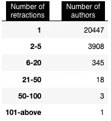

Table 1

# 国别撤回

为了回答这部分分析，我需要从属关系数据。这些数据是杂乱的，许多作者只提供了他们的大学或研究所的名称，而没有国家名称，并且许多时候国家名称以各种形式出现，如 UK/United Kingdom/England。为了解决第一个问题，我使用了 [SPARQL](https://en.wikipedia.org/wiki/SPARQL) 从[维基数据](https://www.wikidata.org/wiki/Wikidata:Main_Page)获取数据。这给了我一个 102，958 个组织的列表，其中包括全球各种大学、研究所、工程学院、大学系统、公认的大学、国际组织、医院、企业、研究中心和科学院(可能是所有进行生物医学研究的地方)，这有助于找到相应的国家。我使用维基百科获得备用国名来解决第二个问题。

随着我们当前的科学研究在本质上变得越来越具有协作性，因为一篇论文的作者可能来自不同的机构以及不同的国家。因此，对于每一份出版物，我都为附属国家保留了独特的价值观。从下图中可以看出，大多数撤回来自单一国家，国际出版物上的撤回论文从 2005 年才开始出现，仍然只占全部撤回的 4.6%。

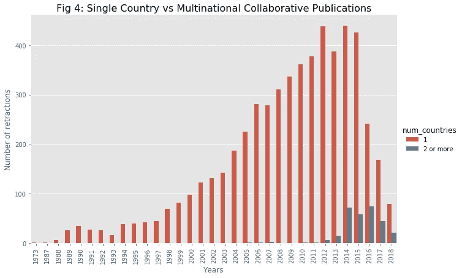

撤稿论文来自 98 个国家，美国、中国、日本、印度和德国占据前五位(图 5)。

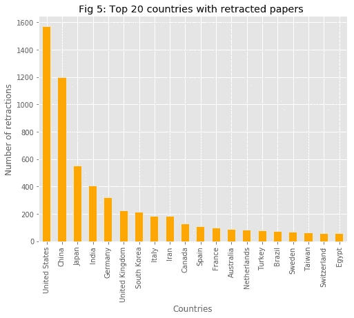

如果我们放大这 5 个国家的表现，我们可以看到中国在 2010 年中期撤回的论文(即在此期间发表的论文)数量急剧增加(图 6)，这与其出版速度的增加速度密切相关(图 7)。

从本世纪初到 2015 年，中国的出版率飙升了近 15 倍。随着科学基金的增加以及在汤森路透的科学引文索引(SCI)索引的期刊上发表论文的竞争的同时增加，这是中国科学家晋升和研究资助的关键要求，在 SCI 期刊上发表论文的不道德手段已经出现。这种不公平的手段包括购买作者身份，通过用中文发表已发表论文的英文翻译进行自我剽窃，假冒同行评议，代笔和购买论文 authorships⁵ ⁶.随着撤回数量的急剧增加，2017 年，中国政府采取了零容忍政策来控制不道德的科学。一些措施包括在不同时期禁止欺诈性的研究人员进入他们的研究所，撤销奖励和荣誉，收回研究基金，关闭广告出售论文的网站，并调查参与出售 papers⁷的第三方机构。中国的政策是否会有助于减轻收回成本的负担，并因此成为其他国家的榜样，还有待观察。

虽然上述各国撤回论文的记录有助于我们了解哪些国家的撤回论文数量最多，但检查哪些国家的撤回率最高(每篇已发表论文中的撤回论文数量)也同样重要。在这方面，安圭拉、阿鲁巴和圣马力诺占据了前三名。但是，他们总共发表了不到 300 篇文章，每篇文章都有一篇撤回。为了避免让那些没有发表很多生物医学研究论文的国家加入进来，我设定了一个门槛，即任何一个国家至少要发表 1 万篇论文。这样我们就获得了这个位置上的顶尖玩家——伊朗、突尼斯、印度、乌克兰和中国(图 8)。根据 2018 年的一项 report⁸，来自伊朗的 80%的被撤论文是由于科学不端行为，为控制科学欺诈敲响了警钟。

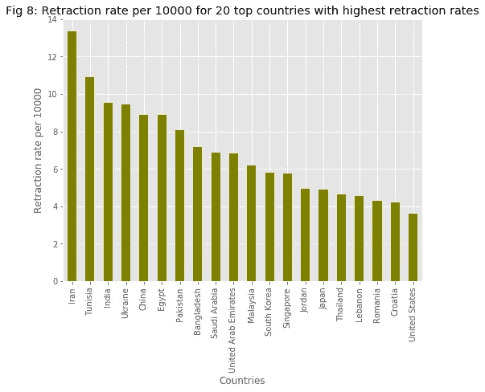

虽然作者是任何科学出版物中的关键负责人，但出版期刊和编辑也有一些责任，不允许发表妥协的研究，或至少主动撤回此类出版物。这让我想到了科学期刊中的下一个撤稿点。

# 大多数撤稿来自低影响因子期刊

撤回的论文发表在 1988 种不同的科学期刊上，其中《生物化学杂志》、《肿瘤生物学》、《公共科学图书馆·综合》、《PNAS》和《科学》占据了撤回论文数量最多的前五位(图 9)。

虽然这些期刊中有 54%只是一次性违规，但像《生物化学杂志》这样的期刊有 253 次撤回(约占总撤回量的 13%)，其次是《肿瘤生物学》有 145 次撤回和《公共科学图书馆综合》有 132 次撤回(图 10)。

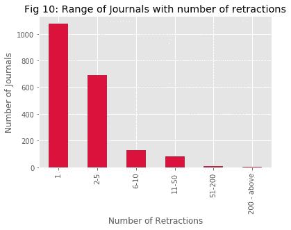

与其他撤稿期刊相比，肿瘤生物学的撤稿从 2011 年论文开始，并在 2014 年至 2015 年间急剧增加(图 11)。在这些撤回之后，其中超过 100 篇归因于虚假评论，2017 年 7 月，科学网停止了对肿瘤生物学的报道。这意味着从那时起它就没有影响因子，大多数研究人员也不会对在这个杂志上发表感兴趣。

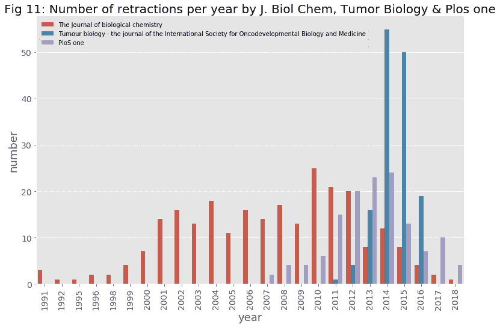

此外，在这 20 种顶级期刊中，诊断病理学的退稿率(期刊发表的论文总数中的退稿数)最高，其次是肿瘤生物学(图 12)。但是，与肿瘤生物学相比,《诊断病理学》的出版数量少了 4 倍，撤回量也少了近 4 倍。另一方面，相对于其他期刊(除了诊断病理学，它也是在 2006 年开始的)，Plos one 是最近(2006 年)开始的，在其他 19 种期刊中发表数量最多，撤回数量第三高(图 13)。如果这种大规模出版正在影响 Plos，那么出版商需要考虑一个人的质量。

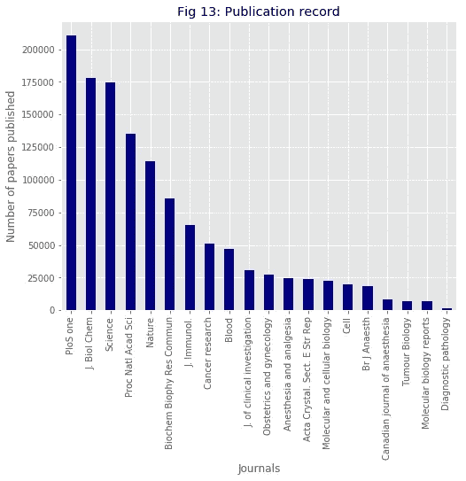

由于期刊的影响因子是研究人员选择在哪里发表研究的决定标准之一，我检查了这一因素是否与撤稿有任何联系。为此，使用了 Clarivate Analytics 发布的 2018 年影响因子列表。分析显示，约 80%的撤稿来自影响因子为 0-5 的期刊。尽管撤稿也发生在影响因子较高的期刊中(影响因子甚至高达 53)，但频率较低(图 14)。

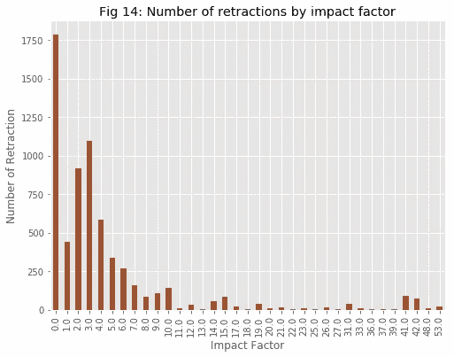

接下来，我很好奇前 5 个国家(也占全球总撤销量的 62%)的撤销分布情况。正如所料，这些国家的大部分撤稿仅限于低影响因子期刊，但高影响因子期刊的大部分撤稿通常来自美国，在某些情况下来自日本和德国(图 15)。

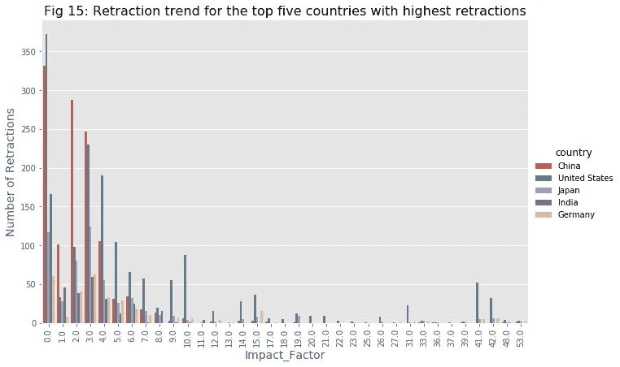

当研究这些国家的总撤回次数时，很明显，中国和印度在低影响因子期刊(0-5)中的总撤回次数分别高达 90%和 87.3%，而美国只有 63%。与印度和中国相比，日本和德国在低影响因子期刊(0-5)中的撤回率也较低。这表明至少这三个发达国家撤回论文的分布略有倾斜，与中国和印度这两个发展中国家相比，在影响因子较高的期刊上撤回的论文更多(图 16)。在 2012 年的一项研究中，美国、日本和德国报告了大多数因欺诈导致的撤回，并与更高的影响因素相关。此外，作者发现，由于抄袭和重复导致的撤稿更多发生在中国和印度，并且涉及低影响因子期刊。这应该进一步调查。我还没有找到关于撤回原因的全面数据，但如果有可用的东西，我会很乐意挖掘。

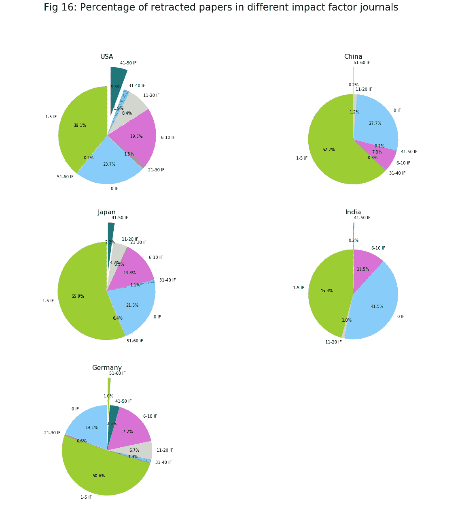

# 结论

到目前为止，我们已经看到了多年来撤稿数量的增加，撤稿最多的作者、国家和期刊。虽然“发表或灭亡”不是进行研究的最佳环境，但不诚实的科学肯定不是解决这个问题的答案。这不仅会影响被撤回论文的作者，还会将其他科学家引向无效的研究方向，在最坏的情况下，还会导致对患者的不当治疗。此外，所有这些都降低了公众对科学的信任。虽然撤回暴露了科学的阴暗面，但消灭坏科学的积极一面是，科学家和其他参与该领域的人愿意纠正他们的错误，并维护其神圣性。

如果您有兴趣获取这里使用的数据或检查该分析的源代码，请参见我的 [Github](https://github.com/bbhatt001/Retractions-Biology) 。

这篇文章也发表在我的[博客](https://bhumikabhatt.org/on-retractions-in-biomedical-literature.html)上。

1.  e . c . moylan 和 m . k . Kowalczuk，2016 年。为什么文章被撤稿:生物医学中心撤稿通知的回顾性横断面研究。BMJ 公开赛，6(11)，第 e012047 页
2.  方，2012 年。不端行为占被撤回的科学出版物的大多数。美国国家科学院院刊，109(42)，第 17028-17033 页。
3.  贝克，硕士，2016。1500 名科学家揭开再现性的盖子。自然新闻，533(7604)，第 452 页
4.  Bik，E.M .，Fang，F.C .，Kullas，A.L .，Davis，R.J .，Casadevall，a .，2018。不适当图像复制的分析和纠正:分子和细胞生物学经验。分子和细胞生物学，38(20)，第 e 00309–18 页。
5.  维斯滕达尔，硕士，2013 年。中国出版市场。
6.  2018 年:廖庆军、张、杨燕、范、杨春、郑、陈明辉、白、陈立杰、何晓霞、张世波、夏、何海红、何海红。中国生物医学研究人员对学术不端行为的看法:2015 年与 2010 年的比较。科学与工程伦理，第 1-17 页。
7.  [http://www.xinhuanet.com/english/2017-07/28/c_136480677.htm](http://www.xinhuanet.com/english/2017-07/28/c_136480677.htm)
8.  Masoomi，r .和 Amanollahi，a .，2018。为什么伊朗生物医学论文被撤稿？。《医学教育与发展杂志》,第 13 卷第 2 期，第 87-100 页。