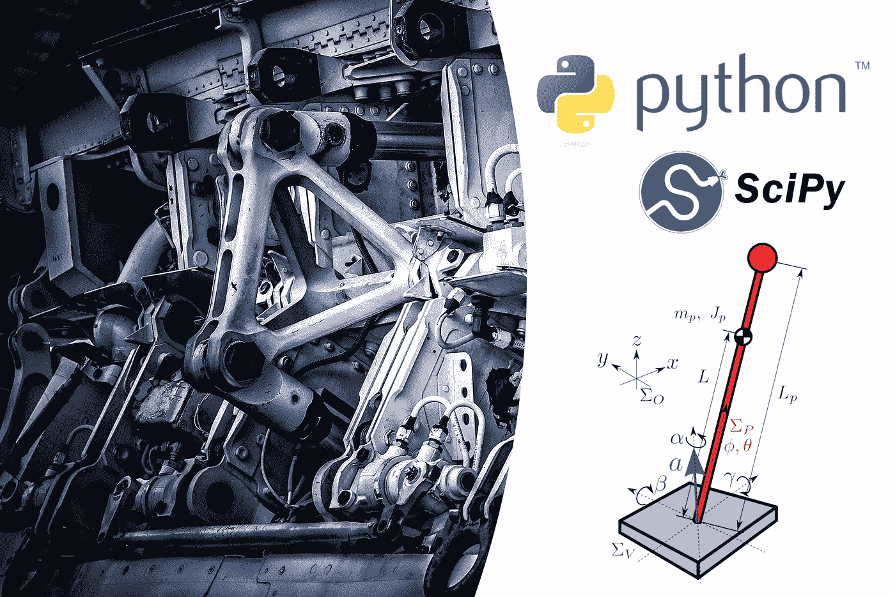
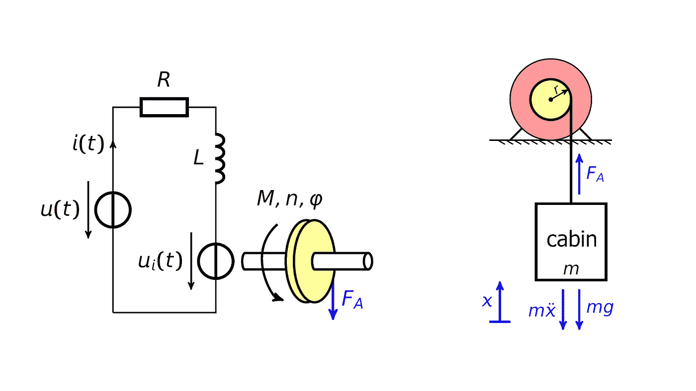
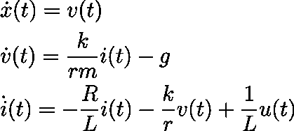
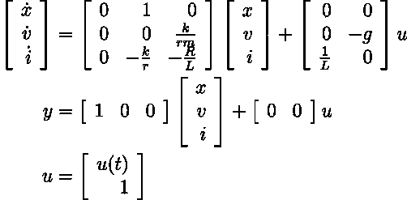
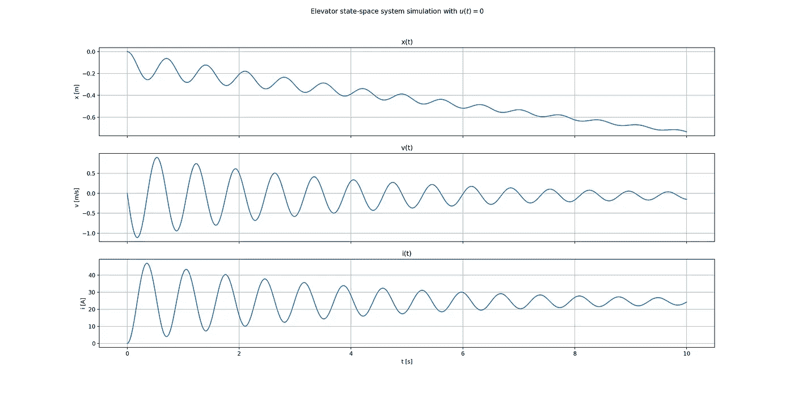
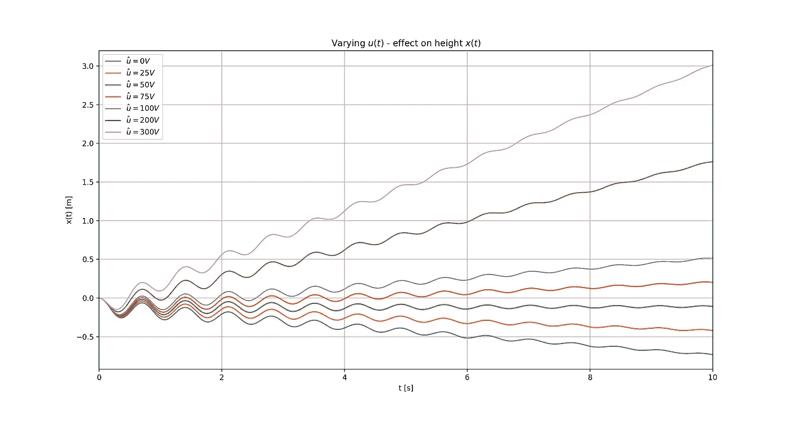
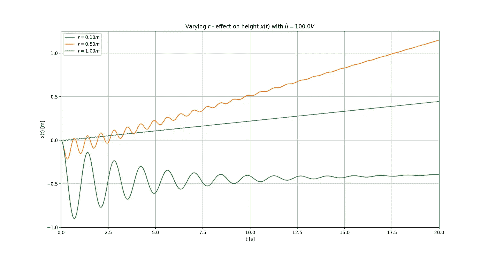
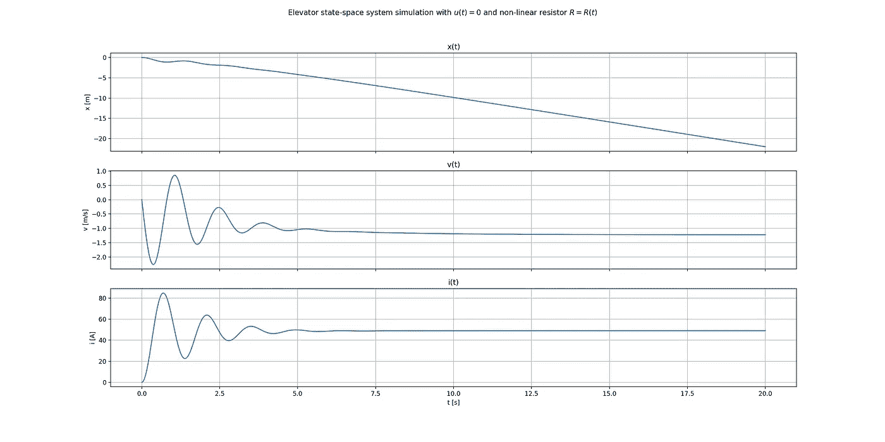

# 关于用 Python 模拟非线性动态系统或如何不用 ML 获得洞察力

> 原文：<https://towardsdatascience.com/on-simulating-non-linear-dynamic-systems-with-python-or-how-to-gain-insights-without-using-ml-353eebf8dcc3?source=collection_archive---------5----------------------->

机器学习无处不在。你每天都会听到语言处理、计算机视觉或强化学习方面的突破性进展。令人惊讶的是，在工程领域内，将机器学习作为核心元素应用于安全关键系统的例子很少。当然，自动驾驶(AD)栈在很大程度上依赖于使用雷达、激光雷达和视频作为输入的深度学习算法进行感知，尽管控制部分仍然由系统理论和控制工程中几个世纪以来开发的方法来管理。

强化学习试图解决控制复杂系统的问题，但训练代理需要在目标环境中进行成千上万次的试错(探索/利用)(即在 AD 示例中:真实车辆的真实交通)——这可能是昂贵的，甚至是危险的。或者，您可以对您的环境进行足够精确的物理模拟，您可以用它来训练您的代理的基线，然后，在您的性能达到某个阈值之后，将代理部署到真实环境中，以传输和调整它的知识。物理模型通常会简化我们的非线性现实世界，以便进行(数值)计算。RL 代理将调整它们内部的非线性状态值或状态动作函数以适应那些特定的情况，并实现与传统控制方法相比更好的性能。

本文试图激励您更仔细地研究控制理论中介绍的概念，并在日常生活中应用它们来理解事物、摆弄参数并观察系统对您引入的变化的行为。或者你可以用这些知识来建立模拟环境，作为你复杂的、基于神经网络的 RL-agent 的训练营。

# 观众

我为所有对将机器学习算法应用于现实工程问题感兴趣的人写了这篇文章。你应该有一些数学、物理、机械和电子工程的基础知识。因为我们使用 Python 来求解常微分方程(ODE ),所以你应该知道如何创建、操作和绘制 NumPy 数组。

如果您在学习期间使用 MATLAB，现在考虑转换到 Python 以节省成本或使用更大的 ML/DL 堆栈，那么这篇文章也会让您感兴趣。

# 我们的系统

在本文中，我们将开发一个简单的电梯模型，它由两个主要部分组成:左边的 DC 电机电枢(电气部分)和右边的机械结构。

在接下来的两节中，我们将推导出这两个部分的数学描述。之后，我们将把所有方程合并成一个描述我们整个系统的状态空间模型。敬请期待！

## (刷)DC 电机

数学上有刷 DC 电机是一个由电机电阻 **R** (线圈绕组的电阻)、电感 **L** 和电动势 **Ui** 组成的电气网络，电动势与转速 **n** 耦合。扭矩 **M** 与电流 **i(t)** 成正比。扭矩 **M** 除以轴 **r** 的半径产生一个将轿厢拉起的驱动力 **F** 。形式上，我们有以下关系:

Equations of the electromechanical side

第一个等式是电流 **i(t)** 和驱动转矩 **M** 之间的形式关系。扭矩与电机特性 **k** 成比例。

第二个等式表示电动势电压 **Ui** 和转速 **n(t)** 之间的线性关系。两者之间的因素还是，电机参数 **k** 。

第三个等式描述了电机的机械动态特性([机械平衡](https://en.wikipedia.org/wiki/Mechanical_equilibrium))。竖井的惯性被设置为零，因为其对电梯轿厢的重力和惯性力的影响可以忽略不计。请注意，忽略转动惯量会导致我们的第一次近似，我们可能会失去精度！

最后一个等式是[基尔霍夫电压定律](https://en.wikipedia.org/wiki/Kirchhoff%27s_circuit_laws#Kirchhoff's_voltage_law)的实现，它是力 **F** (over **i(t)** )和输入电压 **u** 之间的重要联系。输入电压是我们系统的输入信号，它控制电梯的高度 **x.**

在我们的模型中还有第二个更大的不准确性——第三个等式意味着我们有一个常数 **r** ,这在现实世界中是不真实的，因为轴的半径将随着每一次额外旋转的绳索厚度而增加。但是为了保持方程简单，我们将假设绳索厚度相对于竖井本身的半径可以忽略不计:

Visual example of the radius increase issue. Image source: [https://picclick.fr/36mm-Naturelle-Coton-Bannister-Rampe-%C3%89scalier-Corde-X-303031999809.html](https://picclick.fr/36mm-Naturelle-Coton-Bannister-Rampe-%C3%89scalier-Corde-X-303031999809.html)

## 机械结构

为了实现从 **F** 到高度 **x** 的关系，我们将再次使用[机械平衡](https://en.wikipedia.org/wiki/Mechanical_equilibrium)定律:

Driving force F_A is a sum of inertia and gravitation

重力把我们的小屋拉下来，而驱动力试图把它拉起来。惯性力与我们电梯的垂直加速度成正比。

轿厢垂直速度 **v** 与转速 **n(t)** 的关系:

# 向状态空间出发

为了模拟上面的微分方程，我们将把它们组合成一个[状态空间](https://en.wikipedia.org/wiki/State-space_representation)表示。状态 **s** 是一个 **n** 维向量(n :=状态数)，它描述了每个时间点的整个系统，也就是说，给定 **s** ，我们可以推导出所有其他变量(包括输出变量)。

State-space representation

这个表达式由两个方程组成。在第一个等式中， **s** 的导数取决于状态本身和一个输入向量 **u** (在我们的例子中，它是一个标量，因为我们只有一个输入，即 DC 电机的电压)。第二个等式显示了我们系统的输出行为，这当然取决于系统的状态和输入 **u** 。

让我们来设置表示。有几种方法可以导出表示法，我们将使用最简单的一种(imho！)，因为它不需要任何关于拉普拉斯传递函数的知识。我们的状态变量将是导致我们系统中能量增加或减少的变量。

一个好的经验法则是选择不能在不同级别之间跳跃的变量。以 **x(t)** 为例。电梯轿厢不能在无限短的时间内将其高度从 0 改变到 10 米，因为这个过程也需要无限量的电力。你们可能在物理课上还记得，计算势能的公式是

m: mass of the object, g: gravitational acceleration, h: relative height to 0 potential

第二个状态变量是座舱的垂直速度。速度也不能从 0 跳到 10 米/秒，原因同上，在我们的系统中表示能量的信号需要无限的能量来应对突然的变化。此外，物理课上还有一个动能公式:

v: vertical velocity

第三种状态没有那么明显。直到现在，我们的能量变量 x 和 v 只描述了机械部分。在电路中，我们有下一个能量存储——电感 **L** 。你不能改变电感上的电压，因为你可以用一个简单的电阻来改变。因此，我们引入 **i(t)** 作为第三个状态变量。这里，磁能的方程式是:

上面介绍的机械和电气部分中的所有其他变量都线性依赖于所选的状态变量。让我们重新排列方程，这样在左边我们只有状态变量的一阶导数，在右边是其他的一切(没有导数)。

我们将使用变量 **i(t)** 来完成这个过程:

The derivative of i(t) only depends on the input u(t), the current i(t) and velocity v(t), which are input or state variables respectively.

用类似的方法，我们得到了 **x** 和**v**的方程，我们一起得到了我们的状态空间方程系统(一阶常微分方程):

以矩阵形式(一般形式)——TL；这一大段的 DR 版本:

State-space representation of our elevator example. Note, that because of gravitation our input vector has two elements, the input voltage **u(t)** and a constant 1 which is multiplied with **g**.

换句话说，我们现在有了状态空间矩阵:

A: state-matrix, B: input-matrix, C: output-matrix, D: feedforward-matrix

# 模型运行(带 SciPy)

首先，我们导入本教程中使用的几个包，并初始化系统参数:

让我们定义我们的状态空间表示矩阵，并初始化 *StateSpace* 类:

对于我们的第一个模拟，我们希望观察如果我们短路输入电压 **u(t)** (即我们将其设置为 0)会发生什么。我们定义输入向量并用 *lsim* 进行仿真:

由于我们感兴趣的信号(高度 **x** )等于第一个状态变量，我们将从现在开始在下面的可视化中使用第一个状态变量。

让我们观察我们的系统如何运行，我们绘制随时间变化的三维状态向量:

好的，显然引力将电梯舱往下拉(即 **x(t)** 在减小)——正如预期的那样。有意思的是，下降的路并不平坦，机舱震荡。这种异常行为的原因是 DC 电机不仅是一个驱动电机，它也是一个发电机。机舱的势能转化为电能，电能本身在电阻 **R** 上转化为热量(P = RI =(25A)* 2ω= 1250 w)。

让我们探索一下当我们改变输入函数 u(t)的幅度时会发生什么。我们模拟不同的幅度:

观察前两秒钟，我们观察到轿厢将下降大约 25 厘米，与输入电压无关。此外，我们可以“控制”机舱的速度和加速度。

在下一个示例中，我们将改变轴半径 **r** 并绘制系统的阶跃响应:

看起来 r 在我们的系统中是一个非常重要的参数，因为它的选择会影响系统机制——更大的 **r** 会导致更快的响应。

理解和量化我们的系统有助于设计系统和控制器/代理(通过其成本函数)。控制器设计必须确保乘客的舒适性。此外，该系统的设计试图最大限度地提高电梯的动态性能(响应能力),同时最大限度地降低能耗。

# 走向非线性

我们上面的基于矩阵的状态空间表示仅适用于单个操作点(例如 x=10m ),其中行为几乎是线性的(使用我们的简化模型)。一般来说，情况并不总是这样。

非线性时变(在上面的例子中与时不变相比)系统的一般状态空间方程如下:

函数 **f** 和 **h** 可以是非线性的。我们如何模拟这样的模型？我们不能再使用`**StateSpace**`类了。为了解那些微分方程，我们需要切换到`**scipy.integrate.odeint**` 。

为了这个例子，我们将假设电阻器 **R** 将随着运行时间 **t** 增加其温度(参见下面的示例图):

R_0 = 2Ω, T_R=3s

以下代码片段是计算阶跃响应的示例(高度为零):

对于`**odeint**`函数还有很多可选参数(它在后台使用 FORTRAN 库`**odepack**`，可以随意阅读[官方文档](https://docs.scipy.org/doc/scipy/reference/generated/scipy.integrate.odeint.html#scipy-integrate-odeint)。

让我们画出模拟的结果:

# 结论

在本文中，我试图展示如何用 Python/SciPy 为线性和非线性时不变系统设计和实现物理仿真。设计这样的模拟框架有助于理解和量化未来控制器/代理将运行的环境。此外，它可以帮助我们调整系统本身(例如，选择某些机械部件)，假设我们对感兴趣的系统有足够精确的数学描述。

本文的第二个动机是证明简单线性系统不一定需要 MATLAB/Simulink。如果您有更复杂的行为，如离散和连续元素/状态机，并且您想要一个更好的用户界面来调整和设计您的模型，MATLAB/Simulink 套件是一个不错的选择。

# 信用

感谢 Anna F .回顾这个故事。