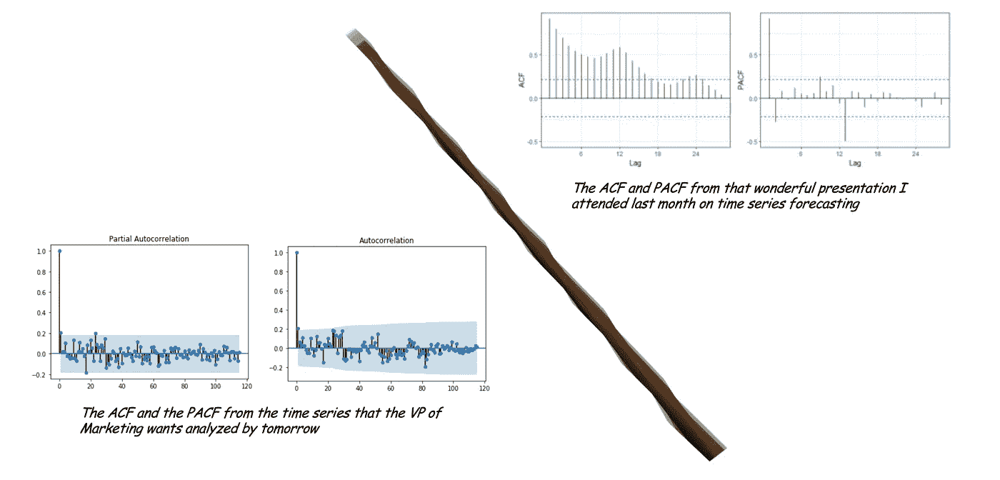
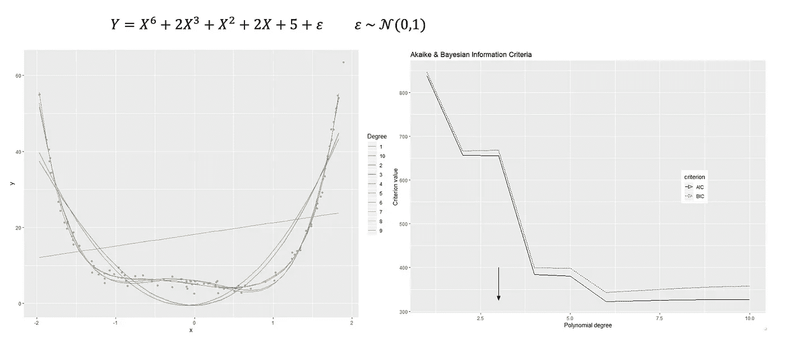

# 时间序列预测模型的自动化:技术和组织考虑。

> 原文：<https://towardsdatascience.com/on-the-automation-of-time-series-forecasting-models-technical-and-organizational-considerations-286db3120c8e?source=collection_archive---------7----------------------->

这篇文章是对我最初给[的一个关于交叉验证的问题的回复](https://stats.stackexchange.com/questions/380599/is-it-possible-to-automate-time-series-forecasting) (Stackoverflow 的姐妹网站，关于统计和数据科学相关主题)。

原来的问题是:

> 我想建立一个算法，能够分析任何时间序列，并“自动”为分析的时间序列数据选择最佳的传统/统计预测方法(及其参数)。
> 
> 有可能做这样的事情吗？如果是的话，你能给我一些建议吗？

**TL，DR:*是的。***

的确，大多数关于时间序列预测的介绍性教科书和教程都花了很多篇幅来解释决定哪个模型最适合你的数据的复杂性。由此，你会得到这样的印象，即一个实践预测者的一天就是盯着 ACF 和 PACF 图，摆弄各种 ARIMA 参数，直到她找到最佳模型，或者挠头试图弄清楚是使用仅含趋势的指数平滑模型还是含趋势+季节性的指数平滑模型。

我代表整个预测界，为误导而道歉，因为事实并非如此，而且已经有一段时间不是这样了。专业预测者有更重要的事情要做，而不是因为难以理解的 PACF 图而焦虑不安。如今，预测建模部分几乎完全自动化，他们更可能花时间使用领域知识来审查输出并决定是否进行预测，或者在会议中试图说服持怀疑态度的业务利益相关者他们的预测是合理的。事实上，自从大多数专业预测工具(甚至一些开源工具)完全自动化预测过程的参数选择部分以来，已经有一段时间了。

In my experience, how to interpret real world ACF and PACF plots is one of the most confusing things somebody has to deal with when beginning their time series forecasting journey.

在这篇文章中，我将介绍自动预测生成的技术方面，以及在决定使用自动预测生成系统时会出现的一些组织方面的考虑。

# 作为模型选择练习的自动时间序列预测；

正如我前面所说，在许多领域，包括我的零售需求预测领域，大多数商业预测包都执行自动预测生成。几个开源包也是如此，最著名的是 Rob Hyndman 的 [auto.arima()](https://www.rdocumentation.org/packages/forecast/versions/8.9/topics/auto.arima) (ARIMA)和 [ETS()](https://www.rdocumentation.org/packages/fable/versions/0.0.0.9100/topics/ETS) (指数平滑)函数，它们来自 r 中的开源预测包。还有一个 auto.arima 的 python 实现，称为[金字塔](https://pypi.org/project/pyramid-arima/)，其他几个 Python 包也在开发中。

我提到的商业产品和开源软件包都是基于使用[信息标准](https://stats.stackexchange.com/questions/86767/aic-bic-cic-dic-eic-fic-gic-hic-iic-can-i-use-them-interchangeably)来选择最佳预测模型的想法工作的:你拟合一堆模型，然后选择具有最低 AIC、BIC、AICc 等的模型。(通常是用*代替*样品外验证— [详见本演示文稿](https://www.slideshare.net/slideshow/embed_code/key/oUWUcUnyEQxKf2))。

An example of the AIC and BIC selecting the “true” model of our data: We generate a data set using a 6th order polynomial with Gaussian noise, we then notice that both the AIC and BIC are at there lowest for the polynomial regression that is of order 6, i.e. they allowed to select the true model, even if polynomials of order 8 and 9 gives us lower RMSE.

然而有一个重要的警告:所有这些方法都在一个模型家族中工作。他们从一组 ARIMA 模型中选择最佳模型，或者从一组指数平滑模型中选择最佳模型，等等

如果你想从不同系列的模型中进行选择，这将更具挑战性，例如，如果你想从 ARIMA、指数平滑和 Theta 方法中选择最佳模型。从理论上讲，您可以采用与单一系列模型相同的方式，即使用信息标准。然而在实践中，你需要以完全相同的方式计算所有模型的 AIC 或 BIC，这是一个巨大的挑战。使用[时间序列交叉验证](https://robjhyndman.com/hyndsight/tscv/)或样本外验证，而不是信息标准，可能会更好，但这将更加计算密集(并且编码繁琐)，更不用说交叉验证哪个合适的预测范围了。

# “一种模式统治一切”的方法:

脸书的 Prophet 软件包也使基于一般加法模型的自动预测生成成为可能([详见此处](https://peerj.com/preprints/3190.pdf))。然而，Prophet 只适合一个单一的模型，尽管这是一个具有许多参数的非常灵活的模型。Prophet 的隐含假设是 GAM 是“统治所有人的一个模型”，这在理论上可能是不合理的，但对于一些现实世界的场景非常实用和有用(即:除了趋势和季节性之外没有其他结构的非常短期的预测)。更具体地说，prophet 模型的基本假设是，最有用的真实世界时间序列不包含任何超出趋势、季节性和因果/假日效应的结构，并且我们不会像非平凡的 ARIMA 模型那样试图挖掘它们的复杂自相关性。除了便于在自动化和灵活性之间取得平衡，Prophet 的趋势+季节性+因果效应方法还可以非常方便地将结果传达给非技术或科学人员(如果你是该领域的学生或初学者，请做好准备:就预测的有效性与企业讨价还价将占用你一天的很大一部分时间。去复习你的软技能吧。

The Facebook Prophet API makes it very easy to communicate the results of a forecast to business stake holders, compared to say, explaining what and ARIMA(2,1,2) model does.

有人可能会问:但这不正是三重指数平滑法(霍尔特-温特斯)的作用吗？拟合一个趋势成分和一个季节成分，然后就这样了？我们只是为了炒作的目的而尝试使用脸书 API 吗？不完全是。在这方面，Prophet 比 Holt-Winters 更复杂:它可以模拟趋势中的转折点和多个季节性(例如，客户时间序列中的每日和每月峰值)。它还可以处理 HW 不能处理的因果事件(您必须添加因果效应作为某种排序或后处理步骤)。先知的灵活性部分来自于它不“仅仅”是一个 GAM 模型。在引擎盖下，有一些贝叶斯的繁重工作正在进行，包括在因果建模部分。

# 没有免费的午餐定理，时间序列预测版(有点):

据推测，您想要进行自动化时间序列预测的主要原因之一是因为您想要预测多个时间序列，这些时间序列太多而无法进行手动分析(我的团队使用的工具每天生成数百万个预测—每个产品/位置组合一个)。因此，您的自动预测程序必须能够适应不同类型的时间序列和不同的业务场景。在一般的 ML 案例中，有一个理论结果叫做[没有免费的午餐定理](https://www.kdnuggets.com/2019/09/no-free-lunch-data-science.html):不存在所谓的“监督 ML 模型来统治它们”，它可以生成最佳的样本预测，而不必对数据集的结构做出任何假设。因此，如果你要抛出一个通用的 ML 模型，比方说一个前馈神经网络，在你的问题空间，并希望它能为可能出现的每一种可能的数据配置工作，你也必须接受有时会有一个模型比你最终得到的模型表现得更好。这是你为所有事情都有一个通用模型所付出的代价，因此“没有免费的午餐”。

时间序列模型也会发生类似的情况:您需要记住，自动预测方法永远不会找到每个时间序列的绝对最佳模型，它会给出所有时间序列的平均合理模型，但仍有可能其中一些时间序列的模型比自动方法选择的模型更好。

参见[这篇文章](https://stats.stackexchange.com/questions/361065/when-is-the-aic-a-good-model-selection-criterion-for-forecasting-and-when-is-it)中的一个例子。简而言之，如果你打算进行自动预测，你将不得不偶尔容忍“足够好”的预测，而不是每个时间序列的最佳预测。这是您为灵活性和健壮性付出的代价。

In this case, manually selecting higher order ARIMA parameters — i.e with higher AIC and BIC — gives better out of sample forecasts than the one automatically by auto.arima(), but the one selected using the lowest AIC and BIC is still pretty close to the ground truth, compared to, say, a non-seasonal model (seasonality and trend were not passed in any way to auto.arima(), it figured that out on its own).

# 基于 ML 的预测——事情变得越来越复杂，但却矛盾地简化了:

只要你坚持使用时间序列的统计方法，自动预测即使不是一个简单的问题，至少也是一个容易解决的问题。该问题相当于一个统计模型选择问题(或 FB Prophet 情况下的曲线拟合练习)，它有一些坚实的理论基础，并在几本研究生水平的教科书中进行了讨论和探索。

如果你计划使用基于 ML 的预测模型，那么这个问题就变成了更普遍的 auto-ML(自动机器学习)问题。当涉及到超参数调整和 auto-ML 应用于时间序列预测的问题时，学术文献和技术都不成熟(*和往常一样，NLP 和计算机视觉首先得到所有的关注……*)。有一些有趣的 auto-ML 和贝叶斯优化工具可用于该任务，以及一些商业产品(如 Google Vizier)，但在时间序列的情况下，关于贝叶斯优化和迁移学习仍有许多开放的问题。(更新-2021 年初:自本文最初发表以来，在利用“真正的”AutoML 方面已经取得了重大进展，包括神经架构搜索和贝叶斯优化风格调整。[详见本帖](https://ai.googleblog.com/2020/12/using-automl-for-time-series-forecasting.html)。

When using a machine learning forecasting method like seq2seq models, you generally apply one ML model to an entire group of time series, as opposed to having one model fit per each series

此外，使用基于 ML 的方法，您最有可能为多个时间序列预测开发大型单一全球模型(例如，在零售环境中，每个部门一个模型)，而不是为每个单独的时间序列开发特定的模型。这也使得特征选择和工程更具挑战性。

最后，在商业观众面前，ML 模型不容易解释和辩护。即使是训练有素的数据科学家也需要求助于模型可解释性工具，以便理解基于树的回归子集合或复杂 seq2seq 网络的一些输出。

好吧，但我也说过这会让事情变得更简单。为什么不像统计方法，每次我们想要生成新的预测时都需要重新训练，在这种情况下，我们可以每隔几个月就重新训练一次模型。这是因为一个全球模型是在一个大得多的数据块上训练的，从某种意义上说，在其训练阶段“它已经看到了一切”，并且可以计算出一个时间序列在长期内如何需要不断更新(顺便说一句，如果你*没有*大型数据集，远离基于 ML 的方法，坚持使用统计方法。我知道，这在你的老板和客户面前不会给人留下深刻的印象，你真的真的想在你的项目中使用 PyTorch，但是相信我，你最终会感谢我的。

这种差异(每次都必须改装模型，而不是每隔几周或几个月就必须改装一次)非常显著，远远超出了您必须多长时间经历一次培训和评估过程的简单问题:

*   从工程的观点来看，生产统计预测系统的体系结构将与基于 ML 的生产预测系统的体系结构完全不同。在第一种情况下，您的模型拟合计算资源必须位于您的生产预测引擎中，因为模型拟合阶段和预测阶段是紧密耦合的。这对您将使用的环境的性能要求提出了各种各样的要求。在第二种(ML)情况下，您可以将训练计算资源与预测计算资源分开，并且您的系统的性能要求没有那么严格。
*   在 ML 的情况下，你只需要每 3 到 6 个月训练一次模型，这意味着你有足够的时间来离线执行训练，并且这个过程不需要与每天的生产计划完全同步。这给了数据科学家和工程团队在 SLA 方面很大的回旋余地，如果他们不喜欢结果，可以重新开始，决定他们是否要在模型中包括新的功能，等等…
*   从统计学的角度来看，你没有这样的奢侈品。由于您必须经常进行再培训，您可能会面临严格的 SLA 约束(例如，您晚上只有 8 个小时来生成新的预测，等等)。此外，您的模型选择过程必须非常健壮，因为如果您想要完成 SLA，您将无法重新运行它。

这就是为什么尽管使用 ML 方法进行预测在概念上更加困难，并且在最佳实践和指导原则自动参数和特征选择方面还没有达到成熟，但从工程的角度来看，它确实使事情变得更容易，因为它对生产预测引擎的要求更少，并且从 SLA 的角度来看更灵活。

It’s the year 2019, and we are still channelling the utterings of an 18th century cleric…will Bayes ever become obsolete?

# “人在循环中”和两种类型的预测组织:

如果您的组织需要执行自动化时间序列预测，那么几乎也需要进行监控，因为没有一个预测引擎好到可以“完全信任”它的预测。因此，一些人工分析师干预的机制是必要的。此外，无论下游系统在消耗你的预测，你都需要有适当的逻辑来确保正确的预测被提供给它。需要实现各种警报机制和健全性检查。

这就引出了一个问题:当模型自动生成时，谁对预测负责？如果预测超出 350%,公司因此遭受重大损失，哪个人或团队应该对此负责(请注意，这不是为了惩罚或解雇员工，而是为了从错误中吸取教训，避免将来出现类似的错误，并找出异常的根本原因)？

根据我的经验，对于大规模进行大量预测的公司，有两种类型的预测组织:

*   在第一种类型的组织中，预测功能由数据科学家执行，即，对他们正在运行的算法具有正式的统计和技术知识的人。在这种类型的组织中，生产模型的人也是消费模型的人:决定使用哪个模型的数据科学家(ARIMA？先知？LSTM？等等)，也是最终负责预测数字并将其传达给业务利益相关者和领导层的人。从软件方面来说，他们可能与 ML 和数据工程团队合作，在生产中运行模型的纯技术方面，但是他们做出模型设计决策和调度决策，并且他们通常知道足够的 Python、R 或 sa 来自己运行模型。简而言之，制作预测模型的人也是对预测负责的人。
*   在第二种类型的组织中，产生预测模型的人和使用模型的人是分离的:数据科学家或机器学习工程师将负责调整、部署和运行模型(该模型可能是内部开发的，或者是从软件供应商或咨询公司购买的软件包的一部分)。一个业务预测团队，他们带来了大量的领域知识(零售、供应链、金融等)。)，但通常很少或没有技术和科学技能，然后将检查预测并决定是采用自动生成的预测还是手动调整预测(即，基于领域知识执行判断性预测)。他们是预测的最终所有者，也是对预测质量负责的人。

您的组织使用的两种业务模型中的哪一种显然将是您如何处理自动预测生成问题的决定性因素:

*   在第一种类型的组织中，您在预测自动化方面有一些回旋余地，因为数据科学家将拥有必要的技能，能够根据需要重新运行预测，执行样本外测试以验证模型，动态修改模型，直接与在生产中运行模型的工程团队合作，等等。硬币的另一面是，数据科学家很少具备必要的业务和领域知识来可靠地做出判断性预测，并在需要时覆盖模型的输出。他们通常更接近技术组织，或者是独立分析/人工智能组织的一部分，而不是足够接近业务组织，以有效地做出纯粹由领域知识驱动的判断。
*   在第二种类型的组织中，你的预测者通常是商业组织的一部分，因此完全有能力对预测进行领域知识和市场驱动的调整，这些预测并不总是被统计或 ML 模型捕捉到。然而，从预测自动化的角度来看，这导致了几个限制:作为软件产品，您的预测自动化需要更加可靠，并且您需要围绕您的模型建立一个更加健壮的管道和可视化基础结构，以便非技术预测者使用。您现在所处的环境是，如果数字看起来不合适，您就没有机会重新运行一个特定的模型。你(通常)受限于易于解释的统计模型(就季节效应、趋势、因果变量等而言)。在第二种情况下，适当地升级到新的预测模型，并确保业务采用，是一个更加困难的过程。

每种类型的组织都有其优点和缺点，但在决定您需要开发的预测自动化框架(或使用现成产品实施)时，您正在使用哪种类型的组织至关重要。

# 总结一下:

*   是的，可以自动选择预测模型。事实上，这样做的工具已经存在很长时间了，至少对于统计预测模型来说是这样。
*   对于统计模型，使用像 AIC 这样的信息标准是自动化过程的一种方式。也有可能采取“一种模式来统治所有人”的方法，就像脸书先知一样。
*   在自动预测的场景中，你将不得不妥协并接受你的一些预测已经足够好了。这是您为一种对大型时间序列数据集足够灵活的方法所付出的代价。
*   如果您选择基于 ML 的预测方法，您将不得不使用基于 auto-ML 的方法(即贝叶斯优化+迁移学习)进行模型选择。Auto-ML 方法不像传统的模型选择方法那样在时间序列的上下文中被很好地理解，但是从工程的角度来看，它们具有其他优势。
*   当预测自动生成时，就会出现预测所有权的问题，即谁对预测的质量负责。在一些组织中，数据科学家自己对预测负责，而在其他组织中，有业务预测者(没有技术或数学技能)审查预测，并最终决定是否应该保留或覆盖预测。您试图服务的这两种组织模型中的哪一种将影响您设计自动化预测生成过程的方式。

应该注意的是，我在统计预测方法的情况下提到的许多软件考虑事项(性能要求、增强的健壮性和可靠性等)应该由您选择的软件供应商解决，如果您最终选择预打包的解决方案的话。如果您选择在内部构建自己的统计预测解决方案，这些考虑将成为一个更大的问题。权衡的结果是，对于预打包的解决方案，您通常依赖于供应商选择包含在他们的包中的一个或多个模型。在某些情况下，您甚至不知道模型的细节，只有对其功能的高级描述，而您作为公司 ML/DS 人员的工作就是构建管道并确保适当的监控和仪表板到位。幸运的是，这种情况已经开始改变，越来越多的供应商正在“开放”他们的预测解决方案，以便内部数据科学团队可以部署调整或定制的模型。

最后，虽然我提到基于最大似然的预测方法不如统计方法成熟，但是学术文献中的一些报告已经讨论了这个主题。此外，在过去的一年左右，一些工具已经变得可用，可以帮助数据科学团队测试基于 ML 和 DL 的预测方法的优势。我期待着在不久的将来这个主题的发展。