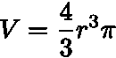
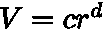
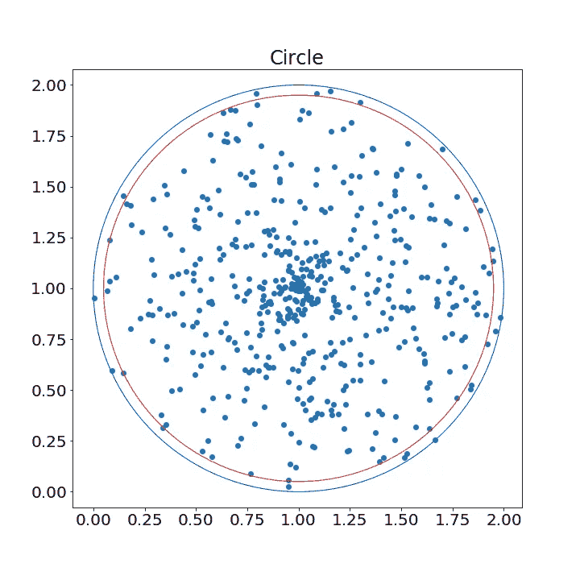
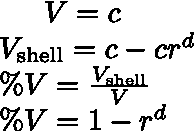
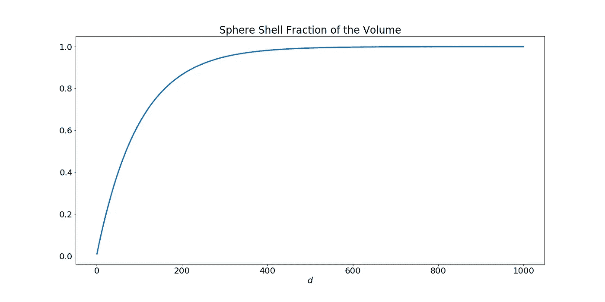
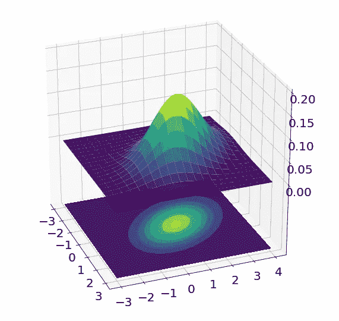

# 论维度的诅咒

> 原文：<https://towardsdatascience.com/on-the-curse-of-dimensionality-b91a3a51268?source=collection_archive---------10----------------------->

如果我要给机器学习领域的任何人一个建议，那就是:永远不要忘记维数灾难。传统的解释是这样的:“好吧，如果你有很多输入维度，那么你的问题在计算上变得昂贵和难以解决”。是的，这是真的，但为什么是真的呢？让我们更详细地谈论这一点。

对于维数灾难，我遇到的最直观的解释之一是看一个单位超球及其体积。我这么说是什么意思？嗯，一个数据点大多表示为一个*-维向量。让我们设想一个特定问题中的所有数据点都位于一个单位超球中。我们都知道什么是三维超球的体积，即:*

**

*为了将其扩展到 ***d*** 维度，我们可以忽略体积方程中的常数，并将它们放入变量 **c** 中，则体积方程采用以下形式:*

**

*让我们花一分钟来看看下面的圆，从几何学上看，它看起来好像大部分点都落在壳外(蓝线和红线之间的空间)。换句话说，半径为 0.95 的单位圆的壳只占圆面积的很小一部分:*

**

*A unit circle with random data points generated in it.*

*现在，当我们看一个 **d-** 维超球时，你会想象这种情况是什么样子的？我怀疑大多数人会说这是相似的，大部分体积都在超球壳之外。正如你所怀疑的，大多数人都是错的。事实是，人类并不真正有能力在高维空间中思考。它不是直观的，我们只是无法将它们形象化。让我们来看看实际发生了什么。我们可以将壳层在 **d** 维超球中所占的体积分数写为:*

**

*如果我们取超球半径的 5%作为壳，看看这个分数是如何发展的，问题就很明显了。随着输入尺寸 **d** 的增加，壳体中的体积量显著增加，如下图所示:*

**

*This figure shows the fraction of the volume that the shell takes up from the hypersphere increases with increasing the dimension of the data.*

*我们可以看到，壳的体积分数随着维数的增加呈指数增长，1 是它的极限。即使对于少量的 **r** ，壳的分数也会迅速增加到 1。*

*这是什么意思，什么时候这会产生问题？为了看到这一点，让我们来看看机器学习中最常用的分布，高斯分布。如果我们观察 3 维输入空间的高斯密度，它就像一个超球，概率随着距离平均值的半径而减小，这通常适用于 3 维以上的空间，您可以通过下图了解我的意思:*

**

*The Gaussian density for a 2D Gaussian. Notice how the density projects to an ellipse-like object, similar behavior can be expected in higher dimensional spaces.*

*在高维空间中，高斯密度集中在其超球的外壳中，这是由于外壳占超球体积的一部分，这在高维空间中变得很重要。这意味着当你从这个高斯样本中取样时，结果将是来自超球外壳的概率最高的数据点。*

*我们可以从经验风险最小化的角度来考虑维数灾难，我在文章[学习理论:经验风险最小化](/learning-theory-empirical-risk-minimization-d3573f90ff77)中对此进行了详尽的解释。简而言之，我们希望从我们的数据中获得一个有代表性的训练样本，以便能够对看不见的数据进行归纳。现在，在超球的例子中，我们检查了球的外壳包含超过 90%的体积，当它的厚度是球半径的 5%时，并且如果数据维度大约是 400 维。假设我们有位于球体中心(0%半径)和 95%半径之间的数据样本。在这种情况下，我们覆盖了半径范围的 95%,然而我们只覆盖了不到 10%的体积。显然，在这种情况下，很难获得有代表性的样本，因为我们只从覆盖 10%体积的范围内观察到数据。*

*幸运的是，维数灾难并不意味着我们不能建立有效的模型。通常我们对数据有一些平滑度保证，数据的空间没有填充得那么密集或者可以降低维度(机器学习研究的一大部分)。也许最好的例子是所有可能的 64x64 RGB 图像的空间。数据的维数是 64x64x3=12288。如果我们想想超球体的例子，这显然是个问题。但在现实中，大多数像素的各种组合对于任何分类都毫无意义，只是简单的噪声。此外，计算机视觉方法充满了有用的先验知识，使问题更容易解决。*

*我希望这篇文章能够阐明维数灾难以及为什么它是一个重要的概念。如果你需要从这篇文章中学到什么，请记住，你对高维空间的直觉**很可能是错误的**。*