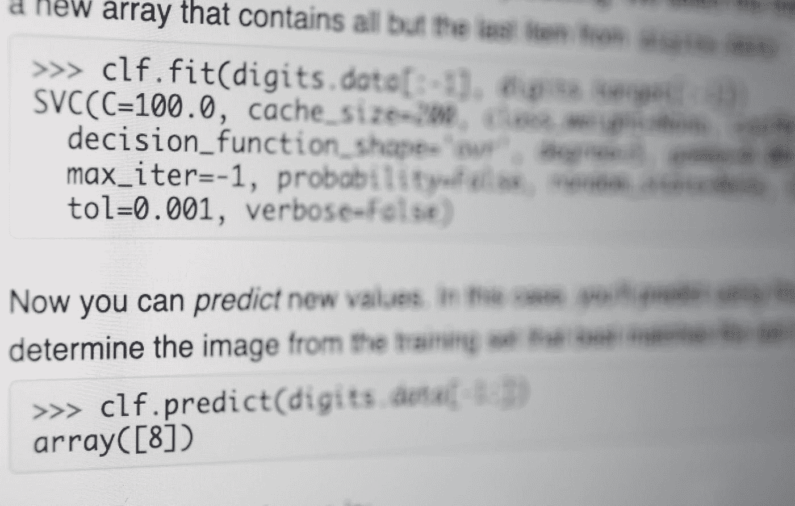

# 论人工智能新闻的轰动效应

> 原文：<https://towardsdatascience.com/on-the-over-sensationalism-of-artificial-intelligence-news-8ba6892ad8e6?source=collection_archive---------41----------------------->

## 当 AI 文章误传误导。

Photo by [Roman Kraft](https://unsplash.com/@romankraft?utm_source=unsplash&utm_medium=referral&utm_content=creditCopyText) on [Unsplash](https://unsplash.com/s/photos/newspaper?utm_source=unsplash&utm_medium=referral&utm_content=creditCopyText)

我人工智能(AI)**已经不是什么秘密了。曾经是计算机科学的一个令人困惑和相当小众的领域，突然开始以它的许多应用接管我们的生活。因此，由于人工智能及其更突出的孩子**、机器学习**的这种神秘和未知的特征，新闻网站和媒体通常喜欢夸大该领域成功或进步背后的现实。这种现象经常导致令人讨厌的文章，这些文章似乎是耸人听闻的，甚至是散播真实发生的事情。在这篇文章中，我想阐明这个问题。**

人工智能经常被一些最著名的倡导者、技术传播者和公司(如谷歌)描述为“[新的电力](https://www.youtube.com/watch?v=21EiKfQYZXc)”或“[人类有史以来最重要的事情](https://money.cnn.com/2018/01/24/technology/sundar-pichai-google-ai-artificial-intelligence/index.html)”。老实说，这些短语给人一种希望、未来甚至发展的感觉。毕竟，电力确实改变了我们的生活方式，也改变了世界和我们的经济。然而，它们仅仅是短语、夸张和隐喻。尽管人工智能很强大，但它只是另一项技术。和其他许多东西一样，它的设计目的是让我们的生活更加舒适、便捷和简单。因此，当谈论它时，应该以我们谈论移动设备的同样方式进行。然而，一些新闻网站无视人工智能只是另一种工具的事实，在这个过程中，他们夸大和误导了真实事件。让我们看一些例子。

Photo by [Alex Iby](https://unsplash.com/@alexiby?utm_source=medium&utm_medium=referral) on [Unsplash](https://unsplash.com?utm_source=medium&utm_medium=referral)

2015 年，一名工厂工人在一台机器将他抱起并碾压后死亡。这个令人悲伤的消息导致了许多耸人听闻的新闻，声称“机器人杀了一个人。”这句话，从某种意义上说，有一部分是对的。然而，一些新闻媒体描述事故的方式就好像是机器*故意*杀死了那个人。这个猜想根本不成立；机器人虽然是自动的，但不是自主的([准确来源](https://www.telegraph.co.uk/news/worldnews/europe/germany/11712513/Robot-kills-man-at-Volkswagen-plant-in-Germany.html))。

另一个例子是脸书的实验，两个聊天机器人互相聊天。根据脸书的说法，测试是失败的，他们关闭了它，因为机器人基本上是在“说”胡言乱语。很无辜，对吧？对某些人来说不是。就在这个声明之后，新闻浮出水面说脸书已经关闭了它，因为机器人发明了他们的语言，保持它的运行太危险了。这种说法一点都不准确。事实是，机器人无法使用正确的英语语法进行交流，因此对我们毫无用处。下面的文字是他们对话的一部分([准确来源](https://gizmodo.com/no-facebook-did-not-panic-and-shut-down-an-ai-program-1797414922))。

> 鲍勃:我可以做其他事情
> 
> 爱丽丝:球对我来说等于零，对我来说等于零，对我来说等于零，对我来说等于零
> 
> 鲍勃:你是我的一切
> 
> 爱丽丝:球有一个球给我，给我，给我，给我，给我，给我，给我

然后就是所谓的*种族主义*人工智能模型。例如，不久前麻省理工学院展示了他们的 [*诺曼*](http://norman-ai.mit.edu/) 模型，一个他们称之为世界上第一个“精神病患者”的人工智能。当然，这个模型可能会产生一些黑暗和莫波色的内容(下面的例子)，但马上称之为种族主义似乎不太合适。毕竟，这只是一个受控实验，研究人员向模型中输入“令人不安的”数据。

> “一个人被电死了，然后被抓去处死”
> 
> “一名男子被枪杀”

Norman looks a bit creepy, though ([source](http://norman-ai.mit.edu/)).

同样，这是最近的和有争议的 ImageNet 轮盘赌项目。这个艺术项目的特色是([实验已经关闭](https://imagenet-roulette.paglen.com/))一个网站，用户上传自己的图像，并从一个人工智能接收一个标签，描述它“*看到的*是什么样的人正如你所料，并不是每个人都对他们的结果感到满意。ImageNet 的人物分类包含各种各样的类别，其中一些带有某种攻击性，例如，“强奸嫌疑人”、“吸毒者”和“失败者”

结果，访问网站的用户期望在他们的朋友之间分享一个好的分类，而不是迎接一个负面的分类。这一结果引起了媒体的轩然大波，称该模型为各种事物。我个人没有任何问题，因为模特称我为摇滚明星。然而，我能理解为什么有些人会对一台称他们为失败者的机器感到不安。但是我们需要接受这样一个事实:一个人工智能系统仅仅是一个从它所看到的信息中推断出来的黑匣子；它不觉得，“*认识*”或者讨厌你。在变得疯狂并开始相互指责之前，我们应该研究智能实体的背景。是怎么训练出来的？背后的数据是什么？谁给数据贴了标签？这些是这里的基本问题。

Rock star

我想说明的最后一个例子是关于我读到的一篇关于产生音乐的人工智能的[文章](https://www.digitaltrends.com/cool-tech/auxuman-ai-album/)。在这里，作者写了一张最近发行的完全由机器制作的音乐专辑，但随后，迅速将话题转移到这对音乐产业意味着什么。我将在这里把这个问题过于简单化(如果有的话)，并且说，在我看来，它毫无意义。每周发行多少张专辑？很多，我很确定。那么，为什么不能把这张“艾专辑”当做另一张呢？澄清一下，作者没有说什么负面的话。事实上，他似乎对生成性 AI 的话题非常好奇，他的立场是中立的。

现在我们要问:媒体为什么要这么做？我们无法确定。但是，我愿意说，部分是因为这两个原因:点击和不了解。互联网浩如烟海，让用户访问你的网站基本上是一种竞争。为了吸引他们，人们使用一些我们都知道的最廉价的伎俩，如点击诱饵标题或夸张(通常是假的)新闻。通过使用耸人听闻的标题，他们肯定会带来许多用户，这转化为广告收入或受欢迎程度，通过操纵内容和偏离真相，他们肯定会抓住那些不熟悉现实的人的注意力。

第二个原因可能是真的不理解他们试图传达的信息背后的问题。人工智能和机器学习是复杂的领域，它的许多概念都很复杂，很繁琐，不容易解释。因此，如果一些误传的事实仅仅是无意的人为错误，我不会感到惊讶。

Doing machine learning. Photo by me.

尽管如此，无论这是一个错误还是故意的，这里的一个主要问题是，这种错误通知人工智能新闻的趋势可能会导致恐慌。正如我之前所说，人工智能是一个神秘的领域，多年来，它一直与终结者、机器人起义和世界末日联系在一起。因此，当我们有新闻说一个机器人杀了一个人，另一个人叫别人“黑人”，或者一辆处于半自动驾驶状态的[特斯拉造成了致命事故](https://www.wired.com/story/teslas-latest-autopilot-death-looks-like-prior-crash/)时，大众会开始将人工智能的想法，即应该造福人类的所谓电力，与世界末日或对我们有害的事情联系起来，而事实上，并不是这样。