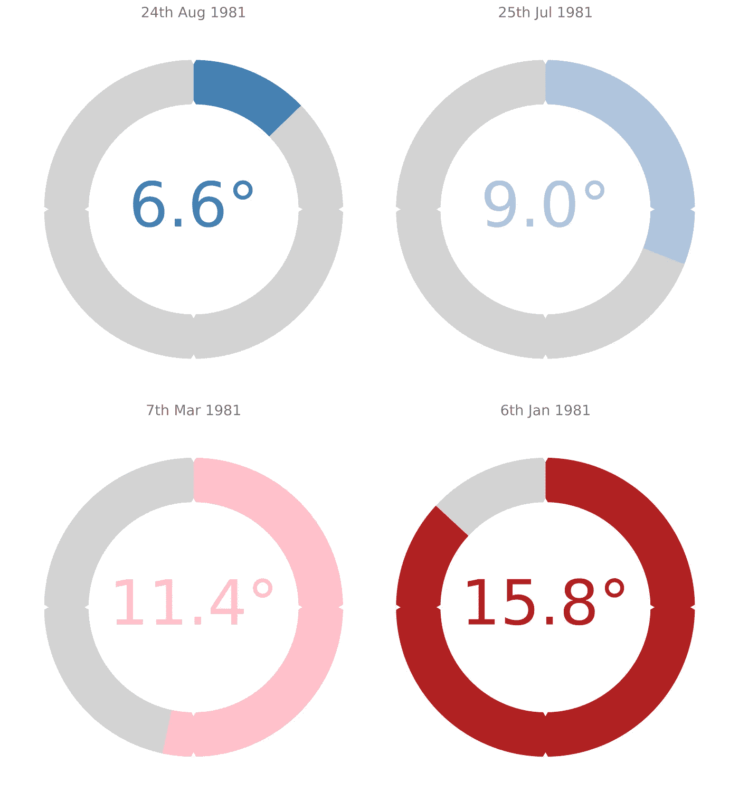

# 关于禁令的力量

> 原文：<https://towardsdatascience.com/on-the-power-of-the-ban-aa783510f3a1?source=collection_archive---------39----------------------->

禁令或大屁股数字是一种视觉化的技术，这种技术经常被忽视，而倾向于不必要的复杂图形。虽然一些利益相关者可能需要知道过去 18 个月的销售数字，并需要大量关于上周表现的统计数据，但对于其他人来说，一个可以识别好周或坏周的顶级统计数据就足够了，并具有更大的影响。在这篇文章中，我将分享一个基于 BAN 的甜甜圈图代码，这是我用 python 开发的，我将把它应用于两个常见的数据集。

# 航空乘客数据集

让我们从航空乘客数据集开始。这组数据包含了从 1949 年到 1960 年每个月的飞机乘客数量信息。我想从我的 BAN 甜甜圈图中显示的统计数据是某个月的乘客数量以及相对于其他月份的表现。禁令只是显示了当月的乘客数量，而甜甜圈图显示了相对于其他月份的百分比排名。根据四分位数，整个数字被适当地着色以立即显示这是一个好的一周还是不好的一周。我也使用直观的颜色，红色代表不好，绿色代表好。以下是 3 个示例周的曲线图:

# 墨尔本气温

我使用的第二个数据集是墨尔本从 1981 年到 1990 年的最低温度。这些图显示了相同的统计数据，而 BAN 显示了特定一天的温度。我加入了这个数据集来展示一个不同的色阶，它反映了人们对温度的直觉差异:红色是热的，蓝色是冷的。这里有 4 个例子:

# 结论

就数据而言，不是每个人都需要相同的粒度级别；简单和直觉是关键。

# 密码

用于生成这些图的代码可以在[这个 github repo](https://github.com/mattcrooksphd/Doughnut_plot.git) 中找到。