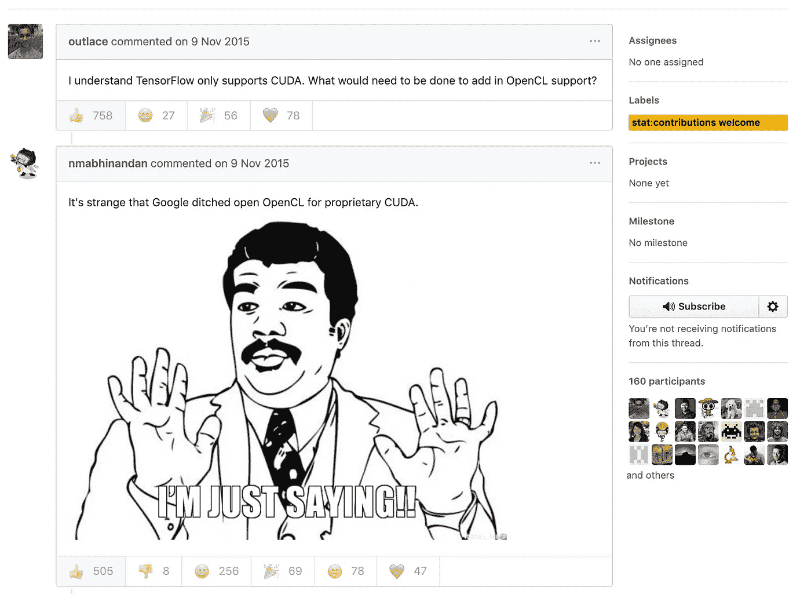
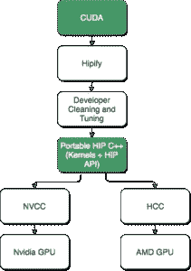

# 论 CUDA 围墙花园外的深度学习状态

> 原文：<https://towardsdatascience.com/on-the-state-of-deep-learning-outside-of-cudas-walled-garden-d88c8bbb4342?source=collection_archive---------3----------------------->

Photo by [Omar Flores](https://unsplash.com/@colorflores?utm_source=medium&utm_medium=referral) on [Unsplash](https://unsplash.com?utm_source=medium&utm_medium=referral)

如果你是一名深度学习研究人员或爱好者，并且你碰巧喜欢私下或专业使用 MAC，每年你都会为你的 GPU 获得最新和最令人失望的 AMD 升级。为什么令人失望？因为你得到的是最新最棒的 Vega GPU，当然不使用 CUDA。

什么是 CUDA，为什么这很重要？

> CUDA 是 NVIDIA 开发的并行计算平台和编程模型，用于图形处理单元(GPU)上的一般计算。有了 CUDA，开发人员就可以利用 GPU 的强大功能，大幅提高计算应用的速度。

好的。很好。你需要知道的是，这是正在被用来加速人工神经网络(ann)训练的底层核心技术。这个想法是在 GPU 上运行这些计算昂贵的任务，GPU 有数千个优化的 GPU 核心，与 CPU(对不起，英特尔)相比，这些核心对这种任务来说是无限好的。但为什么我不能在我那款花哨的 7k 美元 2019 年年中 Macbook 上运行这款 8 核、基于 HBMI2 的 Vega 20 GPU。原因。也就是说，像 TensorFlow 和 PyTorch 这样的用于训练人工神经网络的流行库并不正式支持 OpenCL。什么是 OpenCL？

> OpenCL(开放计算语言)是一种开放的、免版税的标准，适用于个人计算机、服务器、移动设备和嵌入式平台中各种处理器的跨平台并行编程。

基本上是 AMD 在他们的 GPU 中使用的 GPU 加速(CUDA 是 Nvidia 的专有技术！).具有讽刺意味的是，根据[这篇](https://create.pro/blog/opencl-vs-cuda/)文章，基于 Nvidia CUDA 的 GPU 可以运行 OpenCL，但显然不如 AMD 卡高效。这里顺便介绍一些知识:所有这些都是在“图形处理单元通用计算”(GPGPU)的旗帜下运行的，也就是说，如果你的朋友问的话，在 GPU 上运行东西作为主要的计算单元，而不是 CPU。现在回到 CUDA 和 TensorFlow 以及所有其他流行词汇。

以下是两个最流行的深度学习库的 OpenCL 实现状态:

**张量流**

GitHub 票:[https://github.com/tensorflow/tensorflow/issues/22](https://github.com/tensorflow/tensorflow/issues/22)

开放时间:2015 年 11 月 9 日。(这是第 22 期；我们目前在#28961)

Tensorflow 将该问题锁定为“过于激烈”，并于 2019 年 2 月 26 日限制了与合作者的对话。评论 541 条，无受让人。

This screenshot of the first 2 entries in the GH ticket describes the status quo.

**PyTorch**

GitHub 票:[https://github.com/pytorch/pytorch/issues/488](https://github.com/pytorch/pytorch/issues/488)

开放时间:2017 年 11 月 18 日(实际上它现在已经关闭，带有“需要讨论”标签)

这张票比另一张更理智。以下是来自脸书人工智能研究团队的一位贡献者的声明:

> 我们官方没有计划任何 OpenCL 工作，因为:
> 
> AMD 本身似乎正在向拥有 CUDA transpiler 的 HIP / GPUOpen 发展(他们已经在 transpiling Torch 的后端做了一些工作)。英特尔正在将其速度和优化价值转移到 MKLDNN 中。在适当的情况下，通用 OpenCL 支持的性能比使用 CUDA/HIP/MKLDNN 要差得多。

进一步挖掘，发现[这](https://github.com/pytorch/pytorch/issues/10657#issuecomment-415067478)期 22.08.2018:

*“免责声明:PyTorch AMD 仍在开发中，所以完整的测试范围还没有提供。PyTorch AMD 运行在镭龙开放计算堆栈(ROCm)之上……"*

进入 ROCm(radeonpencomputer)，这是一个面向 HPC 和“超大规模”计算的开源平台。对此我发现了以下[信息](https://community.amd.com/community/radeon-instinct-accelerators/blog/2018/11/13/exploring-amd-vega-for-deep-learning):

*   ROCm 包括基于 LLVM 的 HCC C/C++编译器。HCC 支持直接生成原生镭龙 GPU 指令集
*   ROCm 创建了一个名为 HIP 的 CUDA 移植工具，可以扫描 CUDA 源代码，转换成 HIP 源代码。
*   HIP 源代码看起来类似于 CUDA，但编译后的 HIP 代码可以通过 HCC 编译器在 CUDA 和基于 AMD 的 GPU 上运行。

这似乎是一个巨大的努力。在这一点上，我不得不祝贺 Nvidia 不仅创造了一项伟大的技术，还创造了一个惊人的(以一种糟糕的方式)对其 GPU 平台的技术锁定。值得称赞。我不明白的是为什么 Google 从一开始就决定不正式支持 OpenCL。没有预算？这让我们回到 Tensorflow GH 问题中的精彩评论和迷因。

所以，基本上在某些时候事情会解决的。也许吧。今天你应该买一个 Nvidia GPU，保持理智。

在你说谁关心你的 Macbook 问题之前——不是这个问题。没有一个理智的人工智能研究者会用 Mac 来做任何严肃的人工智能工作。这是关于这样一个事实，脸书公司和谷歌公司正在推动大块的 DL 开发工作(在工具链方面)，已经决定只支持一个专有的 GPU 加速标准，因此只有一个 GPU 卡制造商。我是英伟达的超级粉丝。我也完全了解脸书人工智能研究团队在 GitHub 问题上提出的“CUDA 性能优于 OpenCL”的观点。尽管如此，我认为没有理由不投入一些时间和精力(脸书和谷歌都有)来支持多个 GPU 加速框架。而拥有一个更抽象、更开放的接口，以便将来开发新的 GPU 或者更小众的 DL-acceleration 框架又如何？

我也意识到这两个框架都是开源的，任何人都可以为之做出贡献，但是让我们面对现实吧——这两个框架之所以以目前的状态存在，是因为它们背后有两家公司的官方支持(金钱或其他方式)。只针对专有目标的开源代码不完全是 *open* open source。我们可以做得更好！

P.S .如果我错过了一些关于 PT/TF 和 AMD 支持的重大新闻，请在下面的评论中写下，我会更新我的文章。我喜欢一些好消息！

来源:

https://developer.nvidia.com/cuda-zone[2019 年 5 月 23 日](https://developer.nvidia.com/cuda-zone)

https://www.khronos.org/opencl/2019 年 5 月 23 日

[https://community . amd . com/community/radeon-instinct-accelerators/blog/2018/11/13/exploring-amd-Vega-for-deep-learning](https://community.amd.com/community/radeon-instinct-accelerators/blog/2018/11/13/exploring-amd-vega-for-deep-learning)，23.05.2019