# 制造业中的一堂课:自动编码器和黄金单位基线

> 原文：<https://towardsdatascience.com/one-class-learning-in-manufacturing-autoencoder-and-golden-units-baselining-4c910038a4b3?source=collection_archive---------16----------------------->

最近，我一直在与想要加入机器学习潮流的制造业客户(既有 [OEM](https://en.wikipedia.org/wiki/Original_equipment_manufacturer) 也有 [CM](https://en.wikipedia.org/wiki/Contract_manufacturer) )合作。一个常见的用例是更好地检测生产线上有缺陷的产品(或[待测设备](https://en.wikipedia.org/wiki/Device_under_test) /DUT】)。使用机器学习的术语，这属于二进制分类的问题，因为 DUT 只能**通过**或**失败**。

然而，训练一个需要来自通过**和未通过**两种情况的样本的二项式分类器被证明是不切实际的。有两个原因。

1.  不平衡的数据。优化制造工艺，以生产具有高[产量](https://www.asprova.jp/mrp/glossary/en/cat248/post-729.html)的器件，即尽可能少的缺陷。收集历史生产数据时发生的一个典型情况是:获得了大量良好/ **通过**的数据，但几乎没有不良/ **未通过**的数据。
2.  代表性不足的缺陷样品。有许多不同类型缺陷会导致失败。一一列举已经很困难了，更不用说从所有样本中收集足够的样本了。另一方面，好的数据通常是相似的，更容易定义。

> 一个小小的哲学讨论(随意分享你的观点，我对此可能是错误的):借用最优化理论的思想，如果我们将**好定义为我们努力追求的全局最优**，将**缺陷定义为次优样本**，那么应该只有一个好的定义和无限多个缺陷(假设一个连续的空间)。当然，在实践中，公差接近全局最优的次优样本被认为是好的(由于世界上不完善的过程)。但是那些非常远的将被认为是有缺陷的。

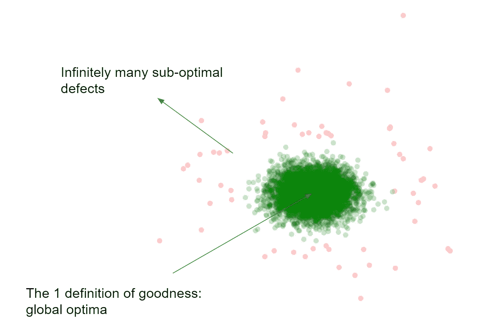

Our depiction of good and bad samples in manufacturing. Good samples are dense, defective samples are sparse.

因此，我们需要找到另一种更适合这种情况的训练模式。理想情况下，新模型必须能够只从好的样本中学习，而拒绝那些看起来与前者大相径庭的有缺陷的样本。[一班学习](https://en.wikipedia.org/wiki/One-class_classification)是个不错的人选。

# “等等，这听起来很熟悉……不就是用黄金单位做基线吗？”

一个晴朗的下午，一位 T2 六西格玛专家在会议室说道。确实是的！事实证明，一类学习在制造业中并不是一个外来的概念。只是术语不同而已。在质量控制中，工程师通常会收集黄金单位，或已知的良好组件，并对它们进行一些测量(也称为特征工程)。接下来，将根据测量值的分布计算公差极限。一种可以用来计算这种极限的统计方法叫做[部分平均测试](http://yieldwerx.com/part-average-testing-pat-tutorial/)(由汽车电子委员会出版)。在生产过程中，测量值在限值内的设备将被通过，而在限值外的设备则不合格。

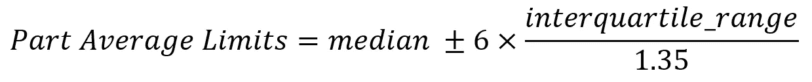

Part Average Testing Limit Calculation


Part Average Limits applied to distribution of measurement values

下图显示了整个基线化过程。

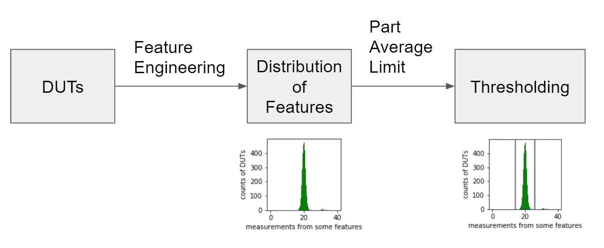

Golden Unit Baselining

# **特色工程**

棘手的部分是决定提取什么特征。传统上，这需要深厚的领域专业知识。因此，预计将有数百种算法部署在生产线上，每种算法都经过精心设计，以识别某些缺陷的存在。机器学习的想法是一直消除这种人工干预，让模型从提供给它的海量数据中发现共性和差异。

尽管如此，不要误解我，这样的“传统”方法实际上是相当准确的。我曾与领域专家合作，他们可以在不到一秒钟的时间内直观地识别某些设备中的缺陷(直到现在我仍然感到惊讶)——他们编写了非常擅长识别这些缺陷的算法。在我看来，机器学习可以作为现有算法的补充。

在本文的其余部分，我将简要概述一门课的学习是如何完成的。我将通过一个被称为自动编码器神经网络的类学习的特定算法实现。然而，我不会深入研究自动编码器的理论。我把它留给另一个帖子。

我们还将假设收集的测量值是图像的形式(例如[视觉检查系统](https://en.wikipedia.org/wiki/Automated_optical_inspection))。将使用来自 MNIST 手写数字的虚拟数据集。

# 基于黄金单位的自动编码器重构误差计算零件平均极限

我们的实验设置是这样的:假设来自好设备的图像看起来像数字 1。因此，在训练期间，我们将只输入数字 1 的图像。为了测试这个模型的有效性，我们将对一组看不见的数字 1(好样本)和数字 2(坏样本)进行测试。假设数字 1 的重构误差将是低的，而数字 2 的重构误差将是高的。如果这是真的，那么我们可以使用重建误差作为一个特征。整个管道绘制如下图(注意与*黄金单位基线*相似)。

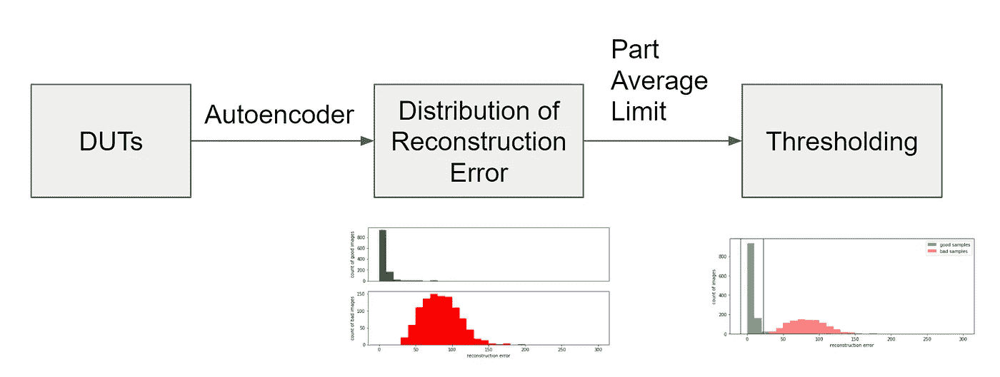

One Class Learning

本教程中的大部分代码来自 [Keras 的《自动编码器基础教程](# https://blog.keras.io/building-autoencoders-in-keras.html)。

首先，让我们限制 tensorflow-keras 将消耗的 GPU 资源量。默认情况下，它会尝试保留所有可用的内存。在这种情况下，我们将只占用 40%的可用内存。

```
import tensorflow as tf
import tensorflow.keras.backend as K"""
Limit GPU memory consumption
"""tfgraph = tf.get_default_graph()with tfgraph.as_default():
    config = tf.ConfigProto(
        intra_op_parallelism_threads=12
    )
    # 0.4 means only 40% of GPU memory will be used
    config.gpu_options.per_process_gpu_memory_fraction = 0.4
    tfSess = tf.Session(config=config)
    K.set_session(tfSess)
```

之后，我们可以从 Keras 加载 MNIST 手写数字数据集。随后，我们将图像强度值从 0–255 归一化到 0–1。这允许我们在自动编码器的最后一层使用 sigmoid 激活函数(因为输出域也将在 0 和 1 之间)。如果我们坚持输入为 0–255，我们将不得不相应地调整自动编码器的输出，因为默认情况下，没有输出范围为 0–255 的激活函数。

> 提示:确保您的神经网络的输入和输出具有相同的域。否则无论使用多少个纪元，你的训练损失都不会正确收敛。

```
# import library dependencies
import numpy as np
import matplotlib.pyplot as plt
from keras.datasets import mnist# import mnist dataset
(x_train, y_train), (x_test, y_test) = mnist.load_data()# normalization
x_train = x_train.astype('float32') / 255.
x_test = x_test.astype('float32') / 255.
x_train = np.reshape(x_train, (len(x_train), 28, 28, 1))  # adapt this if using `channels_first` image data format
x_test = np.reshape(x_test, (len(x_test), 28, 28, 1))
```

然后，我们将数据分成好的样本(1 的图像)和坏的样本(2 的图像)。

```
# get trainData of digit 1 only
trainX, trainY = zip(*filter(lambda x: x[1] == 1, zip(x_train, y_train)))
trainX = np.array(trainX)# get testData of digit 1 only
testGoodX, testGoodY = zip(*filter(lambda x: x[1] == 1, zip(x_test, y_test)))
testGoodX = np.array(testGoodX)
```

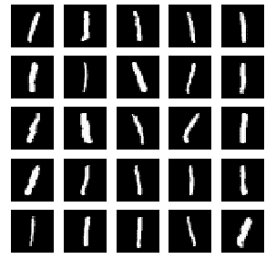

Good Samples i.e. images of 1s

```
# get testData of digit 2 only
testBadX, testBadY = zip(*filter(lambda x: x[1] == 2, zip(x_test, y_test)))
testBadX = np.array(testBadX)
```

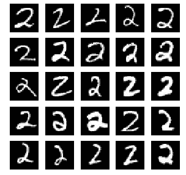

Bad Samples i.e. images of 2s

为了简单起见，我们将使用 Keras 中自动编码器的[默认定义。我们在这里做的唯一额外的事情是将编码层展平为中间的 2 神经元瓶颈层。注意，这个选择是任意的。在这个实验中，我没有进行任何超参数搜索，因为我只是想做一个简单的介绍。至于 2-神经元的选择，稍后当我试图在 2D 空间中可视化编码嵌入时，这将是有用的。](# https://blog.keras.io/building-autoencoders-in-keras.html)

```
# [https://blog.keras.io/building-autoencoders-in-keras.html](https://blog.keras.io/building-autoencoders-in-keras.html)from keras.layers import Input, Flatten, Reshape, Dense, Conv2D, MaxPooling2D, UpSampling2D
from keras.models import Model
from keras import backend as Kinput_img = Input(shape=(28, 28, 1))  # adapt this if using `channels_first` image data format# decode
x = Conv2D(16, (3, 3), activation='relu', padding='same')(input_img)
x = MaxPooling2D((2, 2), padding='same')(x)
x = Conv2D(8, (3, 3), activation='relu', padding='same')(x)
x = MaxPooling2D((2, 2), padding='same')(x)
x = Conv2D(8, (3, 3), activation='relu', padding='same')(x)
# at this point the representation is (4, 4, 8) i.e. 128-dimensional
encoded = MaxPooling2D((2, 2), padding='same')(x)# flatten and compress
shape = K.int_shape(encoded) 
bn = Flatten()(encoded)
bn = Dense(2)(bn)
bnRec = Dense(shape[1] * shape[2] * shape[3], activation='relu')(bn)
encoded = Reshape((shape[1], shape[2], shape[3]))(bnRec)# encode
x = Conv2D(8, (3, 3), activation='relu', padding='same')(encoded)
x = UpSampling2D((2, 2))(x)
x = Conv2D(8, (3, 3), activation='relu', padding='same')(x)
x = UpSampling2D((2, 2))(x)
x = Conv2D(16, (3, 3), activation='relu')(x)
x = UpSampling2D((2, 2))(x)
decoded = Conv2D(1, (3, 3), activation='sigmoid', padding='same')(x)# create encoder
encoder = Model(input_img, bn)
# create autoencoder
autoencoder = Model(input_img, decoded)
autoencoder.compile(optimizer='adadelta', loss='mse')
autoencoder.summary()
```

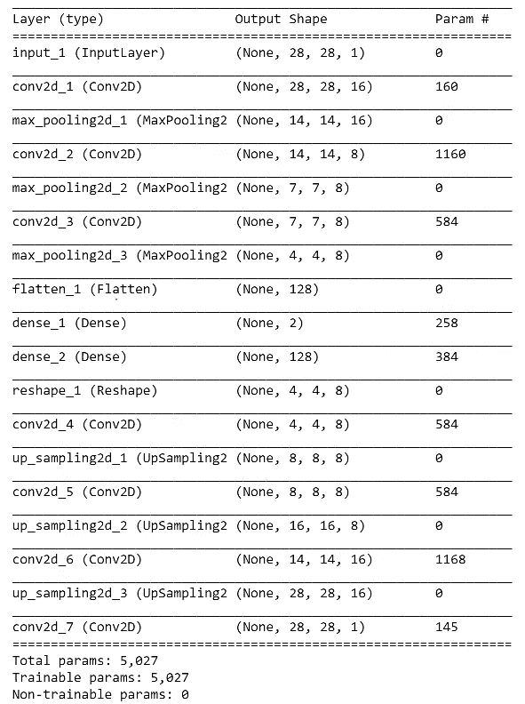

Autoencoder Summary

下一步是训练自动编码器模型。我们称之为。fit()函数，并为其提供 1s 的图像。至于验证，我们放 2 的图像。请注意，在反向传播过程中不会考虑验证数据集。我把它放在那里，以便我们可以看到随着训练的进行，1 和 2 的图像之间的重建误差如何发散。

```
history = autoencoder.fit(trainX, trainX,
                epochs=30,
                batch_size=128,
                shuffle=True,
                validation_data=(testBadX, testBadX))
```

然后，我们可以绘制 1s(好)和 2s(差)图像在各时期的重建误差。可以观察到，1s 的误差随时间降低，而 2s 保持高电平。这意味着自动编码器已经学会了重建好的图像，它已经用(1s)进行了训练，但没有重建坏的图像(2s)。

```
# summarize history for loss
plt.figure(figsize=(10, 3))
plt.plot(history.history['loss'])
plt.plot(history.history['val_loss'])
plt.title('model loss')
plt.ylabel('loss')
plt.xlabel('epoch')
plt.legend(['good', 'bad'], loc='upper left')
plt.show()
```

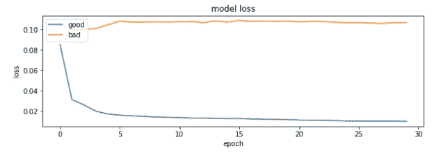

Reconstruction Error for Good and Bad Samples over Time

以上误差只是点估计。我们需要看到重构误差的整体分布，以便计算公差极限(例如，部分平均测试极限)。从下面的图表中，我们可以看到，确实差的图像比好的图像具有更高的重建误差。

```
# predict
predGood = autoencoder.predict(testGoodX)
predBad = autoencoder.predict(testBadX)# reconstruction error
rec1 = np.sum((predGood - testGoodX)**2, axis=(1, 2, 3))
rec2 = np.sum((predBad - testBadX)**2, axis=(1, 2, 3))# histogram
plt.figure(figsize=(10, 5))
plt.subplot(2, 1, 1)
plt.hist(rec1, bins=30, range=(0,300), color='g')
plt.tick_params(axis='x', which='both', bottom=False, top=False, labelbottom=False)
plt.ylabel("count of good images")plt.subplot(2, 1, 2)
plt.hist(rec2, bins=30, range=(0,300), color='r')
plt.xlabel("reconstruction error")
plt.ylabel("count of bad images")plt.show()
```

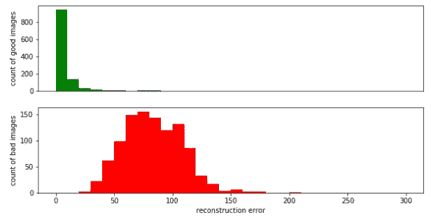

Reconstruction Error for good (Top) and bad (Bottom) images

我们现在可以计算零件平均极限。遵循黄金单位的基线实验，我们将只使用来自好样本的误差，并相应地计算极限。产生的阈值如下所示。

```
# Part Average Limit
robustMean = np.median(rec1)
robustStd = (np.quantile(rec1, 0.75) - np.quantile(rec1, 0.25)) / 1.35
PAUL = robustMean + 6 * robustStd
PALL = robustMean - 6 * robustStd# histogram
plt.figure(figsize=(10, 4))
plt.hist(rec1, bins=30, range=(0,300), color='g', alpha=0.5, label='good samples')
plt.hist(rec2, bins=30, range=(0,300), color='r', alpha=0.5, label='bad samples')
plt.xlabel("reconstruction error")
plt.ylabel("count of images")
plt.axvline(x=PAUL, c='b')
plt.axvline(x=PALL, c='b')
plt.legend()
plt.show()
```


Part Average Limit on Reconstruction Error

以下是自动编码器输出的一些好的和坏的图像的例子。我们可以直观地看到，1s 的图像可以很好地重建，而 2s 则不能。有趣的是，自动编码器在 2s 图像上的输出看起来奇怪地类似于 1s。我对此没有理论上的保证，但从经验上看，该模型的解码器部分似乎只学会了构造具有一定变化程度(例如角度和笔画)的 1，而没有学会其他数字。


Autoencoder’s reconstruction of good images

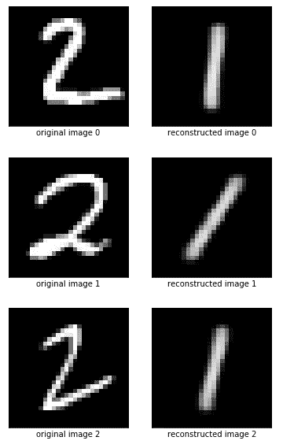

Autoencoder’s reconstruction of bad images

为了进一步了解解码器如何用不同的笔画和角度构建 1 的图像，我们可以看看自动编码器模型的瓶颈层中产生的编码。我们想看看那里是否有任何建筑。会不会有一些具有特定笔画/角度的图像簇？

由于我们已经将信息压缩到一个 2 神经元层中，我们可以很容易地将每个图像表示为一个 2 维向量，并在 2D 图中可视化它们。

```
testGoodEncodedX = encoder.predict(testGoodX)
np.shape(testGoodEncodedX)plt.figure(figsize=(8, 8))
plt.scatter(testGoodEncodedX[:,0], testGoodEncodedX[:, 1])
plt.show()
```

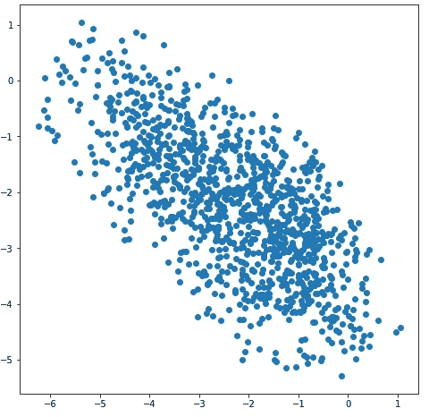

2D Scatter Plot of Encoded Images

从分布来看，我们最初怀疑存在具有特定笔划/角度的数字簇似乎是不正确的。也许这个模式看起来更像一个光谱而不是集群？为了形象化这一点，我们可以用它的“原始图像”替换上面图中的每个点。

```
from matplotlib.offsetbox import AnnotationBbox, OffsetImagefig, ax = plt.subplots(figsize=(20, 20))for x, xEnc in zip(testGoodX, testGoodEncodedX):
    imagebox = OffsetImage(x[:,:,0], cmap=plt.cm.gray)
    ab = AnnotationBbox(imagebox, [xEnc[0], xEnc[1]], frameon=False)                                  
    ax.add_artist(ab)

plt.xlim((testGoodEncodedX[:,0].min(), testGoodEncodedX[:,0].max()))
plt.ylim((testGoodEncodedX[:,1].min(), testGoodEncodedX[:,1].max()))
plt.show()
```

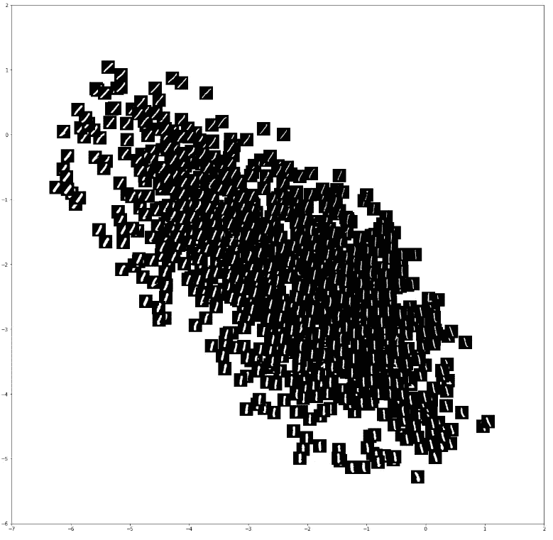

事实上，我们发现在嵌入空间中存在不同程度的 1 的图像。从左上角到右下角，我们可以看到不同的角度范围。同时，在非对角线方向，当我们靠近左下象限时，我们看到更粗的笔画。

# **结论**

我必须首先道歉，我不能使用来自真实生产线的数据集。尽管如此，我希望这个简单的教程能让你更好地理解一个类学习和黄金单位基线在实践中是多么的相似。我提供了一个简单的 python 代码演练，以展示我们通常在实践中分析的一个类学习的各个方面。

*免责声明*:在处理过来自真实工厂车间的数据后，我可以证明现实比这个简单的 1 和 2 的图像样本要混乱得多。需要做大量的预处理工作。此外，并非所有的数据标签都是可信的——因为这些标签是由人工标注的，所以可能会因不一致而出现错误。尽管如此，基本概念保持不变。