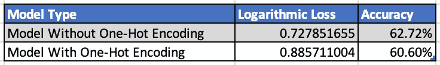
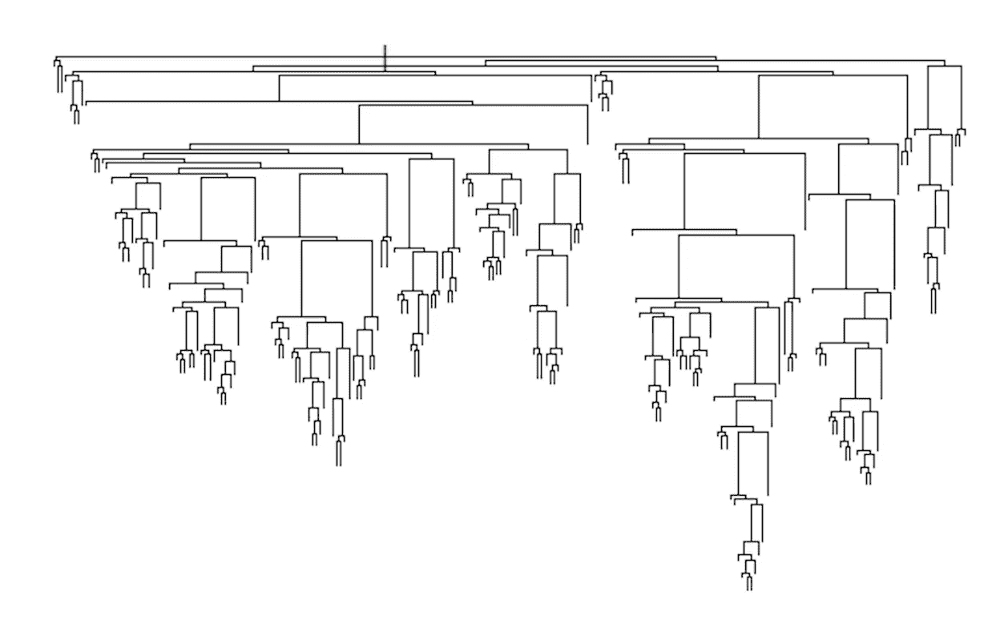
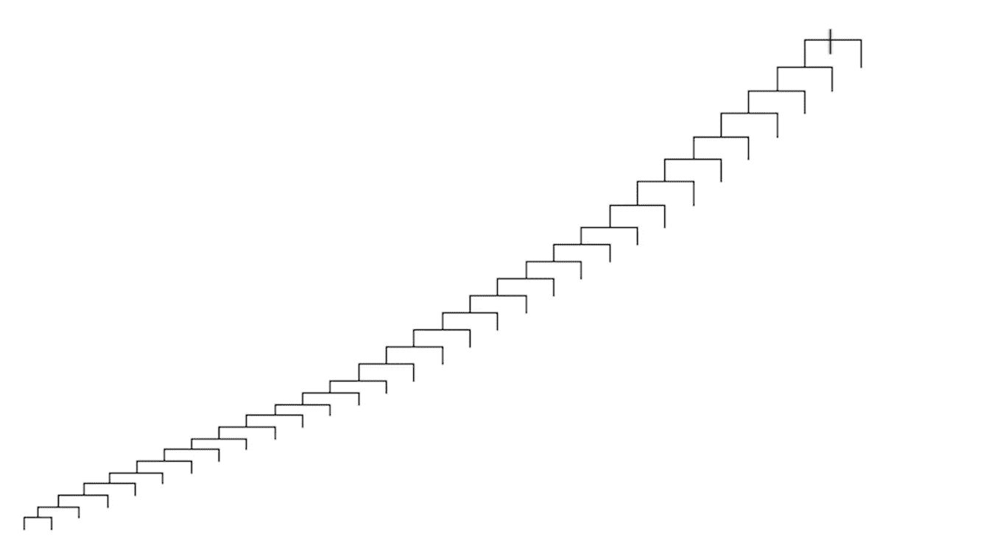
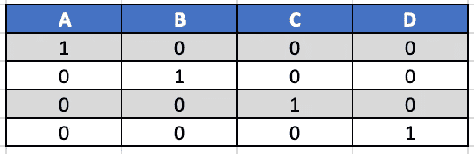
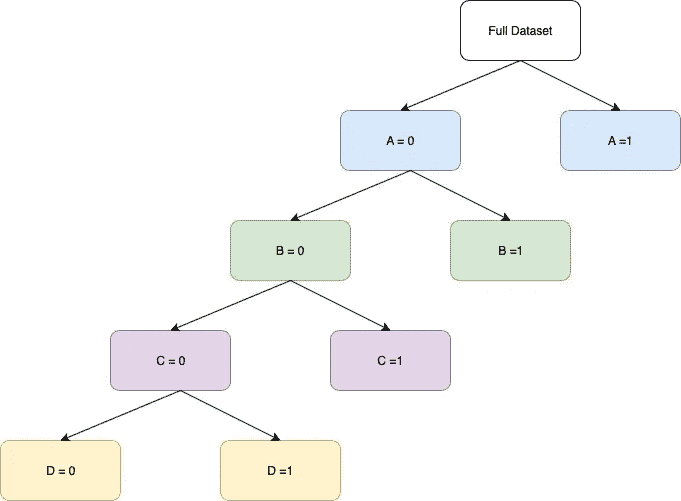
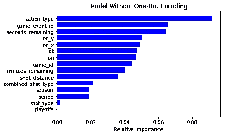
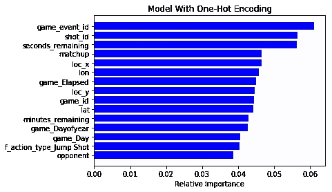

# 一键编码使你的基于树的集合变得更糟，这是为什么？

> 原文：<https://towardsdatascience.com/one-hot-encoding-is-making-your-tree-based-ensembles-worse-heres-why-d64b282b5769?source=collection_archive---------2----------------------->

## 优化基于树的模型

Photo by [Marita Kavelashvili](https://unsplash.com/@maritafox?utm_source=medium&utm_medium=referral) on [Unsplash](https://unsplash.com?utm_source=medium&utm_medium=referral)

> 我是弗吉尼亚大学数据科学专业的一名硕士学生，正在从事许多机器学习项目。每周，我都会解决一个我在项目中遇到的问题以及一个可行的解决方案。

大多数真实世界的数据集是分类变量和连续变量的混合。虽然连续变量很容易适应所有的机器学习模型，但分类变量的实现在不同的模型和不同的编程语言中有很大的不同。例如，R 使用一种称为 factor 的变量类型处理类别，这种类型可以完美地适应所有模型，而 Python 则要求您将类别转换成标签编码，以便模型工作。Python 是我选择的编程语言，我经常对分类变量进行某种编码。一般来说，一个热编码为模型提供了更好的数据分辨率，大多数模型最终表现更好。事实证明，并非所有模型都是如此，令我惊讶的是，对于具有高基数分类变量的数据集，随机森林的表现一直较差。

**测试设置**

作为科比·布莱恩特的粉丝，我决定使用他的[投篮选择数据](https://www.kaggle.com/c/kobe-bryant-shot-selection)来建立一个模型，以预测在特定情况下一个投篮是否会命中。基于特征重要性分析，很明显描述射击类型的两个变量在预测给定射击的结果中是最重要的，并且两个变量都是分类的。我在数据集上用标签编码(假设有顺序)和一键编码运行随机森林，结果几乎是一样的。事实上，是否有顺序似乎并不重要。

模特们表现如何？

除了预测的准确性，我还使用了模型的对数损失进行比较，因为这是 Kaggle 比赛的评估标准。

Snapshot of Performance

我们通常认为一键编码可以改进模型，但是正如截图所示，采用一键编码的模型比没有采用一键编码的模型性能要差得多。一键编码使对数损失减少了 0.157 个单位。Kaggle 竞赛的获胜者是由最轻微的利润决定的，0.05 的偏差可能是排行榜上前 75%和前 25%之间的差异。既然我们已经确定了一键编码使模型变得更糟，那么让我们检查一下为什么会发生这种情况的原因。

**为什么会出现这种情况？**

为了理解这一点，让我们进入基于树的模型的内部动态。对于每个基于树的算法，都有一个子算法用于根据要素和值将数据集分割成两个条柱。分割算法考虑所有可能的分割(基于所有特征和每个特征的所有可能性值),并根据标准找到最佳分割。我们将不会进入该标准的细节(有多种方式来做到这一点)，但是定性地说，该标准帮助子算法选择使箱的杂质最小化的分裂。纯度是分类问题中特定箱中阳性或阴性样本数量的代表。我发现了一个非常有用的形象化方法，可以帮助我理解这个概念。

Dense Decision Tree (Model without One Hot Encoding)

如果选择一个连续变量进行分割，那么树可以分割的值将有很多选择，并且在大多数情况下，树可以向两个方向生长。从包含大部分连续变量的数据集得到的树看起来像左边图中的东西。

Sparse Decision Tree (Model with One Hot Encoding)

在这种情况下，分类变量自然处于劣势，并且只有很少的分裂选项，这导致决策树非常稀疏。在只有少量级别的变量中，情况会变得更糟，而一次性编码属于只有两个级别的类别。这些树通常倾向于向一个方向生长，因为在分类变量的每个分裂处只有两个值(0 或 1)。该树在虚拟变量中向零的方向生长。如果这没有意义，请密切关注下面的例子。

Dataset A with Dummy Variables

例如，考虑以下数据集，该数据集包含具有级别 A、B、C 和 d 的
分类变量的虚拟变量。如果我们要为该数据拟合一个决策树，以便理解拆分，它将类似于以下内容。

Decision Tree for Dataset A

总之，如果我们有一个 q 水平的分类变量，树必须从((2^q/2)-1)分裂中选择。对于一个虚拟变量，只有一个可能的分裂，这导致稀疏。

**对模型性能的影响**

既然我们已经理解了为什么带有虚拟变量的数据集的决策树看起来像上图，我们可以深入理解这如何影响预测准确性和其他性能指标。

1.  通过对分类变量进行一次性编码，我们在数据集内引入了稀疏性，这是不希望的。
2.  从分裂算法的角度来看，所有虚拟变量都是独立的。如果树决定在虚拟变量中的一个上进行分裂，每次分裂的纯度增益是非常小的。因此，树不太可能选择一个更接近根的虚拟变量。

验证这一点的一种方法是检查两个模型的特性重要性，看看哪些特性最重要。

**特征重要性**

尽管提供了更好的性能，但是基于树的模型具有轻微受损的声誉，主要是因为它的可解释性，这是由于计算特征重要性的方式而产生的。大多数树集成中的特征重要性是基于重要性分数来计算的。重要性分数是对特征被选择用于分裂的频率以及作为选择的结果获得了多少纯度的度量。

最重要的特性是 action_type，它是一个高基数的分类变量，显然比它前面的变量重要得多。为了提供一些上下文，我使用了 one-hot 编码 action_type 和 combined_shot_type，它们都是高基数分类变量。显然，虚拟变量增加了数据集的维数，维数灾难开始起作用，并产生了下面的特征重要性图表。这显然是无法解释的。

为了放大视角，我决定看看对预测影响最大的前 15 个特征。

当我们检查上面的图表时，很明显，只有一个虚拟变量出现在前 15 位，并且也出现在第 14 位，这验证了我们关于分裂变量选择的假设。一次性编码还模糊了编码中不涉及的特征的重要性顺序，这使得模型效率低下。

[链接到 Github](https://github.com/rakeshravidata/Kobe-Shot-Selection-Prediction-)

> *基数大的一次性编码分类变量会导致基于树的集成效率低下。算法将给予连续变量比虚拟变量更大的重要性，这将模糊特征重要性的顺序，导致较差的性能。*

***额外阅读***

1.  *可视化—[http://www.r2d3.us/visual-intro-to-machine-learning-part-1/](http://www.r2d3.us/visual-intro-to-machine-learning-part-1/)*
2.  *教科书—[https://web.stanford.edu/~hastie/ElemStatLearn//](https://web.stanford.edu/~hastie/ElemStatLearn//)*
3.  *参与讨论—[https://www.kaggle.com/c/zillow-prize-1/discussion/38793](https://www.kaggle.com/c/zillow-prize-1/discussion/38793)*
4.  *所有类型的编码摘要—[https://medium . com/data-design/visiting-categorial-features-and-Encoding-in-decision-trees-53400 fa 65931](https://medium.com/data-design/visiting-categorical-features-and-encoding-in-decision-trees-53400fa65931)*