# 一次性编码、多重共线性和虚拟变量陷阱

> 原文：<https://towardsdatascience.com/one-hot-encoding-multicollinearity-and-the-dummy-variable-trap-b5840be3c41a?source=collection_archive---------0----------------------->

## 本文讨论了由多重共线性问题引起的虚拟变量陷阱

到目前为止，我在机器学习方面的每个新话题都有一些我从未见过的东西。但这不仅仅是看不见的话题，而是我曾经经历过的话题有一些我忘记了的东西。虚拟变量陷阱就是这样一个细节，我完全忘记了它的存在，直到 3-4 个月前我回去做分类器。

在开始虚拟变量陷阱的确切内容之前，我们需要熟悉一些术语。正式的定义可以在谷歌上搜索，所以我将写下一个非正式的描述，这对于本文的上下文来说应该足够了。

## 分类变量

范畴变量是那些可以从有限集合中取值的变量。对于这样的变量，它们所占据的值可以具有内在的顺序(例如，*速度:{低，中，高}* )。这样的变量被称为*有序分类变量*。另一方面，一些分类变量可能没有任何内在排序(例如，*性别:{男性，女性}* )。这样的分类变量称为*名义分类变量。*

如果您知道将分类变量编码成数字的常见做法，您就会知道通常建议对它们进行 *One-hot-encoded。有两个原因:*

1.  大多数机器学习算法不能直接处理分类变量，它们需要转换成数字。
2.  即使我们找到了一种直接处理分类变量而不把它们转换成数字的方法，我们的模型也会偏向我们使用的语言。例如，在动物分类任务中，如果标签是{'rat '，' dog '，' ant'}，那么使用这样的标签方法将训练我们的模型只预测英语标签，这将对模型的可能应用施加语言限制。

为了解决这些问题，我们可以将分类变量值编码为数字，如下所示:

## 案例 1:

序数分类变量速度(如上所述)可以编码为:

{ '低':1，'中':2，'高':3}。

## 案例二:

对于动物分类任务(如上所述),标签变量是一个名义分类变量，可以编码为:

{ '老鼠':1，'狗':2，'蚂蚁':3}。

> 我们先讨论案例 2:

这里有一个主要的问题——动物分类问题中的标签不应该被编码成整数(就像我们上面所做的那样),因为那样会强制执行明显不正确的自然排序:*【大鼠】<【狗】<【蚂蚁】。*虽然我们知道不存在这样的排序，并且数字 1、2 和 3 在我们编码的标签中不包含任何数字排序，但我们的机器学习模型将无法*直观地理解*这一点。如果我们将这些数字直接输入模型，成本/损失函数很可能会受到这些值的影响。我们需要用数学方法来模拟我们的这种理解。我们就是这样做的。

> 案例 1:

速度是一个序数变量。我们可能会认为关系:*【低】<【中】<【高】*是有道理的，因此，使用标签 1、2 和 3 应该不是问题。不幸的是，事实并非如此。使用标签 100、101 和 300000 代替 1、2 和 3 仍然具有与'*低*'、*中*和'*高*'相同的关系。用 1，2，3 没什么特别的。换句话说，我们不知道*‘中速’*的速度比*‘低速’*的速度大多少，也不知道它比*‘高速’*的速度小多少。这些标签之间的差异可能会潜在地影响我们训练的模型。因此，我们可能还想对变量*‘speed’*进行一次热编码。

> 在这一点上，我希望我们理解分类变量是什么，以及为什么我们想要对它们进行一次性编码。

## 多重共线性

当数据集中的两个或多个独立变量(也称为要素)相互关联时，就会出现多重共线性。我们可以使用几种方法来测量双变量情况下的相关程度和方向([更多信息](https://www.statisticssolutions.com/correlation-pearson-kendall-spearman/)相关测量)，而多重共线性通常使用方差膨胀因子来测量([更多信息](https://ebrary.net/1025/economics/measuring_degree_multicollinearity)多重共线性测量)。简而言之，当独立变量彼此(几乎)线性相关时，就说数据集中存在多重共线性。

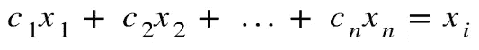

Fig. 1\. Perfect Multicollinearity (perfect linear dependence between x_i and other independent variables)

如图 1 所示的情况。被称为完美多重共线性。同样，我们也有不完全多重共线性的情况，其中一个或多个高度线性的关系可能是我们所关心的。这些会直接影响线性回归分析(有关这方面的更多信息，请参考[这些课堂讲稿](http://www.sfu.ca/~dsignori/buec333/lecture%2016.pdf))。然而，我们将从任何通用机器学习算法的角度来讨论它们的影响。

> **在这一点上，我希望我们理解什么是多重共线性。**

## Python 中的 OneHotEncoding

在我们进入本文的最后一部分之前，让我们看看如何对分类变量进行编码。

One-hot-encoder 为分类列的每个唯一值返回一个向量。每个这样的向量只包含一个' *1* ，而向量中的所有其他值都是' 0 '(参见下面的图 4)，因此命名为*one-hot*-编码器。

可能，也应该有你选择的语言的包，但是因为我一直在用 Python 做所有机器学习和数据科学相关的东西，所以我只包括来自 Python 控制台的片段。在下面的讨论中，我将引用 Python 的 *pandas* 库的流行昵称，将*‘PD’*和 *numpy* 称为’*NP’。*

我用的是自制的 *pd。DataFrame* 对象看起来像:

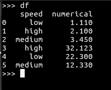

Fig. 2\. An example pandas.DataFrame object

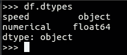

Fig. 3\. Datatypes of respective columns

*速度*是分类变量，而*数值*列是非分类列。

假设我们正在进行一个项目，我们决定对“速度”列进行一次热编码。

**方法一:pd.get_dummies**

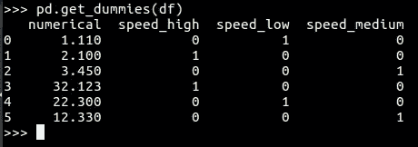

Fig. 4\. pd.get_dummies returns a dataframe with one-hot-encoded columns

*pd.get_dummies* ( [文档](https://pandas.pydata.org/pandas-docs/stable/reference/api/pandas.get_dummies.html) ) 返回一个包含 one-hot-encoded 列的新 dataframe。我们可以观察到并不是所有的列都被编码了。这是因为，如果没有任何列被传递给 *pd.get_dummies* 以告知哪些列要进行 one-hot-encoding，则默认情况下，它采用数据类型为*‘object’的列。*然后对它们进行编码，并返回一个新的 dataframe，用新的列替换旧的分类列*。*在图 3 中，我们可以看到“速度”列属于类型“*对象*”。图 4。显示该列在返回的数据帧中不再存在，并且已被新列替换。我们还可以观察到'*低*'已经映射到一个向量:*低->**【0，1，0】，*类似地，*中->【0，0，1】*和*高->【1，0，0】*。请注意，每个向量中只有一个“1”。还要注意，每个向量都是三维的。这是因为'*速度*'有三个唯一值。事实上，独热向量的维数等于分类列在数据集中所占的唯一值的数目。这里，编码已经完成，因此在向量的第一个位置 1 表示'*速度=高*'，在第二个位置 1 表示'*速度=低*'等等。

**方法二:sk learn . preprocessing . onehotencode**

我更喜欢使用*sk learn . preprocessing . onehotencode*而不是 *pd.get_dummies* 这是因为*sk learn . preprocessing . onehotencode*返回了*sk learn . preprocessing . onehotencode*类的一个对象。我们可以将这个对象放在训练集上，然后使用同一个对象来转换测试集。另一方面， *pd.get_dummies* 返回一个数据帧，其编码基于我们传递给它的数据帧中的值。这对于快速分析来说可能是好的，但是对于一个扩展的模型构建项目，你在训练集上训练，然后在测试集上测试，我建议使用*sk learn . preprocessing . onehotencoder*。

使用*sk learn . preprocessing . onehotencoder*不像使用 *pd.get_dummies* 那么简单。我们可以在下面的图 5 中看到这一点。

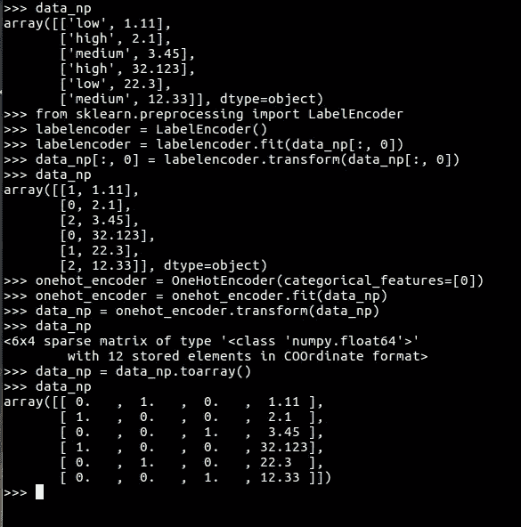

Fig. 5\. One-hot encoding using sklearn.preprocessing.OneHotEncoder

您可能已经注意到，我们首先使用 *LabelEncoder 对分类列进行了整数编码。*这是因为 *OneHotEncoder* 要求分类列包含数字标签。 *fit* 和 *transform* 方法需要传递形状为 *(m，n)* 的 *np.array* 对象。最后， *fit* 方法返回一个 *OneHotEncoder* 对象，该对象适用于传递给它的数据。这个过程是漫长的，但是你最终得到了一个合适的对象，它可以在以后的测试集中使用。Scikit-learn 提供了一个方法 *fit* 和*transform*-*fit _ transform*的组合版本，有助于减少一两行代码([参见](https://scikit-learn.org/stable/modules/generated/sklearn.preprocessing.OneHotEncoder.html)文档)。

## 虚拟变量陷阱

虚拟变量陷阱直接体现在应用于分类变量的一键编码中。如前所述，独热向量的大小等于分类列所占的唯一值的数量，并且每个这样的向量中恰好包含一个“1”。这将多重共线性引入我们的数据集。从图 4 中的编码数据集(其等同于图 5 中的编码数据集)，我们可以观察到以下线性关系(图 6):

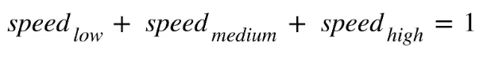

Fig. 6\. Perfect Multicollinearity after one-hot encoding

图 6 是完全多重共线性的情况。我们用来编码分类列的向量被称为'*虚拟变量*'。我们打算解决使用分类变量的问题，但是*被多重共线性的问题困住了*。这被称为*虚拟变量陷阱。*

如前所述，这会直接影响线性回归分析，因为线性回归假设数据集中不存在多重共线性。然而，它也提出了机器学习任务中的一些其他问题。比方说，我们在数据集上训练一个逻辑回归模型。我们期望我们的模型学习以下等式的权重:

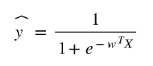

Fig. 7\. Sigmoid function

特别是，对于我们数据集中的要素，以下是逻辑回归将学习的权重:

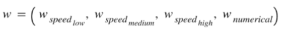

并且特征向量 **X** 是:

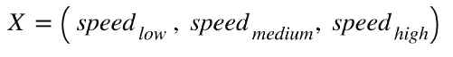

显然，sigmoid 函数分母中指数函数的幂实际上影响了 *y_hat* 的值，并且包含可训练的权重。这个表达式实际上扩展为:

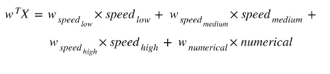

Equation- 1: Expanding the power term in sigmoid function

根据图 6 中的关系，我们可以将三个自变量中的任何一个用另外两个来表示，让我们以 LHS 的 *speed_low* 用 *speed_medium* 和 *speed_high:* 来表示

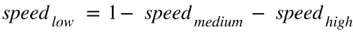

Equation-2: Expressing speed_low in terms of speed_medium and *speed_high*

> **为什么不好？**

正如我们前面讨论的，这对于线性回归问题有直接的影响。因此，以下是对所有算法通用的问题的总结。

1.  我们可以用等式-2 中的值替换等式-1 中的 *speed_low* 。这实际上意味着(至少)我们正在使用的一个特征是多余的-该特征可以是三个特征中的任何一个，因为方程-2 可以用 LHS 中的任何一个来编写。所以，我们让我们的模型学习一个不需要的额外重量。这消耗了计算能力和时间。这也给出了一个优化目标，该目标可能不太合理，并且可能难以实现。过多的自变量也可能导致维度 y 的[诅咒。如果多重共线性也随之而来，事情会变得更糟。](https://en.wikipedia.org/wiki/Curse_of_dimensionality)
2.  我们不仅希望我们的模型预测准确，还希望它是可解释的。例如，逻辑回归被期望学习对应于相对更重要的特征的相对更高的权重值。更重要的特征对最终预测的影响更大。但是如果特性是相关的，那么就很难判断哪个特性在最终决策中更有“发言权”，因为它们的值实际上是相互依赖的。这会影响权重的值。换句话说，权重不仅取决于自变量与因变量的相关性，还受到自变量之间相关性的影响。例如，如果 *speed_high* 的值比其他值高，那么 *speed_low* 和 *speed_medium* 必须更低，使得总和总是 1。我们假设*重要性(speed_high ) =重要性(speed_medium) =重要性(speed_low)。*但是由于 *speed_high* 的值比其他自变量的值高，因此与之对应的学习权重将比其他两个低得多。实际上，我们希望它们各自的权重(几乎)相等。

因为一次热编码直接导致完美的多重共线性，所以我们从编码的要素中删除其中一列。例如，在这种情况下，我们可以选择删除 *speed_medium* ，但这种选择完全是任意的。

下面是我们如何处理这个问题(删除其中一个编码列):

1.  当我们使用 *pd.get_dummies* 时，我们可以传递一个额外的参数，*drop _ first = True*([documentation](https://pandas.pydata.org/pandas-docs/stable/reference/api/pandas.get_dummies.html))来删除编码后得到的第一个新列(也称为第一个虚拟变量)(图 7):

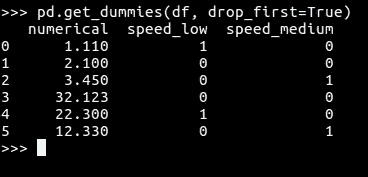

Fig. 7\. drop_first=True

将图 7 中返回的数据帧与图 4 中得到的输出进行比较。我们发现 *speed_high* 从编码数据帧中被删除。不使用 *drop_first=True* 会让 sklearn 使用该参数的默认赋值，即 *False* 。

2.当我们使用*sk learn . preprocessing . OneHotEncoder*并想要删除其中一个新列时，我们传递 *OneHotEncoder* 类的参数 *drop='first'* 构造函数([文档](https://scikit-learn.org/stable/modules/generated/sklearn.preprocessing.OneHotEncoder.html))。 ***然而，这似乎并不支持所有版本的 sklearn(我得到了一个错误，因为我的 sk learn . preprocessing . onehotencoder 版本不支持‘drop’参数)，所以您可能需要更新 python 包，然后才能在您的系统上使用它*** 。虽然您可以通过手动写入一两行来手动删除其中一个虚拟变量(图 8)，但如果您有多个分类列，并且每个分类列中有太多要处理的类别，则可能很难跟踪对数据框架所做的更改。

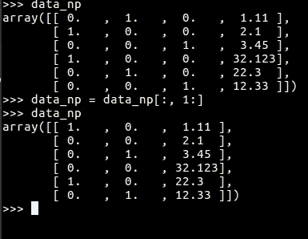

Fig. 8\. Manually dropping one of the dummy variables

由*转换*(或者， *fit_transform* )返回的 dataframe 在所有其他列之前添加新列(图 8)。因此，为了删除第一列，我们可以使用数组切片，如图 8 所示。然而，如前所述，这样做可能会变得笨拙。

## 结论

我希望这篇文章能够对多重共线性、一次性编码和虚拟变量陷阱进行全面的描述。这篇文章完全基于我的个人经验，事实来自可靠的来源(在每个这样的概念旁边已经提到了链接)。所以，如果你在文章中发现任何不一致的地方，请在下面评论。您的反馈将有助于我更好地写作和描述。期待收到你的来信。

谢谢你。