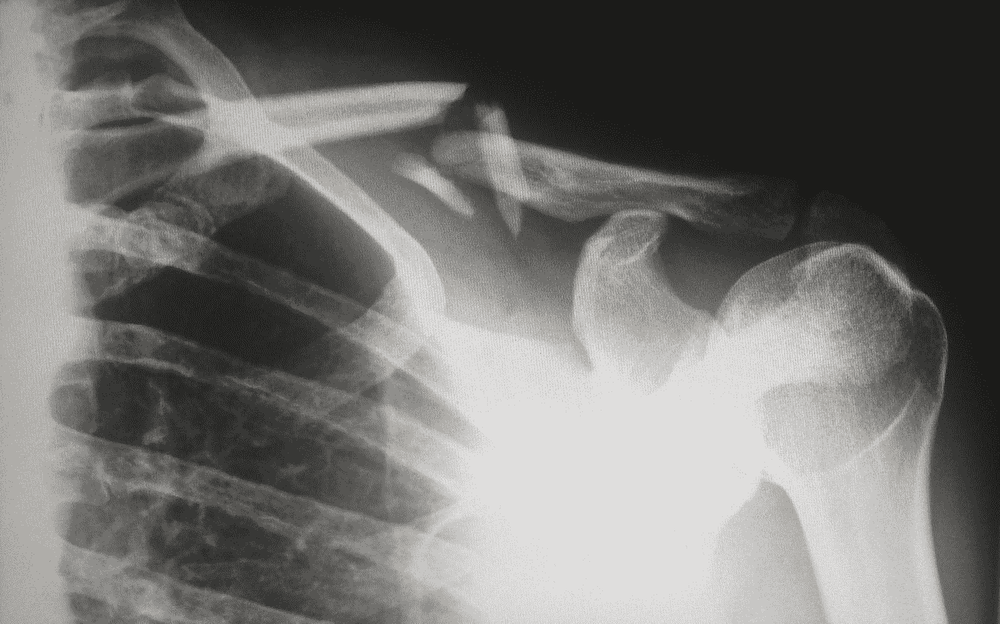
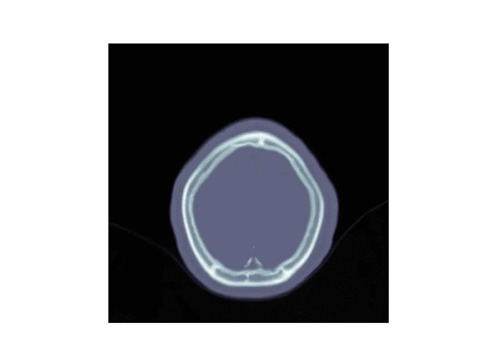
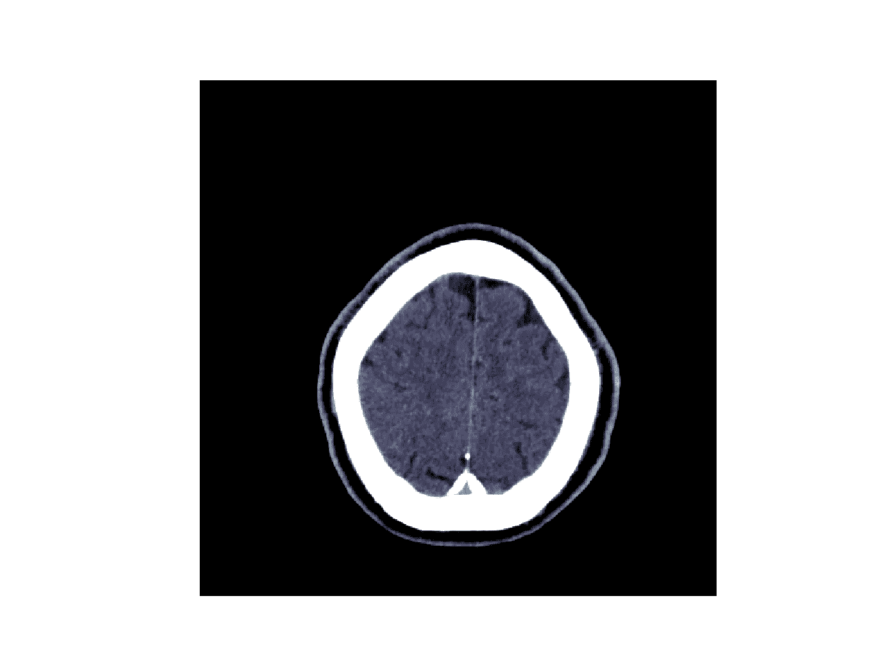
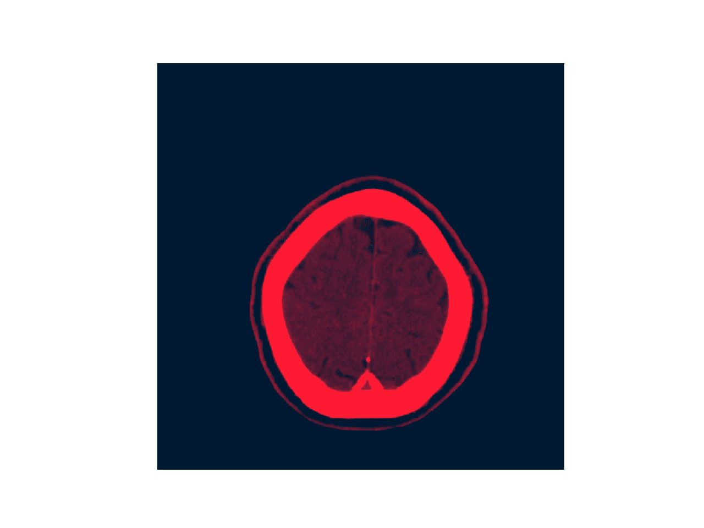
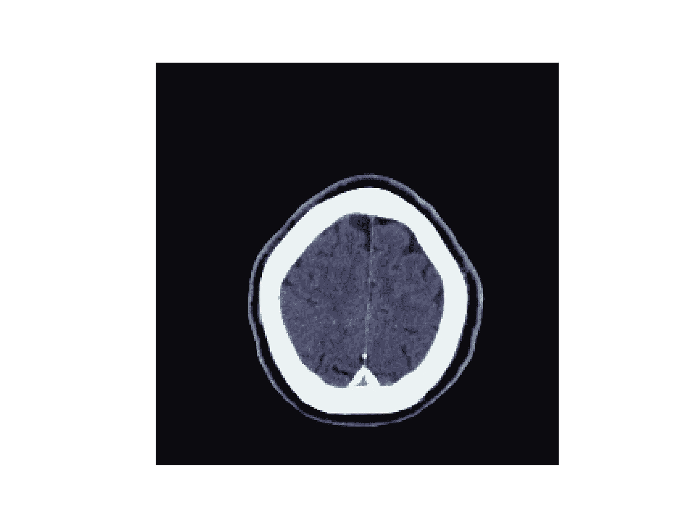

# 用 Miptools 进行一分钟 CT 预处理

> 原文：<https://towardsdatascience.com/one-minute-ct-preprocessing-with-miptools-8f8c3436c302?source=collection_archive---------22----------------------->

## 如何高效地预处理用于深度学习的 CT 图像

让我们面对它，医学图像处理是具有挑战性的。今天的医学成像机器能够产生具有大量信息的大量图像。然而，从图像中提取这些信息需要对成像技术有深入的理解。作为一名研究医学图像处理和机器学习的研究生，我发现除了众所周知的`pydicom`和`NiBabel`之外，缺乏好的医学图像预处理库。我最近参加了 RSNA 颅内出血检测比赛，这提醒了我图像预处理质量的重要性。

Photo by [Harlie Raethel](https://unsplash.com/@harlsta?utm_source=medium&utm_medium=referral) on [Unsplash](https://unsplash.com?utm_source=medium&utm_medium=referral)

这是一个未经任何预处理的正常脑部 CT 图像示例:

大脑在哪里？灰质/白质在哪里？显而易见(没有双关语)，可视化的 CT 缺少一些重要信息。他们没有出现的真正原因是因为我们错过了可视化之前的一个非常重要的步骤。当放射科医生查看 CT 图像，特别是脑部 CT 扫描时，他们的清单上最重要的项目之一就是开窗。人类只能感知范围从 0 到 255 的灰度(我想比 50 多一点)，而 CT 扫描的 Hounsfield 单位(HU)范围从-1000 到+2000。我不打算在本教程中深入描述胡的转变过程，但如果你感兴趣，这里有一篇关于胡的有用的[文章](https://radiopaedia.org/articles/hounsfield-unit?lang=us)。

为了正确显示 CT 扫描，使用窗口将 HU 数转换为灰度值。用`miptools`很容易做到这一点:

第一次开窗是简单的元数据开窗，可以通过设置`windowing='simple'`来指定。这会提取 DICOM 文件的窗口中心和宽度，并相应地将图像裁剪到指定的范围。我们转换后的图像应该是这样的:

现在我们至少可以在图像中看到大脑了，对吧？我们还可以通过 bsb(大脑、硬膜下、血液)窗口将更多信息编码到我们的转换图像中。这听起来可能很复杂，但我们只是将我们的图像转换为 3 个窗口:大脑窗口(中心:40，宽度:80)，硬膜下窗口(中心:80，宽度:200)和骨窗口(中心:600，宽度:2000)。最后，我们把 3 个窗口连接起来，作为我们变换后的图像的 3 个通道。执行代码片段中的第 7 行应该会产生下图:

上面显示的图像是用 bsb 窗口转换的。尽管它看起来只是我们元数据转换图像的红色版本，但它编码了更多信息，可能更适合深度学习目的。回想一下，彩色图像可以表示为三维阵列。我们能放入这 3 个维度的信息越多，我们的深层网络就能从我们的训练图像中提取和学习越多。

我们可以使用的另一种预处理技术是重采样。特定的扫描可能具有像素间距`[0.5, 0.5]`，而另一个患者的扫描可能具有像素间距`[0.8, 0.8]`。保持像素间距一致很重要，否则我们的网络可能很难推广。

通过指定`resampling=True`，我们可以用一行代码将像素间距重采样为`[1, 1]`。使用带有重采样的简单元数据窗口会得到以下图像:

医学图像处理中有很多先进的技术，但为了简单起见，我不会在本教程中一一介绍。如果你喜欢阅读这篇文章，请查看并启动我的 [miptools](https://github.com/chinokenochkan/miptools) 源代码库。我保证在不久的将来会增加更多的功能，因为我现在在学校很忙。