# 一个神经网络，多种用途

> 原文：<https://towardsdatascience.com/one-neural-network-many-uses-image-captioning-image-search-similar-image-and-words-in-one-model-1e22080ce73d?source=collection_archive---------9----------------------->

## 使用单一模型构建图像搜索、图像标题、相似文字和相似图像

众所周知，神经网络确实擅长一项狭窄的任务，但它们无法处理多项任务。这与人脑不同，人脑能够在惊人不同的任务中使用相同的概念。例如，如果你以前从未见过分形，我现在就给你看一个。

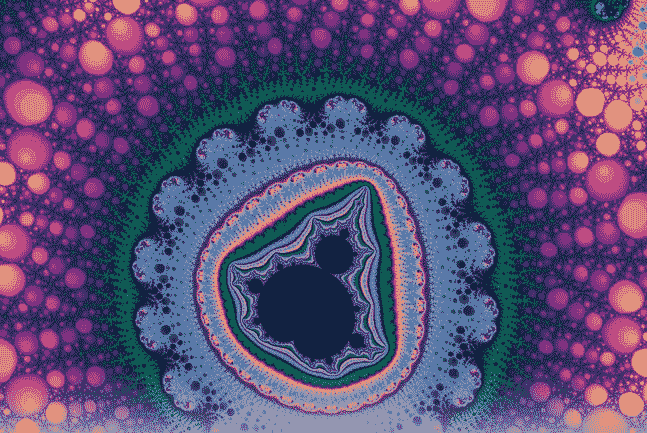

This beauty is courtesy math. (via [https://fractalfoundation.org/](https://fractalfoundation.org/))

**看到分形的图像后，你将能够处理与之相关的多项任务:**

*   在一组图像中，区分分形和猫
*   在一张纸上，大致画出分形的样子(它不会很完美，但也不会是随意的涂鸦)
*   将类似分形的图像与非类似分形的图像进行分类(你可以自动将图像从最相似到最不相似进行分类)
*   闭上眼睛，想象分形是什么样子的(即使没有视觉输入，你仍然可以在一次曝光后想象它。多酷啊！)

你是如何完成所有这些任务的？在你的大脑中有专门的神经网络专门处理所有这些任务吗？

现代神经科学表明，答案是你大脑中的信息在不同部分之间共享和交流。具体是如何做到的是一个研究领域，但我们有一些关于这种多任务性能可能如何发生的线索。答案可能在于数据在神经网络中是如何存储和解释的。

# 奇妙的表现世界

顾名思义，表示就是信息在网络中的编码方式。当一个单词、一个句子或一幅图像(或者其他任何东西)被作为输入提供给一个经过训练的神经网络时，随着权重乘以输入和激活的应用，它会在连续的层上进行转换。最后，在输出层，我们得到数字，我们解释为类标签或股票价格或网络训练的任何其他任务。

这种输入->输出的神奇转换是由于连续层中发生的输入转换而发生的。这些输入数据的转换被称为表示。**一个关键的想法是每一层都让下一层的工作**变得*容易*。使连续层的寿命更容易的过程导致激活(特定层的输入数据的转换)**有意义的**。

我说的有意义是什么意思？让我们看一个图像分类器不同层激活的例子。

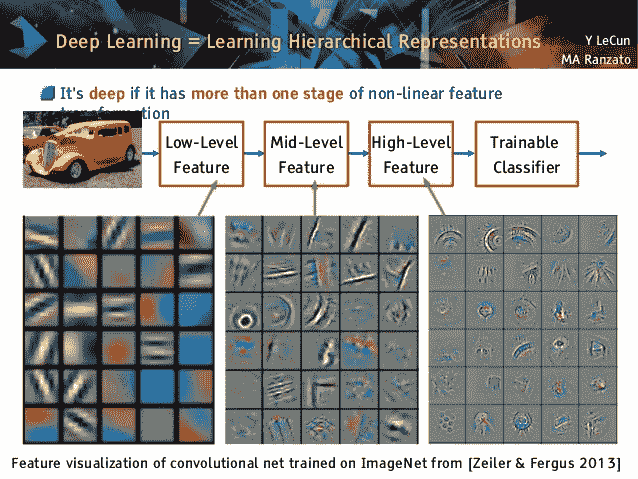

图像分类网络所做的是**将像素空间中的图像转换到越来越高的概念空间**。因此，以 RGB 值表示的汽车图像将开始在第一层的边缘空间中表示，然后在第二层的圆形和基本形状空间中以及在预最终层中，它将开始在高级对象中表示，如车轮、门等。

这种越来越丰富的表现形式(由于深层网络的等级性质而自动出现)使得图像分类的任务变得微不足道。最后一层要做的就是权衡轮子和门的概念，使之更像汽车，耳朵和眼睛更像人。

# 你能对陈述做什么？

因为这些中间层存储了输入数据的有意义的编码，所以您可以将相同的信息用于多个任务。例如，你可以用一个语言模型(一个被训练来预测下一个单词的递归神经网络)来解释特定神经元的激活，以[预测句子](https://blog.openai.com/unsupervised-sentiment-neuron/)的情绪。

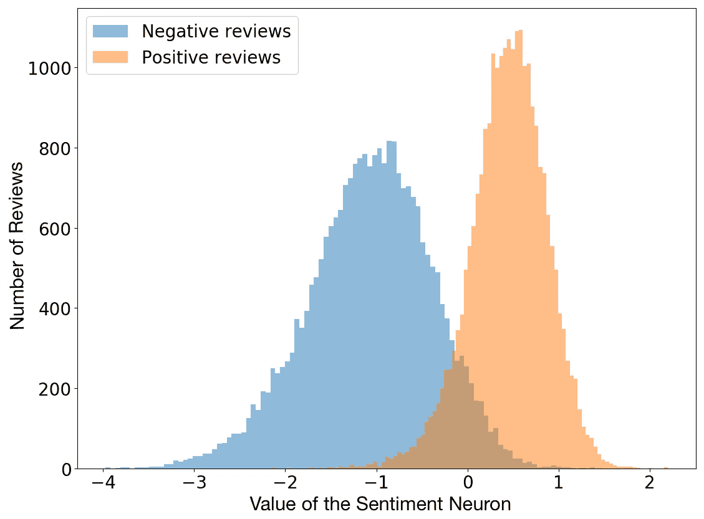

(via [Unsupervised Sentiment Neuron](https://blog.openai.com/unsupervised-sentiment-neuron/))

令人惊讶的事实是，情感神经元在无监督的语言建模任务中自然出现。(参见[这篇教程](https://rakeshchada.github.io/Sentiment-Neuron.html)中的精彩评论)。网络被训练来预测下一部作品，在任务中我们没有要求网络预测情绪。也许情感是一个非常有用的概念，网络发明它是为了在语言建模方面做得更好。

一旦你**得到**表示的想法，你将开始以完全不同的眼光看待深层神经网络。你将开始感觉到表征是一种可转移的语言，它使不同的网络(或同一网络的不同部分)相互交谈成为可能。

# 通过构建四位一体的网络来探索表征

为了充分理解什么是表示，让我们建立我们自己的深度神经网络，它做四件事:

*   **图像标题生成器**:给定一幅图像，为其生成标题
*   **相似词生成器**:给定一个词，找出与其相似的其他词
*   **视觉相似图像搜索**:给定一幅图像，找出与其最相似的图像
*   **描述图像内容搜索**:搜索包含文字描述内容的图像

这里的三个任务中的每一个本身都是一个项目，传统上需要三个模型。但是我们将使用**一个型号**来完成所有这些任务。

代码将用 Pytorch 写在 Jupyter 笔记本上。你可以从[这个库](https://github.com/paraschopra/one-network-many-uses)下载。

→ Github 库:【https://github.com/paraschopra/one-network-many-uses】T2ⅲ

## 第一部分—图像字幕

网上有很多很好的教程来实现图像字幕，所以我不打算深入讲解。我的实现与本教程中的完全相同:[构建一个自动图像字幕应用](https://daniel.lasiman.com/post/image-captioning/)。关键的区别在于，我的实现是在 Pytorch 中，而本教程使用的是 Keras。

要继续学习，您需要下载 Flickr8K 数据集。填写[这张表格](https://forms.illinois.edu/sec/1713398)，你会在你的邮箱里收到一个下载链接。(还有一个[直接链接下载 1GB 的 Flickr8K 数据集](https://github.com/jbrownlee/Datasets/releases/download/Flickr8k/Flickr8k_Dataset.zip)，虽然我不确定它会像那样保持多久)。将 zip 文件提取到笔记本所在目录下的“Flicker8k_Dataset”文件夹中。你还需要从这里下载字幕[。提取文件夹“caption_datasets”中的标题。](http://cs.stanford.edu/people/karpathy/deepimagesent/caption_datasets.zip)

**型号**

图像字幕大致有两个组成部分:a)图像编码器，它获取输入图像，并以对字幕有意义的格式表示它；b)字幕解码器，获取图像表示并输出其文本描述。

图像编码器是深度卷积网络，而字幕解码器是传统的 LSTM/GRU 递归神经网络。当然，我们可以从头开始训练这两者。但是这样做将需要比我们现有的更多的数据(8k 图像)和大量的训练时间。因此，我们将采用一个预先存在的图像分类器，并使用它的预最终层激活，而不是从头开始训练图像编码器。

这是你将在本帖中看到的许多神奇的表示示例中的第一个。我采用了在 ImageNet 上训练的可用于 [PyTorch modelzoo](https://pytorch.org/docs/stable/torchvision/models.html) 的盗梦空间网络来对 100 个类别的图像进行分类，并使用它来给我一个可以输入到递归神经网络中的表示。

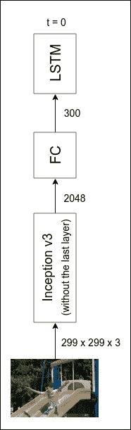

via [https://daniel.lasiman.com/post/image-captioning/](https://daniel.lasiman.com/post/image-captioning/)

请注意，盗梦空间网络从未接受过图像字幕任务的培训。然而，它工作了！

就像我在我的[通过机器学习](/generating-new-ideas-for-machine-learning-projects-through-machine-learning-ce3fee50ec2)帖子中所做的那样，我们也可以为字幕解码器使用预先训练的语言模型。但是这一次，因为我重新实现了教程中的一个运行良好的模型，所以我简单地跟随并从头开始训练了一个解码器。

完整的模型架构如下所示:

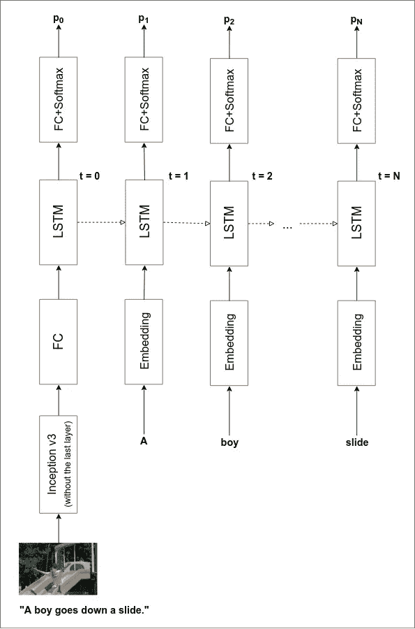

Image via [https://daniel.lasiman.com/post/image-captioning/](https://daniel.lasiman.com/post/image-captioning/)

你可以从头开始训练模型，但这需要在 CPU 上花几天时间(我还没有为 GPU 优化)。但是不要担心！我的笔记本电脑度过了不眠之夜，所以你可以享受已经训练好的模型的成果。(如果你是从零开始训练，请注意，当运行平均损失大约为 2.8 时，我在大约 40 个时期停止了训练)

**表演**

我已经实现了性能良好的波束搜索方法。以下是网络为来自测试集的图像生成的标题示例(它以前从未见过它们)。

让我们看看网络对我自己照片的说明:

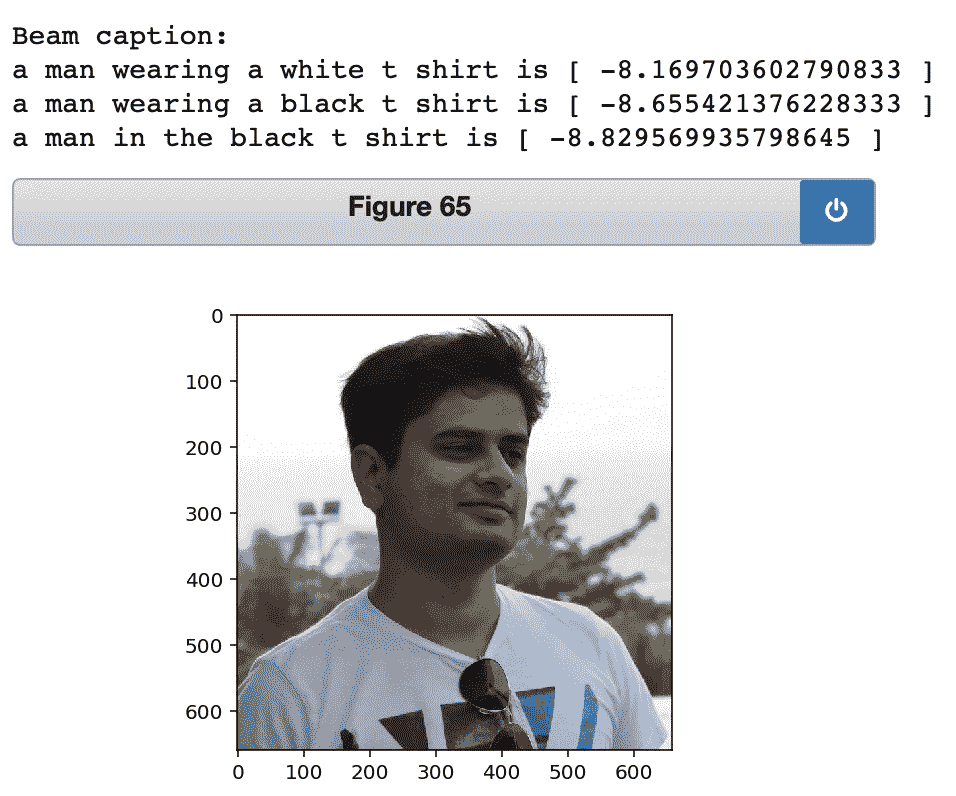

还不错！令人印象深刻的是，该网络知道该图像包含一名身穿白色 t 恤的男子。语法有点问题(我相信多训练可以解决)，但基本要点是好的。

如果输入图像包含网络从未见过的东西，它往往会失败。比如我很好奇网络会给 iPhone X 的一张图片贴什么标签。

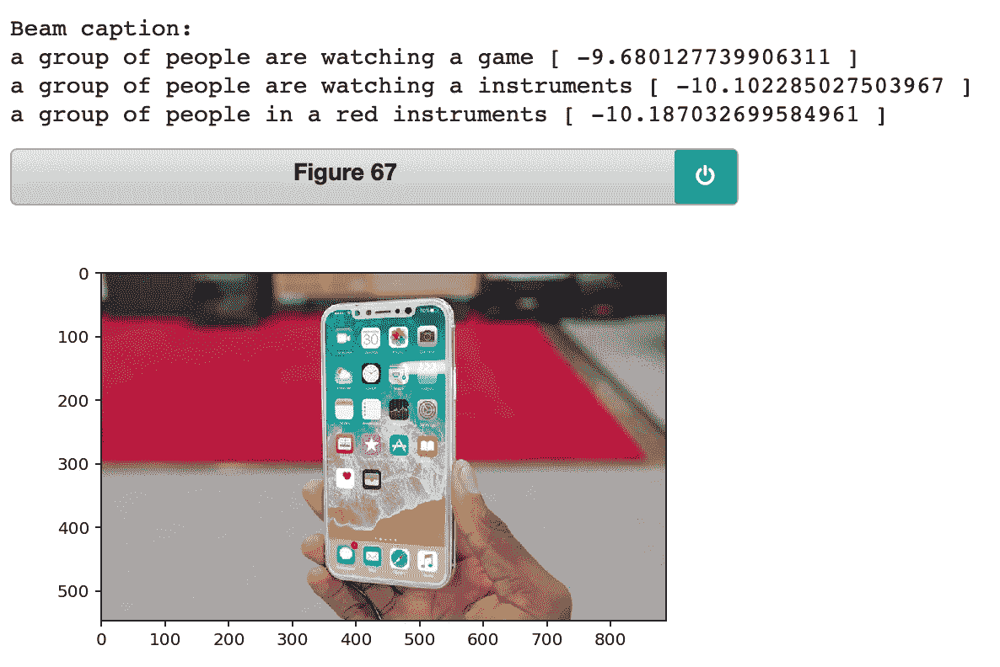

它做得不太好。但总的来说，我对性能相当满意，这为我们使用 network 在学习为图像添加标题时开发的表示来构建其他功能提供了良好的基础。

## 第二部分—相似词

回想一下我们如何从图像表示中解码标题。我们将该表示输入 LSTM/GRU 网络，生成输出，将其解释为第一个单词，然后将第一个单词反馈给网络，以生成第二个单词。这种情况一直持续到网络生成一个表示句子结束的特殊标记。

为了将单词反馈到网络中，我们需要将单词转换成表示，这些表示成为网络的输入。这意味着，如果输入层由 300 个神经元组成，对于所有标题中 8000 多个不同单词中的每一个，我们需要有 300 个相关联的数字来唯一地指定该单词。**将字典中的单词转换成数字表示的过程被称为单词嵌入(或单词表示)。**

我们可以下载和使用像 word2vec 或 GLoVE 这样预先存在的单词嵌入。但是在目前的情况下，我们从零开始学习单词 embedding。我们从随机生成的单词嵌入开始，并探索在训练完成时我们的网络已经学习了关于单词的什么。

由于我们无法可视化 100 维的数字空间，我们将使用一种叫做 [t-SNE](https://lvdmaaten.github.io/tsne/) 的奇妙技术来可视化二维的单词嵌入。t-SNE 是一种降维技术，它试图使高维空间中的邻居在低维空间中仍然是邻居。

**单词嵌入的可视化**

说够了。让我们看看字幕解码器学习的单词嵌入空间(不像其他语言任务有数百万个单词和句子，我们的解码器在训练数据集中只看到了大约 30k 个句子)。

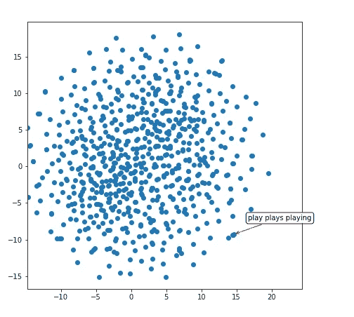

因此，我们的网络已经了解到，像“play”、“plays”和“playing”这样的词是非常相似的(它们有相似的表示，这从带有红色箭头的紧密聚类中可以明显看出)。让我们探索 2D 空间的另一个领域:

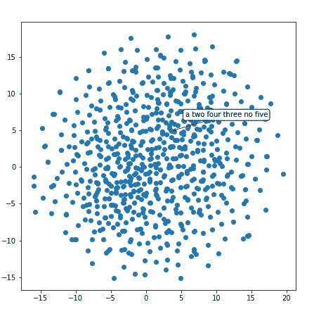

这个区域似乎有成群的数字——“二”、“三”、“四”、“五”等等。另一个:

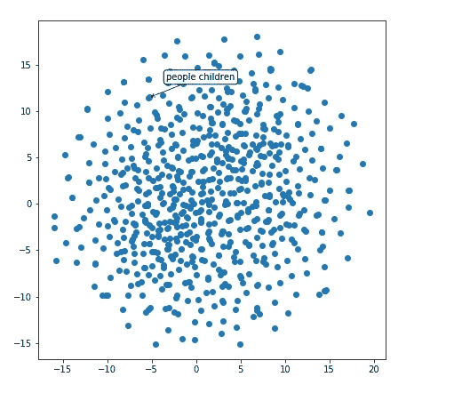

它知道人和孩子是相似的。此外，它还隐含地推断出物体的形状。

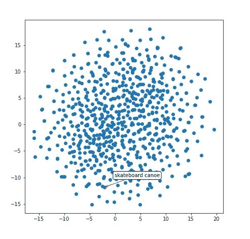

**类似的话**

我们可以使用 100 维表示来构建一个函数，该函数建议与输入单词最相似的单词。它的工作原理很简单:取 100 维的表示，找到它与数据库中所有其他单词的余弦相似度。

让我们来看看**与单词‘boy’最相似的单词**:

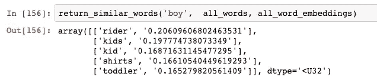

还不错。“骑手”是一个例外，但“孩子”、“小孩”和“蹒跚学步的孩子”是正确的。网络认为什么和‘追’这个词相似:

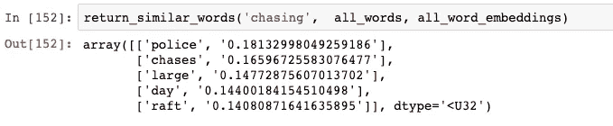

“追逐”很好，但我不知道为什么它认为“警察”与追逐相似。

**词语类比**

关于单词 embeddings 的一个令人震惊的事实是，你可以对它们进行演算。你可以用两个词(比如“国王”和“王后”)减去它们的表示来得到一个方向。当你将这个方向应用到另一个单词表征(比如“男人”)时，你会得到一个接近实际的类似单词(比如“女人”)的表征。这种魔力就是 word2vec 推出时如此出名的原因:

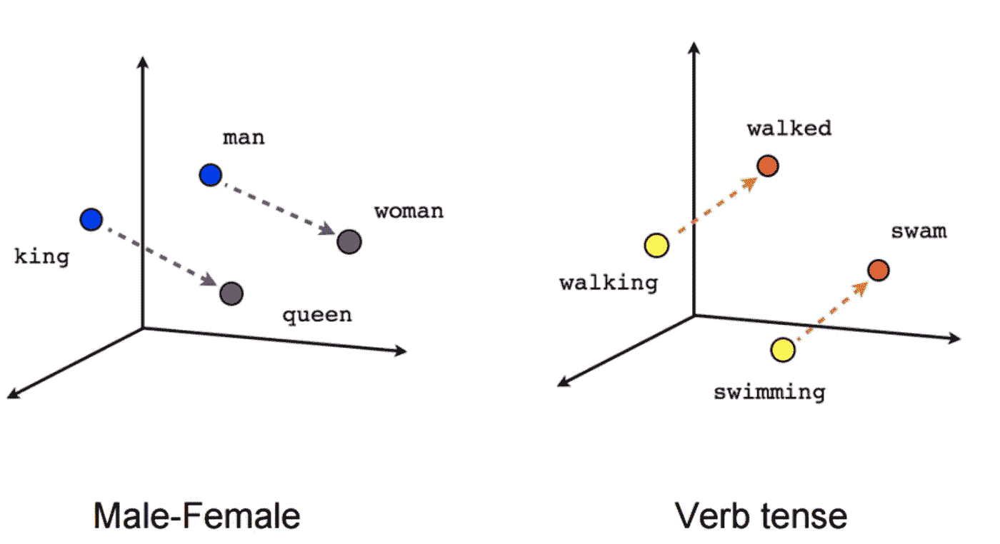

via [https://www.tensorflow.org/images/linear-relationships.png](https://www.tensorflow.org/images/linear-relationships.png)

我很好奇字幕解码器学习到的表现是否也有类似的特性。即使我因为训练数据不多(约 30k 句)而持怀疑态度，我还是试了一下。

网络学习到的类比并不完美(有些单词字面上是为<10 times, so network didn’t have enough info to learn). I had to squint my eyes but it sort-of found analogies.

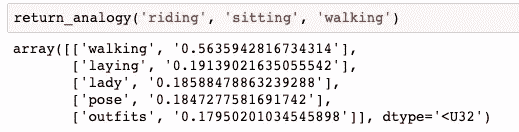

If riding is to sitting, what would walking correspond to? My network things it would be ‘laying’ (which is not bad!).

Similarly, **出现的，如果‘男人’的复数是‘男人’，那么‘女人’的复数是什么**:

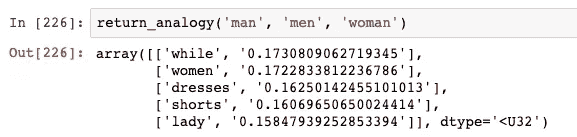

第二个结果是“女人”,相当不错。

最后，**如果草是绿色的，天空会是什么颜色**:

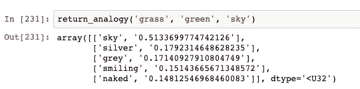

网络认为是银色或者灰色，都不是蓝色但是都是颜色。令人惊讶的是，网络能够推断颜色的方向。

## 第三部分—相似图像

如果单词表示将相似的单词聚集在一起，那么图像表示呢(Inception powered image encoder 输出的图像表示)。我将相同的 t-SNE 技术应用于图像表示(300 维张量，作为字幕解码器第一步的输入)。

**可视化**

这些点代表不同的图像(我没有拍摄完整的 8K 图像，但它是大约 100 张图像的样本)。红色箭头指向附近的一组制图表达。

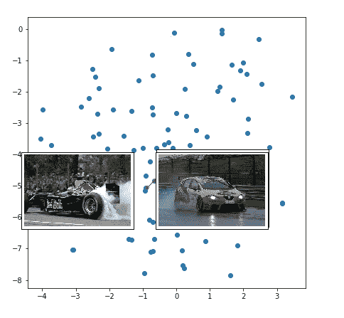

所以，赛车聚集在一起。

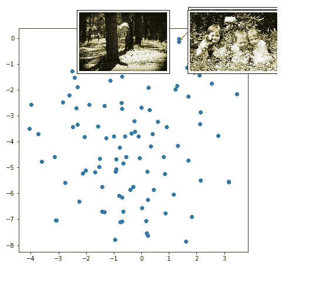

在类似森林/草地的地方玩耍的孩子也是如此。

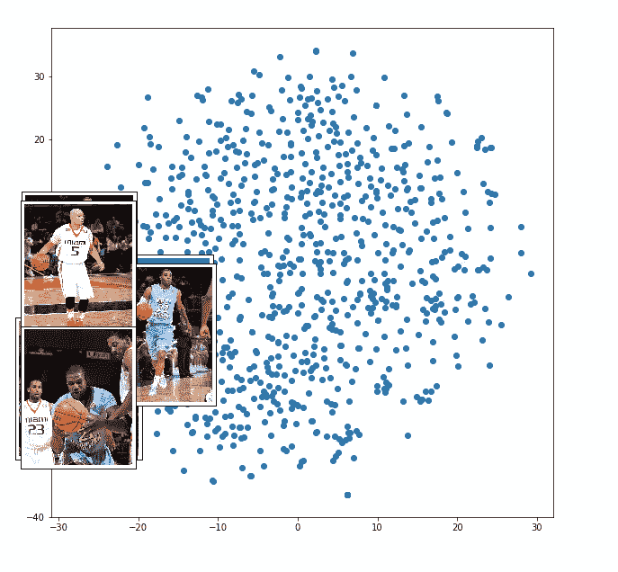

篮球运动员聚集在一起。

**寻找与输入图像相似的图像**

对于相似单词任务，我们被限制在我们的测试集词汇中寻找相似的单词(如果一个单词不存在于测试集中，我们的字幕解码器不会学习它的嵌入)。然而，对于相似图像任务，我们有一个图像表示生成器，它将接受任何输入图像并生成其编码。

这意味着我们可以使用余弦相似度方法来构建按图像搜索的功能，如下所示:

*   步骤 1:获取数据库或目标文件夹中的所有图像，并存储它们的表示(由图像编码器给出)
*   步骤 2:当用户想要搜索与他已经拥有的图像看起来最相似的图像时，获取新图像的表示，并在数据库中找到最接近的图像(由余弦相似度给出)

谷歌图片很可能使用这种(或非常相似的)方法来增强他们的[反向图片搜索](https://support.google.com/websearch/answer/1325808?co=GENIE.Platform%3DDesktop&hl=en)功能。

让我们看看我们的网络做得怎么样。我在果阿度假时点击了下面这张照片。(PS:我爱果阿！)

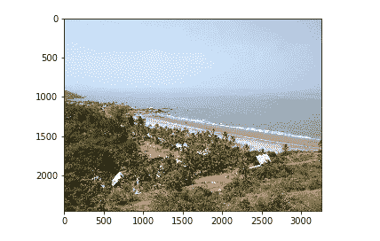

注意，这个图像是我自己的。我们正在使用的模型从未见过它。当我查询与此类似的图像时，网络从 Flickr8K 数据集中输出以下图像:

这难道不令人兴奋吗？我没想到会有这么好的表现，但是我们做到了。[深度神经网络好得不可理喻](https://www.youtube.com/watch?v=Y-WgVcWQYs4)。

## 第四部分-通过描述来搜索图像

在最后一部分，我们反向运行图像标题生成器。因此，我们输入一个标题(文本描述)并找到最匹配的图像，而不是获取一个图像并为其生成标题。

听起来好得难以置信？其实不是。我们是这样做的:

*   第一步:不用来自编码器的 300 维图像表示，从一个完全随机的 300 维输入张量开始
*   步骤 2:冻结整个网络的所有层(即指示 PyTorch 不要计算梯度)
*   步骤 3:假设随机生成的输入张量来自图像编码器，并将其输入字幕解码器
*   步骤 4:获取网络在给出随机输入时生成的标题，并将其与用户提供的标题进行比较
*   步骤 5:比较生成的字幕和用户提供的字幕，计算损失
*   步骤 6:为输入张量寻找最小化损失的梯度(即，300 维数字中的每一个应该在哪个方向上改变以及改变多少，以便当张量被输入到字幕解码器中时，字幕接近用户提供的字幕)
*   第七步:改变输入张量的方向，由梯度决定(按照学习速率的要求迈出一小步)
*   继续步骤 4 至步骤 7，直到收敛或损耗低于某个阈值
*   最后一步:取最终的输入张量，用它的值通过余弦相似性找到最接近它的图像(在 300 维空间中)

当我们这样做时，结果是不可思议的:

我搜索了**‘一只狗’**，这是网络找到的图片:

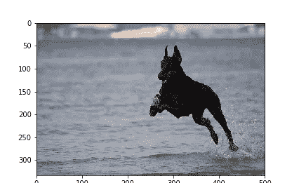

我搜索了**《一个微笑的男孩》**。

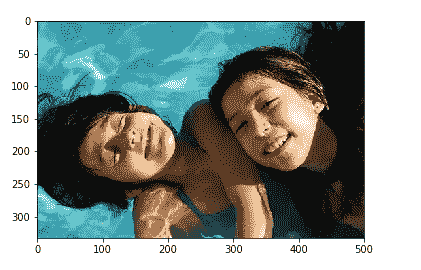

最后，当我搜索:

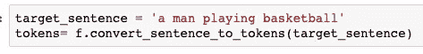

前两个结果是:

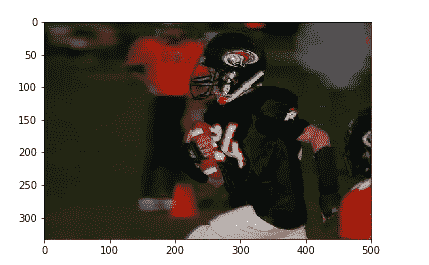

和

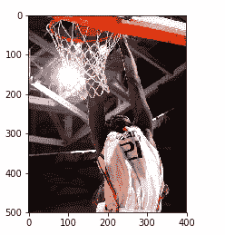

令人兴奋，不是吗？

## 总结和挑战

提醒一下，你可以从[我的 github 库](https://github.com/paraschopra/one-network-many-uses)下载完成所有这些的代码。它包括数据预处理，模型描述，预训练的图像字幕网络，可视化代码。它不包括 Flickr8K 数据集或字幕，您必须分别从这里和这里[下载](http://cs.stanford.edu/people/karpathy/deepimagesent/caption_datasets.zip)。

我希望你喜欢这篇文章。如果你想更进一步，**这里有一个挑战:根据给定的描述生成一个图像**。就像从一个随机的起点生成一个与用户提供的标题相匹配的 300 维图像表示一样，您能更进一步，为用户提供的标题从头开始生成一个图像吗？

这比我们在这篇文章中处理的要难 10 倍，但我感觉这是可行的。如果有一种服务不仅能搜索与文本相对应的图像，还能动态生成图像，那该多好啊。

将来，如果 Google Images 这样做，并开始为尚不存在的图像提供结果(比如“两只独角兽在披萨做成的地毯上飞翔”)，我不会感到惊讶。

就是这样。我希望你能安全而愉快地探索表象世界。

*感谢***的点评和评论。**

## *喜欢这个教程吗？也看看我以前的作品:*

*   *[让深度神经网络作画，了解它们是如何工作的。用 100 行 PyTorch 代码生成抽象艺术，并探索神经网络如何工作](/making-deep-neural-networks-paint-to-understand-how-they-work-4be0901582ee?source=your_stories_page---------------------------)*
*   *[让你的神经网络说“我不知道”——贝叶斯神经网络使用 Pyro 和 PyTorch](/making-your-neural-network-say-i-dont-know-bayesian-nns-using-pyro-and-pytorch-b1c24e6ab8cd) 。在 MNIST 数据集上编写贝叶斯图像分类器的教程+代码。*
*   *[通过机器学习为机器学习项目产生新的想法](/generating-new-ideas-for-machine-learning-projects-through-machine-learning-ce3fee50ec2)。使用预先训练的语言模型从 2.5k 句子的小型语料库中生成风格特定的文本。PyTorch 代码*
*   *[无梯度强化学习:使用遗传算法进化智能体](/reinforcement-learning-without-gradients-evolving-agents-using-genetic-algorithms-8685817d84f)。在 PyTorch 中实现深度神经进化为 CartPole 进化一个 agent 代码+教程]*

## *在 Twitter 上关注我*

*我定期发关于人工智能、深度学习、创业公司、科学和哲学的推特。跟着我上[https://twitter.com/paraschopra](https://twitter.com/paraschopra)*

* [## Paras Chopra (@paraschopra) |推特

### Paras Chopra 的最新推文(@paraschopra)。跟着我，我会把你带到一条混乱的道路上…

twitter.com](https://twitter.com/paraschopra)*