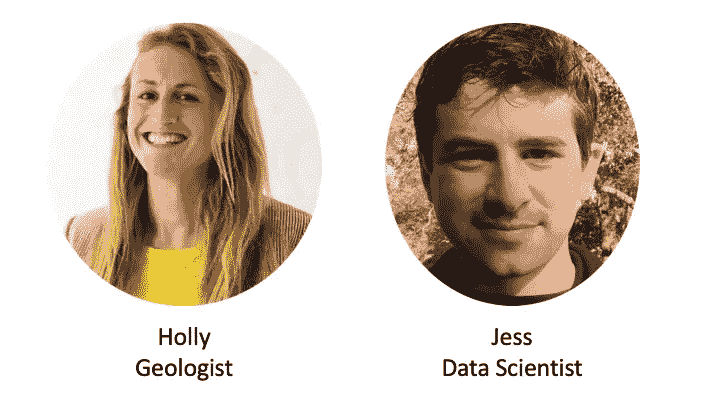
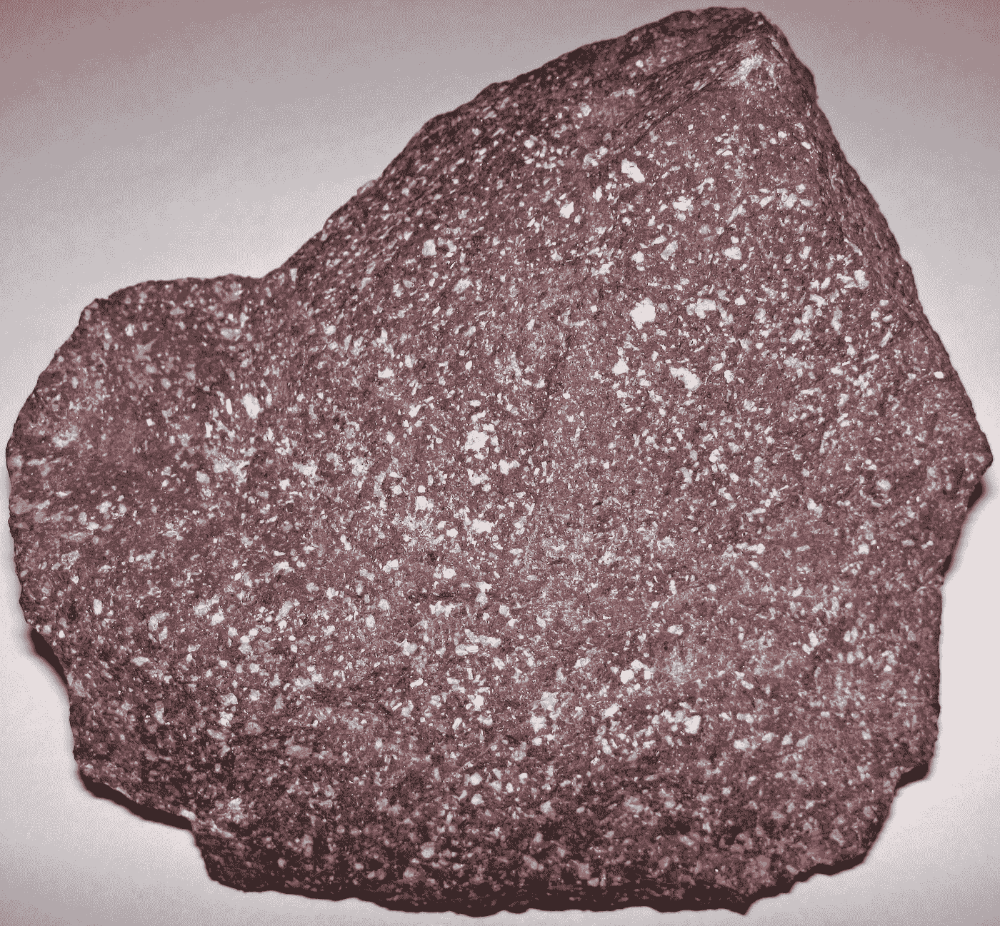

# 其中一件事与众不同:地质异常和数据异常检测

> 原文：<https://towardsdatascience.com/one-of-these-things-is-not-like-the-others-geological-anomalies-and-anomaly-detection-with-data-59a1a8b94785?source=collection_archive---------14----------------------->

## 一位数据科学家和一位地质学家讨论多学科方法

[Shaan Hurley, Flickr](https://www.flickr.com/photos/btl/855738103/)

## 在地球科学中，我们经常谈论寻找数据中的异常作为潜在矿化的指标。但是，我们如何定义异常，数据科学家和地质学家如何合作产生新的见解？

地质学家 Holly Bridgwater 和数据科学家 Jess Robertson 博士最近进行了一次聊天，内容是如何以一种对从通才数据科学角度看待地球科学数据的人有意义的方式来描述异常。

## 请继续阅读，了解他们的观点——或者点击这里观看原始视频[。](https://www.youtube.com/watch?v=L9iGNKGxyq8&t=134s)

***注:*** *这场讨论是由* [*探险者挑战赛*](https://unearthed.solutions/u/competitions/explorer-challenge) *引发的，这是一场使用数据来改善矿产勘探流程的全球竞赛——视频对此做了一些具体的引用，但本文做了更多的概括。*

## 霍莉:

今天，我们将主持一个会议，讨论“什么是异常现象，如何在数据中发现异常现象？”我们的目标是帮助数据科学家掌握地质数据。我将扮演地质学家的角色，提出令人沮丧、框架不佳的数据科学问题，Jess 将能够为您翻译这些问题，希望是以一种有意义的方式。手指交叉！

所以我们认为我们要做的是关注地质数据中常见的三种特殊类型的异常。

# 物理性质

Holly: 首先我们要谈谈岩石的物理特征，特别是地球物理数据。作为一名地质学家，我在这种类型的数据中寻找的是向我表明岩石中物理差异的东西。例如，某些类型的矿体，如硫化物，比周围的岩石密度更大，导电性更好——所以我去寻找可能向我表明密度更大或导电性更好的岩石的信号。

我是如何做到这一点的，首先我找人收集数据，通常是航空地球物理调查，可能是磁力和重力。然后，我让一个比我聪明得多的人对数据做一些数学运算(反演),生成一些典型的彩色网格图像；红色表示高磁场强度，蓝色表示低磁场强度。

Geology is just paint by numbers then, right? ([Flickr](https://www.flickr.com/photos/62030038@N02/8401494204/))

我在这些图像中寻找结构和趋势，这些结构和趋势可能表明一些不同的事情正在发生。我可能在寻找岩石类型或物理特征的特定变化，或者我可能在寻找由密度差异表示的结构或化学变化。

## 杰西:

我想我应该首先注意到，你刚刚谈到了这些数据的五六个不同的步骤。

这是从仪器上得到的原始数据。

需要对数据进行一些处理，例如，如果是磁力，您需要去除地球磁场的影响，这样您就可以看到当地地质对磁场的影响。然后，你提到了反转，你也提到了漂亮的图像，我认为这是两个独立的步骤。

## 霍莉:

我想地质学家对我们为什么进行反演的基本描述是，我们正在记录来自地球的原始测量结果，这些测量结果导致信号以某种方式返回——但我们实际上想知道的是它在告诉我们什么。在反演过程中，我们应用一些先验知识来帮助我们确定。

一个精明的勘探地质学家，在做调查之前，会向地球物理学家提供一些你已经知道的岩石特征。因此，如果你已经了解了岩石类型和它们的一些特征，你可以把它们交给地球物理学家，他们可以生成一个更好的模型，以你已知的地质学为荣。

## 杰西:

因此，从数据科学的角度来看，本质上我们在勘探中做得不太好的事情[注意，杰斯也是地质学家]，我们应该做得更好的事情，是理解**背景**以及试图理解**异常**。

显然，我们知道我们在寻找矿化。我们想找到硫化物的峰值，它会让我们都变得富有。但有时我们没有花足够的时间去真正理解背景是什么样的，岩石的自然可变性是什么——这样我们就可以正确地判断并说“这实际上是一种异常现象”。

我们认为数据科学能够为探索带来的优势之一是，有可能对所有公共数据集进行更大范围的观察，并试图了解其中的自然可变性。然后，当你提出你的异常矿物目标时，你可以说，实际上我们观察了南澳大利亚所有的绿宝石，发现它们有这种地球物理信号，这个东西与那个不同。因此，能够提供这种更大的数据或更高层次的视图是一个额外的好处。

## 霍莉:

给数据科学家提供没有背景的原始地球物理数据有多困难？

## 杰西:

数据科学家的部分职责是从数据中创建上下文！我们认为是“有用的背景”的东西可能不够量化，或者不能适用于所有的数据。因此，数据科学家将采取“越多越好”的方法，他们试图思考所有可能成为“有用环境”的事物的超集，然后从数据中了解哪些是真正有用的。

仍然有很多东西你可以从那些数据中提取出来，而不必进行完全的反演。

只是为了澄清一些语言，当我谈论反演时，从物理背景出发，我希望我们有一些控制方程，描述岩石的物理性质如何导致我们在野外看到的信号。当我做反演时，我基本上是想从场回到那些物理性质。

当你只关注一两个领域时，这种方法很有效。真正困难的地方在于，当你试图在其上堆叠一大堆其他数据时。例如，我们没有任何控制方程同时告诉我们岩石的磁性和密度属性加上地球化学加上矿物学加上结构是如何转化的。你把所有这些东西放在一起，这个方程组就太复杂了，无法恰当地发明出来。

这就是机器学习的特殊优势，因为有了机器学习，我们不需要解决反演问题，而是可以寻找模式。这是一种数据融合方法。或者，你可以进行这种转换，然后开始用其他数据集来约束反演；这也是一个非常有价值的方法，实际上也可以输入到机器学习模型中。

所以，再一次有很多不同的方法将机器学习应用于地质学。

# 地球化学

## 霍莉:

所以，让我们继续我最喜欢的东西——地球化学！

关于地球化学，首先要指出的是，当我们谈论数据时，我们谈论的是实验室化验结果或一些实时化学读数或岩石中元素的指标。

通常，地球化学数据库来自钻井，但钻孔的密度和间距将取决于您是在钻探资源还是在进行区域勘探。因此，由于数据可能很稀疏，我想从数据科学的角度来看，这真的很难。

我们在地球化学异常中寻找的是指示潜在矿化的任何化学变化。

**Yhana (Unearthed editor) to Holly:** “which of these rock photos can be a good geochemistry example image?” **Holly:** “All rocks are awesome! [*blank stare*]… fine, the purple sparkly one.” ([Flickr](https://www.flickr.com/photos/jsjgeology/29980457784/in/photolist-dkdbLv-dDD2dx-Dyq6AX-fhRQ1B-oUw97e-7rgfoE-p5yYc2-oN5LqF-p3wZcL-peYZtD-oJV9PC-7WbTnJ-7W8QhR-7WbXsW-YiayFr-7WbRqj-7W8znH-7Wc7a5-E3jty7-6K2vH2-28K3Mkc-27ngjuC-4ysA2g-27ngjKh-4yszPZ-4ywRXU-28K3KKP-4ysA76-4ywSyJ-Fq2zkc-TrezCv-28K3MKR-4ywRrE-27ngjmS-MLA6qP-4ywSTu-4yszki-4ysAzp-4ywS7W-SNN8my-4yszxV-27ngjx3-SNN8md-27ngjt5-MFgFAy-SNN8jj-27ngjqE-SNN8jE-SNN8jQ-SNN8km))

**仍然霍利:** 我查阅地球化学数据的过程首先是对那些数据进行分段。

我知道如果我看大量的数据，我不太可能看到任何有意义的趋势；我可能会看到不同的岩石类型，但我需要将这些不同的岩石类型分成不同的群体，这样我就可以看到在这些单独的数据集中实际的异常是否突出。因此，我将数据分成不同的岩石类型，甚至蚀变类型的潜在子集。这样我就能清楚地看到那里有哪些异常点

如果我们在寻找一个新的矿床，我们知道我们在寻找不同的东西，但我们不知道确切的化学特征可能是什么。它可能是某些元素的浓缩，但也可能是一种损耗，所以实际上我们只是在寻找某个领域与众不同的东西。

## 杰西:

这是这是一个真正的机会，将你得到的化学数据直接与实际形成矿床的地质过程联系起来。

Holly 还没有提到这一点，但是很多地球化学研究都试图了解不同元素在每个矿床形成过程中的表现。

例如，你可能有一束热流体流过一些岩石，这会改变岩石中的所有矿物，你会看到一些元素富集——如二氧化硅。像斜长石这样的矿物被改造成粘土矿物，或者失去二氧化硅，被热的流动流体带到别处。当你看到这种运作时，这表明那里有热液活动。你可能会想到热液矿床，如金或某种铜。

## 霍莉:

从化学角度来说，作为地质学家，我们通过教育了解未蚀变和蚀变岩石的样子。

从根本上来说，我们可以考虑沉积岩、变质岩和火成岩。地质学家了解它们在自然状态下的不同化学成分。他们还会知道，如果被改变了，哪些元素指标可能会显示出来。我们已经了解了那些物理系统。因此，当我们寻找经济矿化的证据时，我们应用这些知识。

## 杰西:

可以有如此广泛的元素来查看。每个元素在这些变化过程中表现不同，但是元素组表现相似，所以实际上你可以通过比较相似元素组得到很多关于正在发生的过程的信息。

地质学家有一大堆关于热液元素的语言。通常你可以开始做的是计算元素的比率——实际上是元素的比率在变化，给你这个真正的大的指示……事物。

从技术角度来说，你不希望仅仅使用化学之外的原始数据。所有这些结果的关键是每个结果都需要加到 100%,例如，岩石中的二氧化硅含量不能超过 100%。因此，您基本上需要考虑使用对数比变换或类似的方法，将数据实际变换到一个空间，在这个空间中，您将开始应用传统的聚类方法。

地质学家使用像测井仪这样的工具来做这件事。如果你在机器学习中这样做，你可能会想自己实现它。这实际上很简单。

Dr. Jess says it’s really straightforward. I’m sure it’s **fine**. ([Flickr](https://www.flickr.com/photos/jimmiehomeschoolmom/6780505466/in/photolist-bkaSvN-6bzRHY-4bEYL1-bkaS3E-5NxVrg-9Sgawd-axNyFm-5GWNTT-9ScXj8-a3AzFJ-Nywpp-8FPiR9-w3NB8-yU1uX-a3xJ4Z-h9QbN-p3mzwe-a3xJ4z-a3AzEw-yqJHQ-98mMXf-6oX27B-by5LsB-9xPKwX-mQcJE-83yHfJ-5V7WFv-6msoMz-5ghs1u-acpY9G-5nKMj6-GhcSx1-98xrMb-6dunCx-6hA2gA-6htwLr-7rfZZy-73XdDA-99upbv-5gYwrn-U9uX9i-6ahZH5-2LTAn-22avz3Q-7ftwXG-bc8Gy4-gG9znF-axKRXe-gGa7xp-p8KSGF/))

# 结构

## 霍莉:

我们最后要讨论的异常类型是结构。

我们所说的结构是地壳中可能与矿化有关的特征。这些东西如断层、角砾岩、矿脉，可能促进了矿化的发生。

你可能会认为它们是陷阱或水槽。基本上，这种特定特征允许流体沿其流动或创建化学或物理屏障是有原因的——所以我们在数据中寻找这种特征。

## 杰西:

我的意思是，如果你仔细想想，你真的是在寻找地壳中元素可以集中的地方，有几种方法可以做到这一点。

我们可以有某种运输途径。对于我们前面提到的热流体，它们可以通过作为优先通道的断层。在这种情况下，你更有可能将所有这些元素聚集在这种断层周围，因此这是试图寻找某种矿化的良好目标。

想象一下，例如，你从地壳深处的一种流体开始，然后沿着一个断层把它带上来。虽然在地壳深处，它与周围的所有岩石保持化学平衡，但当你沿着断层向上移动时，它会与其他岩石接触，然后你会发生化学反应，这些化学反应会导致某些元素的沉淀。

这使得寻找我们有这种引导结构或运输结构的地方变得有用，这种结构将把材料从一个广阔的区域带到一个真正狭窄的区域。

你看到的每一个矿床并不总是以这种方式形成的。有时你会看到地下水的变化，实际上是这些变化导致了一些东西沉淀出来。

## 霍莉:

值得一提的是，通常某些类型的矿体可能是相当垂直的，所以如果你从上面看，它看起来像一条相当线性的直线；这是我们在数据中寻找的一种特征。通常是在地球物理数据中，因为在密度或电导率或电阻率上，结构之间通常有差异，这使我们能够提取这些差异。

## 杰西:

我想说的是，如果你采用数据科学的方法来研究地质学，并寻找这些断层的变化，那么你应该考虑尝试进行某种空间滤波，特别是对势场数据或磁力和重力进行滤波。

主要是因为你要寻找的是高频变化，所以一般来说，当你看磁图时，你会看到广泛的特征，你知道覆盖层厚度的变化或岩石整体行为的变化。然后你会看到非常细小的肿块；有些只是噪音，但有些实际上是这些非常细微的断层特征。

[南澳大利亚政府资源信息门户](https://map.sarig.sa.gov.au/)刚刚增加了一些新的大地电磁数据，是地壳深部的东西。如果你对试图理解地壳深处的液体可能来自哪里感兴趣，那么可能值得看一看那套设备。

地质学可以为异常现象提供背景。我们在数据科学中可以做的是提取所有这些作为我们预测器的协变量——本质上是试图说，如果我们知道所有背景岩石的样子，告诉我这是否是异常的。

如果你试图让地质学家相信你的模型是有价值的，你试图说这是我的模型添加到你对数据的解释的背景。所以你可以说，我们认为这是反常的，因为所有这些原因，这真的和地质过程有很好的联系吗？

## 霍莉:

当你作为一个公司的地质学家工作时，你会受到额外的约束。所以，我们不只是被要求，'去找任何东西，去寻找异常'。通常还有其他事情推动我们正在做的事情——例如，如果在附近发现了某种类型的矿床，我们通常会使用该矿化类型的模型来寻找其他类似的矿床。

这使得我们非常受特定模型的驱动，寻找特定类型的异常，并且很容易错过数据中其他类型的异常，这是没有预料到的。

此外，大多数勘探部门，无论是大型矿商内部的小部门，都专注于特定的商品或特定的风格。这让我们集中精力，并允许我们以一种特殊的方式运用我们的资金，但这确实意味着我们可能过于偏向于寻找该部门已经处理或交易的矿体。

# 就这样结束了！

## 非常感谢 Holly 和 Jess 花了 20 分钟创造了这个。我们希望它将为奇妙的地质学世界引入更多的数据科学家——因为我们需要找到更多的资源来生产社会需要的所有东西，但这是一场艰难的游戏！