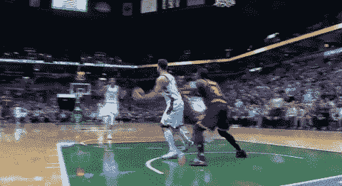

# 一个问题可以统治所有人

> 原文：<https://towardsdatascience.com/one-question-to-rule-them-all-8e0d20301f31?source=collection_archive---------14----------------------->

## 一项评估快速概率思维测试的惊人发现

*这是一篇合作文章，由* [*克里斯托福罗斯 A.*](https://medium.com/u/8ab1b354ea76?source=post_page-----8e0d20301f31--------------------------------) *和* [*斯皮罗斯·多沙迪斯*](https://medium.com/u/7a0e3e502be9?source=post_page-----8e0d20301f31--------------------------------)

## 首先，简单介绍一下背景

很高兴见到你:Christoforos 是帝国学院的荣誉员工，Spiros 是企业家和业余概率学家。我们的一个联合项目是棋类游戏[**Borel—Dice Edition**](https://www.playborel.com/)，这是一个使用概率测验和多面骰子来测试玩家概率判断的游戏。

为了探索人们利用直觉处理概率难题的方式，我们最近制作了一个简短的选择题测试，并在网上传播，有点厚脸皮地称之为 [**概率智商测试**](https://docs.google.com/forms/d/e/1FAIpQLSebSL8RjS5nA6v2jn3swFA8ZbGNEXFhvKecNslO5fhlgGrGQw/viewform?usp=send_form) 。

它由 16 个实验描述组成，有些直接取自我们的棋盘游戏，还有一个关于结果可能性的问题。所以比如其中一个问题是:*掷一个 6 面骰子五次。哪个可能性更大？*

*(a)你至少会掷出一次 2*

*(b)你不会掷出 2*

*(c)大概是 50%-50%*

由于我们只是对测量人们概率直觉的准确性感兴趣，而不是任何种类的数学能力，我们要求受访者每个问题不超过 1 分钟。

由于我们希望探索 Borel 对不同学术背景的人的吸引力，该测试的主要目标是看看正式的数学培训是否对一个人的概率快速思维的准确性有影响。所以在最后我们添加了一个关于回答者的课后正式数学训练的问题(可用的答案是:‘没有正式训练’，‘最多训练 4 年’和‘训练 4 年以上’)。

## **那么，首先，训练对成绩有影响吗？**

让我们首先承认这样一个事实:我们的测试，就像所有的在线民意调查一样，可能会受到选择偏差的影响:回答是自愿的，接触到的受众不是随机选择的，因此不能保证实际参与的人群子集是总体人口的代表性样本。特别是，这里有一个相当明显的选择机制:不喜欢数学谜语的人不太可能做出反应。事实上，平均来说，这类人的表现可能比狂热的业余概率专家更差，因为至少缺乏练习。

此外，我们可以合理地假设，在未受过训练的人群中，任何选择偏差都比受过训练的人群大:受过数学和概率训练的人不太可能对这样的测验产生负面倾向，因此决定他们是否会对测验做出反应的因素与他们在测试中的表现不太可能相关。考虑到这一点，我们来看分析。

训练似乎确实有一个小的积极影响，但这只有在 5 年的训练后才变得显著。鉴于我们上面对选择偏差的讨论，如果我们有一个代表性的样本，我们可能会认为这个影响会更大。然而，我们仍然可以争辩的是，对这门学科的热爱(无论如何足以让你想做一个概率测验)似乎几乎和培训一样有效:分布严重重叠(图 1):30%没有接受过数学培训的受访者比接受过 5 年以上培训的人表现更好，几乎 50%的人比接受过 1-4 年培训的人表现更好。在概率问题上，似乎竞争环境相当公平。

你可能会想，除了训练，还有什么能更好地区分擅长和不擅长这方面的人。在这篇文章的最后，我们为你找到了答案。请继续阅读！

Figure 1 — Performance per years of training

## **一般来说，人们擅长这个吗？**

那么，我们对这类问题有多擅长呢？看一下上面的图，可以发现平均性能约为 50%。这是否意味着我们比随机猜测好不了多少？为了回答这个问题，我们首先需要定义“随机猜测”在这个上下文中的含义。

回想一下，每个问题有三个选项。因此，定义随机猜测的一种方法是随机选择一个答案。这通常会产生 1/3 的平均分数，因此显著低于 50%。除此之外，我们测验中的答案并不总是相互排斥的。举个例子，结果 A 有 52%的可能性发生。在这种情况下，我们将“A 更有可能”和“大约是 50/50”都视为正确答案(我们对此进行了长时间的认真思考，并认为这是直觉测验和正确评估之间的最佳妥协)。

考虑到这一点，随机选择一个答案会给你一个 0.39 的预期分数，这比我们观察到的表现要差得多。

## **因为错误的原因而正确**

有些问题是同一系列问题的不同实例。例如，下面是问题 3 和 10，它们实际上只是一个骰子不同面的问题:

*问题 3* :掷出一个六面骰子。然后滚动一个 10 面骰子。然后滚动一个 30 面骰子。结果会严格按照升序排列吗？

*问题 10* :掷出一个 10 面骰子。然后滚动一个 20 面骰子。然后滚动一个 30 面骰子。结果会严格按照升序排列吗？

想必我们会期望任何给定的回答者在这两个问题上表现得一样好，对吗？完全错了！事实上，在所有可能的问题对中，这一对是最不可能被回答者答对的。很奇怪。

好吧，我们开始吧。首先，请注意，选择这两个答案是为了更有可能出现不同的结果:第一个问题中更有可能出现严格的递增顺序，第二个问题中最不可能出现(公平地说，大约是 50/50)。再加上观察到约 60%的受访者对这两个问题给出了相同的答案，我们可以得出这样的结论:受访者往往会对这个问题形成一种观点，而这种观点实际上对骰子的两面并不敏感。这些回答者有一半时间是对的，但原因是错误的。

它变得更加有趣。对这种现象的一个简单解释是，由于某种认知偏差，受访者倾向于某个答案:例如，人们可能只是倾向于假设最有可能的结果将是严格递增的序列，因为骰子的边数是严格递增的。数据绝对不是这样:在对这两个问题给出相同答案的人中，16%的人认为这两种情况都是 50/50，42%的人认为递增顺序最有可能，42%的人认为最不可能。认为严格增长是这两个问题的正确答案的人与认为严格增长是这两个问题的错误答案的人数量完全相同。只有一个合理的结论:大多数人，面对这个问题的时候，几乎是随便挑一个答案，就坚持下来了！

这一分析也很有趣，因为它展示了认知偏差有时会隐藏得多么好:如果我们只问了这两个问题中的一个，我们就没有办法知道这正在发生。

## 哪个问题最难？

这个结果并不出乎我们的意料:被调查者认为最难正确回答的问题是我们从经验中得知的最有害的问题。是这个:

在一系列连续的硬币投掷中，哪一个序列更有可能在某个时刻首先出现，[正面-反面]或[反面-反面]？

然而，结果是戏剧性的:只有 12%的受访者答对了这个问题。更重要的是，这个问题的答案也高度预测了所有其他问题的表现:答对这个问题的受访者在其余问题上的平均得分为 58%。事实上，这个问题的答案比一个人是否接受过数学培训更能预测整体表现:接受过 5 年以上培训的受访者的平均表现只有 52%。

## **一个统计上的灌篮**

我们发现这个发现如此惊人，以至于我们想对它进行第三次测试(这也是我们想发表这篇文章的原因)。数据没有让人失望。这是一个三步走的过程:

1.如果你知道一个回答者是否答对了这个问题，他们是否接受过数学训练并不能提供额外的预测能力来预测他们在这个测试中的表现。

2.相反，如果一个人知道一个回答者是否受过正式的数学训练，额外知道他们是否答对了这个问题确实提供了额外的预测能力(在二项式回归中的额外效果在 99%的置信水平上显著)。

3.最重要的是，一个人是否答对了这个问题，与他是否接受过统计学培训无关。我们可以在声明下面签名:相关性接近 0。

Giannis knows his probabilities

这三个结果的结合可以被有把握地称为“统计上的成功”。这是统计学家在预测感兴趣的结果时，关于一个指标(在这种情况下，是抛硬币问题的答案)优于另一个指标(在这种情况下，是正规数学训练的存在)的最强有力的声明。所以，尽管还是有点厚脸皮，我们还是准备给招聘人员和人力资源人员以下建议:

如果你在面试一个需要快速概率思维的职位的候选人(什么工作不需要，如果你真的去想？)，不用费心去问他们的学历。漫不经心地把他们长长的简历放进垃圾箱，并问他们一个问题:

*在一系列连续的掷硬币过程中，哪个序列更有可能在某个时刻首先出现，[正面-反面]还是[反面-反面]？*

## 你自己进去

[**试一试**](https://docs.google.com/forms/d/e/1FAIpQLSebSL8RjS5nA6v2jn3swFA8ZbGNEXFhvKecNslO5fhlgGrGQw/viewform) 看看你的概率直觉有多准。你可能还想看看 Borel ，这款棋类游戏开启了这一切。