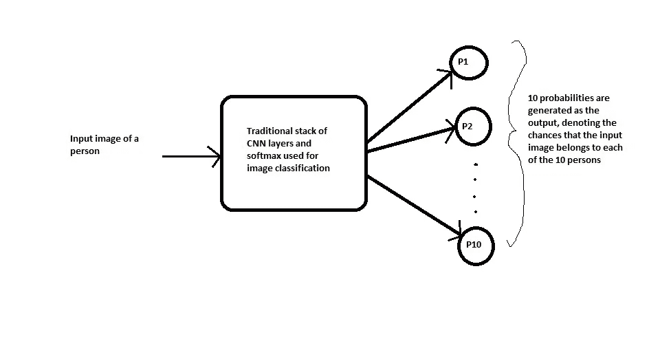
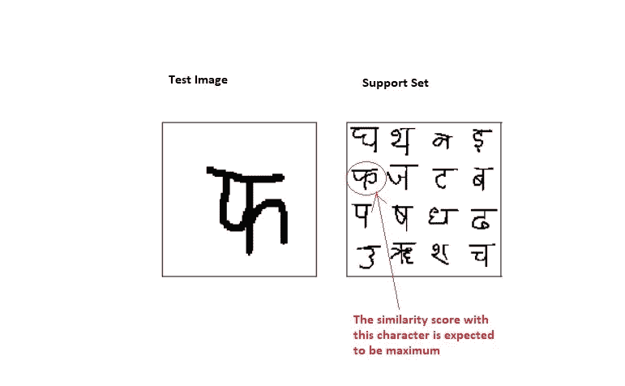

# 使用 Keras 一次性学习暹罗网络

> 原文：<https://towardsdatascience.com/one-shot-learning-with-siamese-networks-using-keras-17f34e75bb3d?source=collection_archive---------0----------------------->

# 目录

1.  介绍
2.  先决条件
3.  分类与一次性学习
4.  应用程序
5.  Omniglot 数据集
6.  加载数据集
7.  将问题映射到二元分类任务
8.  模型架构和培训
9.  验证模型
10.  基线 1 —最近邻模型
11.  基线 2 —随机模型
12.  测试结果和推断
13.  结论
14.  参考

# 1.介绍

深度卷积神经网络已经成为图像分类任务的最先进方法。然而，最大的限制之一是它们需要大量的标记数据。在许多应用程序中，收集这么多数据有时是不可行的。One Shot Learning 旨在解决这个问题。

# 2.先决条件

在这篇文章中，我将假设你已经熟悉机器学习的基础知识，并且在使用 Python 和 Keras 使用卷积神经网络进行图像分类方面有一些经验。

# 3.分类与一次性学习

在**标准分类**的情况下，输入图像被输入到一系列层中，最后在输出端，我们生成所有类别的概率分布(通常使用 Softmax)。例如，如果我们试图将图像分类为猫或狗或马或大象，那么对于每个输入图像，我们生成 4 个概率，指示图像属于 4 个类别中的每一个的概率。这里必须注意两个要点。**首先**，在训练过程中，我们要求每个类(猫、狗、马和大象)的**大**数量的图像。**其次**，如果网络只在上述 4 类图像上进行训练，那么我们就不能指望在任何其他类上进行测试，例如“斑马”。如果我们希望我们的模型也对斑马的图像进行分类，那么我们需要首先获得大量的斑马图像，然后我们必须再次**重新训练**该模型。在有些应用中，我们既没有足够的数据用于每个类，而且类的总数是巨大的，并且是动态变化的。因此，数据收集和定期再培训的成本太高。

另一方面，在**单镜头分类**中，我们只要求每个类有一个训练示例。是的，你说得对，只有一个。因此得名**一枪**。让我们试着用一个真实世界的实际例子来理解。

假设我们要为一个只有 10 名员工的小组织构建人脸识别系统(小数字使事情简单)。使用传统的分类方法，我们可能会得到一个如下所示的系统:



Standard classification using CNN

**问题:**

a)为了训练这样一个系统，我们首先需要组织中 10 个人中每个人的大量**不同的**图像，这可能是不可行的。(想象一下，如果你是为一个有几千名员工的组织做这件事)。

b)如果有新人加入或离开组织怎么办？你需要承受再次收集数据的痛苦，再次重新训练整个模型。这实际上是不可能的，特别是对于几乎每周都在招聘和减员的大型组织。

现在，让我们来了解一下如何使用一次性分类来解决这个问题，一次性分类有助于解决上述两个问题:


One Shot Classification

该网络不是将输入(测试)图像直接分类到组织中的 10 个人中的一个，而是将该人的额外参考图像作为输入，并且将产生相似性分数，该分数表示两个输入图像属于同一个人的可能性。通常，使用 sigmoid 函数将相似性得分压缩在 0 和 1 之间；其中 0 表示没有相似性，1 表示完全相似。0 和 1 之间的任何数字都有相应的解释。

请注意，该网络没有学习将图像直接分类到任何输出类别。相反，它正在学习一个**相似度函数**，该函数将两幅图像作为输入，并表示它们有多相似。

这如何解决我们上面讨论的两个问题？

a)一会儿我们将会看到，为了训练这个网络，你不需要一个类的太多实例，仅仅几个就足以建立一个好的模型。

b)但最大的优势是，假设在人脸识别的情况下，我们有一名新员工加入了组织。现在，为了让网络检测到他的脸，我们只需要一张他的脸的**单个**图像，它将被存储在数据库中。使用该图像作为参考图像，网络将计算呈现给它的任何新实例的相似性。因此我们说网络预测分数在**一杆**。

如果上述细节目前看起来有点抽象，请不要担心，继续前进，我们将解决一个问题的全部细节，我保证你将对主题有深入的理解。

# 4.应用程序

在我们继续之前，我想提一下 one shot learning 的几个应用，以便激发您对了解这项技术产生更浓厚的兴趣。

a.正如我上面已经提到的人脸识别，只需进入这个 [*链接*](https://www.youtube.com/watch?v=wr4rx0Spihs) 人工智能大师吴恩达展示了百度(中国搜索巨头)如何为他们组织的员工开发人脸识别系统。

b.阅读这篇 [*博客*](https://www.microway.com/hpc-tech-tips/one-shot-learning-methods-applied-drug-discovery-deepchem/) 来了解一次性学习是如何应用于数据非常匮乏的药物发现的。

c.在这篇 [*论文*](https://arxiv.org/abs/1707.02131) 中，作者使用一次性学习构建了一个离线签名验证系统，该系统对银行和其他政府以及私人机构非常有用。

# 5.Omniglot 数据集

出于这个博客的目的，我们将使用 Omniglot 数据集，它是来自 50 个不同字母表的 1623 个手绘字符的集合。每个角色只有 20 个例子，每个例子都是由不同的人画的。每个图像都是分辨率为 105x105 的灰度图像。

在我继续之前，我想澄清一下字符和字母表之间的区别。在英语的情况下，集合 A 到 Z 被称为字母表，而每个字母 A、B 等等。叫做人品。因此，我们说英语字母表包含 26 个字符(或字母)。

所以我希望这澄清了我所说的跨越 50 多个不同字母的 1623 个字符。

让我们看一些来自不同字母表的字符图像，以便更好地了解数据集。


Image Source: [https://sorenbouma.github.io/blog/oneshot/](https://sorenbouma.github.io/blog/oneshot/)

因此，我们有 1623 个不同的类(每个字符可以被视为一个单独的类)，每个类只有 20 个图像。显然，如果我们试图使用传统的图像分类方法来解决这个问题，那么我们肯定无法建立一个良好的通用模型。由于每个类别可用的图像数量如此之少，模型很容易会过拟合。

你可以通过克隆这个 [*GitHub 仓库*](https://github.com/brendenlake/omniglot) 来下载数据集。名为“Python”的文件夹包含两个 zip 文件:images_background.zip 和 images_evaluation.zip，解压这两个文件即可。

images_background 文件夹包含来自 30 个字母的字符，并将用于训练模型，而 images_evaluation 文件夹包含来自其他 20 个字母的字符，我们将使用这些字符来测试我们的系统。

解压缩文件后，您将在 images_background 文件夹(用于培训目的)中看到以下文件夹(字母):


Contents of images_background directory

您将在 images_evaluation 文件夹(用于测试目的)中看到以下文件夹(字母):


Contents of images_evaluation directory

请注意，我们将在一组字符上训练系统，然后在训练期间从未使用过的一组完全不同的字符上测试它。这在传统的分类循环中是不可能的。

# 6.加载数据集

首先，我们需要将图像加载到张量中，然后使用这些张量向模型批量提供数据。

我们使用下面的函数将图像加载到张量中:

Code to load images from disk

要按如下方式调用此函数，请按如下方式将火车目录的路径作为参数传递:

```
X,y,c = loadimgs(train_folder)
```

该函数返回一个由 3 个变量组成的元组。我不会遍历代码的每一行，但是我会通过理解它返回的值，给你一些直觉，这个函数到底在做什么。有了这个解释，一旦你完成了它，你就能很好地理解上面的功能。

让我们来理解“X”中呈现的是什么:

```
X.shape
(964, 20, 105, 105)
```

这意味着我们有跨越 30 种不同字母表的 964 个字符(或字母或类别)。对于每个角色，我们有 **20 张**图像，每张图像都是分辨率 **105x105 的灰度图像。**故名形状(964，20，105，105)。

现在让我们了解标签“y”是如何填充的:

```
y.shape
(19280, 1)
```

图像总数= 964 * 20 = 19280。一个字母的所有图像都有相同的标签。，即前 20 个图像的标签为 0，接下来的 20 个图像的标签为 1，依此类推，……最后的 20 个图像的标签为 963。

最后，最后一个变量“c”代表类别，它是一个字典，如下所示:

```
c.keys() # 'c' for categoriesdict_keys(['Alphabet_of_the_Magi', 'Anglo-Saxon_Futhorc', 'Arcadian', 'Armenian', 'Asomtavruli_(Georgian)', 'Balinese', 'Bengali', 'Blackfoot_(Canadian_Aboriginal_Syllabics)', 'Braille', 'Burmese_(Myanmar)', 'Cyrillic', 'Early_Aramaic', 'Futurama', 'Grantha', 'Greek', 'Gujarati', 'Hebrew', 'Inuktitut_(Canadian_Aboriginal_Syllabics)', 'Japanese_(hiragana)', 'Japanese_(katakana)', 'Korean', 'Latin', 'Malay_(Jawi_-_Arabic)', 'Mkhedruli_(Georgian)', 'N_Ko', 'Ojibwe_(Canadian_Aboriginal_Syllabics)', 'Sanskrit', 'Syriac_(Estrangelo)', 'Tagalog', 'Tifinagh'])c['Alphabet_of_the_Magi']
[0, 19]c['Anglo-Saxon_Futhorc']
[20, 48]
```

因为有 30 种不同的字母表，所以这本字典 c 包含 30 个条目。每一项的关键是字母表的名称。每个项目的值是两个数字的列表:[low，high]，其中“low”是该字母表中第一个字符的标签，“high”是该字母表中最后一个字符的标签。

一旦我们加载了训练和测试图像，我们将张量保存在磁盘上的 pickle 文件中，这样我们就可以在以后直接使用它们，而不必再次加载图像。

# 7.将问题映射到二元分类任务

让我们了解如何将这个问题映射到监督学习任务中，其中我们的数据集包含(Xi，易)对，其中“Xi”是输入，“易”是输出。

回想一下，我们系统的输入将是一对图像，输出将是介于 0 和 1 之间的相似性得分。

Xi =一对图像

yi = 1；如果两个图像包含相同的字符

yi = 0；如果两幅图像包含不同的字符

让我们通过可视化下面的数据集来更好地理解:


Sample of 6 data points

因此，我们需要创建成对的图像和目标变量，如上所示，作为输入输入到暹罗网络。请注意，尽管上面显示了来自梵语字母表的字符，但实际上我们将从训练数据中的所有字母表中随机生成对**。**

**生成这些对和目标的代码如下所示:**

**Code to load data in batches**

**我们需要通过传递 batch_size 来调用上面的函数，它将返回“batch_size”数量的图像对及其目标变量。**

**我们将使用下面的生成器函数在网络训练期间批量生成数据。**

# **8.模型架构和培训**

**这段代码是格雷戈里·科赫等人*在这篇 [*研究论文*](https://www.cs.cmu.edu/~rsalakhu/papers/oneshot1.pdf) 中描述的方法的实现。*我使用的模型架构和超参数都如文中所述。**

**在深入细节之前，让我们先从高层次上理解这个架构。下面，我将呈现一个对建筑的直觉。**

****

**A high level architecture**

****直觉**:暹罗这个词的意思是双胞胎。上面显示的两个卷积神经网络不是不同的网络，而是同一网络的两个副本，因此被命名为暹罗网络。基本上它们共享相同的参数。两个输入图像(x1 和 x2)通过 ConvNet，为每个图像(h(x1)和 h(x2))生成一个固定长度的特征向量。假设神经网络模型被适当地训练，我们可以做出如下假设:如果两个输入图像属于同一字符，那么它们的特征向量也一定是相似的，而如果两个输入图像属于不同的字符，那么它们的特征向量也将是不同的。因此，在上述两种情况下，两个特征向量之间的元素方面的绝对差异必定非常不同。因此由输出 sigmoid 层生成的相似性得分在这两种情况下也必须不同。这是暹罗网络背后的中心思想。**

**鉴于上述直觉，让我们看看从研究论文本身获得的更详细的架构图片:**

****

**Image Source: [https://www.cs.cmu.edu/~rsalakhu/papers/oneshot1.pdf](https://www.cs.cmu.edu/~rsalakhu/papers/oneshot1.pdf)**

**以下函数用于创建模型架构:**

**Siamese Model Architecture**

**请注意，Keras 中没有预定义的层来计算两个张量之间的绝对差。我们使用 Keras 中的 Lambda 层来实现这一点，该层用于在 Keras 中添加定制层。**

**要了解在不同层传递的张量的形状，请参考使用 Keras 的 plot_model 实用程序生成的下图。**

****

**Tensor shapes at every level**

**该模型是使用 adam 优化器和二元交叉熵损失函数编译的，如下所示。学习率保持较低，因为发现在高学习率的情况下，模型需要花费大量时间来收敛。然而，这些参数可以被进一步调整以改善当前的设置。**

```
optimizer = Adam(lr = 0.00006)
model.compile(loss="binary_crossentropy",optimizer=optimizer)
```

**该模型被训练了 20000 次迭代，批量大小为 32。**

**在每 200 次迭代后，使用 20 路一次学习进行模型验证，并通过 250 次试验计算精确度。这个概念将在下一节解释。**

# **9.验证模型**

**现在我们已经了解了如何准备用于训练的数据、模型架构和训练；是时候我们必须考虑一个策略来验证和测试我们的模型了。**

**请注意，对于每一对输入图像，我们的模型都会生成一个介于 0 和 1 之间的相似性得分。但是仅仅看分数很难确定模型是否真的能够识别相似的字符并区分不同的字符。**

**一个很好的判断模型的方法是 **N 路一杆学习**。别担心，这比听起来容易多了。**

**4 向一次性学习的示例:**

**我们创建一个包含 4 对图像的数据集，如下所示:**

****

**Example of a 4-way one shot learning**

**基本上，相同的字符与 4 个不同的字符进行比较，其中只有一个字符与原始字符匹配。假设通过进行上述 4 次比较，我们得到了 4 个相似性得分，分别是 S1、S2、S3 和 S4，如图所示。现在，如果模型被适当地训练，我们期望 S1 是所有 4 个相似性分数中最大的，因为第一对图像是唯一一个我们有两个相同字符的图像。**

**因此，如果 S1 恰好是最高分，我们就认为这是一个正确的预测，否则我们就认为这是一个不正确的预测。重复这个过程“k”次，我们可以计算正确预测的百分比如下:**

**percent _ correct =(100 * n _ correct)/k**

**其中 k = >试验总数，n _ correct =次试验中的正确预测数。**

**类似地，9 路单次学习将如下所示:**

****

**Example of a 9-way one shot learning**

**16 向单杆倾斜将如下所示:**

****

**Example of a 16-way one shot learning**

**下面是 25 路一次性学习的样子:**

****

**Example of a 25-way one shot learning**

**注意，N 向一次学习中的“N”的值不一定是完美的正方形。我选择值 4、9、16 和 25 的原因是，当正方形被填满时，它看起来更适合展示。**

**很明显，当重复多次时，较小的“N”值将导致更正确的预测，而较大的“N”值将导致相对不太正确的预测。**

**再次提醒一下:上面显示的所有例子都来自梵文字母表，但是实际上我们将从测试/验证数据集图像的所有字母表中随机生成测试图像和支持集。**

**生成测试图像和支持集的代码如下:**

**Code to generate a test image along with the support set**

# **10.基线 1 —最近邻模型**

**创建简单的基线模型，并将它们的结果与您试图构建的复杂模型进行比较，这始终是一个很好的实践。**

**我们的第一个基线模型是最近邻方法。如果你熟悉 K 近邻算法，那么这也是一样的。**

**如上所述，在 N 路单次学习中，我们将测试图像与 N 个不同的图像进行比较，并选择与测试图像具有最高相似性的图像作为预测。**

**这在直觉上类似于 K=1 的 KNN。让我们详细了解一下这种方法是如何工作的。**

**你可能已经学习了如何计算两个向量之间的 L2 距离(也称为欧几里德距离)。如果你不记得了，下面是怎么做的:**

****

**L2 distance between two vectors**

**假设我们将向量 X 的 L2 距离与其他三个向量 A、B 和 c 进行比较。然后，计算与 X 最相似的向量的一种方法是检查哪个向量与 X 的 L2 距离最小。因为距离与相似度成反比。因此，例如，如果 X 和 B 之间的 L2 距离最小，我们说 X 和 B 之间的相似性最大。**

**然而，在我们的情况下，我们没有矢量，但灰度图像，可以表示为矩阵，而不是矢量。那么我们如何计算矩阵间的 L2 距离呢？**

**这很简单，只要将矩阵展平成向量，然后计算这些向量之间的 L2 距离。例如:**

****

**Computing L2 distance between images**

**因此，在 N 路一次学习中，我们将测试图像的 L2 距离与支持集中的所有图像进行比较。然后我们检查得到最小 L2 距离的字符。如果该字符与测试图像中的字符相同，则预测是正确的，否则预测是不正确的。例如:**

****

**N way Nearest Neighbor Approach**

**类似于 N 路一次学习，我们对多次试验重复这一过程，并计算所有试验的平均预测分数。最近邻方法的代码如下:**

**Code to compute Nearest Neighbors**

# **11.基线 2 —随机模型**

**创建随机预测的随机模型是一种非常常见的技术，以确保我们创建的模型至少比完全随机预测的模型更好。下图总结了它的工作原理:**

****

**N-way Random Approach**

# **12.测试结果和推断**

**对 N = 1，3，5，…进行了 N 向测试。, 19.**

**对于每个 N 向测试，执行 50 次试验，并计算这 50 次试验的平均准确度。**

**以下是 4 种型号之间的对比:**

****

**Test Results**

****推论**:显然，暹罗模型比随机模型和最近邻模型表现得好得多。然而，在训练集和验证集上的结果之间存在一些差距，这表明模型是过拟合的。**

# **13.结论**

**这只是一个初步的解决方案，许多超参数可以调整，以避免过度拟合。此外，通过增加 N 路测试中的“N”值和增加试验次数，可以进行更严格的测试。**

**我希望这有助于你理解使用深度学习的一次性学习方法。**

****源代码**:请在此 查阅我 GitHub 库[上 Jupyter 笔记本中的源代码。](https://github.com/hlamba28/One-Shot-Learning-with-Siamese-Networks.git)**

****注**:模型是用 P4000 GPU 在云上训练的。如果你在 CPU 上训练它，那么你需要非常有耐心。**

**欢迎评论、建议、批评。谢了。**

# **14.参考**

**a.[https://github.com/akshaysharma096/Siamese-Networks](https://github.com/akshaysharma096/Siamese-Networks)**

**b.[https://sorenbouma.github.io/blog/oneshot/](https://sorenbouma.github.io/blog/oneshot/)**

**c.【https://www.cs.cmu.edu/~rsalakhu/papers/oneshot1.pdf 号**

**d.吴恩达在 Coursera 上的 deeplearning.ai 专业化课程**