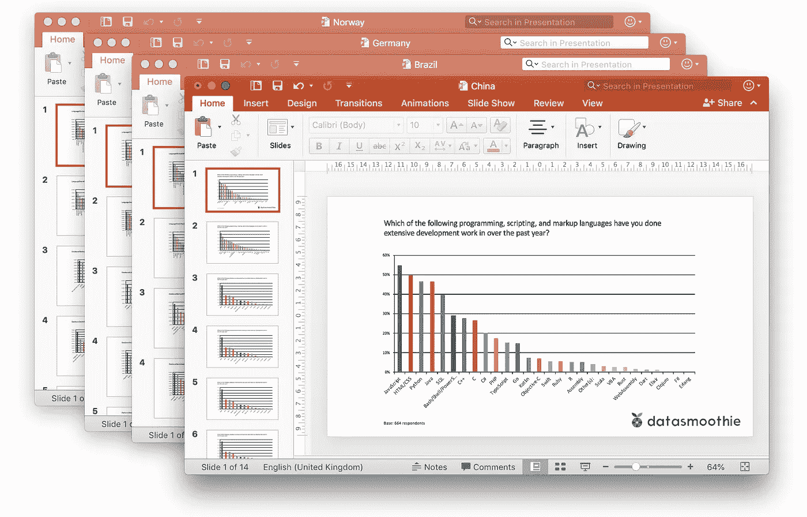
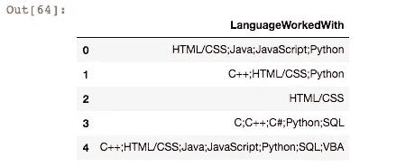
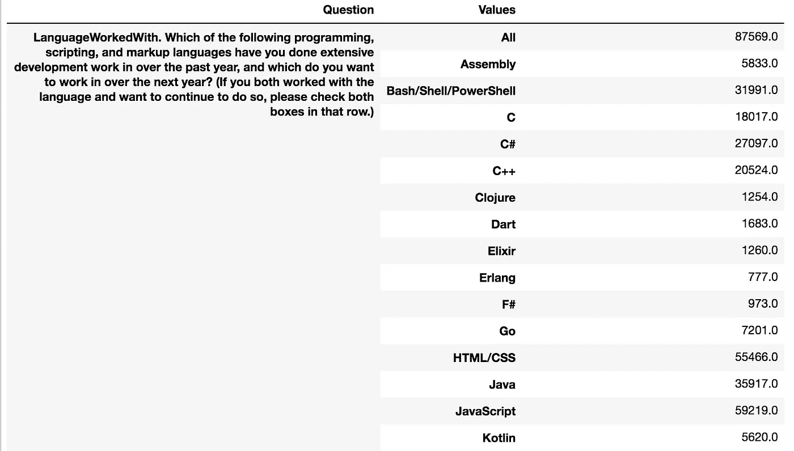
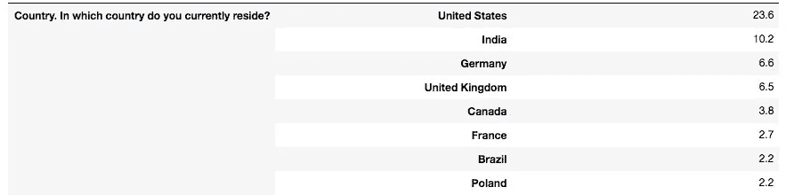
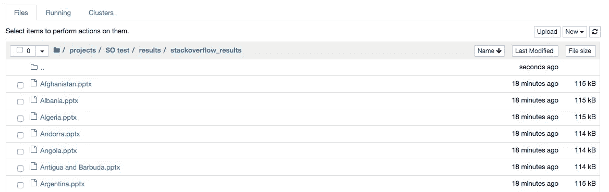
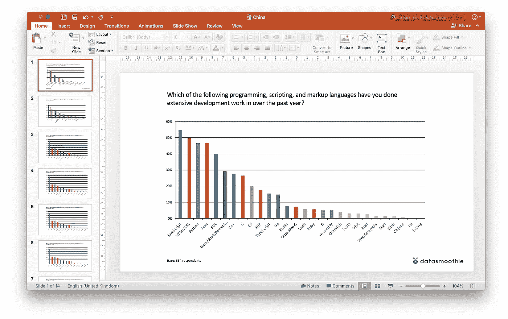

# 10 分钟内完成一项调查、100 张卡片和 1，000 张幻灯片

> 原文：<https://towardsdatascience.com/one-survey-100-decks-and-1-000-slides-in-10-minutes-8fcfd1b246ee?source=collection_archive---------25----------------------->

## 用开源软件自动化调查数据分析-第二部分

整个研究团队在会议室集合。现在是晚上 10 点。咖啡机正在汩汩作响，宣布新的一壶已经煮好了。还有至少四个小时的工作。你知道这一点，因为你以前来过这里；房间里的其他人也一样。

数据处理团队两周前对结果进行了清理、加权和计算——在调查结束后一周，那么为什么我们都在晚上 10 点喝马马虎虎的过滤咖啡呢？

嗯，客户有 20 个部门，每个部门都需要一个单独的幻灯片，上面有他们自己的结果；每组有 30 张幻灯片，大多数幻灯片有两张图表。通过将正确的数据复制并粘贴到正确文档的正确幻灯片中，从表格中手动创建了近 1，000 个图表。

最后，就在你快完成了，隧道尽头出现了曙光，只剩下一点点抽查的时候，那封电子邮件到了。宣布客户顿悟的电子邮件:新定义的年龄细分将以更精细的方式抓住他们的目标受众，请再次运行表格和幻灯片。一个初级研究员在哭吗？

## 在 python 中自动生成 PowerPoint 幻灯片

不需要那样。Python 的一大承诺是它能够自动化枯燥的东西(阿尔·斯威加特的[书](https://automatetheboringstuff.com/)很好地介绍了这个概念)。手动复制/粘贴过程没有实际价值，但存在巨大的风险。在使用开源软件自动进行调查数据分析的第二部分中，我们将向您展示您的团队如何在野外工作完成后立即准备好这 1，000 个图表，最终在不到 10 分钟的时间内，在将近 200 个 PowerPoint 文件中完成 1，000 多个图表。



We’ll create one PowerPoint slideshow for what technologies are used in every single country in the Stackoverflow survey. The results are native Excel charts that can be edited, and the slideshows are based on themes that can be branded at will.

## 我们的数据:Stackoverflow 2019 开发者调查

为了说明工作流，我们将使用 Stackoverflow 2019 开发者调查，该调查查看了大约 90，000 名编码人员的工具和偏好。我们的目标是为参与调查的每个国家正在使用的技术制作一个 PowerPoint 幻灯片。我们将使用 Python 库:pandas、python-pptx 和 Quantipy(专门用于调查数据的库)以及 Jupyter 笔记本。

```
import pandas, quantipy, python-pptx
```

和我们所有的项目一样，我们从一个标准的目录布局开始(在后面的文章中会详细介绍我们的标准化工作流程),在那里我们存储原始的数据文件(我们总是在一个副本上工作，以便有一个干净的引用来返回)。在初始库导入之后，我们有兴趣查看数据中的一个名为`LanguagesWorkedWith`的变量，它看起来像这样:

```
pd.read_csv('./data/original/survey_results_public.csv',
            usecols=['LanguageWorkedWith']).head()
```



受访者可以选择一种以上他们有工作经验的语言。这意味着数据列中不是单个值，而是一个由字符分隔的值列表(分隔集)。在上面的例子中，第一个回答者拥有 HTML/CSS、Java、JavaScript 和 Python 的经验。

将测量数据和模式 CSV 文件转换为 Quantipy 数据和元数据文件格式后，我们可以创建 Quantipy 数据集(数据集是一种 Python 对象，专门用于处理测量数据，允许方便地访问数据以进行分析和探索)。

```
dataset = qp.DataSet(“StackOverflow 2019”)
dataset.read_quantipy(meta=”stackoverflow.json”,
                      data=”stackoverflow.csv”)
```

Quantipy 的便利功能之一是`dataset.crosstab()`，允许我们轻松地检查受访者所说的他们使用的不同技术的结果。

```
dataset.crosstab(‘LanguageWorkedWith’)
```



Almost ninety thousand Stackoverflow users answered what technology they’ve worked with.

这看起来不错:JavaScript 是我们的数据中最受欢迎的，与 Stackoverflow 公布结果时报告的一样。所以，我们继续。

## 179 个国家，每个国家一个 PowerPoint 文件

我们将从查看哪些变量对我们可用开始:因为我们已经决定查看不同国家的人们使用什么技术，我们将添加与语言、数据库、平台、网络框架和各种技术相关的“曾经工作过”和“期望的”变量。

```
variables = ['LanguageWorkedWith',
             'LanguageDesireNextYear',
             'DatabaseWorkedWith',
             'DatabaseDesireNextYear',
             'PlatformWorkedWith',
             'PlatformDesireNextYear',
             'WebFrameWorkedWith',
             'WebFrameDesireNextYear',
             'MiscTechWorkedWith',
             'MiscTechDesireNextYear']
```

我们还做了另一个健全性检查；计算每个国家回复的百分比，并与公布的结果进行比较。这些匹配，所以我们继续。

```
# Sanity check: This matches 
# data from the officially published results.
# The pct parameter means we calculate percentages 
# rather than counts
countries_pct = dataset.crosstab('Country', pct=True)# the index of the resulting dataframe has a list of all countries
# in the data
all_countries = countries_pct.index.get_level_values(1)countries_pct
```



现在我们遍历各个国家，并计算上面定义的`variables`数组中每个变量的结果。

因此，循环变成:

```
countries = {}
for country in all_countries:
    slide_data = []
    for variable in variables:
        # convert country name to relevant code/number
        # and use it to filter the data before running the crosstab
        filter = {'Country':dataset.code_from_label('Country',
                                                    country)}
        result = dataset.crosstab(variable, 
                                  pct=True, 
                                  f=filter)
        slide_data.append()
    countries[country] = slide_data
```

现在我们已经计算了数据，我们编写创建 PowerPoint 文档的最后一个循环:

```
for country in all_countries:
    prs = Presentation('./specs/pptx-template.pptx') for i, var in enumerate(variables):
        title = countries[country][i].index[0][0]
        data = countries[country][i]
        data = data.sort_values(by='@')/100
        chartData = hp.ChartData_from_DataFrame(data)  
        # blank slide
        slide = prs.slides.add_slide(prs.slide_layouts[6])
        x, y, cx, cy = 1524000, 1397000, 6096000, 4064000
        chart = slide.shapes.add_chart(
            XL_CHART_TYPE.BAR_CLUSTERED,
            x, y, cx, cy,
            chartData
        ).chart
        txBox = slide.shapes.add_textbox(x, y-1000000, cx, cy)
        txBox.text_frame.text = title chart.category_axis.tick_labels.font.size = Pt(12)
        chart.value_axis.tick_labels.font.size = Pt(10) folder = "./results/stackoverflow_results/" 
        prs.save("{}/{}.pptx".format(folder, country))
```

pptx 模板文件应该是一个空的演示文稿，并且`slide_layouts`引用将用于插入结果的主幻灯片。在这种情况下，我们使用一个空幻灯片，但我们也可以使用图表占位符来更好地控制。

## 结果呢

我们已经将以上内容整合到一个[笔记本中，发布在 Github](https://github.com/datasmoothie/notebooks/blob/master/One%20survey%20-%201000%20slides.ipynb) 上，当笔记本运行时，我们最终得到了 179 个幻灯片，每个国家一个。每个幻灯片组有 10 张幻灯片，因此您的团队不需要手动生成 1790 张幻灯片。



Navigate into your results folder in Jupyter Notebooks and see the slides you’ve generated for each country.



Above is the first page of the results for China in PowerPoint. The chart is a native Excel chart, not an image, so it can be edited, the chart type changed and so on.

## 进一步自动化

在 Jupyter 笔记本中运行上述内容的好处在于，它可以成为管道的一部分。我们已经写了通过将 Jupyter 笔记本链接在一起来自动化[数据处理管道](/automating-survey-data-analysis-with-open-source-software-f08f000bd672)(准备数据)，在这个系列的下一步将是自动化输出管道。这将包括创建一个所谓的“图表规范”，一个定义应该生成哪些幻灯片的 Excel 文件。一旦一个合适的图表规范准备就绪，它就可以在每次项目启动时自动在数据集上运行。

自动化和进一步抽象上述 PowerPoint 文件的构建将是我们下一篇文章的主题。

盖尔·弗雷松是 [Datasmoothie](https://www.datasmoothie.com) 的联合创始人，这是一个专门从事调查数据分析和可视化的平台。如果你对使用开源软件进行调查数据分析感兴趣，注册我们的时事通讯，名为[自发认知](https://confirmsubscription.com/h/r/123C34C5066BF0AD2540EF23F30FEDED)。