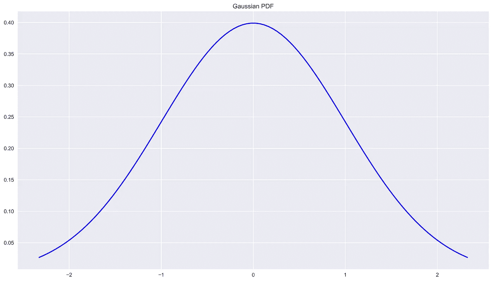
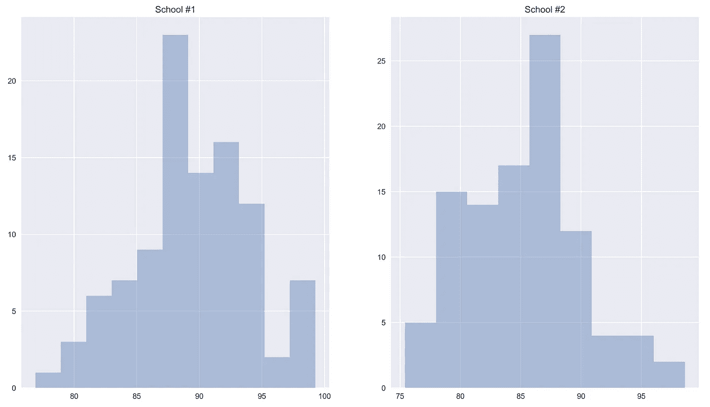

# 单尾还是双尾检验，这是个问题

> 原文：<https://towardsdatascience.com/one-tailed-or-two-tailed-test-that-is-the-question-1283387f631c?source=collection_archive---------6----------------------->


Source: [pixabay](https://pixabay.com/pl/photos/deska-szko%C5%82a-uniwersytet-2853022/)

## 了解统计测试的两种变体之间的区别，以及如何在 Python 中实现它们

在数据科学/计量经济学中我们在很多地方看到统计检验:相关分析、ANOVA、A/B 检验、线性回归结果等。因此，对于实践者来说，彻底理解它们的含义并知道为什么在特定的地方使用给定的测试是非常重要的。在这篇文章中，我想提供一些直觉来选择一个合适的统计检验版本——单尾或双尾——以符合陈述的假设。

进行任何统计检验的关键步骤是选择正确的假设，因为它们不仅决定了应该使用的统计检验的类型，而且还影响了它的版本。



PDF of a Gaussian Distribution

如果考虑的检验统计量是对称分布的，我们可以选择三个备选假设中的一个:

*   x 大于 y
*   x 比 y 小
*   x 不等于 y

前两个对应于单尾检验，而最后一个对应双尾检验。

让我们更深入地研究测试的两种变体之间的差异，并展示一些 Python 中的例子！

# 单尾检验

假设我们选择了 0.05(或 5%)作为显著性水平。使用单尾检验意味着临界区域位于检验统计的概率分布的顶部/底部的 5%。如果检验统计量落入这个区域，我们拒绝零假设。我们有效地测试了一个方向上的关系的可能性(明显更大或更小)，而忽略了另一个方向上的关系的可能性。

单尾检验的一个重要特征是它提供了更多的能力来检测一个方向上的影响，因为它不检测另一个方向。然而，这也带来了一些威胁，我在下面的例子中对此进行了说明。

让我们想象一下，我们制造了一种新药，并想用当前的解决方案来测试它的有效性。我们可能会尝试使用单尾检验，因为它最大化了检测改进的机会(明确指定的效果方向)。但这让我们有可能忽略这样一个事实，即我们的药物实际上不如目前的药物有效。

这个例子表明，当遗漏一个效应的后果可以忽略不计时，我们应该选择单尾检验，而上面的例子并非如此。我们不应该仅仅为了获得统计显著性而选择单尾检验，因为这可能会导致无效的结论，在某些情况下还会导致可怕的后果。


[Source](http://www.fao.org/3/X6831E/X6831E120.gif)

# 双尾检验

在双尾检验的情况下，我们正在检验一个不包含方向关系的假设。如果我们想测试样本均值是否等于 x(t-检验的零假设)，那么另一个选项表明均值不等于 x。为了测试它，我们考虑均值显著大于和显著小于 x 的情况。在 5%的显著性水平下，当检验统计量落入临界区域(检验统计量概率分布的底部和顶部 2.5%)时，样本均值被视为与 x 显著不同。这导致 p 值小于 0.05，表明我们应该拒绝零假设，支持另一个假设。

# Python 中的示例

让我们假设我们正在处理关于学校考试的数据。两所学校的学生写了同样的标准化考试，现在我们想调查平均成绩之间是否有统计学差异。

为简单起见，我们假设每所学校有 100 名学生，考试成绩来自具有不同参数的高斯分布。

## 生成数据



## 单样本 t 检验

在单样本 t 检验中，我们根据特定值检验样本的平均值。我们从检验的双尾变量开始，假设如下:

H_0:来自学校#1 的学生的平均成绩是 70
H_1:来自学校#1 的学生的平均成绩不是 70

```
stats.ttest_1samp(school_1, 70)# Ttest_1sampResult(statistic=42.90122143039788, pvalue=9.063698741097363e-66)
```

测试的 p 值低于 0.05，因此我们可以拒绝零假设，而支持另一个假设。

在第二个测试中，我们检查 2 号学校学生的平均成绩是否大于 90。

H _ 0:2 号学校学生的平均成绩大于等于 90
H _ 1:2 号学校学生的平均成绩小于 90

由于这是一个方向性测试，我们正在做 t 测试的单尾变体。

```
test_2 = stats.ttest_1samp(school_2, 90)# Ttest_1sampResult(statistic=-10.251936967846719, pvalue=3.087893244277984e-17)
```

在`scipy`中，没有直接的方法表明我们想要运行测试的单尾变体。然而，为了获得期望的结果，我们自己调整输出。在这种设置的情况下，我们只需要将 p 值除以 2(测试统计保持不变)。

```
test_2.pvalue / 2# 1.543946622138992e-17
```

有了获得的`p-value < 0.05`,我们有理由拒绝零假设，支持替代方案。

为了彻底起见，我们还运行了测试的最后一个变体。

H _ 0:2 号学校学生的平均成绩小于或等于 90
H _ 1:2 号学校学生的平均成绩大于 90

```
test_3 = stats.ttest_1samp(school_2, 90)
```

我们还需要校正 p 值，这次的方法略有不同:

```
1 - test_3.pvalue / 2# 1.0
```

有了所得的`p-value=1`，我们就没有理由拒绝零假设。校正 p 值的方式取决于我们考虑的另一个假设，它是否涉及“更大”或“更小”的测试。

## 双样本 t 检验

在双样本检验中，我们检验两个样本均值的相等性。

H_0:来自学校#1 的学生的平均成绩与来自学校#2 的平均成绩相同

默认情况下，`stats.ttest_ind`假设总体具有相同的方差(在这种情况下是正确的，请参阅数据生成)。

```
stats.ttest_ind(school_1, school_2)# Ttest_indResult(statistic=6.635596055724986, pvalue=3.0230309820272883e-10)
```

结果表明，我们应该拒绝两个学校平均成绩相等的零假设，这符合我们的预期。

为了保持文章简短，我们只考虑检验的双尾变量，因为单尾计算类似于单样本 t 检验的代码。

# 结论

在这篇文章中，我提出了一些关于统计检验的单尾和双尾变量的直觉。默认情况下，大多数统计软件产生双尾结果。这就是为什么能够将这些结果转换为单尾等价结果也很重要。

如果你喜欢这篇文章的主题，你可能也会对描述[功耗分析](/introduction-to-power-analysis-in-python-e7b748dfa26)的文章感兴趣。

一如既往，我们欢迎任何建设性的反馈。你可以在[推特](https://twitter.com/erykml1)或评论中联系我。文章的代码可以在[这里](https://github.com/erykml/medium_articles/blob/master/Statistics/statistical_tests.ipynb)找到。