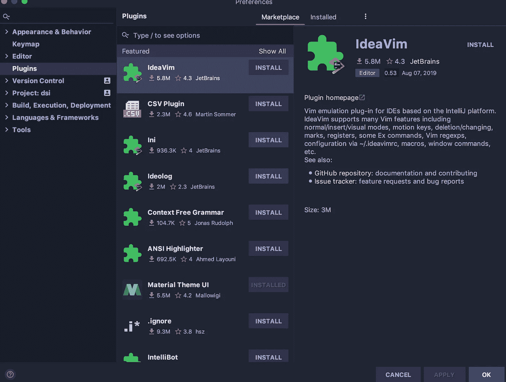
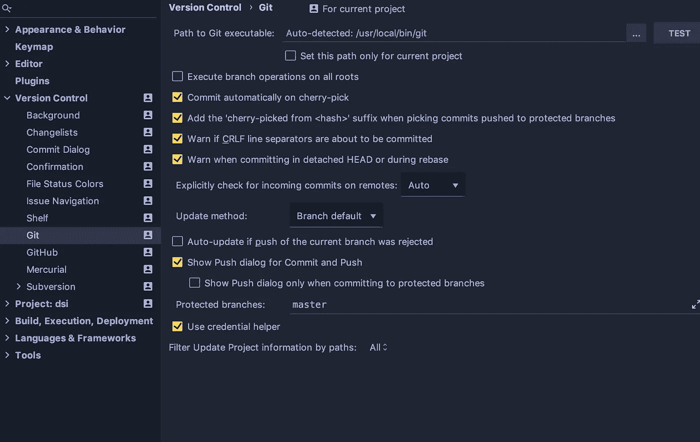
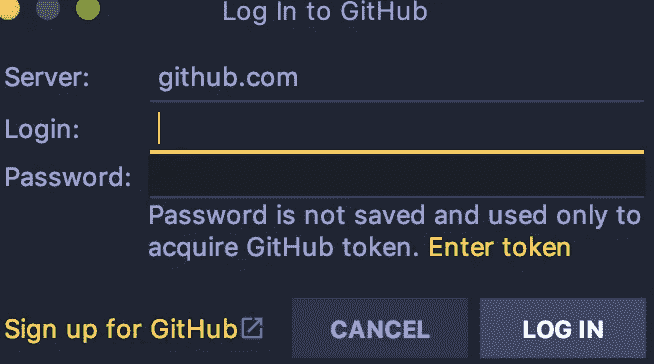
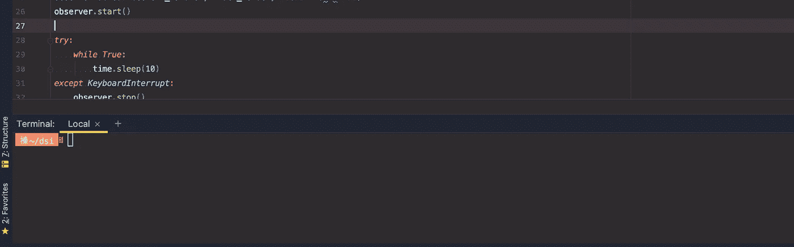

# 一个统治所有人的工具

> 原文：<https://towardsdatascience.com/one-tool-to-rule-them-all-c007b9489424?source=collection_archive---------35----------------------->

Photo by [Randy Fath](https://unsplash.com/@randyfath?utm_source=unsplash&utm_medium=referral&utm_content=creditCopyText) on [Unsplash](https://unsplash.com/search/photos/king?utm_source=unsplash&utm_medium=referral&utm_content=creditCopyText)

如果你和我一样，你会重视用更少的资源做更多的事情——效率。当我还是一名电工时，我会尽量减少所需工具的数量，这样不仅可以减轻重量，还可以充分利用每件工具。数据科学家经常使用终端，移动文件或创建 git 存储库，然后上传到 GitHub。如果一个工具可以自己完成所有这些任务会怎么样？这样的工具是存在的，它叫做 Pycharm。

ycharm 是一个 IDE 或集成开发环境，它很简单，我们可以像程序员一样开发和处理代码。Pycharm 与众不同之处在于它内置了所有功能。本文将介绍 Pycharm 可以帮助我们实现更高效的工作流的几件事情。

Photo by [Alvaro Reyes](https://unsplash.com/@alvaroreyes?utm_source=unsplash&utm_medium=referral&utm_content=creditCopyText) on [Unsplash](https://unsplash.com/search/photos/work-flow?utm_source=unsplash&utm_medium=referral&utm_content=creditCopyText)

首先，Pycharm 使用了 python，但并不局限于只使用 python。支持许多其他语言，如 R、Javascript、CSS、HTML 等等！Pycharm 附带了大多数库，并且可以通过终端或首选项中的插件部分安装其他库。插件这个词对任何编程爱好者来说就像音乐一样，它是新的兔子洞，花了无数个小时才意识到你已经走得太远了，现在不能回来。Pycharm 有一个插件部分，允许你安装更多的语言支持或主题，这样你就可以把它变成你自己的 IDE。这里简单看一下插件部分:首选项>插件。

在 marketplace 选项卡中，您可以找到不同的插件来满足各种需求或定制您自己的用户体验。我鼓励任何使用 Pycharm 的人在这里找到一些东西，并花时间尝试不同的插件设置。

# 版本控制

注意上面截图中写着“版本控制”的地方？每个软件工程师和数据科学家最好的朋友都住在那里——Git。您不仅可以找到使用 Git 的选项，还可以在 Pycharm 中链接 GitHub 并提交所有内容，而无需离开并打开终端。最好的部分是没有插件可以下载，Git 和 GitHub 都是预装的，随时可以工作。

在 version control 选项卡中，可以根据用户的偏好更改 Git 设置。在 Git 标签下，有 GitHub。在这里，只需点击“+”按钮并填写以下信息，即可链接 GitHub 帐户:

可以在 GitHub 上生成一个令牌来使用，我建议走这条路以避免任何安全问题。一旦 GitHub 帐户全部链接起来，并且你已经完成了你的第一个项目，你就可以提交和推送它了。提交并推送到 GitHub 只需要一个键盘快捷键:在 Mac 上，你可以点击`shift+command+k`弹出一个提交窗口，然后点击推，完成！Pycharm 甚至会为文件夹提供不同的颜色，让你直观地看到它们是否是 GitHub 的最新版本。最后，您可以将多个 GitHub 链接到 Pycharm，这样您就可以将您的个人 GitHub 和一个企业链接起来。

# 末端的

Photo by [chuttersnap](https://unsplash.com/@chuttersnap?utm_source=unsplash&utm_medium=referral&utm_content=creditCopyText) on [Unsplash](https://unsplash.com/search/photos/terminal?utm_source=unsplash&utm_medium=referral&utm_content=creditCopyText)

典型地，当我们上传到 GitHub 时，终端是首选的工具。然而，现在我们已经不需要终端了吗？一点也不！Pycharm 有一个内置的终端窗口，所以在 IDE 之间访问和使用终端都在一个地方。如果有的话，终端现在更容易访问，因为不再需要切换窗口，从而减少了完成终端相关任务所需的时间。

上面你可以看到我一直在做的 python 脚本。如果我想测试它，我可以在位于代码部分正下方的终端窗口中运行它。

# 朱皮特

[Source](https://www.analyticsvidhya.com/blog/2018/05/starters-guide-jupyter-notebook/)

ycharm 也可以运行 Jupyter 笔记本电脑，这是无价的，因为它允许我们在运行模型或测试代码的同时处理实际的代码。Pycharm 有这个功能已经有一段时间了，但随着 2019.2 更新到程序，它变得更加可靠和有用，创建了一个更稳定的环境。同样在 2019.2 更新中，增加了“全部运行”功能。我把 Jupyter 笔记本留到了最后，因为它在 Pycharm 的终端中创建了一个本地服务器，所以你现在可以在一个地方托管所有东西，而不必切换或管理两个独立的终端窗口。

# 最后的想法

Pycharm 对任何开发人员来说都是一个很好的工具，它拥有科学家日常需要和使用的所有功能强大的数据。从 HTML 到 SQL，Pycharm 都能做到。我想补充一下，Pycharm 可以在这里下载[。JetBrains 是开发 Pycharm 的公司，提供 30 天的专业级软件试用。有一个社区版，可以使用一些有限的功能，但总的来说本身就是一个了不起的工具。我的生活哲学是拥有合适的工作工具，这在我做电工的时候很重要。拥有一个好的工具不仅对工作流至关重要，对数据科学家个人的发展也至关重要。](https://www.jetbrains.com/pycharm/?fromMenu)