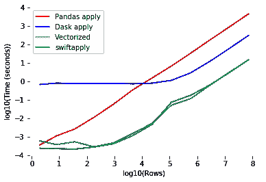

# 一个字的代码停止使用熊猫这么慢

> 原文：<https://towardsdatascience.com/one-word-of-code-to-stop-using-pandas-so-slowly-793e0a81343c?source=collection_archive---------2----------------------->

## 那将永远改变你的生活


Photo by [Lance Anderson](https://unsplash.com/@lanceanderson?utm_source=medium&utm_medium=referral) on [Unsplash](https://unsplash.com?utm_source=medium&utm_medium=referral)

您已经将所有数据加载到 Panda 的数据框架中，准备进行一些探索性分析，但是首先，您需要创建一些附加的要素。很自然地，你转向[应用](https://pandas.pydata.org/pandas-docs/stable/reference/api/pandas.DataFrame.apply.html)功能。Apply 很棒，因为它使得对所有数据行使用函数变得很容易。您设置好一切，运行您的代码，然后…

> 美国驻 T2 大使馆

事实证明，处理一个大型数据集的每一行都需要一段时间。**谢天谢地，有一个非常简单的解决方案可以为您节省大量时间。**

# 下前支索

Swifter 是一个库，它“以最快的方式将任何函数应用到 pandas 数据帧或系列中。”要理解这一点，我们需要先讨论几个原则。

## …向量化…

对于这个用例，我们将把矢量化定义为使用 Numpy 来表示整个数组的计算，而不是它们的元素。

例如，假设您有两个数组:

```
array_1 = np.array([1,2,3,4,5])
array_2 = np.array([6,7,8,9,10])
```

您希望创建一个新数组，它是两个数组的和，结果是:

```
result = [7,9,11,13,15]
```

您可以用 Python 中的 for 循环对这些数组求和，但这非常慢。相反，Numpy 允许您直接在数组上操作，这样速度明显更快(尤其是对于大型数组)

```
result = array_1 + array_2
```

关键的一点是，只要有可能，就要使用矢量化运算。

## 并行处理

几乎所有的计算机都有多个处理器。这意味着你可以很容易地通过利用它们来加速你的代码。由于 apply 只是将一个函数应用于数据帧的每一行，因此很容易实现并行化。您可以将数据帧分成多个数据块，将每个数据块提供给处理器，然后在最后将这些数据块组合成一个数据帧。

# 魔力



Source: [https://github.com/jmcarpenter2/swifter](https://github.com/jmcarpenter2/swifter)

斯威夫特做的是

1.  检查你的函数是否可以矢量化，如果可以，就使用矢量化计算。
2.  如果无法实现矢量化，请检查是使用 [Dask](https://dask.org/) 进行并行处理还是仅使用 vanilla Pandas apply(仅使用单核)最有意义。对于小型数据集，并行处理的开销会使处理速度变慢。

这在上图中得到了很好的展示。您可以看到，无论数据大小如何，使用矢量化几乎总是更好。如果这是不可能的，你可以从 vanilla Pandas 获得最好的速度，直到你的数据足够大。一旦超过大小阈值，并行处理最有意义。

您可以看到“swiftapply”行是 swifter 会做的事情，它会自动为您选择最佳选项。

你怎么利用你问的这种魔力？简单。

如上所示，只需在应用程序前添加更快的调用，现在只需一个单词，您就可以比以往任何时候都更快地运行您的熊猫应用程序。

现在，你可以花更少的时间盯着进度条，花更多的时间做科学。这改变了生活。不过，你可能没那么多时间进行剑战了。


Source: [https://xkcd.com/303/](https://xkcd.com/303/)

[免费获得掌握数据科学的 11 种极其有用的资源](https://datascienceleadership.substack.com/)