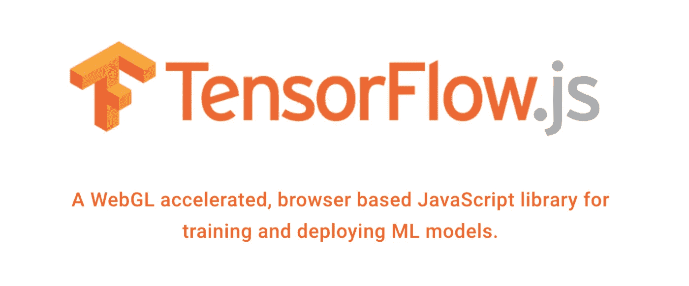
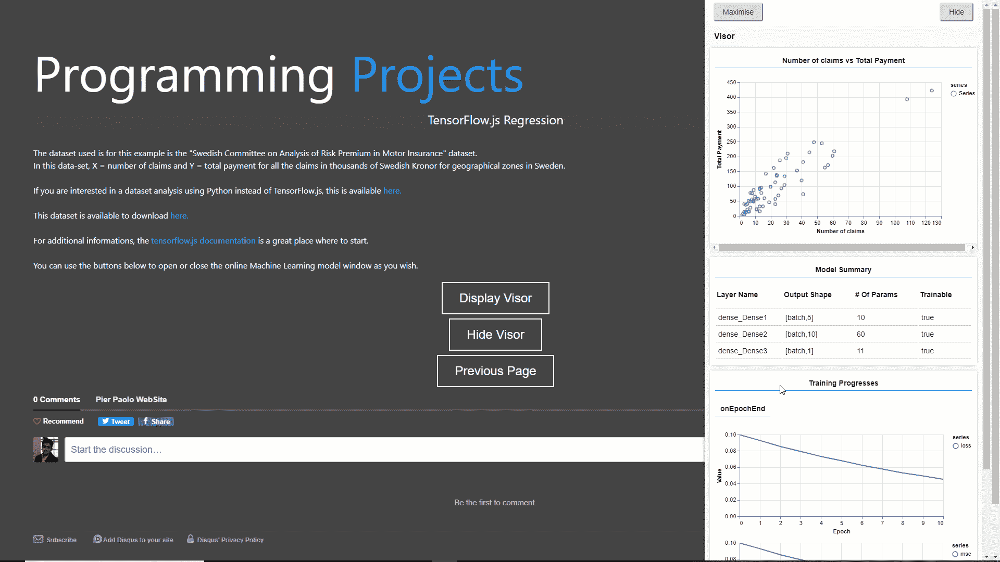
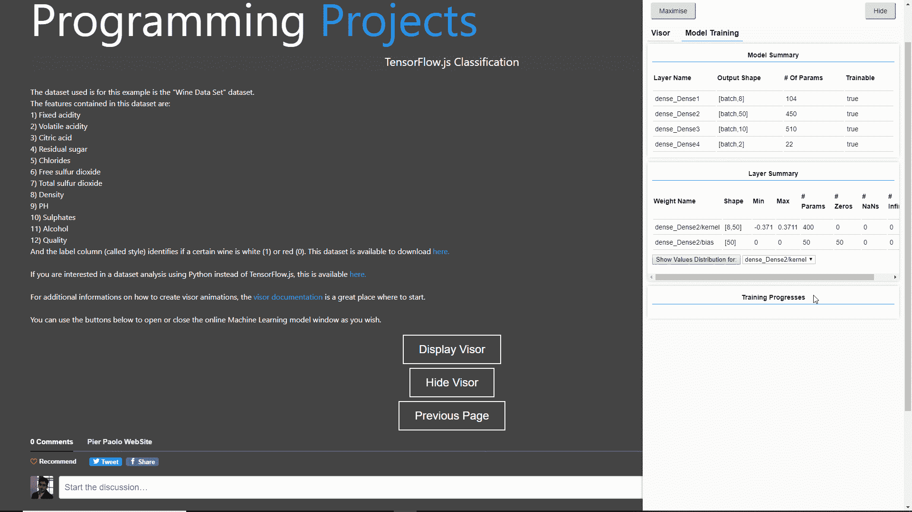
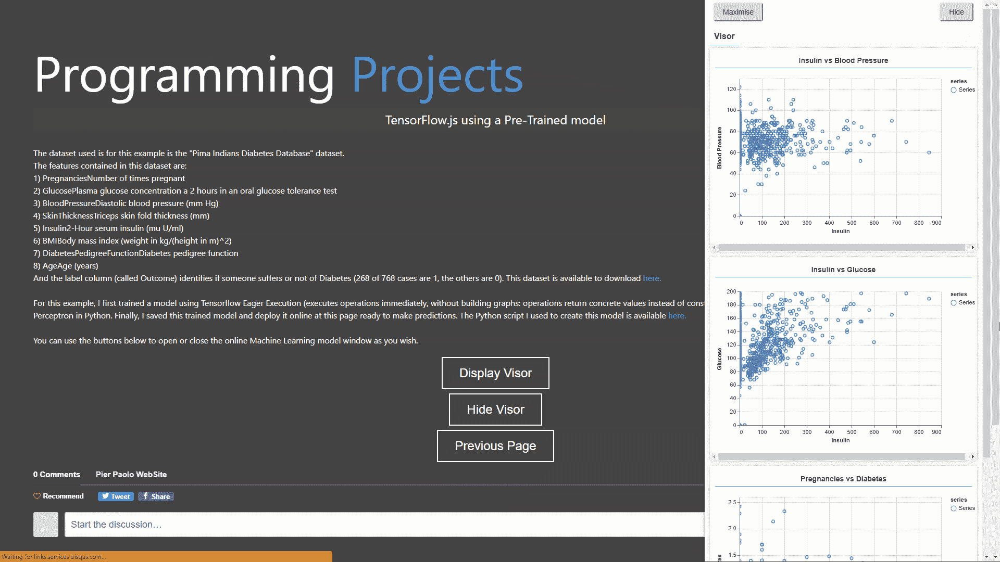
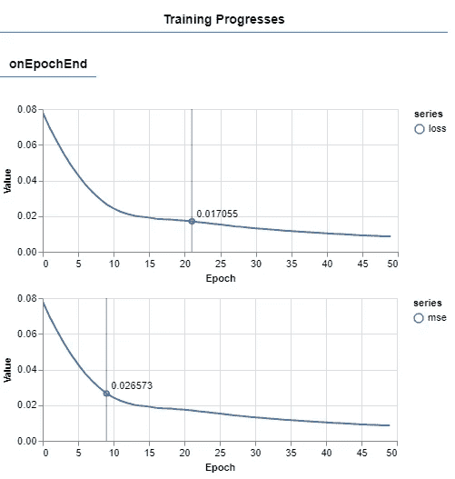
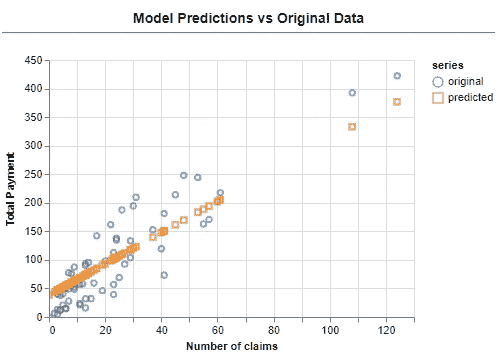
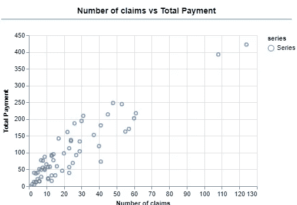

# 使用 Tensorflow.js 进行在线机器学习

> 原文：<https://towardsdatascience.com/online-machine-learning-with-tensorflow-js-2ae232352901?source=collection_archive---------19----------------------->

## 关于如何使用 Tensorflow.js 在浏览器中创建、训练和测试机器学习模型的端到端指南

(Source: [https://miro.medium.com/max/1400/1*F-1fq9TNjDnAYPAXnZP4Ww.png](https://miro.medium.com/max/1400/1*F-1fq9TNjDnAYPAXnZP4Ww.png))

# 介绍

由于最近人工智能的进步，现在建立和训练机器学习模型变得相对容易。虽然，这些模型只有通过分享它们，让它们做好在线预测的准备，才能让社会受益。

在我之前的一篇文章中，我解释了如何使用 [Heroku 和 Flask](/flask-and-heroku-for-online-machine-learning-deployment-425beb54a274) 创建和部署一个简单的机器学习模型，今天我将为您提供另一个选项:Tensorflow.js。

Tensorflow.js 是 Google 创建的 Javascript 库，用于将机器学习能力嵌入到任何形式的 web 应用程序中。

为了添加一些浏览器内可视化，Tensorflow.js 使用了一个名为 *tfjs-vis 的小库。*这个库可以用来创建一个侧面板，所有的内容都可以在上面显示。

除此之外，谷歌还开发了另一个名为 *ml5.js* 的库，旨在使在线部署预训练模型变得非常容易。这样，非专业人员也可以开始在网络上部署机器学习模型。一个简单的例子，如何使用谷歌 PoseNet 预训练模型是可用的[这里](https://pierpaolo28.github.io/Projects/ml5.js/ml5intro.html)。

有 3 种主要类型的模型可以在线部署:

1.  **回归模型**

在这个例子(GIF 1)中，我决定使用[“瑞典汽车保险风险溢价分析委员会”数据集](https://college.cengage.com/mathematics/brase/understandable_statistics/7e/students/datasets/slr/frames/frame.html)来训练和可视化一个简单的回归模型。打开网页后，培训过程将实时在线进行。

GIF 1: Training and Visualizing online a Regression Model

2.**分类模型**

在这个例子(GIF 2)中，我决定使用[“葡萄酒数据集”来训练一个分类模型。](https://www.kaggle.com/sgus1318/winedata)在这种情况下，培训过程也是实时在线进行的。此外，还提供了所用神经网络层特征的总结和分类矩阵。

GIF 2: Training and Visualizing online a Classification Model

3.**预训练模型**

最后，在这个例子(GIF 3)中，我决定使用一个预先训练好的模型。我首先使用[“Pima Indians Diabetes Database”](https://www.kaggle.com/uciml/pima-indians-diabetes-database)用 Python 训练了这个模型，将其保存为 JSON 文件，最后将其部署到网上，准备进行预测。

GIF 3: Making Predictions and Visualizing online using a Pre-Trained Model

这三个例子都可以在我的[个人网站](https://pierpaolo28.github.io/Projects/tensorflow.js/tensorjs.html)上找到，如果你有兴趣测试一下的话。

在本文中，我将带您了解如何实现这三个示例中的第一个。

所有用于创建这些例子的代码和数据集都可以在我的 [GitHub 库](https://github.com/pierpaolo28/Artificial-Intelligence-Projects/tree/master/Google%20AI%20tools/tensorflow.js)中找到。

# 示范

对于这个例子，我将使用这个[“瑞典汽车保险风险溢价分析委员会”数据集](https://raw.githubusercontent.com/pierpaolo28/Artificial-Intelligence-Projects/master/Google%20AI%20tools/tensorflow.js/swedish.json)。这个简单的数据集仅由两列组成(X =索赔数量，Y =瑞典地理区域内所有索赔的总支付额，单位为千瑞典克朗)。

作为演示的一部分，我们将通过检查索赔分布的总数来预测所有索赔的总支付额。

## 设置

首先，我们需要创建一个 HTML 页面来显示我们的内容。下面的代码片段提供了一个基本的模板，您可以随意添加任何您想要的功能！

## 预处理

我们现在可以创建另一个名为 *script.js* 的文件(在我们的 HTML 文件的同一个目录中)，在这里我们可以开始加载数据集并执行一些基本的预处理任务。

为了从 JSON 文件加载数据集，我们可以使用下面的函数( *getData* )。在这个函数中，我们首先加载数据集，然后选择我们感兴趣的列，并给它们取一个用户友好的名称。最后，使用一个过滤函数，我们去掉所有出现在所选列中的 nan(不是一个数字)。

接下来，我们可以创建一个函数来预处理我们的数据集( *convertToTensor* )。在这种情况下，我们:

1.  **混洗数据** =随机化样本的顺序，这些样本稍后将用于训练我们的回归模型。通过这种方式，与原始数据分布相比，我们可以为我们的模型提供更多种类的数据(这是因为当输入模型时，我们的训练数据将被连续划分为更小的子集，称为批次)。
2.  **将数据分为特征和标签** =特征将是我们的输入样本，标签将是我们的真实输出值(基本事实)。
3.  **以张量形式转换特征和标签** =我们将原始数组转换成二维张量。
4.  **标准化输出张量** =将我们的数据重新调整到 0 到 1 之间的范围。这样做是为了防止训练模型中出现过大或过小的值(上溢/下溢)的问题。一旦训练了我们的模型，我们就可以反规格化我们的输出来获得我们的最终结果。

## 定义和训练我们的模型

我们现在可以继续设计一个简单的机器学习模型( *createModel* )，然后创建一个函数来训练它( *trianModel* )。

在这种情况下，我利用回调来调用 Tensorflow.js 图形支持库 *tfjs-vis* ，以便创建一个实时图形，显示我们的模型损失在训练期间是如何变化的(图 1)。如果你有兴趣更详细地了解回调是如何工作的，我在本文[中提供了更详细的解释。](/deep-learning-analysis-using-large-model-support-3a67a919255)

Figure 1: Real-Time model Loss

## 测试

现在我们的模型已经训练好了，我们可以开始做预测了。为此，我设计了下面的函数( *testModel* )。在这个简单的例子中，我决定使用训练数据本身来测试我们的模型性能。

此外，我还对我们的模型预测进行了反规范化，然后将它们与真实输出进行了对比，以便检查我们的模型性能(图 2)。

Figure 2: Model Predictions vs Original Data

## 运行模型

最后，我们现在需要创建一个函数来运行所有代码(*运行*)。在这个函数中，我们首先执行一些数据可视化，然后调用我们之前定义的所有函数(图 3)。

Figure 3: Scatterplot of the original data

现在，您可以通过在自己的网站上运行或使用本地服务器来测试您的模型。如果您从未使用过本地服务器，一个简单的解决方案是使用 [Visual Studio 代码](https://visualstudio.microsoft.com/)并安装其 [Live 服务器扩展](https://marketplace.visualstudio.com/items?itemName=negokaz.live-server-preview)。

# 联系人

如果你想了解我最新的文章和项目[请关注我的媒体](https://medium.com/@pierpaoloippolito28?source=post_page---------------------------)并订阅我的[邮件列表](http://eepurl.com/gwO-Dr?source=post_page---------------------------)。以下是我的一些联系人详细信息:

*   [领英](https://uk.linkedin.com/in/pier-paolo-ippolito-202917146?source=post_page---------------------------)
*   [个人博客](https://pierpaolo28.github.io/blog/?source=post_page---------------------------)
*   [个人网站](https://pierpaolo28.github.io/?source=post_page---------------------------)
*   [中型简介](https://towardsdatascience.com/@pierpaoloippolito28?source=post_page---------------------------)
*   [GitHub](https://github.com/pierpaolo28?source=post_page---------------------------)
*   [卡格尔](https://www.kaggle.com/pierpaolo28?source=post_page---------------------------)