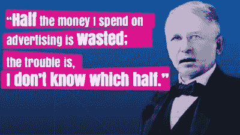
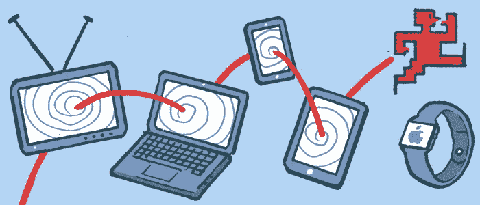
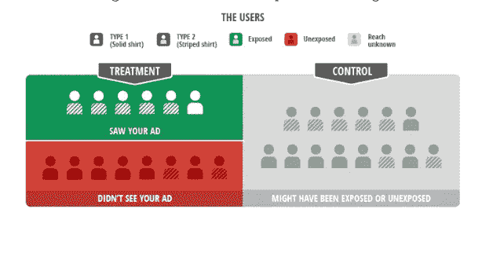
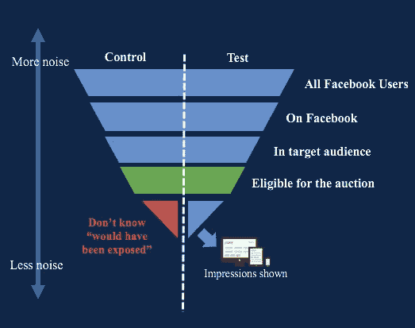
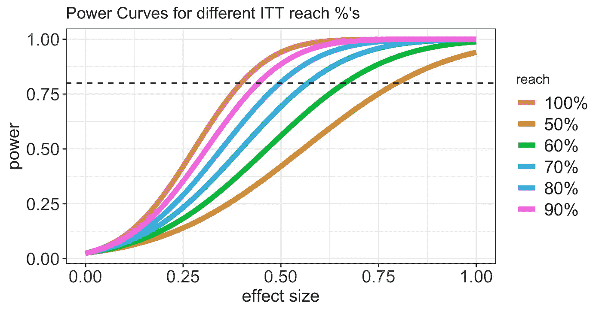
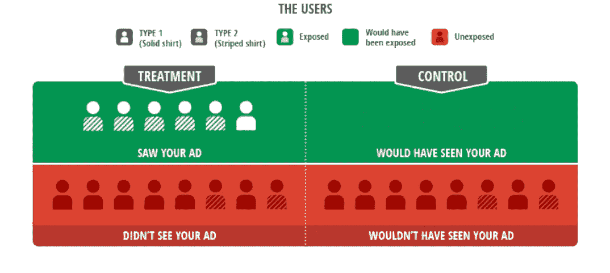

# 网络营销测量:哪一半？

> 原文：<https://towardsdatascience.com/online-marketing-measurement-which-half-ce7ef3f26b7e?source=collection_archive---------34----------------------->

John Wanamaker (1838–1922)

广告在今天的互联网上一直存在。他们支持谷歌和脸书，并跟随我们到任何地方。与所有营销支出一样，它们是一种投资。与大多数投资一样，衡量投资回报至关重要。

使在线营销与众不同的是建立精确测量工具的前所未有的可能性。

在这篇文章中，我将描述一些在行业中广泛使用的技术，并分享我在构建 Airbnb 的展示营销测量框架时获得的一些经验。

# 归因和增量

为了公平地估计 roa(广告支出的回报),我们需要能够将增量购买归因于引起它们的活动。我们对接触有机购买的人群不感兴趣(例如，自己购买)，而是接触不打算购买的人群，并通过我们的广告说服他们。两者之间的区别是相关性和因果性之间的区别，并且可以被目标机制所利用。如果我们不区分有机购买和增量购买，定位算法将因描述和定位更有可能购买的用户而获得奖励，这将是“向唱诗班布道”。

我们希望从我们的在线活动中接触到那些被说服的人，并说服他们购买我们的产品。

这有点微妙，因为特别是像旅游住宿这样的商品，我们可能需要多个接触点来与用户建立关系，并慢慢地将他们转移到漏斗中。

不幸的是，老学校的归属系统依赖于臭名昭著的“最后点击”:即在购买获得信用之前最后点击的广告。

这是有问题的，因为它没有区分增量销售和有机销售，但它也有较大的偏差。

美国和欧洲的大多数用户拥有多种设备，并通过桌面、移动和标签登录。这使得跟踪用户旅程变得很有挑战性。Cookies 被删除和多个用户从同一设备登录只是构建和维护设备图的两个问题，设备图可以帮助识别用户已经接触了哪些广告。

由于这个问题，展示渠道(如脸书、Instagram、YouTube 等。)与漏斗中较低的渠道(如 SEM(搜索引擎营销))相比，过于不利。

在“最后一次点击”的世界中，SEM 营销获得了很大份额的信任，这也是因为用户很可能通过谷歌相关关键词被重定向到该网站，这应被视为一种有机(即非增量)购买。

为了理解“最后一次点击”的归因是多么荒谬，想象一下向你的另一半求婚，如果有理由相信订婚戒指是他们积极回应的唯一贡献者。

幸运的是，统计学家有很多锦囊妙计，可以追溯到几个世纪前的许多实验设计可以拯救我们。

# 实验和测量

如上所述，测量增量的问题恰恰是相关性与因果性的问题:我们想要识别我们引起的购买，而不是将我们的广告与用户的购买倾向相关联。

主要的挑战是尽可能地将目标从用户的动作中分离出来，这在这些复杂的环境中并不容易。

在控制大多数已知因素的同时，实验是精确测量因果关系的最佳工具。

实验的设计将取决于广告平台的性质:在最受欢迎的选项下面。

# 意向治疗(ITT)

我要描述的第一种方法是临床试验领域的一种非常古老的技术，也是脸书的[转换提升研究](https://www.facebook.com/help/399737743699353?helpref=page_content)工具中使用的方法之一。

当试图确定目标算法的效果时，我们无法将算法选择的受众与固定的控制进行比较。这将奖励樱桃采摘:如果算法被训练来选择有机转换器(即无论如何都要购买的用户)，我们将高估算法的性能，混淆有机行为(相关性)和增量效应(因果关系)。

意向性治疗(ITT)是一种分析实验的技术，其中存在单方面的非依从性，即当治疗组中的一些受试者没有接受治疗时。将非服用者排除在分析之外会导致选择偏差，但忽略这个问题并假装治疗组中的所有受试者都是平等的会低估效果或只是测量不同的东西(即被分配到治疗组的效果而不是治疗本身的效果)。

ITT 原则可以用“一次随机，永远分析”来概括。 [ICH](https://www.ich.org/) 声明“意向性治疗原则意味着主要分析应包括所有随机受试者。遵循这一原则需要对所有随机受试者进行完整的随访，以了解研究结果。在实践中，这一理想可能难以实现[……]”。该建议的理由是，即使数据缺失(不符合)不是完全随机的，ITT 分析也会给出稳健的估计。这将涵盖不遵从治疗的或多或少严重的患者的临床情况，或者，在我们的营销案例中，用户是由算法精心挑选的。

一般来说，当试图测量绝对增量(或提升)时，我们可以问以下问题:

1.  向 100 个人展示一个广告会带来多少额外的销售额。
2.  100 个人看到这个广告会带来多少额外的销售额。

ITT 不仅不受缺乏合规性的影响，而且可以衡量什么是可操作的(选项 1)，而且在很少假设的情况下，它允许我们衡量两者。

[ITT Design](https://www.thinkwithgoogle.com/intl/en-gb/marketing-resources/data-measurement/a-revolution-in-measuring-ad-effectiveness/)

上图把设定解释的相当清楚。条纹衬衫代表高意向用户，他们必然会有机转化。在玩具示例中:

*   治疗是中性的。暴露后转化的概率与有机率相同，为 50%
*   覆盖率(即接受治疗的治疗使用者的百分比)为 42%
*   该算法以高意向用户为目标，这些用户无论如何都会转化，因此治疗中有 83%的用户会转化。
*   由于有偏见的目标，只有 25%的从未服用者(即治疗组中没有得到治疗的使用者)转变了。
*   如果我们不是以 ITT 的方式来分析，我们会得出这样的结论:增量转换率是 33%

脸书的提升测试工具使用 ITT 分析来测量增量。由于目标算法针对更有可能转化的人进行了优化，因此很难找到类似的控制(这实际上非常容易，但需要改变目标算法，类似于谷歌的幽灵广告。)

治疗和控制之间的分离发生在“整体”水平(即，受众中的所有用户都有资格进行拍卖)，然后广告被显示给治疗组中的一部分人。维持组和测试组的拍卖资格都有记录，印象也是如此，但接触过广告的控制用户的子集没有记录(下图中的红色三角形)。

Facebook Lift Study

ITT 设计很容易实现，通过一些简单的数学计算，我们可以从“向 100 个人展示一个广告会带来多少额外的销售额”到“100 个人看到这个广告会带来多少额外的销售额”。后者等于第一次缩放(除以)的范围。

这种设计的缺点是低覆盖范围会大大减弱信号，因此在计算功率时需要考虑覆盖范围。

Power curves at sample size 200

由于这一事实，ITT 不太适合广泛接触运动:这种倡议假设接触广泛受众中少数有前途的个人，因此它们本质上是为低接触而设计的，最终动力不足。

在下一节中，我们将描述另一个可以解决这个问题的设计。

# “幽灵”广告

如前一节所述，当目标算法优化了谁被派发广告的选择时，就很难确定适当的控制。

ITT 设计在分配水平上比较各组，但这有局限性，因为当治疗组的 reach 百分比较低时，估计可能具有较高的不确定性，这可能导致信号减弱。

这个问题的另一个流行解决方案是[预测幽灵广告](https://papers.ssrn.com/sol3/papers.cfm?abstract_id=2620078)。这种方法首先由谷歌开发，用于精确测量他们的显示广告，包括使用与定向相同的算法来识别对照组中“会被提供”广告的用户，并将他们作为治疗组中实际提供广告的可比组。

[Ideal Experimental Setting](https://www.thinkwithgoogle.com/intl/en-gb/marketing-resources/data-measurement/a-revolution-in-measuring-ad-effectiveness/)

这是一个理想的设置，因为我们将使用相同的标准来选择治疗组和对照组，然而，这可能是复杂的和难以实现的，特别是在更复杂的广告定位系统中，

在第三代系统中，优化程序将使用从站点访问中提取的特征，并将学习更多关于治疗组中的用户的信息，这可能会引入偏差，因为相同的学习对于对照组中的用户是不可能的。对照组最终会成为第一次接触的目标用户的代表，但他们对第一个广告的反应的任何信息都只能在治疗组中获得，这引入了潜在的偏见。然而，第二代系统只使用用户特性，因此尽可能保持两个组的同质性。

GDN 定位算法属于第二代家族，它可以轻松利用 Ghost Ads 框架。然而，脸书的目标更先进，这就是为什么它必须依靠某种形式的 ITT。

这非常难以实现，但是在混合 Ghost-ITT 设计中，将机会记录减少到第一次接触将是增加范围的一个很好的折衷。

# “分割”测试

当然，即使在这种情况下，经典的 AB 测试也有其用途。分割测试是设计用来测量一个活动的某些特征的相对增量的实验。**绝对增量**是投放广告的因果效应，**相对增量**是一个版本的广告相对于另一个版本的附加值。

此工具对于快速迭代复制更改、图像、设计等非常有用。虽然这种测试很容易启动，但可能很难衡量即时的变化(由于购买的延迟)。

# 地理层面的实验

所有这些技术都假定在广告管理中有高度的控制。这就是为什么他们嵌入了供应商(脸书、谷歌等)的生态系统。).他们的成功基于个体靶向性，确保治疗臂之间无溢出和分离。

然而，有许多广告渠道不能给予这种程度的控制。例子包括:

*   广播/电视/户外广告
*   长期影响(即使使用当前的工具，也难以长期对用户进行分组)

由于我们无法控制单个单位的分配，在这种情况下，我们根据位置分配我们的支出。由于用户只能在特定时间处于特定地理位置，根据他们的移动性，我们可以控制谁是特定活动的目标，谁不是。

这可以通过选择几个城市、州或指定的市场区域(DMA)作为目标，而将其他几个安静的区域作为对照来实现。这显然是一个大规模的操作，意味着内部协调，并在由于控制区域和对 roa 的理解而导致的销售损失之间进行权衡。

DMA’s in the USA

我不会在这里深入讨论如何分析这些类型的实验。像差异中的差异(非常类似于谷歌的[基于时间的回归](http://www.unofficialgoogledatascience.com/2016/06/estimating-causal-effects-using-geo.html))这样的技术很容易实现，但往往不可靠。[合成控制](https://www.summitllc.us/synthetic-control-method)(如谷歌的[因果影响](https://google.github.io/CausalImpact/CausalImpact.html)包)类型的技术更灵活，允许更高的功率和更强的推理。

# 数据中心方法

这篇文章给出了一个营销测量的鸟瞰图，并描述了一些重要的技术。

还有一些我没有涉及到的领域，但是同样重要。努力像建立一个可靠的自下而上的多接触归因模型(MTA 又名数字营销的圣杯)或混合媒体模型(嗯，自上而下的方法来决定在哪里花下一个营销美元)。

建立数据驱动的数字营销团队的关键是培养数据文化。尽管数据科学家对测量技术有着深刻的理解，但市场营销人员对数据有着最佳的感觉，并且在获得访问权限和培训后，能够扩展测量工作。对数据的更多关注也将有助于提高数据质量，因为停机将被更早地报告。

允许营销人员将他们的营销活动作为实验，并赋予他们对统计测试的理解，将允许更好的假设得到检验，更快地失败并采用新的知识。

这最终可以总结为一种“衡量它或根本不做它”的文化，在这种文化中，只有当投资回报是可衡量的时，美元才会被花掉，而这只能通过衡量工具的民主化来实现。

选择权在你…

# 词汇表

*   **DMA** =指定市场区域
*   SEM =搜索引擎营销。搜索引擎搜索顶部的赞助广告。
*   **SEO** =搜索引擎优化。
*   **ROAS** =广告支出的回报
*   **MTA** =多点触摸属性。
*   **MMM** =混合媒体模型。
*   **ITT** =意图治疗
*   **吃了** =治疗效果一般

*原载于 2019 年 11 月 10 日*[*http://mrpozzi . github . io*](http://mrpozzi.github.io/2019/11/10/which-half/)*。*