# 在线扑克——何时赚钱？

> 原文：<https://towardsdatascience.com/online-poker-whens-the-money-a22fe3fa7a6?source=collection_archive---------10----------------------->

## 玩的最佳时间和它的价值

Photo by [Michał Parzuchowski](https://unsplash.com/@mparzuchowski?utm_source=medium&utm_medium=referral) on [Unsplash](https://unsplash.com?utm_source=medium&utm_medium=referral)

当扑克玩家在线分享牌局进行策略讨论时，他们会将自己标记为英雄，将对手标记为恶棍。无论这是为了隐藏他们的身份还是他们的对手，这种随意的行话揭示了一个关于扑克的基本真理-这是每个玩家与世界的对抗，如果你需要一个英雄，不要看得太远，因为没有人会来救你。

这就是我过去十年生活的现实。作为一名职业扑克玩家，我专注于两人对决锦标赛(常规德州扑克，但只有两名玩家)，我经常发现自己陷入旷日持久的在线领地之争。我交过朋友，但它们通常只有在互利的情况下才会持续，这通常相当于“我们都很好，我们不玩对方如何？”

这个世界是我的第二天性，但有时很难用语言来表达。因此，为了描绘一幅更清晰的画面，我将数据科学工作流应用于一年的游戏摘要样本(大约 200，000 份，超过 14，000 名不同玩家，全部来自一个买入级别)，主要目标是回答问题“职业玩家玩游戏的最佳(最赚钱)时间是什么时候？”本文着眼于该分析的一些过程和结论。

# 数据争论

第一步是争论我的数据。为了做到这一点，我获取了游戏摘要数据，并将其子集化为每个唯一的玩家，使用来自每个子集表的聚合玩家结果来填充玩家结果表。游戏计数表是通过每小时对时间序列进行重新采样获得的，每小时计数一次。

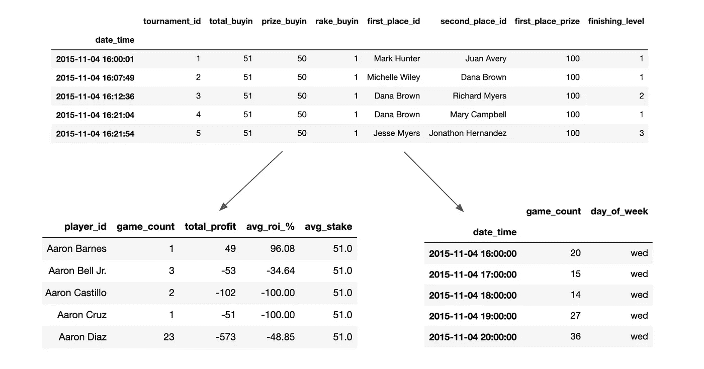

# 时间序列 EDA

将确定最有利可图的游戏时间作为我的主要目标，并假设这将与每小时的游戏数相关，我首先对每小时的游戏时间序列进行了一些 EDA(探索性数据分析)。有几件事很突出:

## 工作日的客流量比周末高

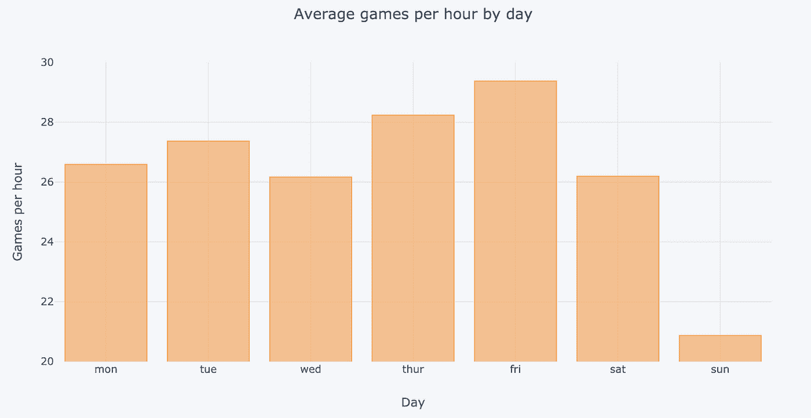

工作日的平均流量高于周末，这可能会让最有经验的玩家感到惊讶。

## 数据中有空白

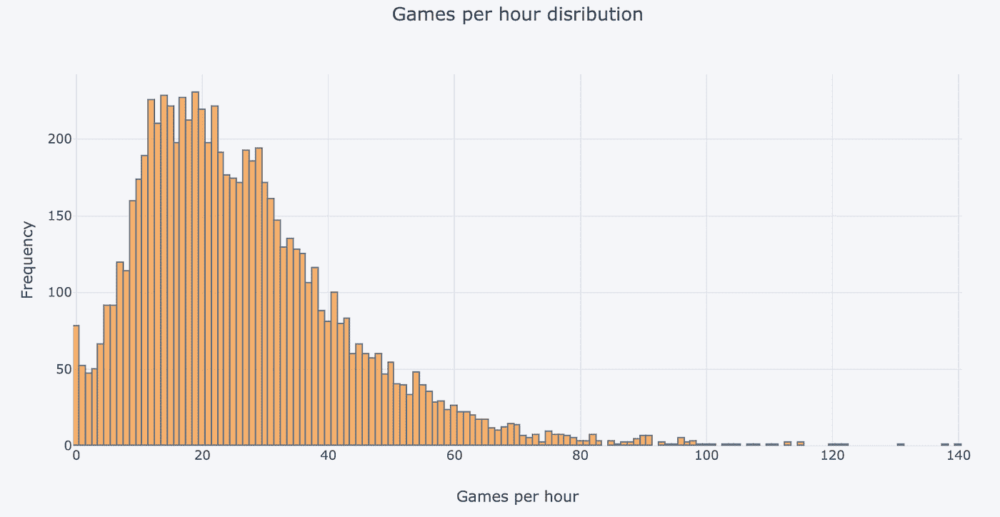

从频率分布来看，每小时 0 场比赛似乎在数据中被夸大了。在这种情况下，我已经知道数据中有一些漏洞，但通过这个视图，我对这些漏洞的规模有了更好的了解，这将有助于为任何填充策略提供信息。

## 时间序列是季节性的

这里第 0 天是星期一，第 1 天是星期二，以此类推。时间序列中有明显的每日季节性成分(也可能是每周——这可以解释周日交通流量较低的原因)。正午过后，每小时的游戏数确实会更高。

## 12 月交通流量激增

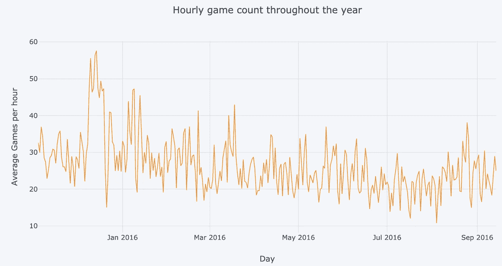

12 月的流量有一个显著的峰值，但是样本中只有 12 个月，所以不可能知道这是否是经常发生的。需要进一步的研究或 EDA 才能有机会确定原因。

# 玩家 EDA

另一个明显影响玩家盈利的因素是对手的技能水平。虽然我们没有机会预测单个玩家的行动，但对总体结果的分析也有助于确定最佳的游戏时机。

我分析的这一部分无疑是最吸引人的，每一个情节都在揭示一些隐藏的真相的同时，提出了和它回答的一样多的问题。

## 投资回报是有限的

平均投资回报率是衡量扑克玩家技能的最佳指标。随着所玩游戏样本的增加，该指标作为技能衡量标准的有效性也随之增加。在该数据中，所有游戏的买入费为 51 美元，因此 2%的投资回报率代表每场游戏约 1 美元的利润。每款游戏还有 1 美元的沉没成本(对托管游戏的网站而言)，这已计入投资回报率。

这里我们看到，随着玩家游戏次数的增加，他们的 ROI 被限制在一个更窄的范围内(或者更具体地说，比-100%到 100%更窄的范围)。在扑克社区中，单挑扑克的基本策略被认为是在不看牌的情况下把所有牌都押上，在这种情况下，这将产生大约 45%的投资回报率(超过一个重要的样本)。在 50 场以上的游戏中，我们看到平均 ROI 符合这一基线，随着游戏数量的增加，ROI 范围变得越来越窄(这说明玩家需要超过一定的 ROI 阈值才能激励他们如此频繁地玩游戏)。

虽然该图信息丰富，但它也隐藏了大量数据，因为许多点代表不止一个玩家(有时超过 1000 个玩家)。为了更清楚地了解 ROI 与游戏次数的关系，我们重复了这个图，这次是根据游戏次数对玩家进行分组，然后取平均 ROI 的平均值。

## 赢的越多，玩的时间越长

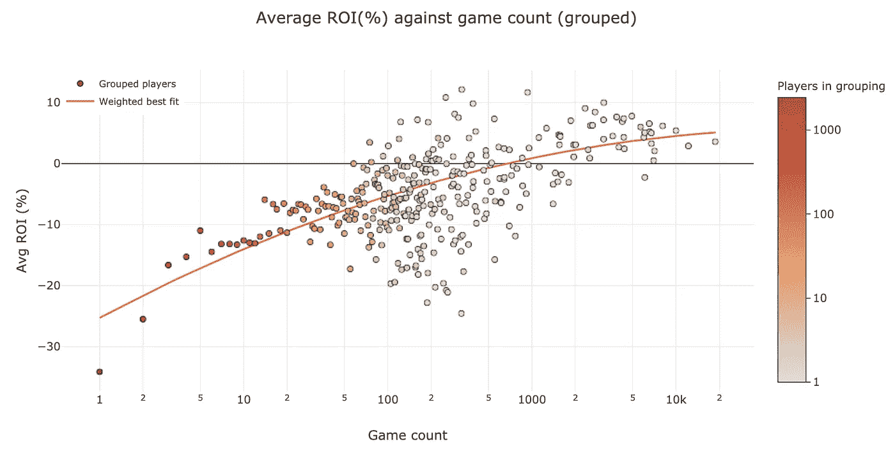

这是一个有用的投资回报率的近似值，反过来也是技能水平的近似值，适用于游戏次数少的玩家，他们的结果受高水平方差的影响。一个显而易见的结论是，玩游戏次数最少的人是最差的玩家——尽管存在一些偏见，即赢得第一场游戏的人肯定有能力再玩一场游戏，但失败者却不是这样。

那些不熟悉扑克的人经常问我，完全的新手是不是最难对付的，因为他们太不可预测了。这就是我的答案，不！一个新玩家在游戏中的行动可能是不可预测的，但总体来说，他们的策略将是可预见的糟糕，他们将是我每天的首选对手。

请注意，图的中心非常嘈杂。在这里，我们对 2-15 名玩家进行了任意分组，分组的投资回报率差异很大。这促使我们进一步分析与不同样本规模的固定胜率相关的 ROI 差异。我由此得出结论，当游戏样本低于 1000 时，我不愿意根据玩家的投资回报率对他们的技能水平做出强有力的结论。

## 很少有人有可靠的收入

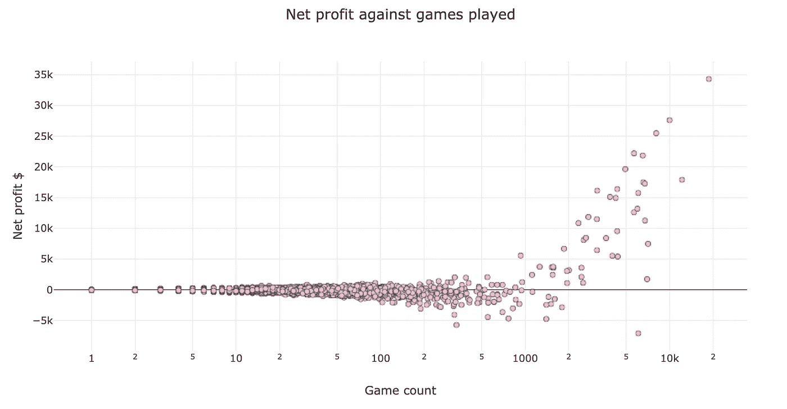

在这里，我们看到大多数玩家在他们的整个游戏样本中经历了名义上的赢/输，超过 90%的玩家赢或输的钱少于$500。在剩下的人中，有几个是高收入者，许多人损失了中等数额。

从这些图(和附加直方图)中，我看到 99%的玩家在一年中玩了不到 200 场游戏，剩下的 1%中，一半属于 200-400 场游戏，最后一半属于 400-19000 场游戏。我们在前面的图中看到，少于 400 场比赛的玩家主要是输球的玩家。

在这里，我们开始看到两类玩家的出现，大多数(超过 99%)是胜率不一的休闲玩家，一小部分(不到 1%)玩得更频繁，可以从他们的样本中看到可观的回报。

为了进一步探索玩家分类的想法，我将玩家分为两类，一类是玩 1000 个游戏以上的玩家(高容量玩家)，另一类是玩不到 1000 个游戏的玩家(低容量玩家)。

每个游戏有两个玩家，所以从玩家的角度来看，200，000 个游戏相当于 400，000 个游戏。

高交易量的玩家一年总共赢了 40 多万美元，低交易量的玩家总共输了 80 多万美元(该网站举办这些游戏净赚了 40 万美元)。

最有趣的是每组内部的游戏率。17%的高容量玩家玩的游戏是与其他高容量玩家玩的，这个数字在低容量玩家中只有 10%。这意味着超过 80%的游戏包括一个高音量播放器和一个低音量播放器。

这比我预期的更清楚地代表了在线扑克单挑社区的动态。有两类玩家，职业玩家(高容量)和娱乐玩家(低容量)，或者玩家称之为鲨鱼和鱼。鲨鱼大部分时间都在玩(吃！)鱼，鱼很少有机会吃掉其他的鱼(在鲨鱼出现之前)，有时鲨鱼会为了保护它们的鱼群而一决雌雄。

这个类比在在线扑克中很普遍，可以激发一些有趣的广告活动…

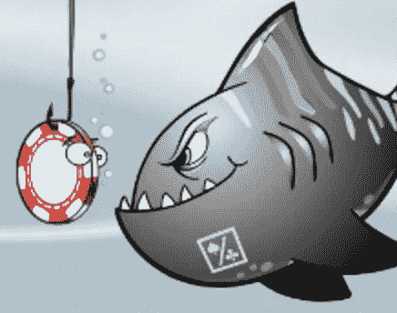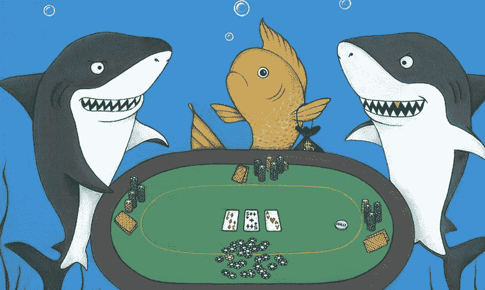

将玩家分类为职业玩家或娱乐玩家(鲨鱼或鱼)可能是确定最有利可图的游戏时间的有价值的特征。我们有一些功能可以进行粗略的分类(ROI 和游戏计数)，深入了解高容量玩家的内部游戏率可能会对我们应该如何使用这些功能提供一些提示(例如，通过设置被视为鲨鱼的 ROI 阈值)。

## 鲨鱼大战鲨鱼

为了调查高容量玩家的内部游戏率的情况，我构建了一个按利润排名前 20 位玩家和按游戏排名前 20 位玩家的每种组合之间的游戏配对矩阵。结果集是 25 个玩家，显示出两个组之间的高度重叠。

该组中的所有玩家都玩过 2000 多场游戏。尽管如此，他们几乎都不玩游戏。这种最频繁的玩家之间的小游戏计数，这些玩家都是(除了一个)赢家，表明大多数赢家积极努力避免彼此玩。

在这组玩家中，有一个玩家与其他玩家进行了大量游戏，尽管对手如此强大，但他们的投资回报率并不比每场游戏的沉没成本(rake)低多少。这个玩家和他的对手有相似的技能水平，但是由于所述对手的技能水平更高，他的回报很低。

这种动态最好用网络图来说明:

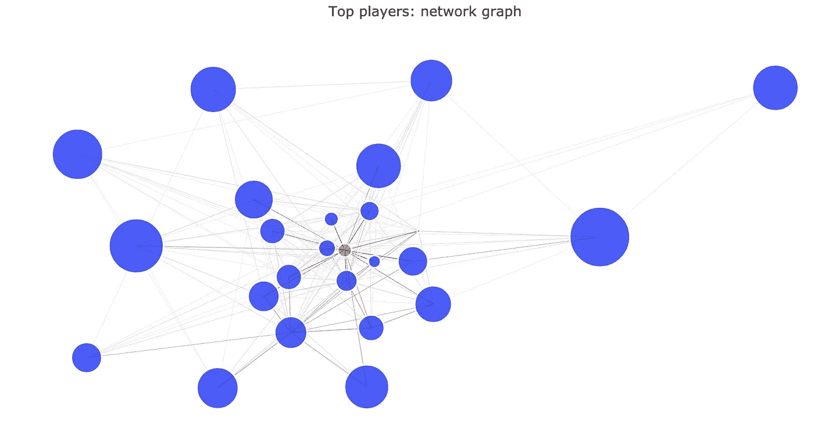

Top 25 players network graph

*   每个节点代表一个玩家，圆圈大小是绝对 ROI，蓝色表示正 ROI，红色表示负 ROI。
*   线强度是两个玩家之间的游戏次数。
*   节点位置由 networkX springfield 布局生成(因此接近度也代表两个玩家之间的游戏玩家数量，但布局不是确定性的，即每次绘制时都会发生变化)。

在这个图中真正突出的是，它的中心是投资回报率较低的玩家(较小的节点)，这个组内的大多数互动是在最弱的玩家之间进行的。较强的玩家之间几乎没有互动，与群体中较弱的玩家互动也非常少。

另一种形象化的方式是与红色节点的互动。在这里，我们可以看到红色节点代表的玩家很少与投资回报率超过 5%的玩家进行游戏，他们在回避更强的玩家！

在这里，我们开始了解职业单挑玩家的真实生活。

职业玩家积极努力避免互相游戏，这是一组玩家之间不成文的协议，先于本研究中的游戏样本。为了进入这个职业组，玩家必须通过与组中现有的职业玩家比赛来证明自己——为了提高他们成功的机会，他们将努力集中在较弱的现有职业玩家身上。玩家将这些团体描述为“卡特尔”，它们存在于大多数买入级别，随着赌注的增加，规模会变小。

又是什么激励弱势专业人士捍卫自己的领地呢？是身边的强者们！想象红色节点正在从一个洞里爬出来，蓝色的小节点正在试图把他推回去，知道如果自己不够努力，就会被周围更强的玩家自己推下去。

不幸的是，对这些玩家来说，扑克不仅仅是扑克，它还包括有效地管理敌对和互利的关系，以管理鱼鲨比，进而管理他们的底线。这种动态对于单挑锦标赛扑克来说是独一无二的，因为这是唯一一种你无法在不完全放弃玩游戏的情况下避开想要玩你的对手的扑克形式，因为这样玩家可以有效地猎杀其他玩家。

这可能在很大程度上解释了为什么我在扑克中的友谊很少超过互惠互利的程度。不像锦标赛玩家从许多不同的玩家那里赢得或输掉少量的钱，很难发展出怨恨或敌人，我经常处于这样的境地，我从一个玩家那里拿走了或已经从我这里拿走了 5 位数的钱，有时是在一天之内！老实说，我不会有任何其他方式。

但是让我们回到正题。我在这一阶段的分析中得出的另一个结论是，通过审查这些玩家相对于组中其他玩家的游戏投资回报率，当这些玩家玩红色节点时，实际上只有主机赚钱，因为技能差距不足以让任何一个玩家克服主机游戏的沉没成本。

回到最初的问题，玩游戏的最佳(最有利可图)时间是什么，如果我们可以将玩家分为职业和娱乐，鲨鱼和鱼，我们可以从每小时游戏数时间序列中删除鲨鱼对鲨鱼的实例，将其从每小时游戏数转换为至少包括一条鱼的每小时游戏数。通过这样做，我们分离出每小时流量的“盈利”成分，我们可以用它来预测未来的盈利播放时间。我们可以生成的另一个时间序列是一小时内在线的专业人员数量，这代表了每小时流量中“无利可图”的部分。

我还为数据中的每个玩家创建了一个额外的特性，即每小时在线玩游戏的次数。这表明鲨鱼通常比鱼每小时有更高的游戏计数，这在分类边缘案例时可能是有用的。

# 给玩家分类

是时候拿出一些聚类算法了？可惜没有！我们预计不到 1%的玩家是专业人士，这代表了严重的阶级不平衡，这对监督学习算法来说已经足够困难了，更不用说无监督学习算法了。我尝试了一下，但试图对这些未标记的数据进行聚类，最终以我手动检查聚类并在我认为它们不能反映我自己的估计(基于我多年的经验)的地方修改它们而告终。

我使用的最后一种分类方法是我自己创建的决策树，所有的玩家只通过几个节点进行分类，如下所示:

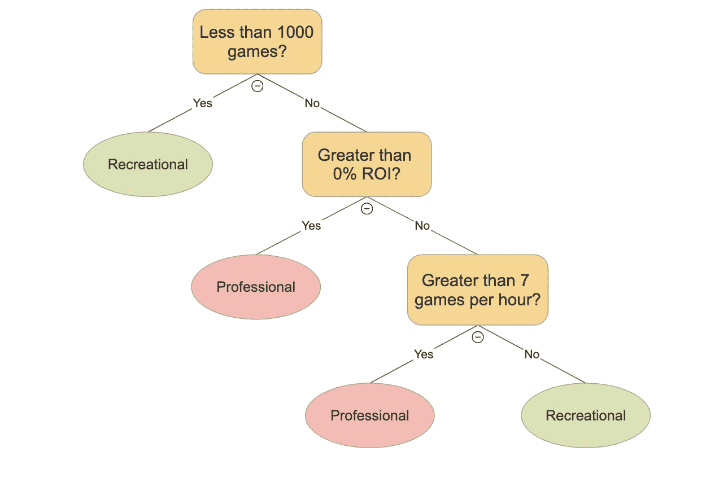

这是一个相当生硬的分类方案，毫无疑问，一些球员被错误分类，但它将满足这一分析。我想象如果我创造一个预测工具，它会给用户手动分类球员的选项，增加他们定义的准确性。

# 返工时间序列

现在我们有了分类，我们可以给每个游戏一个代表游戏中职业人数的分数。这可用于创建新的时间序列，娱乐和专业的每种组合都有一个时间序列(即专业与专业、专业与娱乐以及娱乐与娱乐)。

我们可以立即看到，我们之前注意到的 12 月流量的峰值是由职业玩家相互竞争的临时增加引起的。爆发了一场小战争，而且很短暂。我们看到，娱乐玩家几乎从不互相游戏；在时间序列的早期，rec vs rec 线异常高，这表明一些球员可能被错误分类(可能是那些寻求晋升的球员，他们在放弃之前没有参加 1000 场比赛)。

通过计算每个小时内独立职业玩家的数量，我们还可以得出每小时在线独立职业玩家的数量。下图是休闲交通时间序列。

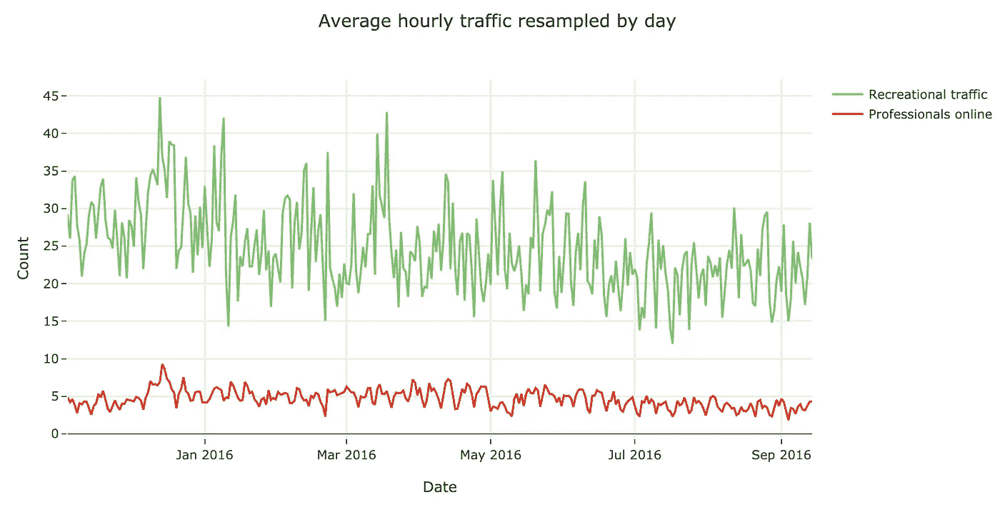

# 玩的最好时间

因此，如果每个包含一个娱乐玩家的游戏是一条鱼，而每个在线职业玩家是一条鲨鱼，我们可以通过确定哪个小时每条鲨鱼产鱼最多(通过将娱乐游戏除以在线职业玩家)来计算出最佳游戏时间。

但是首先要对时间序列做一些改变。两个系列的可疑缺失值用一周中该小时的平均值填充。对于专业人士在线系列，每次观察都会增加一条，这改变了“专业人士在线一小时内钓到多少鱼？”的问题到“如果一个额外的职业选手也在那个小时打球，他们会得到多少鱼？”这更能代表与决定参与游戏相关的价值主张。

我们没有足够的年或月的数据来得出一年或一月中最好玩的时间的结论，但我们有足够的周数。下面是一周中每个小时每个职业球员的平均游戏次数(包括一个娱乐玩家)的图表(记住:0 =星期一，1 =星期二，等等)。

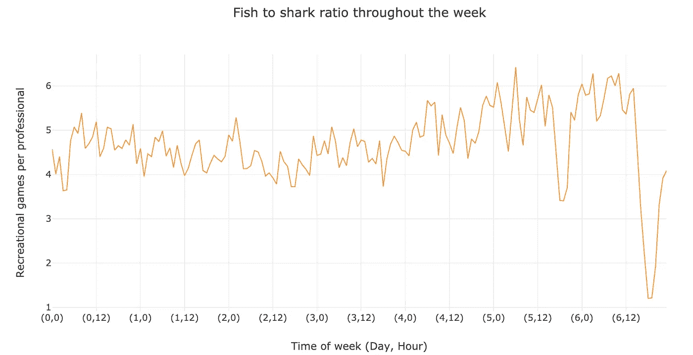

我们之前在“一周内每小时游戏计数”图中看到的每日季节性几乎完全消失了。专业人士的集体私利似乎在调节鲨鱼和鱼的比例，使其在工作日保持在 4 到 5 之间。虽然开始时我们看到工作日有更高的流量，但午夜后，周五和周六是最好的玩游戏的时间，周六和周日下午是最差的。

那么从这个分析中我们能给玩家什么建议呢？在一周中，你什么时候玩并不重要，你可以让生活的其他方面影响你的时间表，因为你不会错过任何额外的价值。是的，周五和周六晚上更适合玩，但这远远不是双倍时间——预计每小时玩的游戏会增加 25%左右。避开周六和周日下午。

对于有抱负的职业玩家来说，他们很想知道在这个买入级别玩游戏的价值。无论你在一周中的什么时候玩，期望你的平均回报是一样的。我们看到专业人士的投资回报率为 2–8%，因此买入费为 51 美元，每小时玩 4.6 场游戏(工作日)，根据你的技能水平(买入费*游戏次数*投资回报率)，预计每小时可赚 4.70 至 18.77 美元。

因此，我们有它，最好的时间玩，或者更确切地说，知识，除了几个时间在周末，没有任何调整可以对玩家的每周时间表，以提高他们的预期利润。

但是那些作息时间灵活的球员呢？可以即时决定是开始、继续还是停止播放。我们对这些球员有什么建议吗？我们知道，但我们将把这一点留到另一篇文章中，在那篇文章中，我将带您完成创建一个时间序列模型的过程，该模型可用于预测未来的鱼鲨比

***注来自《走向数据科学》的编辑:*** *虽然我们允许独立作者根据我们的* [*规则和指导方针*](/questions-96667b06af5) *发表文章，但我们不认可每个作者的贡献。你不应该在没有寻求专业建议的情况下依赖一个作者的作品。详见我们的* [*读者术语*](/readers-terms-b5d780a700a4) *。*