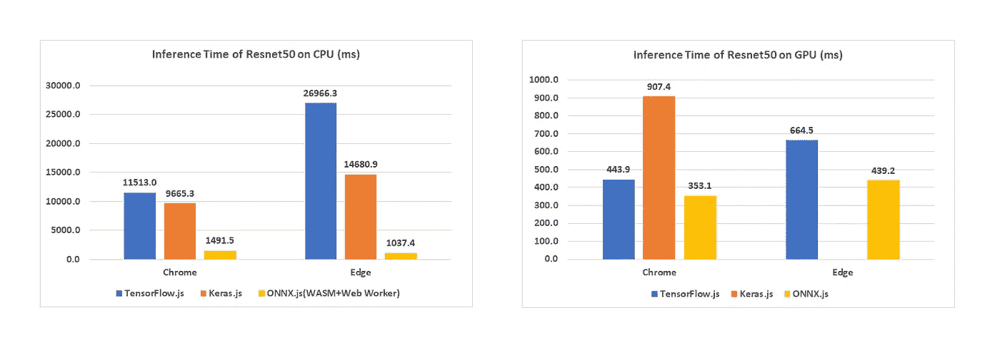

# ONNX.js:浏览器中的通用深度学习模型

> 原文：<https://towardsdatascience.com/onnx-js-universal-deep-learning-models-in-the-browser-fbd268c67513?source=collection_archive---------15----------------------->

## 通用开放标准深度学习格式介绍及其在浏览器中的使用(ONNX/ONNX.js)

Photo by [Franck V.](https://unsplash.com/@franckinjapan?utm_source=medium&utm_medium=referral) on [Unsplash](https://unsplash.com?utm_source=medium&utm_medium=referral)

在客户端浏览器上运行深度学习模型并不是什么新鲜事。2018 年初，谷歌发布了 TensorFlow.js，这是一个开源库，用于完全在浏览器中定义、训练和运行机器学习(ML)和深度学习(DL)模型，使用 Javascript 和高级 API。

2017 年 12 月，[亚马逊](https://aws.amazon.com/blogs/machine-learning/announcing-the-availability-of-onnx-1-0/)、[脸书](https://research.fb.com/onnx-v1-released/)和[微软](https://www.microsoft.com/en-us/cognitive-toolkit/blog/2017/12/announcing-onnx-1-0-open-ecosystem-ai/)宣布了让[开放神经网络交换](https://onnx.ai/) (ONNX)格式制作就绪的合作倡议。ONNX 现在可以支持许多顶级框架和运行时，包括 Caffe2、MATLAB、微软的认知工具包、Apache MXNet、PyTorch 和 NVIDIA 的 TensorRT。还有从 TensorFlow 和 CoreML 到 ONNX 的早期转换器，可以用到今天。

2018 年 11 月，ONNX.js 发布。ONNX.js 是一个开源的 Javascript 库，用于在浏览器和 Node.js(类似 TensorFlow.js)上运行 ONNX 模型。你可以使用它在浏览器上直接对预训练的 ONNX 模型进行评分。ONNX.js 也是第一个在基于 Javascript 的人工智能推理引擎(通过 Web Workers)中利用多线程的解决方案，与 CPU 上的任何现有解决方案相比，它提供了显著的性能改进。好消息，对吧？

# ONNX 是什么，为什么这么酷？

当你开发一个机器学习或深度学习模型时，你通常会产生经过训练的模型工件，然后用于预测。该文件包含您花费数小时训练的神经网络参数和权重。每个平台通常有不同的输出格式。例如，MXNet CNN 模型保存在(*。参数和*。json)文件。这种格式只适用于 MXNet 运行时推理。ONNX 来解决这个问题。它使得深度学习模型可移植，你可以使用 MXNet、Caffe 或 PyTorch 开发一个模型，然后在不同的平台上使用它。例如，您可以使用 PyTorch 开发一个图像分类模型，然后将其部署到 iPhone 设备上，以使用 ONNX 格式的 CoreML。

# 为什么要在浏览器上进行深度学习？

在客户端设备(浏览器)上运行 DL 模型有一些重要的好处:

## 1-隐私:

如果 ML/DL 模型处理敏感和私有数据，并且您不想将数据发送到服务器进行推断，那么这将是一个很好的解决方案。

## 2-低延迟:

将模型直接放在客户端减少了客户端-服务器的通信开销。

## 3-跨平台:

你使用什么操作系统并不重要，因为它可以在浏览器上运行。也不需要安装任何库。

# 基准测试结果:

微软对 tensorflow.js 和 keras.js 库进行了一些基准测试，结果令人震惊。您可以看到 ONNX.js 可以快 8 倍以上:

[https://github.com/Microsoft/onnxjs](https://github.com/Microsoft/onnxjs)

# 现在，让我们看一些代码:

现在，让我们使用**三个简单步骤**中的预构建模型——Inception _ v2 来构建一个简单的图像分类器。你可以从 [ONNX 模型动物园下载预先训练好的模型。](https://github.com/onnx/models)

第一步是用 WebGL 或 WebAssembly 后端创建 ONNX 推理会话。在这个例子中，我将使用 WebGL 后端，然后我将使用`session.loadModel()`函数加载我刚刚下载的模型。

第二步是处理输入图像并调整其大小，然后使用`onnx.Tensor()`函数从输入图像中创建一个张量。

第三步是使用`session.run()`函数获得预测，并将输出转化为相关的类。

Code Snippet for using ONNX.js

你可以从[这里](https://github.com/Microsoft/onnxjs-demo/tree/data/data/examples)获得完整的示例代码。这里还有一个为您尝试的所有演示部署的网站。

# 结论:

ONNX 是一种非常强大的开放标准格式，它使得模型工件可以在平台之间移植。你仍然可以使用你最喜欢的框架进行编码，然后发布你的结果，使它可以在任何使用 ONNX 格式的平台上工作。这是让机器和深度学习开发和推理民主化的一个非常好的方式。当然还有更多，但是希望本文中的信息可以作为对 ONNX 和 ONNX.js 的简短而有用的介绍。