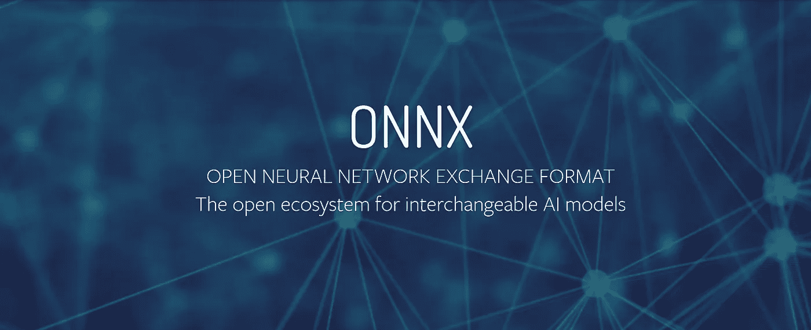
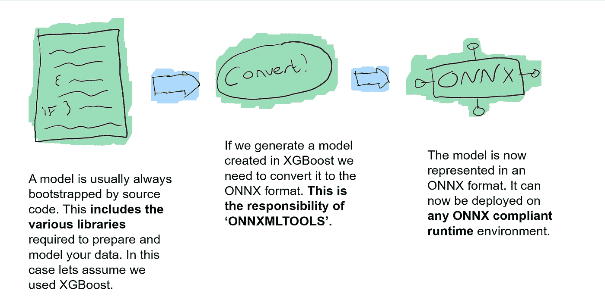

# ONNX —变得简单

> 原文：<https://towardsdatascience.com/onnx-made-easy-957e60d16e94?source=collection_archive---------10----------------------->

如果你对当前人工智能技术领域中使 ONNX 成为必要的各种环境因素感到好奇，我在文章结尾提供了一个简洁的附录。现在，让我们直接关注这场秀的明星- **Onnx** 。

# ONNX:那么，它到底是什么？

ONNX 是一种持久性格式。一种将生成的模型序列化为离散资产的方法，可以用代码对其进行存储、版本控制和控制。如果你看看幕后，你会发现 ONNX 已经得到了微软、脸书、英伟达以及其他公司的大力支持。所有将人工智能视为其业务核心的组织。考虑到这一点，你可能会开始想，是什么让 ONNX 如此特别？

> **互操作性**:不同程序交换信息、共享文件和使用相同协议的能力。

这是一个简单的想法。这种想法在软件工程中已经存在了几十年(Java 的 JVM 是一个显著的例子)，但在人工智能领域却一直没有出现，这是人工智能研究中所谓的“复制危机”的一个促成因素。

本质上，ONNX 解决这个问题的方法是，它保证在给定数据集的情况下，模型将始终保持其行为的确定性，其结果与运行时环境不变。

那么，这对**我们**意味着什么，为什么**我们**(作为数据科学家/人工智能工程师)要关心呢？

## **赞成者！**

*   您可以用一种编程语言创建一个模型，然后在一个完全不同的运行时环境中执行(例如，想象一下用 Python 创建您的模型，然后部署到一个 C#软件解决方案上)——太好了！😎
*   你可以使用几乎任何人工智能工具来创建一个模型，ONNX 运行时会对它进行一般性的处理。这为您创建的任何模型提供了一个通用的、一致的界面👏
*   使用 ONNX，您不需要打包用于创建模型的各种依赖项，您需要的只是 ONNX 运行时☺️
*   它得到了几乎所有重要行业贡献者的广泛支持。它是开源的，并且会一直存在下去😍

在乌托邦世界里，ONNX 不会有任何问题。尽管该框架有崇高的理想和令人钦佩的目标，但我们需要解决一些问题。

## 不利因素。

*   ONNX 是新的。技术上的新奇常常暴露出日常使用中的不成熟。对于 ONNX 来说，这表现为一个笨拙的 API，并且缺乏在野外工作的范例实现。生产项目依赖于确定性和易用性😵
*   文档是有限的。提出了一个丑陋的问题“如果出了问题怎么办？”这是一个可怕的风险，因为有记录的支持是随意的😰
*   它直接支持将有限数量的库转换成 ONNX 格式😓
*   存在(3…2…1 中的讽刺)缺乏例子。这使得采用成为一个挑战，除了最强壮和思想开放的团队🤯

在这篇文章中，我想把焦点放在第四个骗局上。为那些遇到和我一样的挑战的人提供希望的灯塔。对于你们每一个 ONNX 航海家，我希望这些例子将是你的灯塔。

# ONNX —变得简单

首先，我们如何在我们的开发环境中安装 ONNX(本文不打算深入介绍安装，而是给你一个指南针)？你需要两样东西。

1.  [ONNX](https://github.com/onnx/onnx)
2.  [ONNXMLTOOLS](https://github.com/onnx/onnxmltools)

幸运的是，安装说明分解为一个 pip 安装，说明被捕获在超链接的 GitHub 存储库中。所以，你现在有 ONNX 准备…嗯…那么，为什么有两个依赖项？这实际上可以归结为*转换工具*和 ONNX 本身的解耦。让这张方便的图表解释…

A tl;dr view on where the ‘ONNXMLTOOLS’ fit into the ONNX eco-system

> **有趣的事实:**ONNX 官方支持的转换过程在编写时只支持几个库。例如，Sci-Kit Learn 有一个独立的 ONNX 转换工具(我们很快就会看到)。

现在已经澄清了(我希望！)，让我们从 **XGBoost 开始，探索几个展示模型到 ONNX 的转换的代码示例！**

很简洁，你不同意吗？这个例子当然很简单，但是这个例子表明代码不动产与其他持久化方法非常相似。

然而，这仅仅考虑了*保存*模型，我们如何在 ONNX 运行时环境中*给*打分？

这个例子也是用 Python 编写的，但是您可以使用任何与 ONNX 运行时环境兼容的编程语言。你可以想象，当将一个由人工智能驱动的功能集成到一个现有的项目中时，这将是非常强大的(拥有自己预先建立的技术栈)！

## 如何将“不支持的”库转换成 ONNX？

正如我们前面所讨论的，ONNX 的当前转换工具只支持一小部分可能的库，有一些重要的例外；如 [Sci-kit Learn](https://scikit-learn.org/stable/) 。

ONNX 开源社区为此设计了一个特定的库(是的…另一个依赖项)，称为[‘sk learn-ONNX’](https://github.com/onnx/sklearn-onnx)。这个额外的转换器是 ONNX 开放课程生态系统中存在的几个转换器之一，每个转换器都反映了核心 ONNX 工具的现有标准(这是一个可取之处)。

关键时刻-对 code real estate 有什么影响吗？

长话短说…不。这是一个好的结果，它表明分裂的转换库严格遵循现有的 ONNX 转换 API——很好。

## 如果我想同时使用 SKLearn 和 XGboost 怎么办？

好问题！这是一个先前范例和支持文件都有限的领域。ONNX，由于运动几个分散的转换器经常感觉像编译不同的乐高积木。为了使 SKLearn 转换库支持 XGBoost，我们的目标是从核心 ONNX 工具注册 XGBoost。

让我们看看是什么代码启动了这个过程…

维奥拉。虽然同时利用每个转换库*感觉*很笨拙，但它是有效的。这证明了基本 ONNX API 的可扩展性和一致性。如果我在哪里阅读茶叶来预测 ONNX 的未来，这个核心原则是一个让我对未来更统一的工具集抱有希望的原则。

我喜欢 ONNX。它试图满足人工智能社区的真正需求，努力确保我们构建的模型的神圣性。这对于减少构建人工智能驱动的软件解决方案和人工智能增强的软件解决方案的摩擦至关重要。

对于 AI 社区中的那些人来说，我们应该在 ONNX 发展的幼虫阶段支持它。ONNX 来了。让我们拥抱它。

> 所以你可能会想，是什么让我们来到这里？导致 ONNX 产生的因素是什么？我在下面加了一个简短的补充，涵盖了我对这个话题的思考。

# 因果——为什么 ONNX 是必需品？

现代人工智能领域是一个丰富的、不断变化的工具和技术的织锦。过去的五年包含了我所说的现代人工智能复兴，它以三种不同的方式表现出来:

*   在人工智能的直接垂直领域和更广泛的数据科学技能组合方面，*教育*都取得了重大进展。
*   人工智能欣赏已经渗透到科技世界的日常词汇中。它成为我们腰带上的另一个工具。
*   *工装的成熟度；*这已经建立了当前的“三层”抽象模型(例如，从云认知服务、 [Sagemaker](https://aws.amazon.com/sagemaker/) 及其同类到全脂肪、低级端到端框架，如 [Tensorflow](https://www.tensorflow.org/) )。

本文主要关注第三点的后果。当然，工具已经以一种净积极的方式成熟了，但是(是的，有一个但是…)工具的开发一直是混乱和分散的。

> 在短短 10 分钟内(我自己计时)，我数了 **24(！)**独特的人工智能聚焦库&平台。每一个都提供非常相似的广泛功能，但是标准、API 和持久格式却大相径庭。

这是怎么发生的？

*   竞争力……大型科技公司有一种与生俱来的竞争欲望。
*   在当今世界，人工智能的编程语言之间并不存在对等性。通常情况下，功能会在 Python、R、C#以及更高版本中被复制……只是在不同的库中。

这对每个工具生成的模型如何被持久化产生了非常有针对性的影响。有两种选择浮出水面。

1.  完全依赖于专有工具/格式(或供应商！).
2.  使用通用的序列化格式，如[泡菜](https://docs.python.org/3/library/pickle.html)(其中有一些关于方面的[。)和 JobLib 是当今部署人工智能模型的常用方法。由于它的易用性，我已经在各种项目中使用过。](https://scikit-learn.org/stable/modules/model_persistence.html#security-maintainability-limitations)

与所有混乱的环境一样，标准化和领导力也存在机会—**2017 年，ONNX 加入了竞争。**

其余的，正如他们所说，都是历史了。