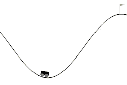

# OpenAI 健身房经典控制问题的奖励工程|DQN |RL

> 原文：<https://towardsdatascience.com/open-ai-gym-classic-control-problems-rl-dqn-reward-functions-16a1bc2b007?source=collection_archive---------15----------------------->

## 自定义奖励功能，加快学习速度！

我通过尝试在 [OpenAI](https://gym.openai.com/) 健身房解决问题开始学习强化学习。我特别选择了[经典控制](https://gym.openai.com/envs/#classic_control)问题，因为它们是力学和强化学习的结合。在这篇文章中，我将使用深度 Q 网络(DQN)展示选择一个合适的奖励函数如何导致更快的学习。

# **1。扁担**


Episode 40 (unbalanced)


Episode 60 (balanced)

这是 OpenAI 健身房上最简单的经典控制题。极点保持平衡的每个时间步长的默认奖励值是 1。我将这个默认奖励改为与磁极角度绝对值的减少成比例的值，这样，它会因为使磁极更接近平衡位置的动作而得到奖励。具有 2 个隐藏层的神经网络，每个隐藏层具有 24 个节点，在 50 集内解决了这个问题。

```
**#Code Snippet, the reward function is the decrease in pole angle**
def train_dqn(episode):
    global env
    loss = []
    agent = DQN(2, env.observation_space.shape[0])
    for e in range(episode):
        temp=[]
        state = env.reset()
        state = np.reshape(state, (1, 4))
        score = 0
        maxp = -1.2
        max_steps = 1000
        for i in range(max_steps):
            env.render()
            action = agent.act(state)
            next_state, reward, done, _ = env.step(action)
            next_state = np.reshape(next_state, (1, 4)) 
            ***#Customised reward function***                        
            reward = -100*(abs(next_state[0,2]) - abs(state[0,2])) 
            agent.remember(state, action, reward, next_state, done)
            state = next_state
            score=score+1
            agent.replay()
```

在这里找到完整的代码。


Time steps for which the pole stayed balanced in different episodes

# **2。山地车**


Episode 2



Episode 200

这里的目标是到达正确的山顶，汽车将不得不来回到达正确的山顶。为了让网络自己想出这个策略，需要为它提供一个适当的奖励函数。在某些情节中，一旦汽车通过试错法到达目的地，简单地给予积极的奖励，而对所有其他时间步骤给予消极的奖励是行不通的，并且在网络学习最佳策略之前需要相当长的时间。

为了从谷底到达顶峰，汽车需要获得机械能，因此最佳策略是汽车在每个时间步获得机械能(势能+动能)。所以一个好的回报函数应该是，在每一个时间步，机械能的增加。

```
**#Code Snippet, the reward function is the increase in mechanical energy
def** train_dqn(episode):
    **global** env
    loss = []
    agent = DQN(3, env.observation_space.shape[0])
    **for** e **in** range(episode):
        state = env.reset()
        state = np.reshape(state, (1, 2))
        score = 0
        max_steps = 1000
        **for** i **in** range(max_steps):
            env.render()
            action = agent.act(state)
            next_state, reward, done, _ = env.step(action)
            next_state = np.reshape(next_state, (1, 2))
            ***#Customised reward function*** reward = 100*((math.sin(3*next_state[0,0]) * 0.0025 + 0.5 * next_state[0,1] * next_state[0,1]) - (math.sin(3*state[0,0]) * 0.0025 + 0.5 * state[0,1] * state[0,1])) 
            agent.remember(state, action, reward, next_state, done)
            state = next_state
            agent.replay() 
```

在这里找到完整的代码。

有了这个奖励函数，网络可以很快地学习到最佳策略。


TIme steps taken by the car to reach the flag at different episodes.

# 3.钟摆


Performance of the RL Agent at different episodes (From left: episode 6, episode 40, episode 200)

在这个问题中，我需要摆动一个钟摆，并使用顺时针或逆时针方向的扭矩使它保持平衡。这个问题类似于山地车问题，但是当杆到达倒置位置时，保持杆平衡有额外的困难。
最初，杆的机械能需要增加，但是一旦它获得足够的能量到达倒置位置，任何更多的能量增加将迫使摆锤保持旋转。

最佳策略是以这样一种方式提供扭矩，即不断增加摆的机械能至极限 mg1/2，该极限等于倒立摆的势能。这将确保钟摆到达倒置位置。除此之外，为了保持极点的平衡，应该对倒立位置附近的钟摆位置给予正奖励。

```
**#Snippet of the code, the reward function is the increase in mechanical energy of the pendulum upto a limit of 5 with an added positive reward for positions close to the inverted pendulum.
for** e **in** range(episode):
        temp=[]
        state = env.reset()
        state = np.reshape(state, (1, 3))
        score = 0
        maxp = -1.2
        max_steps = 1000
        **for** i **in** range(max_steps):
            env.render()
            action = agent.act(state)
            torque = [-2+action]
            next_state, reward, done, _ = env.step(torque)
            next_state = np.reshape(next_state, (1, 3))
            **if** (next_state[0,0]>0.95):
                score=score+1
            ***#Customised reward function***
            reward= 25*np.exp(-1*(next_state[0,0]-1)*   (next_state[0,0]-1)/0.001)-100*np.abs(10*0.5 - (10*0.5*next_state[0,0] + 0.5*0.3333*next_state[0,2] * next_state[0,2])) + 100*np.abs(10*0.5 - (10*0.5*state[0,0] + 0.5*0.3333*state[0,2] * state[0,2]))
            maxp = max(maxp, next_state[0,0])
            temp.append(next_state[0,0])
            agent.remember(state, action, reward, next_state, done)
            state = next_state
            agent.replay()
```

在此找到完整的代码[。](https://github.com/msachin93/RL/blob/master/Pendulum/pendulum.ipynb)

下图显示了在不同事件的 200 个时间步中，钟摆在倒置位置保持平衡的时间。


Time spent in the inverted position for different episodes

# 结论

强化学习是机器学习以最优方式执行任务或实现目标的过程。关于手头问题的人类直觉可以以设计的奖励函数的形式添加到神经网络算法中。我们考虑的问题中的默认奖励函数是粗糙的，只在完成任务时奖励代理，这使得 RL 代理很难学习。设计的奖励功能使训练过程更快、更直观，便于我们理解。
阅读更多博客[这里](https://smodi93.wixsite.com/msachin/blogs)。