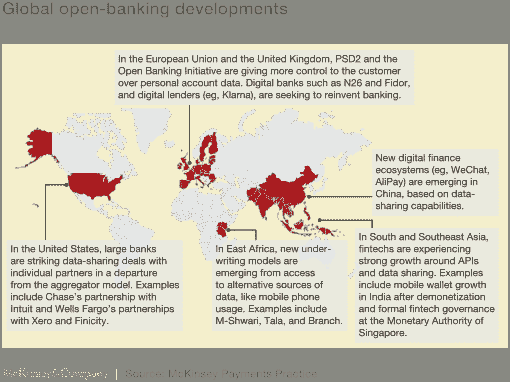

# 开放银行:它是什么，不是什么，为什么重要

> 原文：<https://towardsdatascience.com/open-banking-what-it-is-what-it-isnt-why-it-matters-e4502af143cb?source=collection_archive---------41----------------------->

## 在对个人数据隐私和数字伦理的担忧中，一种名为“*开放银行*的东西的发展似乎是朝着错误的方向迈出了一步。

**但是……**事实是，开放的银行业务和总体开放的框架不仅将传统组织带入 21 世纪，而且是改善客户服务、推动创新和为新的颠覆性商业模式奠定基础的关键。

随着人们对开放银行业的热情日益高涨，组织和个人需要迅速行动起来，在新的竞争格局中占据有利位置。

从高层次来说，开放银行业务是一项指令，要求银行向其客户提供与第三方机构共享其财务信息的选项，以换取改进的服务和定制解决方案。虽然主要集中在欧洲，但该指令在各地正处于不同的发展阶段。

## 如果这听起来很激进，*的确如此。*

仅次于健康，财务数据通常需要最高级别的安全性；由严格的规章制度保证的安全。从表面上看，这是一件好事。没有人希望自己的银行信息可以自由获取。

但是，尽管开放银行业的想法似乎与传统智慧相反，但认为开放银行业是你信用历史上的开放季节是错误的。如果操作得当，开放式银行业务有能力通过增强的“了解你的客户”能力和欺诈检测来提高安全性。

这可能有助于解释为什么银行越来越多地参与进来。为了理解其中的原因，有必要在消费者数据权利(CDR)和开放创新趋势的大背景下思考开放银行业务。从本质上讲，CDR 计划旨在让客户更好地控制他们的数据，使他们能够与他们选择的接收者共享数据，并用于他们授权的目的。

另一方面，开放式创新抓住了信息时代的精髓:脱离组织间的筒仓思维和秘密。

虽然开放银行的想法可能看起来像是在鼓圈里偶然听到的，但事实是，它代表了我们对数据所有权的看法的巨大变化。

# 适时给予的应得的赞扬

**Source:** [**McKinsey Payment Practice**](https://www.mckinsey.com/industries/financial-services/our-insights/data-sharing-and-open-banking)

现在判断这种思维的改变对普通客户的银行体验意味着什么还为时过早，但在这个早期阶段，我们已经看到第三方开发人员利用开放数据源来创建增强银行体验的应用程序和服务。

## 其中，正在开发两种类型的服务:

1.  账户信息服务
2.  支付启动服务

## 账户信息服务

根据英国金融行为监管局(Financial Conduct Authority)的规定，账户信息服务是“一种在线服务，向支付服务提供商提供支付服务用户持有的支付账户的综合信息。”

这实际上意味着客户可以选择允许第三方访问他们的银行信息。概括地说，这意味着您可以使用一个应用程序来查看您的所有银行信息，而不管您使用多少家金融机构。

但这也为人工智能工具和机器学习提供了一个机会，根据你的支出为你提供更好的价格和服务。

*被你的手机供应商骗了？*
账户信息服务可以让你确切地知道从竞争对手那里获得同样的方案会节省多少钱。

每月花 200 美元买咖啡？它会给你一个通知，告诉你如果你把钱放进 RRSP，五年后会是什么样子。

最终，账户信息服务可以为你的支出注入高功率人工智能。像[Mint.com](https://www.mint.com/)、[个人资本](https://www.personalcapital.com/)和 [YNAB](https://www.youneedabudget.com/?ar_clx=yes&ar_channel=sem&ar_campaign=36195583&ar_adgroup=1420857373&ar_ad=256856340712&gclid=EAIaIQobChMIgcTn2qSk3QIVUVmGCh1mfww2EAAYASAAEgL2xPD_BwE) 这样的提供商在过去几年里已经成为管理个人财务的便捷(和颠覆性)应用。

# 支付启动服务

另一方面，支付启动服务仍然是一项进行中的工作。

金融行为监管局将其统称为“一种在线服务，它访问用户的支付账户，在用户同意和验证的情况下代表他们启动资金转移。”

对银行客户承诺的好处是通过重定向交易以避开电子银行系统来降低费用。简单地说，支付发起提供商是借记卡和信用卡的电子商务替代品。总部设在立陶宛的 Paysera 公司通过对在线金融交易收取低得多的费用来为他们的用户省钱。

# 寄希望于变革

当然，问题在于，数字对我们金融生活的入侵仍在敲响警钟。2018 年，向美国卫生与公众服务部报告了 351 起[医疗违规](https://www.hipaajournal.com/largest-healthcare-data-breaches-of-2018/)，超过 1300 万份患者记录在此过程中暴露。 [**剑桥分析公司丑闻**](https://blog.thinkdataworks.com/decoding-cambridge-analytica-scandal) ，收集了 8700 万脸书用户的数据，对于那些认为他们的数字存在处于锁定状态的人来说，这是一个突然的觉醒。

事实是，技术创新的速度超过了立法者，而作为一个社会，我们还没有为个人数据保护建立明确的规则(尽管 GDPR**的建立是个好兆头)。银行将不得不从安全角度出发，或者通过提供数据的服务来获取利益。**

**他们最好快点做。**

**开放的银行业务正在发生，那些做得最好的银行，凭借铁一般的安全性和强大的 API 网络，将垄断市场。**

**当涉及到金融数据时，风险就更高了。**

**毕竟这是我们的钱。**

**但事实是，任何一家头脑正常的金融机构都不会采取一种为欺诈敞开大门的做法，不管名义上的好处有多么诱人。如果做得好，开放银行业务实际上将为银行提供一个减少欺诈、更好地了解客户、释放前所未有的竞争和创新的机会。对于他们的客户来说，这将把 AI 注入到他们的日常生活中。**

**有了这样的好处，从银行到创新者的数据需要尽可能简化。**

> **ThinkData Works 正在连接成千上万的公共数据源，并与公司和金融机构合作，将数据转化为可操作的见解，帮助监管合规性，改善信息收集，并打开新信息的大门。如果您想了解更多关于我们如何准备开放银行业务的信息，请 [**联系我们**](https://www.thinkdataworks.com/contact) 。**

***原载于【https://blog.thinkdataworks.com】**。*****