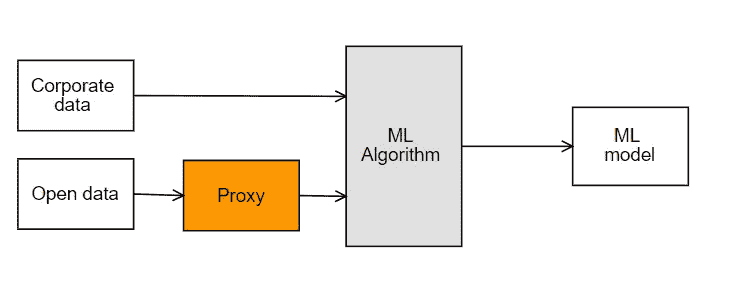

# 通过开放数据改进机器学习

> 原文：<https://towardsdatascience.com/open-data-for-machine-learning-b5c6ef3f5a80?source=collection_archive---------27----------------------->

## 公开数据被政府和机构广泛认为是一种透明和问责的做法。在这篇文章中，我们概述了为什么开放数据可以释放实际机器学习应用程序的潜力。

Taiwan is first ranked in the global Open Data Index (link: [https://index.okfn.org/place/](https://index.okfn.org/place/))

P2P 基金会将开放数据定义为一种理念和实践，要求每个人都可以免费获得某些数据，不受版权限制。专利或其他控制机制[2]。

近年来，作为透明度的一种实践，政府和市议会创建了开放的数据门户，当局将大量数据免费提供给公民。像巴塞罗纳( [OpenDataBcn](https://opendata-ajuntament.barcelona.cat/en/) )、巴黎( [open data Paris](https://opendata.paris.fr/explore/?sort=modified) )、罗马( [dati comune](https://dati.comune.roma.it/) )或柏林(d [aten.berlin](https://daten.berlin.de/) )这样的城市都有一个开放的数据门户，将粒度改为国家几乎世界上每个国家都有一个门户:法国( [data.gouv.fr](https://www.data.gouv.fr/fr/) )、马拉西亚([data.gov.my](http://www.data.gov.my/))或哥斯达黎加( [datosabiertos.presidencia)](http://datosabiertos.presidencia.go.cr/home)

如今，很容易找到几乎所有东西的数据集，只需点击几下鼠标，你就能找到，例如与领土(城市停车位)、人口(教育水平)、治理(选举结果)相关的数据集...伦理运动带来的开放数据的好处主要集中在为居民提供数据，以某种方式为自己谋利。在文章《开放政府数据的 5 大好处》[3]中我们发现:

*   1.增加透明度和问责制
*   2.培养信任、可信度和声誉
*   3.促进进步和创新
*   4.鼓励公众教育和社区参与
*   5.随着时间的推移存储和保存信息

如前所述，开放数据可以释放机器学习的潜力。原因很简单，纳入外部数据有助于增强模型、发现新模式和解决奇偶校验等问题。

Figure 1: Open Data in ML model

* *公司数据:这就是我对项目所拥有的数据的看法:如客户、消费…

为了将开放数据变量包含到 ML 算法中，我们需要在原始数据和分类器的输入之间包含一个代理。这个代理负责转换和对齐数据。

数据必须具有相同的粒度，所有维度必须具有相同的周期。如果我们预测每月天气，开放数据维度也需要以月为单位。否则，它会导致模型中的偏差。这两个信息来源需要归一化(重新标度、均值归一化或标准化是常用的技术)，当然是在同一个单位中，而不是试图建立一个混合公里和英里数据的模型。

保持尺寸比例的不平衡也很重要。在大多数情况下，公司维度的数量需要大于开放数据维度。原因很简单，我们预测的是股票市场，1 个变量是股票的历史价值(公司数据)，其他 100 个变量来自公开数据(国家的 GPD、教育水平或经济活动类型)。在这种情况下，大多数预测将仅使用开放数据维度构建，而不使用公司数据。因此，必须增加尺寸的重量或限制其作为辅助尺寸的使用。

最后，实际的开放数据门户有被第三方采用的障碍，政府不应该仅仅局限于发布数据。为了能够重用这些有价值的信息，需要确保以下特性:

**标准文件格式，**数据以不同的文件格式共享(甚至你可以在 pdf 的文件中找到)。门户网站应该建立一个标准，并以相同的格式共享所有文件(json 和 csv 是首选)。

**元数据**，所有数据集后面都必须有每个变量的描述(如果是表格数据行信息)。一个很好的实践是使用 RDF，这是一个由万维网联盟(W3C)创建的标准，它具有促进数据合并和支持模式随时间演变的特性[5]

**数据的周期性和一致性**，数据应该定期更新并保持历史。同样，必须通知用户数据的新版本。数据还必须随时间保持一致，数据的标识符不能随时间改变。

**API 访问**(应用编程接口)，访问和下载门户的数据是一项成本高昂的活动，为此，他们必须启用 API 来自动升级数据

综上所述，开放数据可以在人工智能项目中释放新的潜力，并作为奇偶校验帮助解决问题。此外，这种结合不是一件小事，开放数据网站需要确保数据的可重用性，ML 工程师需要知道如何融合这些知识。

# 参考

[1] AI 和开放数据:至关重要的组合[https://www . europeandataportal . eu/en/highlights/AI-and-Open-Data-critical-combination](https://www.europeandataportal.eu/en/highlights/ai-and-open-data-crucial-combination)

[2]为一个勇敢的新世界开放治国之道

[3] 5 开放政府数据的好处[https://www . envisio . com/blog/5-开放政府数据的好处](https://www.envisio.com/blog/5-benefits-of-open-government-data)

[4]开放数据和开放政府的好处、采用障碍和神话[https://www . semantic scholar . org/paper/Benefits % 2C-采用障碍和神话-开放数据-让桑-charabidis/4b 606805 da 01 c 61 e 4422 FD 90 Fe 33877 a6d 71951 c](https://www.semanticscholar.org/paper/Benefits%2C-Adoption-Barriers-and-Myths-of-Open-Data-Janssen-Charalabidis/4b606805da01c61e4422fd90fe33877a6d71951c)

[5]资源描述框架(RDF)[https://www.w3.org/RDF/](https://www.w3.org/RDF/)