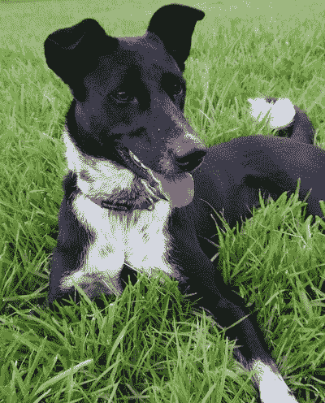
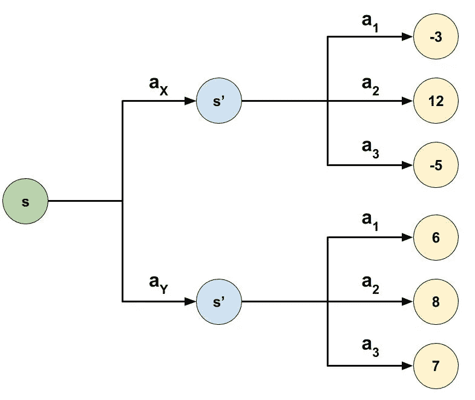
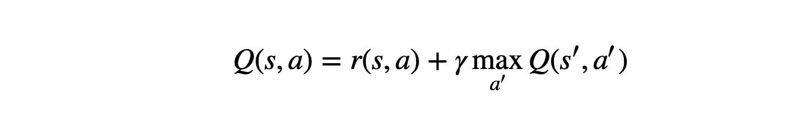
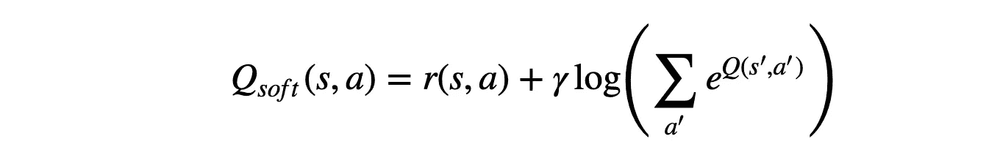

# 开放的人工智能:通过保留所有选项来提高性能

> 原文：<https://towardsdatascience.com/open-minded-ai-improving-performance-by-keeping-all-options-on-the-table-ddefce50913a?source=collection_archive---------10----------------------->

## 我是如何让我的强化学习代理在获得最高奖励后不再天真地表现得更好的

**在媒体*上阅读此文，而*不是使用此** [**好友链接的媒体会员！**](/open-minded-ai-improving-performance-by-keeping-all-options-on-the-table-ddefce50913a?sk=38b2b6fce052dba76e442aa51f376e00)

*本帖描述的井字游戏，以及所有的算法和预训练的模型都可以在* `[tic_tac_toe](https://github.com/shakedzy/tic_tac_toe)` *资源库上* [*我的 GitHub 页面*](https://github.com/shakedzy) *找到。*

当我被要求描述强化学习让我如此着迷的原因时，我通常会解释说，我认为我训练电脑的方式就像我训练我的狗一样——只使用奖励。我的狗学会了坐下、等待、过来、站立、躺下和假装被枪击(向我的妻子致敬)，所有这些都以完全相同的方式——每次她做了我让她做的事情，我都会奖励她。每次我们试图教她一些新东西时，她都不知道我们想从她那里得到什么，但是经过足够的反复试验和一些成功的尝试后，她明白了。当强化学习模型被教授新东西时，完全相同的事情也会发生。这真是太棒了。

Gin the dog. Yes, we named her after a hard-liquor

追求最大可能的回报是几乎所有强化学习模型背后的基本引擎——每种模型都有自己的方法来实现它。但是当从更高的角度审视这种方法时，天真地追求回报是非常狭隘的。遵循这样的策略将使我们无法快速适应意想不到的变化，因为我们从不保留 b 计划。我们的整个探索阶段只是为了找到可能的最佳方式，而很少关注其他好的选择。我们能教我们的模特打开思维吗？我们应该吗？

## 最大化熵而不是回报

不久前，我偶然发现了[伯克利人工智能研究中心](https://bair.berkeley.edu/)的[这篇博文](https://bair.berkeley.edu/blog/2017/10/06/soft-q-learning/)(它非常简要地总结了[这篇论文](https://arxiv.org/abs/1702.08165))，它提出了一种新的学习方法——不要学习提供最高回报的路径，而是跟随提供最积极选项的路径。换句话说，教你的模型增加它的*动作——选择* [*熵*](https://en.wikipedia.org/wiki/Entropy_(information_theory)) 。

这里有一个例子:让我们考虑一个简单的 [Q-Learning](https://meduim.com/@shakedzy/qrash-course-deep-q-networks-from-the-ground-up-1bbda41d3677) 算法，并检查以下场景:

假设我们站在状态 *s* 中，可以从两个动作中选择一个:动作 *X* 和动作 *Y* 。从那里我们将到达状态*s’*，在那里将有三种可能的选择: *1* 、 *2* 和 *3* ，这将把我们带到终端状态，我们将收到奖励。我们看到，如果我们在选择 *X* 后站在*s’*，我们的策略将是无论如何都选择行动 *2* 。另一方面，如果我们在选择 *Y* 后到达*s’*，我们可以更灵活一点——尽管动作 *2* 仍然是最好的。换句话说，该策略在 *X* 之后的*s’*的*熵*非常低——因为它只关注单个动作，而在 *Y* 之后则更高——因为它能够以合理的概率尝试所有状态。

但何必呢？从图中可以清楚地看出，最佳选项将是从状态*s’*开始的动作 *2* 。没错——但是如果环境突然发生变化，会发生什么呢？一个 bug，一个修改，或者对手一个意想不到的动作？如果这样的改变会突然阻止我们采取行动 *2* ，那么行动 *X* 就变成了错误的决定。

但这不仅仅是妄想。就在几行之前，我们同意在选择动作 *Y* 之后，我们可以在下一个动作选择中更加*灵活*。虽然仍然有*最佳*选项，但其他选项也不会太离谱，这可以让模型更多地探索这些其他行为，因为不选择最佳选项的代价很低。在选择动作 *X、*之后，情况就不一样了，我们知道，充分的探索对于一个健壮的强化学习代理来说是至关重要的。

## 让我们谈生意吧

如何设计一个鼓励代理人最大化熵的通用策略在我上面链接的论文中有介绍。在这里，我想把重点放在*软贝尔曼方程*(在我提到的博客中讨论过)。让我们首先用常规的贝尔曼方程来回忆一下:

The Bellman Equation

软贝尔曼方程将试图最大化熵而不是未来的回报。因此，它应该用熵最大化项来代替最后一项，在最后一项中，我们将未来的 Q 值最大化。因此，在有限数量的动作的情况下，软贝尔曼方程是:

The Soft Bellman Equation

如果你想看看这个新术语如何与熵相关的数学证明，博客作者声称可以在 Brian Ziebart 的这篇 236 页的博士论文中找到。如果你上过一次热力学课，你可以回忆一下，气体的热力学熵定义为 s=k⋅lnω，其中平衡态的组态数是，其中平衡态的组态数是。如果你不知道你刚刚读了什么，你只能相信我(或者读论文)。

## 有用吗？

如果你已经读过我的一些博客，你可能已经注意到我喜欢自己测试一些东西，这次也不例外。我曾经写过一篇关于我用深度 Q 网络训练的一个井字游戏代理人的文章，所以我决定编辑它，让它也用软贝尔曼方程学习。然后我训练了两个代理:一个普通的 Q-网络代理和一个最大熵 Q-网络代理。我训练两个这样的代理人互相对抗，然后另外两个代理人分别对抗一个外部玩家——重复这个过程 3 次，最后每种类型有 6 个不同的训练模型。然后，我将所有常规 Q 网络代理与所有最大熵 Q 网络代理进行匹配，以查看哪种类型的代理赢得最多游戏。我还强迫代理们在每场游戏中选择不同的第一步棋(以涵盖所有可能的游戏选项)，并确保他们都能玩到 *X* 和 *O* 。

结果非常清楚:在 648 场比赛中，软贝尔曼代理人赢得了 36.1%的比赛(234 场)，33.5%的比赛以平局告终(217 场)，只有 30.4%的比赛(197 场)由正规 Q 网代理人赢得。当只考虑在没有我强迫代理人做出特定的第一个动作，而是让他们随心所欲地玩的情况下玩的游戏时，结果甚至更有利于软贝尔曼代理人:在玩的 72 场游戏中，40.3% (29 场)由最大熵 Q 网络赢得，33.3% (24 场)由常规代理人赢得，其余 26.4% (19 场)没有赢家。我鼓励你自己也进行这个实验！

## 最后的话

这个实验表明，在学习复杂系统，甚至不那么复杂的系统时，追求更广泛的目标而不是最高的回报是非常有益的。在我看来，教授一个模型如此广泛的政策，就好像我们不再把代理人当作我们希望训练的宠物——而是我们试图教的人。我很高兴看到未来我们还能教给它什么！