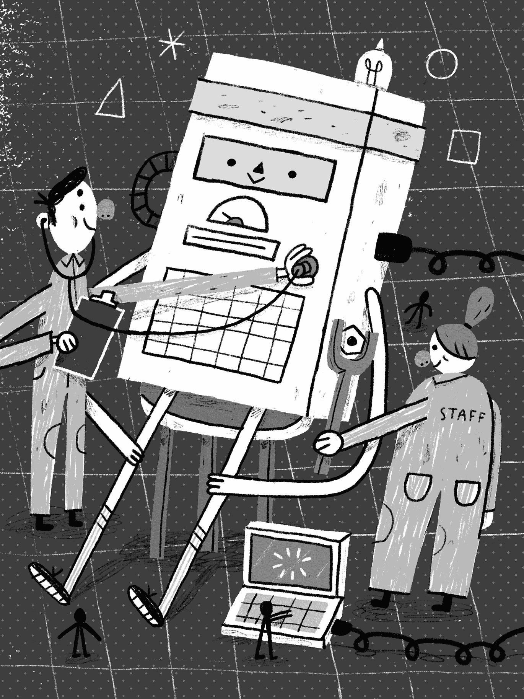

# 公开问题:卡洛斯·戈麦斯·乌里韦

> 原文：<https://towardsdatascience.com/open-questions-carlos-a-gomez-uribe-980c1af1195c?source=collection_archive---------27----------------------->

Illustrations by Alfonso de Anda

尼克·洛克威尔和克里斯·维金斯

*这个帖子也出现在* [*次开*](https://open.nytimes.com/open-questions-carlos-a-gomez-uribe-fa60d5b738c9) *。*

*Carlos A. Gomez-Uribe 是网飞公司前产品创新副总裁，在那里他负责电影推荐和搜索的算法开发。《纽约时报》首席技术官尼克·洛克威尔和首席数据科学家克里斯·维金斯向戈麦斯·乌里韦讲述了他的职业生涯，机器学习在网飞的发展，以及公司应该如何非常周到地考虑如何将机器学习集成到产品中。以下是经过编辑和压缩的。*

**问:你是如何进入网飞的产品部门工作的？你认为从事推荐工作的产品经理拥有数学技能重要吗？**

A.我在网飞开始时是一名数据科学家，在这家仍然很小的公司里参与了很多项目。然而，在与负责推荐算法的工程和产品团队交谈后，我对这个特定领域产生了浓厚的兴趣。网飞正在计划一个基于流媒体的全球产品，推荐算法还比较基础；它主要利用通过邮件发送的 DVD 产品提供的信息进行了优化。

我提出了许多基于流数据学习统计模型的想法，以改进推荐，我向产品团队提出了这些想法。他们是开放的，对模型感兴趣，但对涉及的定量方法感到不舒服，无法决定赞助任何一个模型。谢天谢地，我当时的老板 Chris Pouliot 支持这些想法(尽管持怀疑态度)，并给了我几周时间将其中一个开发成离线原型。原型产生的建议看起来很有趣，一旦我们把它们展示给产品团队，他们就会赞助这个项目。我们与工程和其他团队合作，全面开发和测试它，并根据结果部署它。

这一成功促使产品团队邀请我参与其他与推荐相关的项目。在其中的一次过程中，我开始相信让那些对定量方法不太了解的人——在这种情况下是产品经理——管理整个创新过程是次优的。所以我把这个批评传达给了产品团队。

令我惊喜的是，在思考了几天之后，他们的反应是同意让产品经理拥有深刻而广泛的量化经验将是一件有趣的实验，并创造了一个新的职位来尝试这个想法。更令人惊讶的是:他们让我去面试新职位。所以我转到了产品创新团队。结果相当不错，于是我被要求建立一个拥有强大定量背景的产品经理团队，来管理网飞的推荐和搜索创新流程。

为这个团队寻找合适的人需要时间，但这种努力是值得的，因为他们能够更好地领导跨职能团队，为网飞流媒体构建全球推荐和搜索技术。这种经历与我在其他公司看到的形成鲜明对比，我仍然相信，管理创新过程的强量化产品领导者是创造高质量算法产品的唯一途径。

你在网飞呆了七年；在这段时间里，你看到机器学习的使用方式发生了哪些变化？

它变得更加复杂。我们从几个相对简单的视频排名时间序列或回归模型开始，随着时间的推移，我们发现了更重要的用例，如推荐页面的构建或选择正确的图像来支持推荐。与此同时，我们发现各种更复杂的模型，经过适当的调整和使用，可以提供更好的体验。

**将产品体验的关键部分委托给机器学习可能很难，但只在产品的边缘部分部署机器学习保证了有限的影响和有限的学习。你如何看待对产品有影响的方面进行信任机器学习的信念飞跃？**

我认为你永远不应该盲目地相信一个机器学习系统会比一个替代品(比如手动治疗)表现得更好，直到事实证明并非如此。即使在获得这样的证明之后，机器学习系统也需要不断的监控，以确保整个系统或产品在周围世界发生变化时继续表现良好——以与您组织的使命相一致的方式。

重点是阐明你预计机器学习将如何改善产品或体验，然后投资于研究和开发，以探索这一假设。只有通过旨在理解变化的全部含义的仔细测试和分析，你才应该切换到基于机器学习的产品。这个过程既漫长又昂贵，只在产品的一小部分上尝试是没有意义的，因为即使在最好的情况下，对企业和使用你产品的人的回报也是很小的。

**去年夏天，莫妮卡·罗加蒂写了一篇名为《******》的伟大作品，并提出，“在有效利用人工智能和机器学习之前，你需要为你的数据打下坚实的基础。”然而，有时通过机器学习获得的酷结果可以引发公司需要的那种改进，以从公司的数据中提取更多价值。在你的数据工程还没有完善之前，开发机器学习能力是否具有生产力？****

**你的数据工程永远不会完美，所以等完美了再去开发机器学习解决方案是不明智的。然而，如果数据过于嘈杂、脆弱或稀疏，你将浪费时间来构建和部署大规模的机器学习解决方案。你需要介于两者之间。一种方法是建立一个你关心的数据层次，一旦第一个数据层次稳固，就开始开发机器学习解决方案。与此同时，继续努力提高其他数据的质量和可用性。**

**此外，我认为努力更好地了解你的客户、你的业务、你的产品以及他们之间的任何互动总是富有成效的。数据建模和分析是一个很好的方法；它可以帮助生成假设和潜在有用的输入信号，用于以后可以开发的机器学习技术。这种探索性工作的大部分可以在数据生产就绪之前完成。**

****天赋现在感到非常受限制。面对大科技公司如此激烈的招聘活动，我们其他人很难招聘到合格的人，甚至是刚从学校毕业的人。那么，当人才受到如此制约时，我们如何前进？这对人工智能的发展意味着什么？****

**大学对此的反应是开始培训越来越多的人掌握这类工作所必需的统计和计算等综合技能，所以供给在增加。但随着越来越多的组织意识到他们可以从这些技能中获得价值，需求也在增长。我不清楚未来十年在这方面会如何发展。然而，我也认为，希望员工拥有人工智能背景的公司应该非常清楚他们组织的使命，以及人工智能在这一使命中可以发挥的作用。当然，在人工智能领域训练有素的人才中，你应该能够找到那些不仅对它感兴趣，而且对它与你的组织的使命的特定交集充满热情的人。**

****

**Illustration by Alfonso de Anda**

**数据可以通过多种方式影响产品，例如 A/B 测试和强化学习来优化或个性化。但即使在此之前，网飞已经能够使用数据来建议新的测试功能，甚至新的内容策略。你能谈谈数字公司如何利用数据来建议新功能、新产品，甚至新的内容策略吗？**

**这又回到了一个更早的问题:使用数据分析和建模来更好地理解你的业务、你的客户、你的产品以及它们之间的相互作用。例如，寻找在与你的产品互动时倾向于表现相似的人群。利用这些受众的规模并分析每个受众参与的内容类型，可能会让您改变内容组合，以更好地将受众与产品相匹配。**

**然而，分析过去的数据应该主要用于生成假设。许多将被证明是错误的，例如简单的相关性在实现时会有不同的表现。所以测试，无论是完全受控的(如在 A/B 测试中)还是不受控的(改变一些东西并分析之前和之后)，总是必不可少的。**

****你今年夏天写了一篇关于矩阵分解模型的在线方法的论文******，网飞以这种方法做推荐而闻名。但是你也曾经** [**写过关于多武装土匪的**](https://arxiv.org/abs/1605.05697) **。什么时候像矩阵分解这样的监督学习方法是推荐的方法，什么时候公司应该使用土匪？******

****因子分解模型已经被证明对于个性化非常有效，因为它们在个体和项目之间有效地共享信息，以学习一个小的(例如，100)数字集合来描述每个人和每个项目的行为。另一方面，多武装匪徒本质上是一个回归模型，它根据输入信号的加权和来预测结果。这对于个性化来说是有问题的，根据定义，我们期望个人和物品的交互是重要的。但是量化这种相互作用，将其转化为回归模型的足够少的输入信号可能是复杂的。****

****多臂强盗在非个性化的环境中可以非常成功，因为他们使用所谓的探索-利用策略来避免仅仅因为你没有足够的数据而错过好的决策(例如推荐哪些文章)。您在这里提到的第一篇文章的要点是，如果与特定问题相关，也可以用因子分解模型实现这种探索利用策略。****

****由于网飞是一项订阅服务，因此优化最重要的事情似乎是保持用户数量，它每隔几个月才会给你一个信号。你如何将点击率等快速代理 KPI 与留存率等更重要但速度较慢的 KPI 区分优先级？你如何平衡通过强化学习的快速优化和 A/B 测试的缓慢响应？****

****我差不多两年前离开了网飞，所以我不知道他们今天是如何做算法决策的。但是在互联网技术行业，你会发现一个非常快速的代理(播放、阅读、点击等)。)，然后您仔细测试一个基于此类短期数据训练的模型，以确定长期指标是否真的有所改善。在网飞，这总是意味着要等三到六个月，我们才有信心找到更好的产品版本。我知道的大多数公司都没有这么有耐心，我认为这是一个错误。在互联网技术中，我还没有看到任何强化学习的成功应用，直接优化一个人可能关心的长期指标，但我认为这个方向很有趣，还没有被充分探索。****

******总的来说，关于公司应该(或不应该)将机器学习整合到他们的产品开发中，你学到了什么？******

****特别是，要非常仔细和深思熟虑，确保最终的产品是高质量的(不管你的 KPI 如何，不要偏向你能想象到的最差的内容或交互质量)。产品最终至少与公司的使命相一致，并且理想地支持公司的使命。最后，对产品的社会后果有自己的看法。****