# GPT-2:通过可视化理解语言生成

> 原文：<https://towardsdatascience.com/openai-gpt-2-understanding-language-generation-through-visualization-8252f683b2f8?source=collection_archive---------4----------------------->

## 超大的语言模型是如何完成你的想法的。

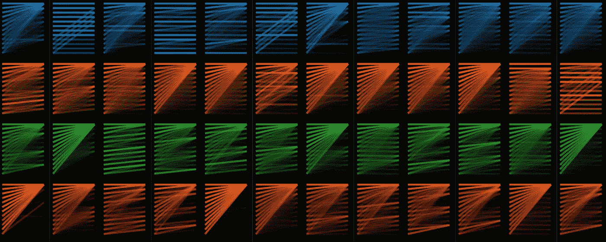

在大多数 [NLP](https://en.wikipedia.org/wiki/Natural_language_processing) 研究人员看来，2018 年是技术进步巨大的一年，新的[预训练](http://nlp.fast.ai/classification/2018/05/15/introducting-ulmfit.html) NLP 模型打破了从情感分析到问题回答等任务的记录。

但对其他人来说，2018 年是 NLP 永远毁掉芝麻街的一年。

首先是[ELMo](https://allennlp.org/elmo)(**E**embeddings from**L**language**Mo**dels)然后是[BERT](http://jalammar.github.io/illustrated-bert/)**(**B**I direction**E**n coder**R**presentations from**T**transformers)，现在 BigBird 坐在[胶水排行榜的首位](https://gluebenchmark.com/leaderboard)[我自己的思维已经被这种命名惯例所腐蚀，以至于当我听到“*我一直在和伯特玩，”*的时候，我脑海中闪现的图像不是我童年时的毛茸茸的单眉锥头鹦鹉，而是这样的:](https://gluebenchmark.com/leaderboard)**

**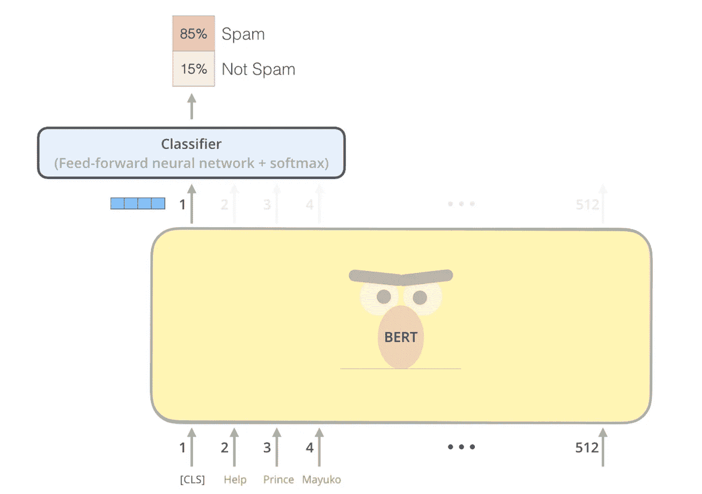**

**我看不到那张，[插图伯特](http://jalammar.github.io/illustrated-bert/)！**

**我问你——如果芝麻街在 NLP 模型品牌化面前都不安全，还有什么是安全的？**

**但有一个模型让我的童年记忆完好无损，这是一个没有名字和面孔的算法，它的作者 OpenAI 简单地将其称为“语言模型”或“我们的方法”。只有当另一篇论文的作者需要将他们的模型与这个无名的创造物进行比较时，它才被认为配得上一个名字。也不是*厄尼*或*格罗弗*或*库克怪兽*；这个名字准确地描述了算法是什么，仅此而已:[***GPT***](https://s3-us-west-2.amazonaws.com/openai-assets/research-covers/language-unsupervised/language_understanding_paper.pdf)，预训练的生成式[变压器](http://jalammar.github.io/illustrated-transformer/)。**

**但是就在它被命名的同时，GPT 被伯特毫不客气地从 GLUE 排行榜上除名了。GPT 失败的一个原因是它使用传统的[语言建模](https://machinelearningmastery.com/statistical-language-modeling-and-neural-language-models/)进行了预训练，即预测句子中的下一个单词。相比之下，伯特使用掩蔽语言建模*，*进行预训练，这更像是一个[填空](/a-i-plays-mad-libs-and-the-results-are-terrifying-78fa44e7f04e)练习:根据*之前和*之后出现的单词猜测缺失(“掩蔽”)的单词。这种双向架构使 BERT 能够学习更丰富的表示，并最终在 NLP 基准测试中表现更好。**

**因此，在 2018 年末，OpenAI 的 GPT 似乎将永远作为伯特的通用名称、奇怪的单向前身而被历史所知。**

**但 2019 年讲述了一个不同的故事。事实证明，导致 GPT 在 2018 年垮台的单向架构让它有能力做一些伯特永远做不到的事情(或者至少不是为它设计的):[写关于会说话的独角兽的故事](https://blog.openai.com/better-language-models/):**

**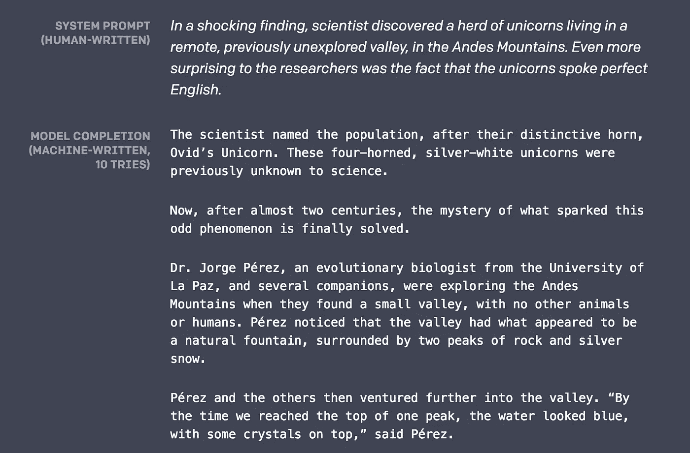**

**From [https://blog.openai.com/better-language-models/](https://blog.openai.com/better-language-models/) . Edited for length.**

**你看，从左到右的语言建模不仅仅是一个训练前的练习；它还实现了一个非常实际的任务:语言生成。如果你能预测一个句子中的下一个单词，你就能预测下一个，再下一个，很快你就有了…很多单词。如果你的语言建模足够好，这些单词将形成有意义的句子，这些句子将形成连贯的段落，这些段落将形成，嗯，你想要的任何东西。**

**而在 2019 年 2 月 14 日，OpenAI 的语言模型确实变得足够好——好到可以写会说话的独角兽的故事，[产生假新闻](https://www.nytimes.com/interactive/2019/06/07/technology/ai-text-disinformation.html)，写[反回收宣言](https://blog.openai.com/better-language-models/#sample8)。它甚至被赋予了一个新名字: *GPT-2* 。**

**那么，GPT 2 号具有类似人类的写作能力的秘密是什么呢？没有根本性的算法突破；这是一个扩大规模的壮举。GPT-2 拥有高达 15 亿个参数(比最初的 GPT 多 10 倍)，并根据来自 800 万个网站的文本进行训练。**

**如何理解一个有 15 亿个参数的模型？让我们看看可视化是否有帮助。**

# **可视化 GPT-2**

**由于担心恶意使用，OpenAI 没有发布完整的 GPT-2 模型，但他们发布了一个较小的版本，大小相当于原始 GPT (117 M 参数)，在新的更大的数据集上进行训练。虽然没有大模型强大，但小版本仍然有一些语言生成能力。让我们看看可视化是否能帮助我们更好地理解这个模型。**

> *****注*** *:创建这些可视化效果的代码可以在* [*GitHub*](https://github.com/jessevig/bertviz) *上找到。***

****一个说明性的例子****

**我们来看看 GPT-2 小模型是如何完成这句话的:**

> **船上的狗跑了**

****

**下面是模型生成的结果:**

> **船上的狗跑了**，狗被船员发现。****

**似乎很合理，对吧？现在让我们稍微调整一下这个例子，把*狗*改成*马达*，看看这个模型会生成什么 *:***

> **船上的马达运转了**

**现在是完整的句子:**

> **船上的马达以大约每小时 100 英里的速度运转。**

**通过改变句首的那个单词，我们得到了完全不同的结果。这个模型似乎理解了狗的奔跑类型和马达的完全不同。**

**GPT-2 怎么知道如此关注*做* g vs *马达*的，尤其是这些词出现在句子的前面？嗯，GPT-2 基于[变压器](http://jalammar.github.io/illustrated-transformer/)，这是一个 [*注意力*](https://jalammar.github.io/visualizing-neural-machine-translation-mechanics-of-seq2seq-models-with-attention/) 模型——它学会将注意力集中在与手头任务最相关的前面的单词上:预测句子中的下一个单词。**

**让我们来看看 GPT 2 号对*船上的狗跑了*的关注点在哪里:**

**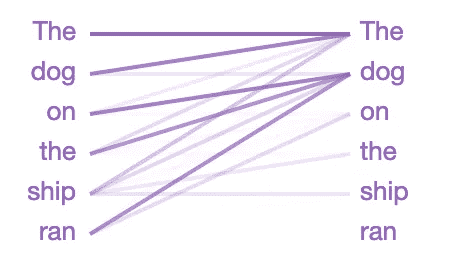**

**从左到右阅读的线条显示了模型在猜测句子中的下一个单词**时注意的位置(颜色强度代表注意强度)。所以，在猜测*跑完之后的下一个单词时，*这种情况下模型密切关注*狗*。这是有意义的，因为知道谁或什么在跑步对于猜测接下来会发生什么至关重要。****

**在语言学术语中，模型关注的是名词短语*的**头**船上的狗*。GPT-2 还捕捉到了许多其他语言特性，因为上面的注意力模式只是模型中 **144** 个注意力模式中的**一个**。GPT-2 有 12 层，每层有 12 个独立的注意机制，称为“头”；结果是 12 x 12 = 144 种不同的注意力模式。在这里，我们将它们全部可视化，突出显示我们刚刚看到的那个:**

**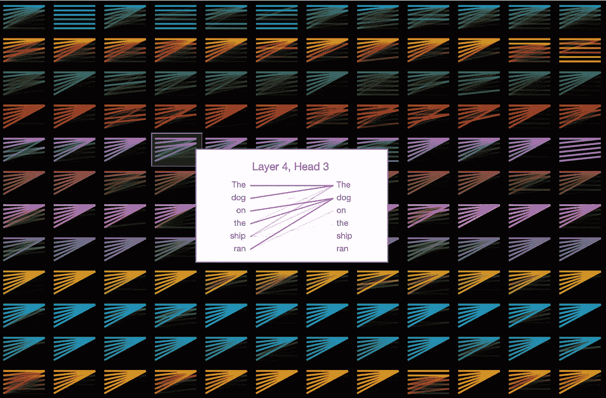**

**Visualization of the attention patterns across the model’s 12 layers (rows) and 12 heads (columns), with Layer 4 / Head 3 selected (zero-indexed).**

**我们可以看到这些模式有许多不同的形式。这里还有一个有趣的例子:**

**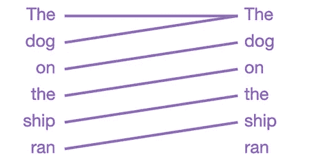**

**这一层/头把所有注意力集中在句子中的**前一个词**上。这是有意义的，因为相邻的单词通常与预测下一个单词最相关。传统的 [*n* -gram](https://en.wikipedia.org/wiki/N-gram) 语言模型也是基于同样的直觉。**

**但是为什么这么多的注意力模式是这样的呢？**

**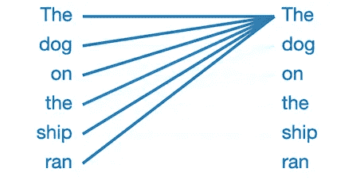**

**在这种模式下，几乎所有的注意力都集中在句子中的第一个单词上，其他单词都被忽略了。这似乎是零模式，表明注意力头没有发现它正在寻找的任何语言现象。当没有更好的关注点时，该模型似乎已经将第一个单词重新定位为要查找的地方。**

## **____ 中的猫**

**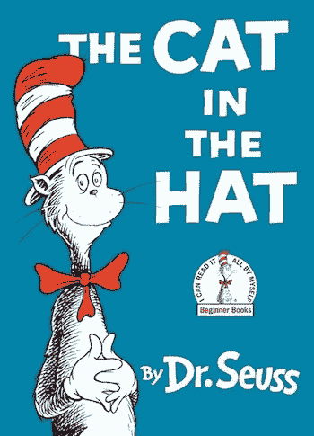**

**好吧，如果我们要让 NLP 玷污我们对芝麻街的记忆，那么我想苏斯博士也是公平的游戏。让我们看看 GPT-2 是如何完成经典作品《戴帽子的猫》中的这些台词的**

> **在一只风筝线上，我们看到了妈妈的新衣服！她的礼服上有粉色、白色和…**

**GPT 2 号是这样完成最后一句话的:**

> **她的礼服上有粉色、白色和蓝色的圆点。**

**不算太差！原文有*红色*，至少我们知道不只是背。**

**那么 GPT 2 号是如何知道选择颜色的呢？也许是因为下面的注意模式似乎能识别逗号分隔的列表:**

**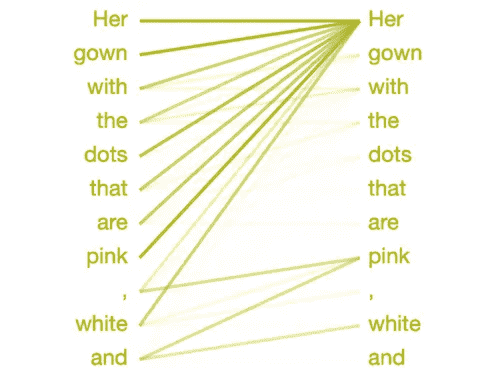**

**为了确定在*和*之后的单词，模特将注意力集中在列表中的前面的项目上——粉色*和白色*。它知道挑选一个与前面项目类型相匹配的单词，在这个例子中是一种颜色。**

**名字有什么意义？**

**GPT-2 似乎特别擅长只根据一个名字写短篇传记。**

****

**作为一个实验，尝试让 GPT-2 [从提示*中生成文本*](https://gpt2.apps.allenai.org/?text=Who%20is)“谁是<你的名字>？”这个特殊的提示通常会触发模型写一篇简短的传记，可能是因为这是网络文章中作者传记的常见序言。**

**下面是为提示“谁是杰西·维格？”生成的几个 bios。：**

> **“杰西·维格是社交媒体营销专家，曾任社交媒体营销经理。他是 VigMedia.com 的联合创始人兼首席执行官，最近又是 vig media . com 的创始人兼首席执行官。”**

**还不错！有点重复，但以一种意想不到的方式很好地将故事个性化。这里还有一个:**

> **“杰西·维格是一位名叫詹姆斯·维格的福音传教士的儿子。他于 1964 年移居美国，成为密歇根大学的一名传教士，在那里他教了 18 年书，直到 2007 年 10 月去世。**

**在这最后一个例子中，GPT-2 足够聪明，知道我的另一个自我的父亲有相同的姓。让我们看看 GPT 2 号在选择最后一个名字时将注意力集中在哪里:**

**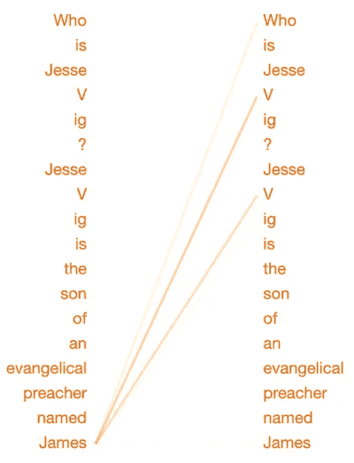**

**Layer 11 / Head 10**

**当决定在*詹姆斯*之后预测的单词时，这种模式将注意力集中在我的姓的先前提及上。(注意，在模型内部， *Vig* 已经被分成单词块“*V”*和“*ig”*，因为它是一个不常用的单词。)似乎这种注意模式专门识别家族名字之间的关系。为了测试这一点，让我们稍微修改一下文本:**

***“杰西·维格是一位名叫詹姆斯的福音传道者的* ***同事****……***

**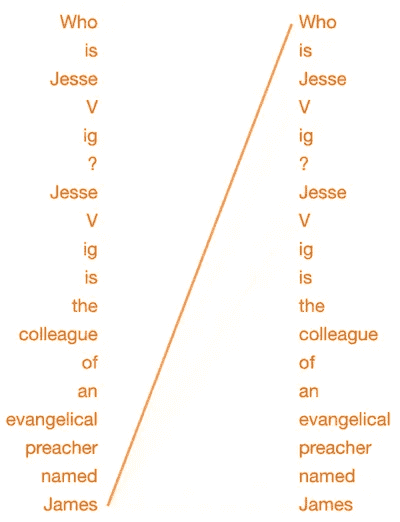**

**Layer 11 / Head 10**

**现在詹姆斯只是一个*同事*，这种注意力模式几乎完全忽略了我的姓。**

> **注意:《GPT-2》似乎是根据一个名字的种族和性别来生成传记的。需要进一步的研究来了解这个模型可能会编码什么样的偏见；你可以在这里阅读更多关于这个话题[的内容。](http://www.fatml.org/)**

# **未来是可生成的**

**就在去年，生成各种内容的能力——图像、视频、音频和文本——已经提高到我们不再相信自己的感官和判断的程度。**

**而这仅仅是开始；这些技术将继续发展，并变得更加相互融合。很快，当我们看着[thispersondoesnotexist.com](http://thispersondoesnotexist.com)上生成的面孔时，他们会迎着我们的目光，和我们聊起他们生成的生活，揭示他们生成的人格的怪癖。**

**最直接的危险也许是真实与生成的混合。我们已经看过了奥巴马作为人工智能傀儡的视频和和与的奇美拉的视频。很快，这些 [deepfakes](https://en.wikipedia.org/wiki/Deepfake) 就会变成个人的了。所以，当你妈妈打电话说她需要 500 美元电汇到开曼群岛时，问问你自己:这真的是我妈妈吗，还是一个语言生成人工智能从我妈妈 5 年前发布的脸书视频中获得了她的语音皮肤？**

**但是现在，让我们先欣赏一下关于会说话的独角兽的故事。**

*****关于这个和相关项目的更新，请随时关注我的*** [***推特***](https://twitter.com/jesse_vig) ***。*****

**【**更新】:** *厄尼*现正式拍摄(两次！)—参见通过 k**N**owledge**I**nt**E**gration 和[E**E**enhanced Language**R**presentation 通过 I**N**Eentities](https://arxiv.org/abs/1905.07129)按原样**

****资源:****

**[GitHub repo](https://github.com/jessevig/bertviz) 用于 Jupyter 和 Colab 笔记本电脑的可视化工具，使用这些出色的工具/框架构建:**

*   **[Tensor2Tensor 可视化工具](https://github.com/tensorflow/tensor2tensor/tree/master/tensor2tensor/visualization)，由 [Llion Jones](https://medium.com/u/a3ad3e75263b?source=post_page-----8252f683b2f8--------------------------------) 打造。**
*   **[拥抱脸](https://medium.com/huggingface)的 [Pytorch 实现](https://medium.com/syncedreview/hugging-face-releases-pytorch-bert-pretrained-models-and-more-b8a7839e7730)的 GPT-2**

****供进一步阅读:****

**[解构 BERT:从 1 亿个参数中提取 6 种模式](/deconstructing-bert-distilling-6-patterns-from-100-million-parameters-b49113672f77)**

**[解构伯特，第 2 部分:可视化注意力的内部运作](/deconstructing-bert-part-2-visualizing-the-inner-workings-of-attention-60a16d86b5c1)**

**[人工智能玩疯狂图书馆，结果是可怕的](/a-i-plays-mad-libs-and-the-results-are-terrifying-78fa44e7f04e)**

**[图解变压器](http://jalammar.github.io/illustrated-transformer/)教程**