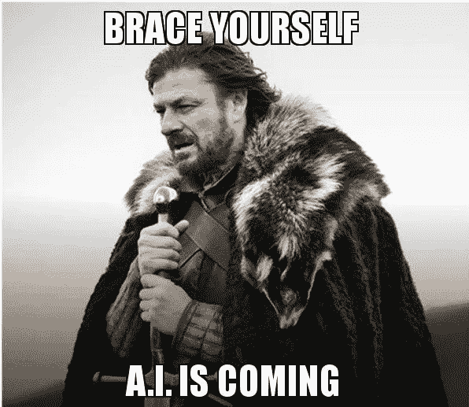
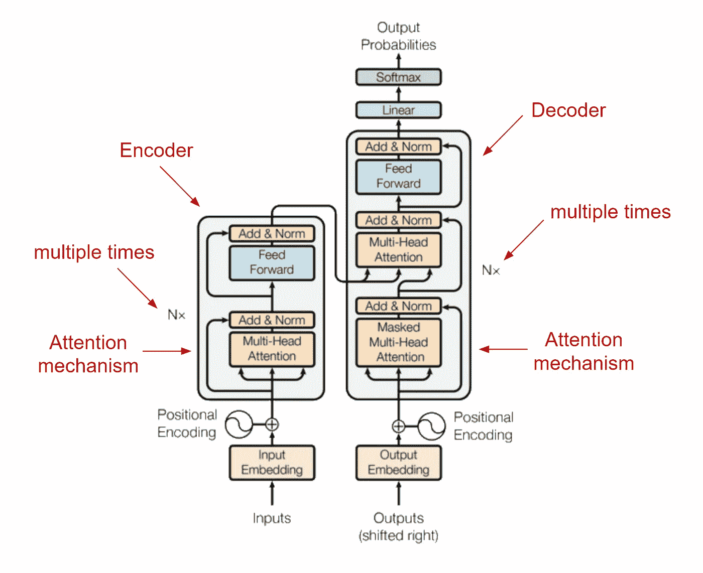
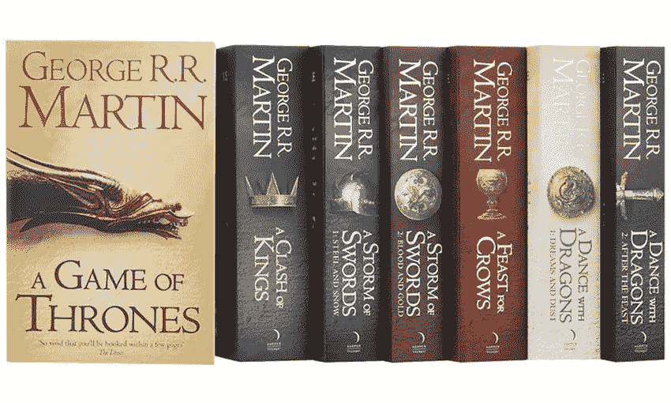
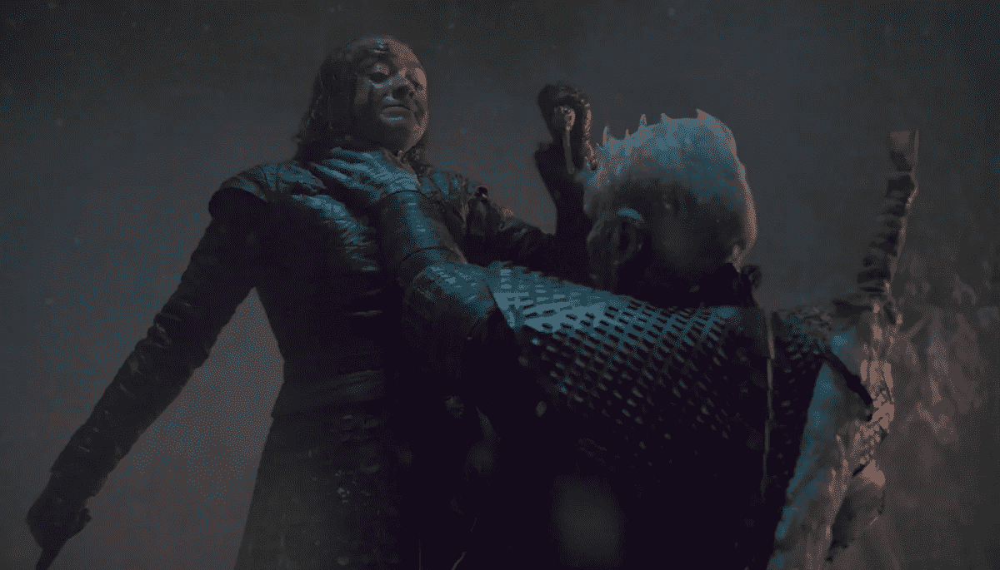
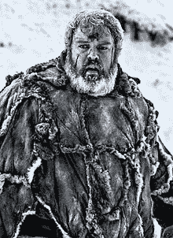
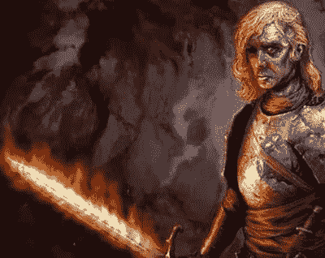
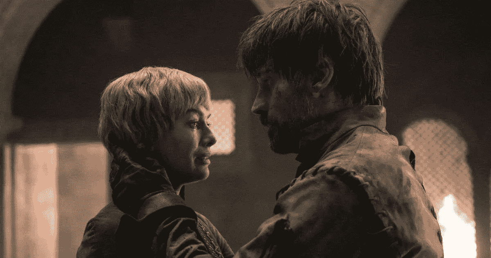
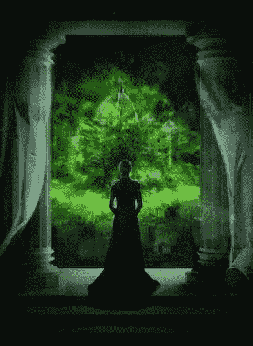
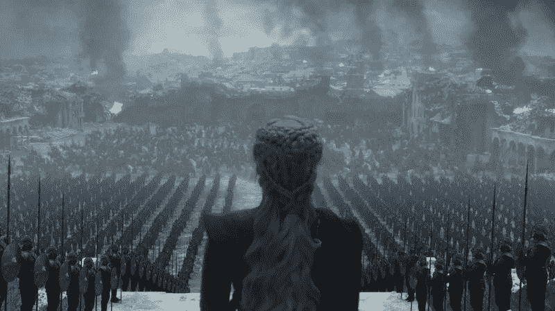
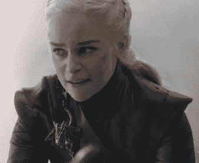

# 《开放的 GPT 2》为《权力的游戏》写了不同的结局

> 原文：<https://towardsdatascience.com/openai-gpt-2-writes-alternate-endings-for-game-of-thrones-c9be75cd2425?source=collection_archive---------4----------------------->

我在 GRRM 的书系列*《冰与火之歌》*上训练了 GPT-2 语言模型，并让它完成了 HBO 节目的故事情节。它能比 HBO 的第八季《火车残骸》更好吗？

Game of Thrones season 8 storyline has left its fandom divided with millions of fans disappointed by its rushed and unsatisfactory ending. Disclaimer: ***Opinions expressed in this article are solely my own.***

[《权力的游戏》](https://www.hbo.com/game-of-thrones)第八季的故事情节让粉丝们产生分歧，[数百万](https://www.change.org/p/hbo-remake-game-of-thrones-season-8-with-competent-writers)粉丝(包括我自己)对其仓促且不尽如人意的结局感到失望。许多人呼吁重写这部电视剧的最后一季，而其他人则提出了他们自己版本的结局，以获得一个满意的结局。其他人正在等待 GRRM 完成他的书，希望他能为人物的不可信行为提供一个更令人信服的构建，但这可能需要很多年。因此，我想让一个人工智能学习 GRRM 的写作风格，并让它完成节目的结尾。

在这篇文章中，我将解释我们如何通过使用名为 [GPT-2](https://openai.com/blog/better-language-models/) 的文本生成语言模型来实现这一点，该模型由 Open AI 的研究人员在 2019 年初推出。然后，我将分享这一季三个主要反派的故事情节的模型预测结果:夜王、瑟曦·兰尼斯特和丹妮莉丝·坦格利安。

# 生成式预训练变压器 2 (GPT-2)

GPT-2 是目前人工智能语言建模中最先进的文本生成模型。它能够产生类似人类的连贯句子，并且能够长时间专注于一个主题。与其他语言模型相比，它令人印象深刻的改进归功于这项研究的两个主要贡献

1.  **大量数据:**搜集并整理了 800 万个网页，形成了一个 40GB 的文本语料库，可以对其进行无监督训练。它涵盖了各种各样的主题，这就是为什么预训练模型非常适合将学习转移到特定领域，就像我们的 GoT 书籍一样。
2.  **大量计算:**它使用 15 亿(！！)在其基于变压器的网络架构中的参数。然而，他们只发布了这个模型的一个较小版本，包含“仅”3.45 亿个参数，引用了[安全原因](https://www.theverge.com/2019/2/21/18234500/ai-ethics-debate-researchers-harmful-programs-openai)。我们将使用这个版本的预训练模型来执行 GoT 脚本的迁移学习。

## 变压器模型

GPT-2 使用变压器网络架构，而不是通常用于序列建模的传统 RNN/LSTM/GRU 网络。Transformer 使用基于注意力的机制和一对编码器/解码器，而不是带有“记忆”门和时间步长的循环单元。

编码器在字节对和位置嵌入的帮助下处理输入，字节对和位置嵌入描述输入句子中单词的“是什么”和“在哪里”(嵌入)。同一个编码器将字节和位置嵌入转换为矢量编码，然后进入解码器，解码器的任务是将编码转换为目标文本序列。该输出和来自前一步骤的编码被馈送到下一编码-解码步骤，并且被重复多次以产生进一步的文本。这里有一篇优秀的[文章](https://blog.floydhub.com/the-transformer-in-pytorch/)详细解释了这个模型架构。

Overview of a general attention-based Transformer model. [source: Attention Is All You Need’ by Vaswani et al.]

请注意，GPT-2 被训练为预测给定输入句子中的下一个单词，其假设是，为了相当准确地预测下一个单词，模型将被迫学习到目前为止它遇到的所有单词的上下文含义。如果不理解文本，语言模型可能只能预测语法正确的单词，但生成的文本不会完全有意义。因此，这种使网络预测足够好的下一个单词的公式，GPT-2 能够获得对输入文本的深刻理解。[这里](https://www.youtube.com/watch?v=T0I88NhR_9M)是伊利亚·苏茨基弗对这个概念的一个很好的解释。

GPT-2 在文本生成期间不需要编码器，因为它不是像语言翻译那样的 seq2seq 转换任务。所以一旦训练结束，编码器就不再需要了。GPT-2 仅使用来自预训练转换器的解码器来生成后续文本。

## **训练模特**

我从乔治·R·R·马丁的书系列*“冰与火之歌”*的所有 5 本书中提取了文本，并将它们连接起来准备训练文本。使用具有 345M 参数的预训练的 GPT-2 模型对该文本执行迁移学习。

George R.R. Martin’s Book Series **“A Song of Ice and Fire”.**

令人惊讶的是，我注意到预先训练的模型也非常擅长写关于《权力的游戏》角色的内容，这意味着它在 800 万网页的初始训练中接触过这些内容。不管怎样，我决定缩小这个“一般化”模型的范围，只按照 GRRM 的风格编写，所以继续在我们的 GoT 数据集上进行训练。该模型在 Google Colab 的 K80 GPU 上训练了大约 12 个小时。

# 结果

让我们尝试解决一些令人失望的结局或故事情节的转折，并尝试使用我们训练有素的 GPT-2 模型预测这些场景的替代结局。

下面是视频格式的结果，后面是文本格式的结果。选择自己的冒险。

## 失望 1:夜王虎头蛇尾的结局

> **输入:**夜王慢慢走到三眼乌鸦面前。琼恩被冰龙挡住，丹妮莉丝被怀特一家团团围住。夜王伸出他的冰剑想要杀死布兰，但突然
> 
> **输出:**阿多阻止了他，他仍然用他的大手抓着冰原狼。“阿多！”乌鸦叫道。“阿多！阿多！”黑魔王脸上带着失落的表情。他用树桩刺穿布兰的背部，开始搏斗、翻滚、旋转。怀特，巨人，半身人，稻草人。布兰与夏莫、老鹰、笨狗和陌生人并肩作战，但光之王绝不会以剑挡剑。乌鸦在说，只是爬上阿多的厚雪白的腿。

据 GPT 2 号说，阿多还活着，他来营救布兰，真是个意外！或者它可能是被布兰注入的阿多的不死之身。但是之后我就不知道模特想说什么了，哈哈！

> **输入:**夜王慢慢走向三眼乌鸦。琼恩被冰龙托起，丹妮莉丝被狼人包围。夜王伸出他的冰剑想要杀死布兰，但突然意想不到的事情发生了。
> 
> **输出:**剑发出炽热的红光。当剑刃击中夜之眼时，它周围的绿色玻璃裂开了，光溶解了，剑像死冰一样发光。然后乌鸦开始尖叫，远处的猫头鹰在龙的左边和右边，有东西正在还击，撞开门，杀死所有长着娃娃脸的傻瓜。我猜 Osha 在给 Rickon 演示如何装弹。也许战斗结束后，他们都会是很好的倾诉对象。

尽管节目主持人忘记了，GPT-2 记得亚梭尔·亚亥的预言，并围绕着杀死夜王的剑光明使者的想法起舞。如果夜王的冰剑最终被证明是光明使者并杀死他，那该有多酷啊？！

> 输入:布兰说，“席恩，你是个好人。谢谢大家。”！席恩，带着他的救赎之弧，奔向夜王的死亡。就在他要用长矛刺穿夜王的时候，
> 
> **输出:**龙——还是另一个？——朝他的脸开了一枪，而夜王平静地看着。世界缩小到三个人，肩并肩站在一起；红色的牧师和他的长矛，国王穿着蓝色，他的皇冠在他的头上。一股寒风穿过冰冷的空气吹进席恩的脑袋，他也能听到他的兄弟们在喊叫。如果我不是那么坚强。。。杀了他，他想喊，但是勇气从他身上消失了，就像他身体的一部分被迫保持沉默。取而代之的是，他弯曲他残废的手臂，扔掉他的矛杆。他告诉自己，给自己留点伤，尽你所能跑吧。

这一篇让我大吃一惊，不是因为它写得很棒(其实不是)，而是因为模型知道龙实际上是一个“他者”(这意味着书中的白行者)。它怎么会知道维塞隆是一条被夜王控制的不死龙呢？韦赛里翁向席恩喷火，折断了他的长矛。席恩，在这一刻，决定在恐惧中逃跑，就像他在这个节目中所做的一样。把所有这些细节都写在一段话里，这太巧合了。令人惊讶的是，模特已经知道了角色的这些细节！

## **失望 2:** 瑟曦·兰尼斯特在没有任何计划和适当战斗的情况下被轻易击倒

> **输入:**巨龙已经烧毁了整个兰尼斯特的军队，钢铁舰队和黄金军团，但是瑟曦依然坚信红堡不会陷落。当恶龙即将烧毁红堡的塔楼时，詹姆前来营救瑟曦。此时此刻，
> 
> 他的心提到了嗓子眼，手掐着喉咙……他不知道如何呼吸……”艾莉亚颤抖着提利昂说兰尼斯特家有刀。"“他说他们有剑，”詹姆承认道。"詹姆杀托曼不是为了保住托曼的贞操，”艾莉亚说，把自己的故事告诉了身旁脸红的男孩提利昂·兰尼斯特。他的小弟弟只是咧嘴一笑。”不，我没有。"詹姆狠狠地瞪了她一眼。"很好。你撒谎。是的，你对那个吻撒了谎。你用嘴杀死了托曼，这既不是吻也不是承诺。只有一两把剑。你伤得很重，小家伙。不管怎样，只要那个脏男孩珍惜你给他的礼物，你姐姐就会把他留在她的床上。"

嗯，好吧，这个完全是垃圾。但我还是留着它，因为它太傻了，实际上很有趣。不管怎样，让我们再试一次！

> **输入:**龙族已经烧毁了整个兰尼斯特军、铁血舰队和黄金连队的军队，但瑟曦依然坚信红堡不会陷落。当恶龙即将烧毁红堡的塔楼时，詹姆前来营救瑟曦。此时此刻，
> 
> **输出:**根据她的预言，疯王将进攻这座城市……“瑟曦，”詹姆又说了一遍，尽量让声音听起来严厉而遥远，“静静地，哦，甜蜜，哦，甜蜜。”他给特罗特写道:“瑟曦，记住，你是凯岩城的国王。记住你是谁，你是什么。还记得你是如何杀死疯王的吗？原谅我，如果我让你犹豫不决。”她没有回答。“原谅我，”他热情地重复道，“为了我从未有过的母亲，你从未有过的母亲，一个所有人都认识并爱着却不认识的母亲。”当刀刃入鞘时，鹰在油的波纹上闪着微光，天花板上的字闪闪发光，又亮又暗…

这次稍微好一点！虽然这个模型在某些细节上出错了，特别是关于疯王的，但我确实喜欢詹姆在那一刻试图给瑟曦力量的想法。也许在这个时候使用某种野火会给她的故事情节带来一些正义感。两个疯狂的女王，以火攻火，烧毁了城市的其余部分。这将是一个更好的结局，表明为什么争夺铁王座的战争是不好的。

## **失望 3:** 丹妮莉丝不劳而获的脚后跟转弯

> **输入:**丹妮莉丝在埃索斯和弥林拥有爱和恐惧。但在维斯特洛，她觉得自己只有恐惧。在她赢得铁王座之战的那一刻，她只能想着给她将要统治的人民灌输恐惧。丹妮莉丝在君临坐在她的龙上，她决定要
> 
> **输出:**吃。“有牙齿的食物，”乔拉爵士说。“我想尝尝那个，”丹妮抱怨道。"吃红肉喝麦芽酒不太像多斯拉克人."她想起了过去的时光，那时她的卡拉萨在长枪党统治时期是国王的住所，多斯拉克人肥胖的卡拉萨在骑马南下消灭其他多斯拉克人之前，会在他们的杯子里倒满美酒、鱼餐和烤芜菁。这只是供思考的食粮。我会大吃大喝，假装休息，直到龙再次出现，杀死我们所有人。

总是吃喝的好时机，对吧？我听说君临有一家不错的咖啡店，丹妮可以去试试(如果它还没被烧毁的话)。这很糟糕，让我们再试一次。

> 丹妮莉丝在埃索斯和弥林拥有爱和恐惧。但在维斯特洛，她觉得自己只有恐惧。在她赢得铁王座之战的那一刻，她只能想着给她将要统治的人民灌输恐惧。丹妮莉丝在君临坐在她的龙上，她决定要
> 
> 保护这座城市，并为任何试图逃跑的人准备好坦格利安的灾难和恐怖，是的，包括人类。有人告诉她，一些巨人可能会杀死她，但丹妮莉丝摇摇头说:“没有巨人喜欢长得像巨人一样大。后来，后来，没有人愿意孤独地死在树林里。”她又读了一遍信。“昆汀王子，我忠诚的仆人们，我见过你们这样愚蠢的傻瓜，但我从未见过你们这样愚蠢的傻瓜。你的生命在众目睽睽之下被夺走了。丹妮莉丝是唯一能救你的人。”

所以这也没什么意义，但似乎坚持了丹妮想把君临的人民从那些准备“屈膝”且不打算逃跑的暴君手中解放出来的叙事。

# 结论

我试图为这些故事情节生成更多的样本，但没有一个在整个节目的背景下有很大的意义。即使对故事情节的理解不是很好，该模型也清楚地展示了学习该剧角色及其某些特质的能力，并在其输出中创建这些角色之间的关联。比如，我看到乔拉爵士在故事情节中出现在谈论丹妮的时候，阿多在谈论布兰的时候出现。而且它往往把这些角色之间的关系处理得恰到好处，真的让人印象深刻！

我认为这显示了随着 OpenAI 的 GPT-2 研究工作，NLP 研究已经前进了多远。我很想知道最大的 GPT-2 型号在这项任务中表现得有多好。也许如果更大的模型被发布，我会回来更新这篇文章。

至于想要一个令人满意和明智的《权力的游戏》结局，我想当代的人工智能帮不了我们，我们必须等待乔治·R·R·马丁完成他的书。愿他万岁！

想在你的浏览器上试试《GPT 2》的《权力的游戏》模型吗？用于测试预训练模型的 Google Colab 笔记本链接如下([为该笔记本提供](https://github.com/ak9250))。

 [## 谷歌联合实验室

### 权力的游戏 GPT-2 文本生成器

colab.research.google.com](https://colab.research.google.com/drive/18pLqrk1j4RQ1RNh69Fa-5WkoTeD4uzwq) 

**参考文献**

*   [如何构建 OpenAI 的 GPT-2:“太危险而无法释放的 AI”](https://blog.floydhub.com/gpt2/)
*   [如何在 PyTorch 中对变压器进行编码](https://blog.floydhub.com/the-transformer-in-pytorch/)
*   [变形金刚:注意力是你需要的全部](https://mchromiak.github.io/articles/2017/Sep/12/Transformer-Attention-is-all-you-need/#.XOTHdMhKiM8)
*   [在浏览器上玩 GPT-2](https://gpt2.apps.allenai.org)

感谢您的阅读。如果你喜欢这篇文章，你可以在[媒体](https://medium.com/@chintan.t93)、 [GitHub](https://github.com/ChintanTrivedi) 上关注我的更多作品，或者订阅我的 [YouTube 频道](http://youtube.com/c/DeepGamingAI)。动手吧。弯曲膝盖。或者面对我的龙。