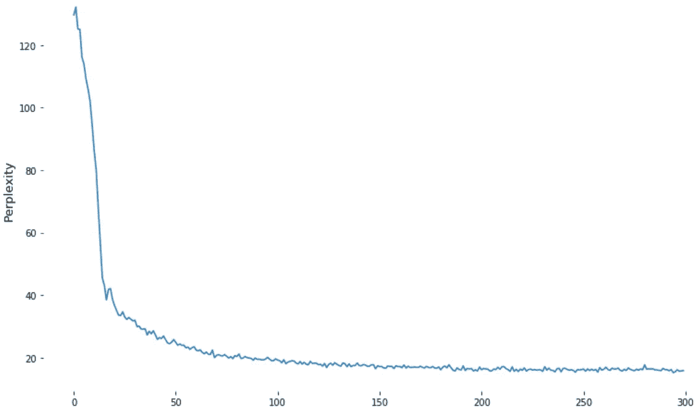
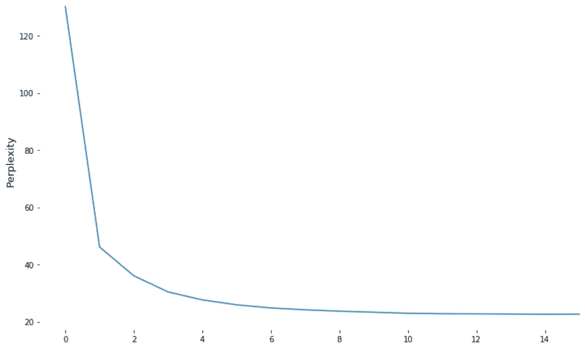

# 基于 TensorFlow Keras 的古腾堡开放 GPT 语言建模

> 原文：<https://towardsdatascience.com/openai-gpt-language-modeling-on-gutenberg-with-tensorflow-keras-876f9f324b6c?source=collection_archive---------18----------------------->

Photo by Camille Orgel on Unsplash

# 1.介绍

2018 年对于深度自然语言处理社区来说是不平凡的一年。大型预训练模型，open ai[**【GPT】**](https://openai.com/blog/language-unsupervised/)和 [**GPT-2**](https://openai.com/blog/better-language-models/) 和 Google [**BERT**](https://arxiv.org/abs/1810.04805) ，在几个监督和非监督任务上取得了 SOTA(“最先进”)的结果。发布这些模型有助于在许多 NLP 任务中获得更好的结果(就像 ImageNet 在视觉领域所做的那样)。

我们一直在做的项目(一种讲故事的方式)需要一个强大的语言模型来促进自然语言的生成。本文介绍了在这项任务上所做的努力，包括技术细节和结果。完整代码以回购的形式发布在我们的团队 GitHub 中:

 [## ShenakhtPajouh/GPT-语言-模型-tf.keras

### 在 GitHub 上创建一个帐户，为 ShenakhtPajouh/GPT-语言-模型-tf.keras 开发做出贡献。

github.com](https://github.com/ShenakhtPajouh/GPT-language-model-tf.keras) 

# 2.动机

根据 [Tensorflow 的网站](https://www.tensorflow.org/guide/keras):

> Keras 是一个高级 API，用于构建和训练深度学习模型。它用于快速原型制作、高级研究和生产，具有三个关键优势:**u*ser friendly****，* ***模块化和可组合*** *，以及* ***易于扩展*** *。*

此外，您可以在会话模式和快速执行模式下运行 TensorFlow Keras 模型。

OpenAI GPT，简称**g**generate**p**re-trained**t**transformer**，**是一个在庞大语料库上训练出来的多层单向 [transformer 解码器](https://arxiv.org/abs/1801.10198) ⁴。它的开发目标是通过微调来很好地执行各种任务。OpenAI 于 2018 年 6 月发布了 GPT 的论文、代码和预训练的权重。

2019 年 2 月，OpenAI 发布了 GPT-2，这是 GPT 的继任者，其参数超过 10 倍，数据量超过 10 倍。它被训练来预测下一个单词，并在 8 个测试语言建模数据集的 7 个上达到 SOTA 结果，而没有任何特定任务的微调！不可思议，不是吗？为了把樱桃放在最上面，OpenAI 决定不完全发布训练模型，而是发布一个小得多的模型，因为他们担心恶意应用程序 T2。

由于 OpenAI 成就和无法访问 GPT-2 完整模型，并且由于从空白状态学习更难取得成功，我们决定受益于**转移学习**技术并使用 TensorFlow Keras 实现 GPT。

# 3.履行

原始 GPT 被实现以在语言模型和分类任务上表现良好。因为我们只需要一个语言模型，所以我决定简化它的架构。有一个由 [Ceshine Lee](https://github.com/ceshine) 设计的重构满足了这个需求。查看他解释原始和修改模型的帖子:

 [## [注意]通过生成性预训练提高语言理解

### 练习:从微调后的模型重建语言模型

medium.com](https://medium.com/the-artificial-impostor/notes-improving-language-understanding-by-generative-pre-training-4c9d4214369c) 

上面的帖子包含了对变形金刚、GPT 和修改的详细解释，所以这篇帖子的其余部分将涵盖我所做的其他更改。

## 3.1.数据迭代器

我们使用 Guttenberg 数据集来重新训练模型。它包含超过 140，000 个段落。每一个样本都是一段被 [BPE](https://arxiv.org/abs/1508.07909) ⁵符号化的段落(带着尊重的面具)。所以在`[iter_data](https://github.com/ShenakhtPajouh/last-sentence-generation-transformer/blob/master/utils.py#L51)`函数中，段落被打乱并通过小批量返回:

## 3.2.将张量流模型转换为 tf.keras 模型

[整个变压器网络已经改造成 tf.keras](https://github.com/ShenakhtPajouh/last-sentence-generation-transformer/blob/master/model.py) 。作为网络一部分的每个张量流函数都被重新实现。`model`、`embed`、`block`、`attn`、`mlp`、`norm`、`cov1d`函数被转换为`Transformer`、`EmbeddingLayer`、`Block`、`Attention`、`MLP`、`Norm`、`Conv1D` 类，这些类是 tf.keras 模型和层。

## 3.3.添加自回归模块

开发 GPT 的初衷并不是为了成为一个语言生成器。因此，它不具备生成文本的自回归模块。所以我们决定设计一个快速语言生成器，采用贪婪解码(它在每一步选择最有可能的下一个标记)。

在生成的每一步，该模块应该处理并获取下一个令牌的 logits，选择最可能的令牌，并在下一步为新序列执行该过程。

获取下一个令牌的 logits 的一个简单方法是传递整个令牌序列(带有生成令牌的早期令牌)。但是太慢了！*为什么？*因为它在每一步都有一个重复的操作:对于每一个 *i，j < k* ，计算 *i* 和 *j* 之间的注意力来预测第 *k* 个令牌。

我们的方法简单地省略了这个重复的操作。我用`mem_k`和`mem_v`来记忆键和值矩阵。首先， [init_model](https://github.com/ShenakhtPajouh/last-sentence-generation-transformer/blob/master/init_model.py) 对输入序列进行预处理，将关键字和值存储在`mem_k`和`mem_v`中，并选择下一个令牌。

然后在每次迭代中， [gen_model](https://github.com/ShenakhtPajouh/last-sentence-generation-transformer/blob/master/gen_model.py) 获得查询、密钥和前一个令牌的值。然后将关键字和查询添加到`mem_k`和`mem_v`，并计算关注度。

有一些方法可以根据其分布生成下一个令牌。最简单的方法是**贪婪解码**。我们在每一步选择最可能的记号。**波束搜索**是另一种试图解决贪婪解码问题的著名技术。但是他们都有相同的内在问题，导致他们无法产生人类文本。(在这篇[论文](https://arxiv.org/abs/1904.09751)中，⁶解释了这些方法的缺点)

因此，在一些论文中，这两种方法被基于抽样的替代方法所取代。在这些方法中，在每一步，我们从下一个令牌分布中进行采样。我们实现了两个强大的解码器，称为 **top-k 采样**和 **nucleus(top-p)** 采样(【2】、【6】、【7】)。这确实提高了我们模型的世代。

您可以在[实用程序](https://github.com/ShenakhtPajouh/GPT-language-model-tf.keras/blob/master/utils.py#L126)中找到解码器的代码:

# 4.重新训练模型

我用 [Adam optimizer](https://arxiv.org/abs/1412.6980) 尝试了几种常用的训练方法，都失败了。然后，根据 ULMFiT 的论文，我做了一些改变:

*   亚当换成梯度下降。亚当技术极有可能让你的模型忘记预先训练好的权重。
*   我还使用了倾斜的三角形学习率(STLR)。它在一小部分训练步骤中线性地增加了学习率。然后，它在剩余步骤中线性降低学习速率。如论文中所述，“*我们希望模型在训练开始时快速收敛到参数空间的合适区域，然后优化其参数。*”于是 STLR 提出了。经过一些失败之后，我为 STLR 找到了一些好的超参数:

在和 STLR 一起训练后，我用一个简单的非线性衰减学习率继续训练:`lr -= lr * (1 / t ** 0.5)`

# 5.结果

下面的学习曲线清楚地显示了 STLR 技术的效率。(因为仅在 2400 步之后，列车困惑度就显著下降)

train ppl in 30,000 steps.

验证集的复杂度从 130.21 降低到 22.57。

validation ppl

# 6.承认

我衷心感谢实现了一些 Transformer 模块的茯苓 Yavari 和实现采样解码器的 Mehrnaz Mofakhami。

# 7.参考

[1] [*利用无监督学习提高语言理解*作者:亚历克·拉德福德、卡蒂克·纳拉西姆汉、蒂姆·萨利曼斯和伊利亚·苏茨基弗](https://s3-us-west-2.amazonaws.com/openai-assets/research-covers/language-unsupervised/language_understanding_paper.pdf)

[2] [*更好的语言模型及其含义*作者:亚历克·拉德福德、杰夫·吴、雷文·柴尔德、大卫·栾、达里奥·阿莫代伊和伊利亚·苏茨基弗](https://d4mucfpksywv.cloudfront.net/better-language-models/language_models_are_unsupervised_multitask_learners.pdf)

[3] [*BERT:用于语言理解的深度双向转换器的预训练*作者:Jacob Devlin，张明蔚，Kenton Lee，Kristina Toutanova](https://arxiv.org/abs/1810.04805)

[4] [*通过总结长序列生成维基百科*作者:Peter J. Liu，Mohammad Saleh，Etienne Pot，Ben Goodrich，Ryan Sepassi，Lukasz Kaiser，Noam Shazeer](https://arxiv.org/abs/1801.10198)

[5] [*由 Rico Sennrich，Barry Haddow，Alexandra Birch*](https://arxiv.org/abs/1508.07909) 编写的具有子词单元的罕见词的神经机器翻译

[*阿里·霍尔茨曼著《神经文本退化的奇特案例》*](https://arxiv.org/abs/1904.09751)

*[7] [*分层次的神经故事生成*由安吉拉·范、、扬·王太子](https://arxiv.org/abs/1805.04833)*