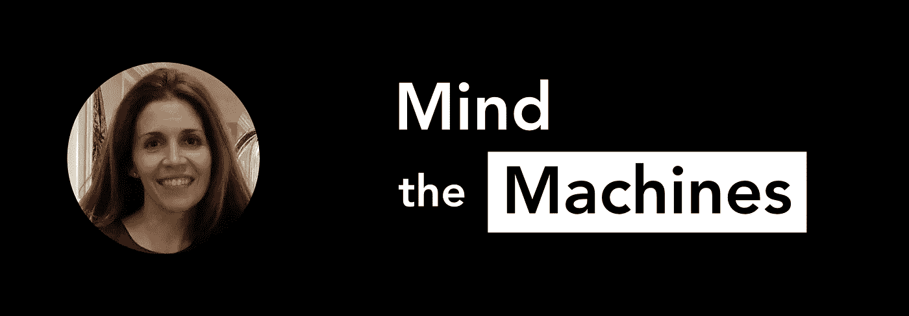

# OpenAI 的克里斯汀·佩恩谈人工智能产生的音乐和超级智能之路

> 原文：<https://towardsdatascience.com/openais-christine-payne-on-ai-generated-music-and-the-road-to-super-intelligence-580f5063093?source=collection_archive---------29----------------------->

她在普林斯顿学习物理，在斯坦福学习神经科学和医学。

她是受过古典音乐训练的钢琴家。

她刚刚发明了一种算法，可以让音乐家失业。(嗯，可能不会，但这确实是一个令人印象深刻的算法)

克里斯汀·佩恩是 [MuseNet](https://openai.com/blog/musenet/) 的作者，这是一个基于 OpenAI 的[现在臭名昭著的](/do-no-evil-why-we-need-a-public-conversation-about-ai-ethics-17366fb0f148) [GPT-2 模型](https://openai.com/blog/better-language-models/)的深度神经网络，可以自动生成几乎任何你想要的风格的歌曲。

我们和 Christine 坐下来谈论 MuseNet，人工智能的未来，以及 OpenAI 防止机器人启示录的任务。请点击这里查看，别忘了在 Twitter 上关注她， [@mcleavey](https://twitter.com/mcleavey) ！