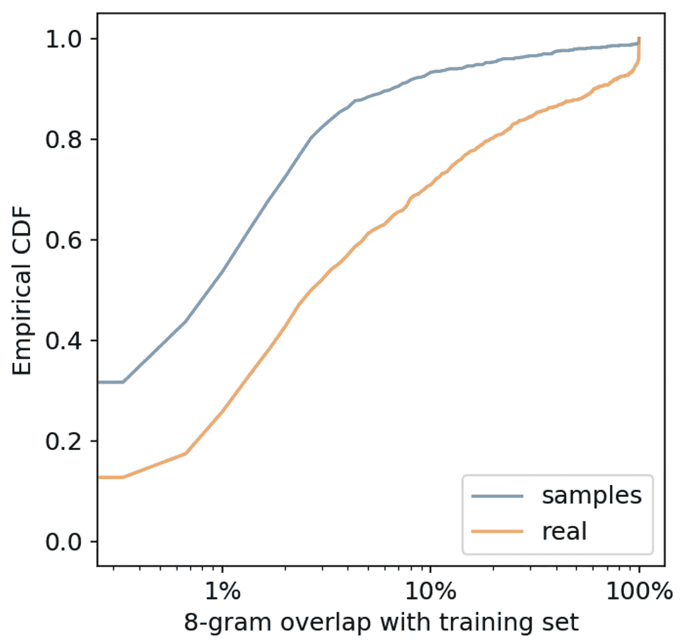

# OpenAI 的 GPT-2:模型、宣传和争议

> 原文：<https://towardsdatascience.com/openais-gpt-2-the-model-the-hype-and-the-controversy-1109f4bfd5e8?source=collection_archive---------3----------------------->

上周四，OpenAI [发布了](https://blog.openai.com/better-language-models/)一个叫做 GPT-2 的超大型语言模型。该模型可以基于一些种子文本生成各种风格的真实文本，从新闻文章到同人小说。有争议的是，他们决定不公布他们最大模型的数据或参数，理由是担心潜在的滥用。已经是[挺](http://approximatelycorrect.com/2019/02/17/openai-trains-language-model-mass-hysteria-ensues/) [大](/should-i-open-source-my-model-1c109188b164) [大](https://www.fast.ai/2019/02/15/openai-gp2/)了。

我决定开一个博客，这样我就可以写这个了，因为我还没有看到一个帖子说了我想说的所有事情。我认为，对于机器学习社区来说，处理机器学习研究的潜在滥用是非常重要的。我还谈到了这项研究的技术价值，人类语言生成的社会意义，以及对 OpenAI 受炒作生成驱动的指责。

*(免责声明:2017 年 2-8 月在 OpenAI 实习，认识一些参与这项研究的人。这里陈述的观点是我自己的。)*

# 这项研究有什么好处吗？

我曾经致力于基于神经网络的对话系统，它被训练成在给定对话中先前响应的情况下预测下一个响应。我记得在 2016 年末，我浏览了我们的模型生成的样本，试图找到一个听起来似乎符合对话背景的句子。

所以当我读到 GPT 2 的[讲英语独角兽的故事](https://pbs.twimg.com/media/DzYpsJOU0AA1PO9.png:large)时，我相当震惊(如果你还没读过，我强烈推荐)。这个故事并不完美，中间有一些摇摆，但总的来说，它非常连贯。这实际上听起来像是一篇人类可以写的新闻文章。对我来说，不管采摘了多少樱桃，这都是一个令人难以置信的结果。如果有一个语言模型能够在没有显式记忆机制的情况下，在整篇文档中正确地回忆起豪尔赫·佩雷斯的名字，我会对这个语言模型有一定的印象。这完全是另一回事。我可能对最近的语言生成文学有点过时，但我不知道有任何模型接近这种水平的连贯性、语法性、长期上下文的使用和世界知识。

要明确的是:这里没有算法的贡献。他们“只是扩大了”之前的研究。但是我认为确切地看到这些放大的模型有多强本身就是一个重要的贡献。回想起来，“当然，更多的数据和计算会给你更好的模型”，这很容易，但如果我上周三向一位同事展示了独角兽的故事，并告诉他们这是人工智能生成的，我认为他们不会相信我。

[一些](https://twitter.com/roydanroy/status/1096222295952105472)人[怀疑](https://twitter.com/SecurelyHashed/status/1096456891696365569)这个模型是否只是记忆文本的“模板”并在正确的时间重复它们。在[的论文](https://d4mucfpksywv.cloudfront.net/better-language-models/language_models_are_unsupervised_multitask_learners.pdf)(附录 8.2)中讨论了这一问题，其中作者表明 GPT-2 的样本和它们的训练集之间的词重叠小于测试集和训练集之间的重叠。换句话说，GPT-2 表现出的记忆行为比随机选择的一部分人类文本要少。这似乎是相当令人信服的证据，表明该模型具有重要的泛化能力。

Figure 5 from the OpenAI GPT-2 paper. It shows the probability that GPT-2 samples (‘samples’) and human text from the test set (‘real’) have a certain % overlap with the training set. Much more of the ‘samples’ probability is at a lower % overlap.

我们应该对他们的结果持怀疑态度吗？关于 OpenAI 是否准确地呈现了他们模型的生成能力，有一个合理的问题。我个人希望看到他们输入 GPT-2 的输入数量，以获得显示的样本(即他们所谓的“元樱桃采摘”的程度)。然而，他们确实提供了数百个原始 GPT-2 样本的转储，这让我们对他们模型的能力有了更清晰的了解。他们还指出，对于每一篇高质量的 GPT-2 写作，需要多少样本才能实现，这在其他论文(包括我自己的论文)中并不常见。随着代码的发布，对我来说 OpenAI 的方法符合其他已发表的 NLP 论文的标准。

# **人为素质造假文本的社会影响**

现在谈谈争议。OpenAI 决定不公布其最大的 GPT-2 模型的权重，并表示担心“大型语言模型被用来大规模产生欺骗性、偏见或辱骂性的语言。”让我们暂时把 GPT-2 是否能做到这一点的问题放在一边，首先问一下:如果我们有一个开源模型，可以生成无限的人类质量的带有特定信息或主题的文本，那会是坏事吗？

我想答案是肯定的。的确，人类已经可以写假新闻，政府已经招募了成千上万的人来为他们的议程写有偏见的评论。但是一个自动化系统可以:(1)让那些没有资源雇佣成千上万人的坏人发动大规模的虚假信息运动；以及(2)大幅增加国家行为者已经在进行的虚假信息运动的规模。这些活动之所以有效，是因为人们在很大程度上[受到他们周围持有某种观点的人的影响](https://journals.plos.org/plosone/article?id=10.1371/journal.pone.0078433)，即使这种观点毫无意义。扩大规模应该相应地增加政府和公司对我们信仰的影响力。

为了解决这个问题，我们需要开始研究人工智能生成文本的检测方法。与虚假视频和语音检测相比，这将提出不同的挑战:虽然只需要一个高质量的虚假视频来影响人们的观点，但视频是非常高维的，并且可能更容易[检测到由 ML 模型产生的](https://theconversation.com/detecting-deepfake-videos-in-the-blink-of-an-eye-101072) [【伪像】](https://distill.pub/2016/deconv-checkerboard/)。另一方面，人工智能生成的假文本必须在大规模下才能产生影响(否则人类可以做到)，但由于文本由离散的单词组成，因此可能更难区分特定的文本片段是否是人工智能生成的，特别是如果它很短。

因此，有合理的理由认为，广泛发布一个完美的人类级别的文本生成器，而不考虑其含义，可能是一个坏主意。

# **AI 炒作，以及 OpenAI 的动机**

还有另一个原因，许多人假设为什么 OpenAI 保留了他们的模型参数——为他们的研究增加宣传价值。理论是，OpenAI 知道新闻媒体如果可以编造“AI 是危险的”叙事，就会更多地报道这项研究，因此保留了他们的模型，以便耸人听闻的新闻报道可以报道它们，从而增加公众对 OpenAI 的认可，并进一步巩固 OpenAI 的 AI 安全工作的感知价值。

OpenAI 还没有写他们与记者互动的方法，但我们可以填补一些空白。像其他工业实验室一样，OpenAI 显然关心公众的看法和认可。他们也明确地邀请记者写关于他们研究的故事(否则他们不会让 GPT 2 号接触他们)。最重要的是，由于 OpenAI 是一个非营利组织，他们获得了更大的优势来宣传他们的研究，因为这可能会增加捐款，从而增加他们做更多研究的预算。很难知道 OpenAI 对关于他们的新闻有多大的控制力，但是一些关于 GPT-2 的[头条](https://www.wired.com/story/ai-text-generator-too-dangerous-to-make-public/)和[文章](https://www.theguardian.com/commentisfree/2019/feb/15/ai-write-robot-openai-gpt2-elon-musk)相当具有启示性。

那么我们怎么知道 OpenAI 的首要动机不是为了获得更多的影响力和金钱呢？简短的回答是:我们没有。我们不得不相信他们的话，他们真的关心他们研究的社会影响。对我来说，这并不特别难以置信，因为我个人认识很多这样的人。

但许多研究人员似乎不愿意给出积极的意图:他们认为 OpenAI 要么是一个认为他们将拯救世界的“比你更神圣”的机构，要么是一个被“AI 奇点”概念误导并致力于制造恐惧的团体，要么是埃隆·马斯克旨在最大限度地扩大新闻报道的自我傀儡，或者是两者的某种组合。他们名字中的“开放”一词，加上他们对媒体的过度关注和与埃隆的联系，似乎酝酿了一种特殊的仇恨，这种仇恨已经蔓延到 Twitter 和 Reddit 上，作为对 GPT-2 宣布的回应。

这些批评值得讨论，也包含了一些事实(除了，据我所知，埃隆已经不再是 OpenAI 董事会的[了，而且已经有一段时间没有影响他们的决策了)。媒体对人工智能研究的扭曲是一个真正的问题，因为媒体炒作导致工业实验室受到过度关注，这欺骗了其他地方的研究人员。关于大实验室公关在影响公众对人工智能的看法方面的作用，将会有一场重要的讨论。](https://blog.openai.com/openai-supporters/)

但是我敦促旁观者暂时把他们对 OpenAI 的判断放在一边(你可以稍后继续)，想想这里到底发生了什么。作为 ML 研究人员，我们正在创造影响人们的东西。迟早，我们会越过一条线，我们的研究可以被恶意利用来做坏事。我们是否应该等到这种情况发生时再决定如何处理可能有负面副作用的研究？

机器学习社区中的杰出人物不屑一顾的讽刺性回应让我特别失望。我不会详细讨论这一点，但我认为这使人们对 ML 的社会影响的轻视态度正常化了。如果你是这个领域的新手，你看到一个很酷的著名研究人员对那些没有发布他们愚蠢的 ML 模型的书呆子开了一个玩笑，你很可能会吸收这些判断而不进行批判性思考(至少，我在硕士期间很容易受到著名人工智能研究人员的影响)。我觉得这个帮助不大。

一名研究人员在 Twitter 上评论说，DeepMind 本可以在发布 [WaveNet](https://arxiv.org/pdf/1609.03499.pdf) 时做一些类似的事情，这是一种生成高质量人类语音的模型，他们对*没有*这样做负有更大的社会责任(他们在[的首次发布](https://deepmind.com/blog/wavenet-generative-model-raw-audio/)中根本没有提到道德影响)。诚然，OpenAI 的研究没有什么特别或神奇的地方——其他实验室已经做了一些研究，这些研究本可以被搁置。一些工业实验室确实有公平团队在发布前审查研究，但我们作为一个领域不知道他们使用什么规范或他们执行什么标准。OpenAI 似乎是唯一一个公开考虑他们的机器学习研究的伦理影响的工业实验室*。即使他们的主要动机是贪婪或炒作，我认为他们提出的问题值得认真对待。*

# ***继续前进:开始关于社会影响的对话***

*GPT-2 模型真的保证了这种程度的谨慎吗？很难说。诸如此类的决定引发了许多问题:这种做法真的会让不良行为者推迟多久才能重现这一结果？再现性的代价是什么？无害的研究和危险的研究之间的界限在哪里？我们如何负责任地与记者接触，以准确报道这些进展？在这种情况下，GPT-2 是否足够良性，应该完全释放？OpenAI 是否应该向研究人员提供有限的访问权限，以确保可重复性？或者他们根本就不应该发布那篇论文？OpenAI 似乎愿意参与关于这些问题的讨论(他们在博客帖子的底部发了一封电子邮件征求反馈)，但这还不够:这些讨论应该公开进行，而不是通过电子邮件交流。*

*这是最重要的一点:机器学习社区真的真的需要开始公开讨论我们的伦理研究发布标准。 我们需要一个不是推特的场地。一种可能是一个研讨会，可能与 ICLR、ICML 或 NeurIPS 等大型 ML 会议设在同一地点，在那里我们可以集思广益，讨论我们希望作为一个领域采用什么规范。我可以想象一种“安全清单”(类似于最近的“[再现性清单](https://www.cs.mcgill.ca/~jpineau/ReproducibilityChecklist.pdf)”)，鼓励研究人员在发布他们的工作之前遵守。像生物技术和网络安全领域一样，我们正在接近这样一个点，即一小部分 ML 论文有可能被滥用。这应该足够让我们开始做些什么了。*

*有机器学习研究人员正在阅读这种思维:“这整个情况是荒谬的，AI 无论如何都不会真正工作。让我回去训练我的模型。”这是问题的一部分:从内部来看，经常感觉进步是递增的，没有什么事情像它应该的那样工作(尤其是 RL)。但是 ML research 已经在现实世界中产生了影响(例如，对贷款申请做出决策[、](https://www.smartdatacollective.com/how-ai-is-transforming-lending-and-loan-management/)、[法院判决](https://www.wired.com/2017/04/courts-using-ai-sentence-criminals-must-stop-now/)、[人员招聘](https://beamery.com/blog/ai-recruiting)等)。).这些算法中的偏见现在正在被暴露出来，但这是在它们首次实施多年之后，同时它们对人们的生活产生了严重影响。*

*随着我们的系统变得更有能力(它们最终会变得更有能力)，我们将能够做越来越棒的事情，并有希望让世界变得更好。但是滥用的可能性也将显著增加。如果大多数人工智能研究人员在发布他们的研究成果之前没有考虑到它们的社会影响，那些关心的人将不断地追赶。如果我们想把机器学习给世界带来的伤害降到最低，这是不够的。*

**感谢 Alex Irpan 和 Jean Harb 在这篇文章中给出了非常棒的反馈，感谢 Natasha Jensen 提出了“安全清单”的想法。**