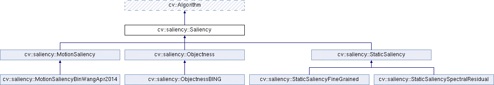
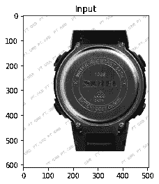
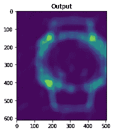
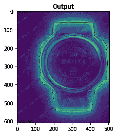

# OpenCV 静态显著性检测简而言之

> 原文：<https://towardsdatascience.com/opencv-static-saliency-detection-in-a-nutshell-404d4c58fee4?source=collection_archive---------11----------------------->

## 寻找佼佼者


Photo by [Justin Ha](https://unsplash.com/@mekanizm?utm_source=medium&utm_medium=referral) on [Unsplash](https://unsplash.com?utm_source=medium&utm_medium=referral)

显著性是图像的突出部分，使我们的大脑能够专注于该部分。当我们看到一幅图像时，这就是我们所关注的，引人注目的区域。比如，你有没有在广告中看到一些有趣的东西，让你停下来看一会儿？这就是广告的显著之处，即使你只是看了一眼，也能吸引你的兴趣。

# 安装 OpenCV

首先，你需要安装 OpenCV 库。如果您已经安装了 pip，您可以通过运行这些命令来完成。

```
> pip install opencv-python
> pip install opencv-contrib-python
```

要验证安装，您可以运行以下命令。

```
> python
Python 3.6.3 (v3.6.3:2c5fed8, Oct  3 2017, 18:11:49)
Type "help", "copyright", "credits" or "license" for more information.
>> import cv2
>> cv2.saliency
  <module 'cv2.saliency'>
```

# 静态显著性检测

有许多方法来检测显著性。在 OpenCV 中，为显著性检测提供的算法分为三类:



Saliency Diagram. Source : [OpenCV Documentation](https://docs.opencv.org/3.4/d9/dcd/classcv_1_1saliency_1_1Saliency.html)

我们将讨论静态显著性。静态显著性检测算法使用允许检测非动态图像的显著对象的不同图像特征。OpenCV 中已经实现了两种算法，谱残差算法和细粒度算法。

## 光谱剩余

该算法分析输入图像的对数谱，在谱域中提取图像的谱残差，并提出一种快速构建显著图的方法，该显著图给出了原型物体的位置。

> 相似意味着冗余。对于以最小化冗余视觉信息为目标的系统，它必须知道输入刺激的统计相似性。因此，在可以观察到相当大的形状相似性的不同对数谱中，值得我们注意的是从平滑曲线中跳出的信息。我们认为，光谱中的统计奇点可能是图像中出现异常区域的原因，在这些区域中会弹出原型物体。

而如果你绘制[显著图](https://en.wikipedia.org/wiki/Saliency_map)，你会得到下面的输出图像。



Spectral Residual

参考:侯、晓迪、。"显著性检测:一种谱残差方法."计算机视觉与模式识别，2007。07 年的 CVPR。IEEE 会议。IEEE，2007 年。

## 细粒

人眼的视网膜由神经节细胞组成。有两种类型的神经节细胞，位于中心和偏离中心。中央对黑暗背景包围的明亮区域做出反应。偏心对明亮背景包围的黑暗区域做出反应。

该算法基于中心和偏心差计算显著性。


On-center and off-center ganglion cells and their approximation on computational models of visual saliency. Source: B. Wang and P. Dudek “A Fast Self-tuning Background Subtraction Algorithm”, in proc of IEEE Workshop on Change Detection, 2014

> 在我们的例子中，通过使用通过所谓的积分图像的
> 中心-周围差异的有效实现，我们演示了一种在原始图像分辨率下实时生成视觉显著性的细粒度特征图的方法。

如果你绘制[显著图](https://en.wikipedia.org/wiki/Saliency_map)，你会得到下面的输出图像。



参考:B. Wang 和 P. Dudek，“一种快速自调整背景减除算法”，IEEE 变化检测研讨会论文集，2014 年

# 参考

[](https://docs.opencv.org/3.4/d9/dcd/classcv_1_1saliency_1_1Saliency.html) [## OpenCV:cv::studential::studential 类引用

### 公共成员函数|受保护成员函数|受保护属性|所有成员的列表

docs . opencv . org https://docs . opencv . org/3.4/d9/DCD/classcv _ 1 _ 1 saliency _ 1 _ 1 saliency . html](https://docs.opencv.org/3.4/d9/dcd/classcv_1_1saliency_1_1Saliency.html)