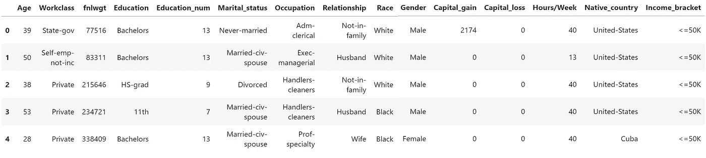
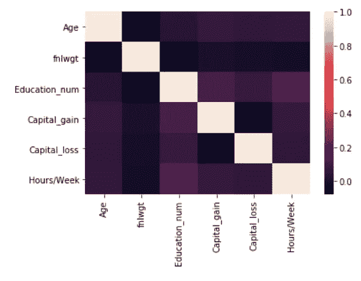
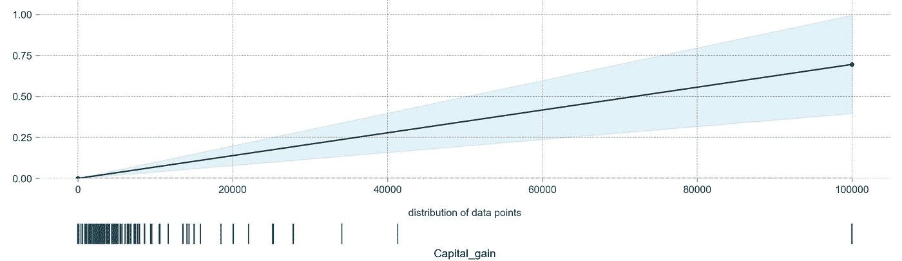
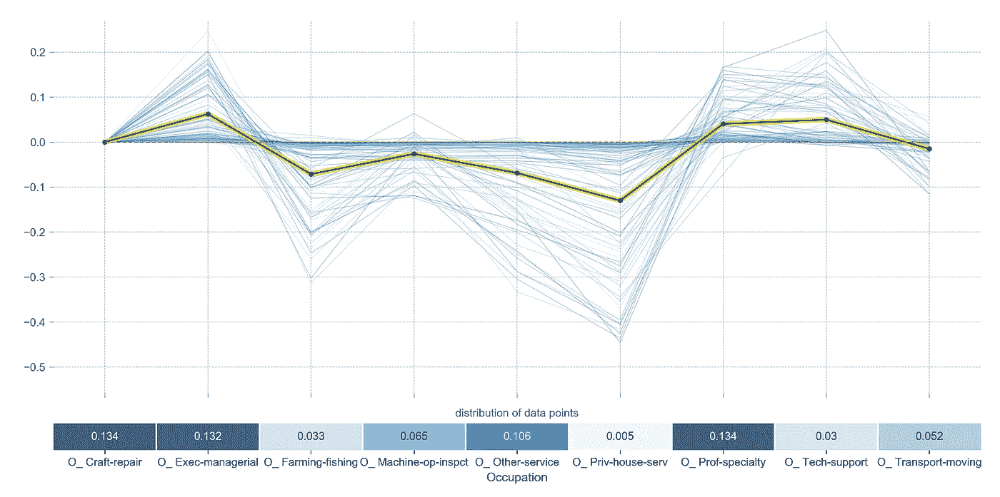
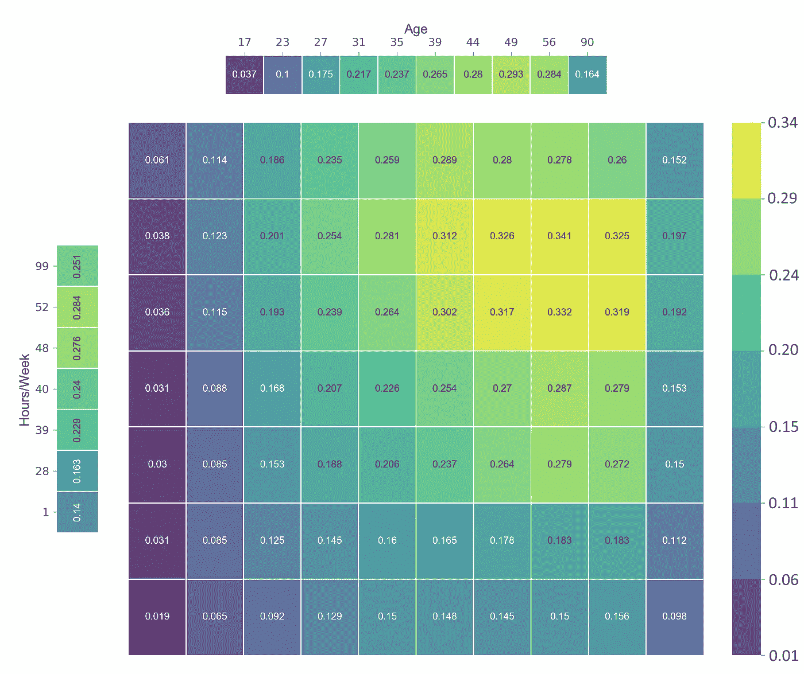
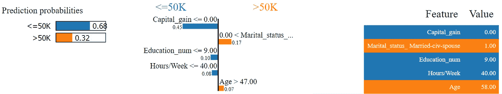
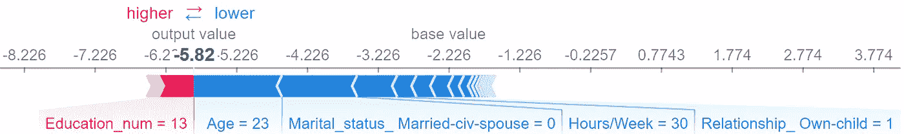
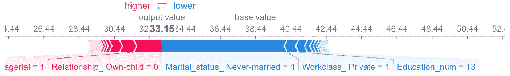
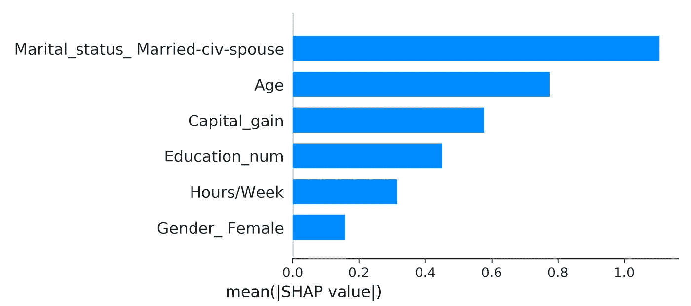
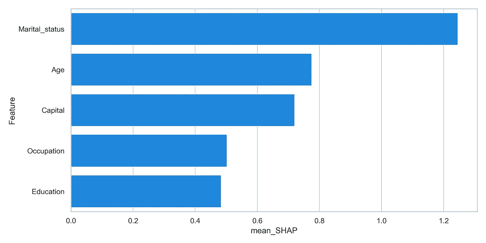

# 打开黑盒:如何利用可解释的机器学习

> 原文：<https://towardsdatascience.com/opening-black-boxes-how-to-leverage-explainable-machine-learning-dd4ab439998e?source=collection_archive---------15----------------------->

## 可解释-ML

## 使用 PDP、LIME 和 SHAP 制定可解释的决策，为利益相关方创造价值

随着机器学习和人工智能变得越来越受欢迎，越来越多的组织正在采用这项新技术。预测建模帮助流程变得更加高效，同时也让用户受益。人们可以根据你的专业技能和经验来预测你可能会挣多少钱。输出可能只是一个数字，但是用户通常想知道为什么给出这个值！

在本文中，我将展示一些创建可解释预测的方法，并引导您打开这些黑盒模型。


本文中使用的数据是美国成人收入数据集，通常用于预测某人的收入是低于 50K 还是高于 50K，这是一个简单的二元分类任务。你可以在这里获得数据[，或者你可以在这里](https://www.kaggle.com/johnolafenwa/us-census-data)跟随笔记本[。](https://github.com/MaartenGr/InterpretableML)

关于个人关系、职业、种族、性别等信息的数据相对简单。



# 建模

分类变量是一次性编码的，目标设置为 0 (≤50K)或 1 (>50K)。现在，假设我们想要使用一个模型，该模型以其在分类任务上的出色性能而闻名，但是高度复杂，并且输出难以解释。这个模型应该是 LightGBM，它与 CatBoost 和 XGBoost 一起经常用于分类和回归任务。

我们首先简单地拟合模型:

```
from lightgbm import LGBMClassifier
X = df[df.columns[1:]]
y = df[df.columns[0]]
clf = LGBMClassifier(random_state=0, n_estimators=100)
fitted_clf = clf.fit(X, y)
```

我应该注意到，为了防止任何过度拟合，你最好将训练/测试分割为附加的维持数据。

接下来，我使用 10 重交叉验证快速检查模型的性能:

```
from sklearn.model_selection import cross_val_score
scores_accuracy = cross_val_score(clf, X, y, cv=10)
scores_balanced = cross_val_score(clf, X, y, cv=10,    
                                  scoring="balanced_accuracy")
```

有趣的是，scores_accuracy 给出了 87%的 10 倍平均准确度，而 scores_balanced 给出了 80%。事实证明，目标变量是不平衡的，25%的目标属于 1，75%属于 0。因此，选择正确的验证方法非常重要，因为它可能会错误地指出一个好的模型。

现在我们已经创建了模型，接下来将解释它到底做了什么。由于 LightGBM 使用高效的梯度推进决策树，因此解释输出可能会很困难。

# 部分相关性图(PDP)

部分相关性图(DPD)显示了某个特性对基于预测的模型的结果的影响。为了提取感兴趣特征的重要性，它在特征的分布上忽略了模型输出。我使用的包 PDPbox 可以在这里找到。

## 假设

这种重要性计算基于一个重要的假设，即感兴趣的特征与所有其他特征(除了目标)不相关。这样做的原因是它将显示很可能是不可能的数据点。例如，体重和身高是相互关联的，但是 PDP 可能会显示目标体重较大而身高很小的影响，而这种组合是极不可能的。这可以通过在 PDP 底部展示一块地毯来部分解决。

## 相互关系

因此，我们检查特性之间的相关性，以确保没有问题:

```
import seaborn as sns
corr = raw_df.corr()
sns.heatmap(corr, 
 xticklabels=corr.columns,
 yticklabels=corr.columns)
```



我们可以看到，这些特征之间不存在强相关性。但是，稍后我将进行一些一次性编码，为建模准备数据，这可能会导致相关特征的创建。

## 连续变量

PDP 图可用于显示变量对所有数据点输出的影响。让我们先从一个显而易见的开始，一个连续变量，即*资本收益*，对目标的影响:

```
from pdpbox import pdp
pdp_fare = pdp.pdp_isolate(
    model=clf, dataset=df[df.columns[1:]], model_features=df.columns[1:], feature='Capital_gain'
)
fig, axes = pdp.pdp_plot(pdp_fare, 'Capital_gain', plot_pts_dist=True)
```



x 轴表示 capital_gain 可以取的值，y 轴表示它对二元分类概率的影响。很明显，随着一个人的*资本收益*增加，他们赚< 50K 的机会也随之增加。请注意，底部的数据点有助于识别不常出现的数据点。

## 独热编码变量

现在，如果你有一次性编码的分类变量呢？您可能希望单独查看类别的效果，而不必单独绘制它们。使用 PDPbox，您可以同时显示对多个二元分类变量的影响:

```
pdp_race = pdp.pdp_isolate(
    model=clf, dataset=df[df.columns[1:]],    
    model_features=df.columns[1:], 
    feature=[i for i in df.columns if 'O_' in i if i not in 
                          ['O_ Adm-clerical', 
                           'O_ Armed-Forces', 
                           'O_ Armed-Forces',
                           'O_ Protective-serv', 
                           'O_ Sales', 
                           'O_ Handlers-cleaners']])
fig, axes = pdp.pdp_plot(pdp_race, 'Occupation', center=True, 
                         plot_lines=True, frac_to_plot=100,  
                         plot_pts_dist=True)
```



在这里，你可以清楚地看到，无论是管理职位还是技术职位，都积极地影响着挣更多钱的可能性。如果你在捕鱼业工作，这种机会会减少。

## 变量之间的相互作用

最后，变量之间的交互可能会有问题，因为 PDP 将为组合创建值，如果变量高度相关，这是不可能的。

```
inter1 = pdp.pdp_interact(
    model=clf, dataset=df[df.columns[1:]], 
    model_features=df.columns[1:], features=['Age', 'Hours/Week'])
fig, axes = pdp.pdp_interact_plot(
    pdp_interact_out=inter1, feature_names=['Age', 'Hours/Week'], 
    plot_type='grid', x_quantile=True, plot_pdp=True)
```



这个矩阵告诉你，如果一个人 49 岁左右，每周工作大约 50 个小时，他可能会赚得更多。我应该注意的是，记住数据集中所有交互的实际分布是很重要的。有可能这个情节会向你展示一些很少或永远不会发生的有趣的互动。

# 局部可解释的模型不可知解释(LIME)

LIME 基本上试图远离导出全局特征的重要性，而是近似局部预测的特征的重要性。它通过获取行(或一组数据点)来进行预测，并基于该行生成虚假数据。然后，它会计算假数据和真实数据之间的相似性，并根据假数据和真实数据之间的相似性来估计更改的影响。我用的包可以在这里找到。

```
from lime.lime_tabular import LimeTabularExplainer
explainer = LimeTabularExplainer(X.values, feature_names=X.columns, 
                                 class_names=["<=50K", ">50K"], 
                                 discretize_continuous=True,
                                 kernel_width=5)i = 304
exp = explainer.explain_instance(X.values[i], clf.predict_proba, 
                                 num_features=5)
exp.show_in_notebook(show_table=True, show_all=False)
```



The output of LIME for a single row

输出显示了前 5 个变量对预测概率的影响。这有助于确定为什么您的模型会做出某种预测，而且还允许向用户进行解释。

## 不足之处

注意，LIME 试图为初始行寻找不同值的邻域(内核宽度)在某种程度上是一个可以优化的超参数。根据数据，有时您需要更大的邻域。找到正确的内核宽度需要一点反复试验，因为这可能会损害解释的可解释性。

# 沙普利附加解释(SHAP)

一个(相当)近期的发展是 Shapley 值在机器学习应用中的实现。本质上，SHAP 使用博弈论来跟踪每个变量的边际贡献(T2)。对于每个变量，它从数据集中随机抽取其他值，并计算模型得分的变化。然后，对每个变量的这些变化进行平均，以创建一个汇总分数，但也提供了某些变量对于特定数据点的重要性的信息。

点击[此处](https://github.com/slundberg/shap)查看我在分析中使用的软件包。要更深入地了解 SHAP 的理论背景，请点击[这里](/one-feature-attribution-method-to-supposedly-rule-them-all-shapley-values-f3e04534983d)。

## 可解释性的三个公理

SHAP 因其满足可解释性三个公理的能力而广受好评:

*   任何对预测值没有影响的要素的 Shapley 值都应该为 0(虚拟)
*   如果两个特征将相同的值添加到预测中，则它们的 Shapley 值应该相同(可替代性)
*   如果您想要合并两个或更多预测，您应该能够简单地添加根据单个预测计算的 Shapley 值(可加性)

## 二元分类

让我们看看，如果我们要计算单行的 Shapley 值，结果会是什么:

```
import shap
explainer = shap.TreeExplainer(clf)
shap_values = explainer.shap_values(X)
shap.initjs()
shap.force_plot(explainer.expected_value, shap_values[1,:],  
                X.iloc[1,:])
```



Shapley values for a single data point

该图显示了用于指示预测方向的基值。由于大多数目标都是 0，所以看到基值为负并不奇怪。

红色条表示如果 E*education _ num*为 13，目标为 1 (>50K)的概率增加了多少。高等教育通常会带来更多的收入。

蓝条显示这些变量降低了概率，其中*年龄*的影响最大。这是有道理的，因为年轻人通常挣得更少。

## 回归

当涉及回归(连续变量)而不是二元分类时，Shapley 直观地工作得更好。仅举一个例子，让我们训练一个模型，从相同的数据集中预测年龄:

```
# Fit model with target Age
X = df[df.columns[2:]]
y = df[df.columns[1]]
clf = LGBMRegressor(random_state=0, n_estimators=100)
fitted_clf = clf.fit(X, y)# Create Shapley plot for one row
explainer = shap.TreeExplainer(clf)
shap_values = explainer.shap_values(X)
shap.initjs()
i=200
shap.force_plot(explainer.expected_value, shap_values[i,:], X.iloc[i,:])
```



Shapley values for a single data point

在这里，你可以很快观察到，如果你从未结过婚，预测的年龄会降低大约 8 岁。与分类任务相比，这更有助于解释预测，因为您直接谈论的是目标的值而不是其概率。

## 独热编码特征

加法公理允许对所有数据点上的每个特征的 Shapley 值求和，以创建平均绝对 Shapley 值。换句话说，它赋予全局特征重要性:

```
shap.summary_plot(shap_values, X, plot_type="bar", show=False)
```



但是，您可以立即看到使用一次性编码要素的 Shapley 值的问题，这些值是为每个一次性编码要素显示的，而不是它们最初表示的内容。

幸运的是，加法公理允许将每个一位热编码生成特征的 Shapley 值相加，作为整个特征的 Shapley 值的表示。

首先，我们需要对独热编码特征的所有 Shapley 值求和:

```
summary_df = pd.DataFrame([X.columns, 
                           abs(shap_values).mean(axis=0)]).T
summary_df.columns = ['Feature', 'mean_SHAP']mapping = {}
for feature in summary_df.Feature.values:
    mapping[feature] = featurefor prefix, alternative in zip(['Workclass', 'Education',  
                                    'Marital_status', 'O_',  
                                    'Relationship', 'Gender',   
                                    'Native_country', 'Capital',  
                                    'Race'],
                                   ['Workclass', 'Education', 
                                    'Marital_status', 'Occupation', 
                                    'Relationship', 'Gender', 
                                    'Country', 'Capital', 'Race']):
        if feature.startswith(prefix):
            mapping[feature] = alternative
            break

summary_df['Feature'] = summary_df.Feature.map(mapping)
shap_df = (summary_df.groupby('Feature')
                    .sum()
                    .sort_values("mean_SHAP", ascending=False)
                    .reset_index())
```

现在，所有 Shapley 值都是所有要素的平均值，并对唯一热码编码要素求和，我们可以绘制最终的要素重要性:

```
import seaborn as sns
import matplotlib.pyplot as plt
sns.set(style="whitegrid")
f, ax = plt.subplots(figsize=(6, 15))
sns.barplot(x="mean_SHAP", y="Feature", data=shap_df[:5],
            label="Total", color="b")
```



我们现在可以看到*职业*比最初的 Shapley 概要情节显示的要重要得多。因此，在向用户解释特性的重要性时，一定要充分利用附加性。他们可能更感兴趣的是*职业*有多重要，而不是具体的*职业*。

# 结论

虽然这肯定不是第一篇讨论可解释和可说明的 ML 的文章，但是我希望这有助于您理解在开发您的模型时如何使用这些技术。

围绕 SHAP 有一个重要的讨论，我希望使用一键编码的特性来演示可加性公理会给如何使用这种方法带来更多的直觉。

# 感谢您的阅读！

如果你像我一样，对人工智能、数据科学或心理学充满热情，请随时在 [LinkedIn](https://www.linkedin.com/in/mgrootendorst/) 上添加我，或者在 [Twitter](https://twitter.com/MaartenGr) 上关注我。

本文中的所有示例和代码都可以在这里找到:

[https://github.com/MaartenGr/InterpretableML](https://github.com/MaartenGr/InterpretableML)

任何反馈和意见，一如既往，非常感谢！