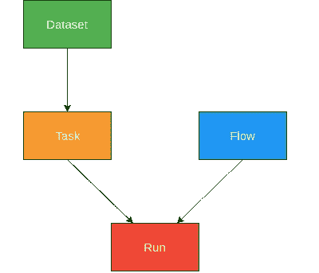

# OpenML:作为社区的机器学习

> 原文：<https://towardsdatascience.com/openml-machine-learning-as-a-community-d678306e1a7e?source=collection_archive---------17----------------------->

OpenML 是一个在线机器学习(ML)实验数据库，每个人都可以免费使用。其核心思想是拥有一个数据集和 ML 实验结果的单一存储库。尽管近年来获得了很大的流行，现在有太多的工具可用，大量的 ML 实验继续在筒仓中发生，并且不一定作为一个完整的共享社区。

在这篇文章中，我们将尝试简要了解 OpenML 提供了什么，以及它如何适应我们当前的机器学习实践。

让我们直接通过建立一个简单的机器学习模型来让我们的手*变脏*。如果我们寻找的是简单性，那就是我们将要使用的 [*虹膜数据集*](https://en.wikipedia.org/wiki/Iris_flower_data_set) 。在下面的示例脚本中，我们将加载 scikit-learn 提供的 Iris 数据集，使用 10 重交叉验证来评估 10 棵树的随机森林。听起来很琐碎，而且实际上不到 10 行代码。

一个简单的脚本，我们实现了平均准确率为 95.33%。那很容易。令人惊讶的是，我们已经在 ML 工具上取得了如此大的进步，使得入门变得非常容易。因此，我们每天都有成千上万的人使用这些工具。这不可避免地导致了车轮的重新发明。每个单独的 ML 从业者执行的任务通常有很大的重叠，可以通过重用来自*社区*的人已经完成的任务来省略。说到底，我们并没有从头开始构建一个随机的森林模型。我们很乐意重用来自*社区*的慷慨人士编写的代码。我们这个物种的特殊属性是作为一个集体工作的能力，在这个集体中，我们的智慧总和大于个体的总和。为什么不为 ML 做同样的事情呢？我的意思是，我可以看看其他 ML 从业者做了什么来在 *Iris* 数据集上获得更好的分数吗？

回答这个问题是这篇文章的目标之一。我们将随后在 OpenML 的帮助下探索这是否可行。然而，首先，我们应该简单地熟悉一些术语，看看我们如何将前面看到的例子分解成模块化组件。

## **OpenML 组件**



Image Source: [https://medium.com/open-machine-learning/openml-1e0d43f0ae13](https://medium.com/open-machine-learning/openml-1e0d43f0ae13)

**数据集** : OpenML 容纳了超过 2k+ *的活跃*数据集，用于各种回归、分类、聚类、生存分析、流处理任务等。任何用户都可以上传数据集。一旦上传，服务器计算数据集上的某些元特征— *类的数量*、*缺失值的数量*、*特征的数量*等。关于我们前面的例子，下面一行相当于从 OpenML 中获取一个数据集。

```
X, y = datasets.load_iris(return_X_y=True)
```

**任务**:一个任务链接到一个特定的数据集，定义目标/因变量是什么。还规定了评估措施，如— *准确度*、精度、曲线下面积等。或者要使用的估计程序的种类，例如 10 重*交叉验证*、n%维持集等。关于我们之前的例子，下面函数调用的*参数*捕获了任务的思想。

```
scores = cross_val_score(clf, X, y, cv=5, scoring='accuracy')
```

**流程**:描述要执行的建模种类。它可以是一个*流程*或一系列步骤，即 scikit-learn 管道。现在，我们已经使用了一个简单的随机森林模型，它是这里的*流*组件。

```
clf = RandomForestClassifier(n_estimators=10, max_depth=2)
```

**运行**:将一个*流程*和*任务*配对在一起，产生一个*运行*。*运行*具有由服务器转化为*评估*的预测。这被该行的*执行*有效地捕获:

```
scores = cross_val_score(clf, X, y, cv=5, scoring='accuracy')
```

现在，这可能看起来有点混乱，因为我们正在尝试划分一个简单的 10 行代码，它工作得很好。然而，如果我们花几秒钟浏览一下上面解释的 4 个组件，我们可以看到，它使我们在 Iris 上对随机森林的*训练成为一系列模块化任务。模块是计算机科学中的一个基本概念。它们就像乐高积木。一旦我们有了模块，就意味着我们可以轻松地即插即用了。下面的代码片段试图使用所描述的 OpenML 组件的思想重写前面的例子，以展示我们在实验中可能获得的收益。*

因此，我们可以组合各种不同的任务、流程，它们是独立的操作。然后，运行可以将任何这样的任务和流配对，以构建一个 ML *工作流*并返回评估的分数。这种方法可以帮助我们一次性定义这样的组件，并且我们可以将其扩展到数据集、模型的任何组合，以及将来的任何数量的评估。想象一下，如果整个 ML *社区*定义这样的任务和他们在日常实践中使用的各种简单到复杂的流程。我们可以构建定制的 ML 工作流水线，甚至可以将我们的技术在同一个*任务*上的表现与其他人进行比较！OpenML 正是以此为目标。在这篇文章的下一部分，我们将触及 OpenML 的表面，看看我们是否真的可以用 OpenML 做它承诺的事情。

# 使用 OpenML

OpenML-Python 可以使用 *pip* 或者通过[克隆 *git repo*](https://openml.github.io/openml-python/develop/contributing.html#installation) 并安装当前开发版本来安装。那么我们应该安装 OpenML 吗？；)如果在阅读本文时试用代码片段，将会非常有益。包含所有代码的 Jupyter 笔记本可以在[这里](https://nbviewer.jupyter.org/github/Neeratyoy/openml-python/blob/blog/OpenML%20-%20Machine%20Learning%20as%20a%20community.ipynb)找到。

现在我们已经有了 OpenML，让我们直接来弄清楚如何从那里获得 Iris 数据集。我们可以随时浏览 [OpenML 网站](https://www.openml.org/)搜索 Iris。那是一条容易的路线。让我们熟悉编程方法，并学习如何钓鱼。OpenML-Python API 可以在这里找到[。](https://openml.github.io/openml-python/develop/api.html)

## 从 OpenML 中检索虹膜

在下面的例子中，我们将列出 OpenML 中所有可能的数据集。我们可以选择输出格式。我将使用*数据框架*，这样我们就可以获得一个熊猫数据框架，并且可以得到一个简洁的表格表示来搜索和排序特定的条目。

列名表明它们包含关于每个数据集的元信息，在这种情况下，我们可以访问由数据帧形状表示的 **2958** 数据集。我们将尝试在*名称*列中搜索“*虹膜*，并使用*版本*列对结果进行排序。

好的，所以版本为 1 的虹膜数据集的 ID 为 **61** 。为了验证，我们可以在[网站上查看数据集 ID 61](https://www.openml.org/d/61) 。我们可以看到，我们感兴趣的是原始的虹膜数据集——3 类 50 个实例，具有 4 个数字特征。然而，我们将按照承诺，以编程方式检索相同的信息。

有了合适的数据集，让我们简单回顾一下我们之前讨论过的术语。到目前为止，我们只使用了*数据集*组件。*数据集*组件与*任务*组件紧密相连。重申一下，*任务*将描述*如何使用*数据集。

## 从 OpenML 中检索相关任务

我们将首先列出 Iris 数据集的所有可用任务。然而，我们只是将 Iris 视为一个监督分类问题，因此将相应地进行过滤。接下来，我们将只收集与我们相关的任务的任务 id。

这也解决了*任务*组件。请注意，对于一个*数据集* (61)，我们获得了 11 个我们感兴趣的任务 id。这应该说明了*数据集-任务组件*可以具有的*一对多*关系。我们还有 2 个组件需要探索— *流*、*运行。我们可以列出所有可能的流，过滤出我们想要的，即随机森林。然而，让我们取而代之的是使用我们上面收集的 11 个任务在 Iris 数据集上进行的所有评估。*

随后，我们将使用上传/使用最多的基于 scikit-learn 的任务。然后，我们将根据是否使用了随机森林，从所选任务中进一步筛选出评估列表(在本例中为 task_id= **59** )。

## 从 OpenML 中检索性能最佳的模型

因为我们是一群雄心勃勃的 ML 从业者，他们只满足于最好，也因为如果不匹配或击败最先进的技术，大多数结果将不会被认为是值得努力的。我们将根据分数或'*值* ' 对过滤后的结果进行排序，然后从那个*运行—任务*和*流程中提取组件。*

好吧，让我们暂停一下，重新评估一下。从全球多个将跑步上传到 OpenML 的用户来看，对于 Iris 上的随机森林跑步，目前看到的最好成绩是 **96.67%** 。这当然比我们当初构建的幼稚模型要好，以达到 **95.33%** 。我们使用了一个基本的 10 重交叉验证来评估一个最大深度为 2 的 10 棵树的随机森林。让我们看看*最佳*跑步使用了什么，以及它是否与我们的方法不同。

显然，我们最初的方法在两个方面是不同的。我们没有明确使用分层抽样进行交叉验证。而随机森林超参数也略有不同( *max_depth=None* )。这听起来绝对像是一件*要做的事情*，然而，我们没有理由把自己限制在随机森林中。记住，我们的目标是*大*这里。考虑到 OpenML 用户的数量，肯定有人在 Iris 上用其他模型得到了更好的分数。然后让我们检索这些信息。当然是程序性的。

总之，我们现在将根据任务定义，使用 *task_id=59* 对 Iris 数据集上所有基于 scikit-learn 的模型的性能进行排序。

使用 SVM 的[变体，在上传的结果中获得的最高分是 **98.67%** 。但是，如果我们检查相应的流描述，我们会发现它使用的是旧的 scikit-learn 版本(0.18.1 ),因此可能无法复制准确的结果。然而，为了提高我们 95.33%的分数，我们应该试着对同一个问题运行一个 *nu-SVC* ，看看我们站在哪里。让我们去争取吧。当然是通过 OpenML。](https://scikit-learn.org/stable/modules/generated/sklearn.svm.NuSVC.html#sklearn.svm.NuSVC)

## 在所需任务上运行最佳性能流程

瞧啊！我们达到了神奇的数字。我个人从来没有尝试过 NuSVC，并且一直在调整随机森林的超参数。这无疑是一个新的发现。我想知道是否有人在 Iris 上尝试过 XGBoost？

无论如何，我们现在可以使用以下代码将这次运行的结果上传到 OpenML:

```
r.publish()
```

人们需要登录到[https://www.openml.org/](https://www.openml.org/)并生成他们各自的 *apikey* 。然后，结果将可供每个人查看，谁知道呢，你可以在 Iris 数据集上用你的名字来对比*有史以来最好的*性能！

这篇文章并不打算成为 OpenML 的终极指南。主要目标是帮助形成对 OpenML 术语的了解，介绍 API，建立与一般 ML 实践的联系，并让我们先睹为快作为一个*社区*一起工作的潜在好处。为了更好地理解 OpenML，请浏览[文档](https://openml.github.io/openml-python/develop/usage.html#usage)。如果你想继续这篇文章中给出的例子并进一步探索，请参考 [API](https://openml.github.io/openml-python/develop/api.html) 。

OpenML-Python 是一个开源项目，非常欢迎每个人以问题和请求的形式做出贡献。对 OpenML 社区的贡献实际上不仅限于代码贡献。每一个用户都可以通过使用 OpenML 共享数据、实验和结果来丰富社区。

作为 ML 从业者，我们可能依赖工具来完成我们的任务。然而，作为一个集体，我们可以在更大程度上挖掘其潜力。让我们一起，让 ML 更透明，更民主！

特别感谢 [Heidi](https://medium.com/@HeidiBaya) 、[bulge](https://medium.com/@bilgecelik_52259)、 [Sahithya](https://medium.com/@sahismiley11) 、 [Matthias](https://medium.com/@mfeurer) 、 [Ashwin](https://medium.com/@ashraaghav) 的想法、反馈和支持。

参考链接:

*   [开始使用 OpenML-Python](https://openml.github.io/openml-python/develop/)
*   [OpenML-Python Github](https://github.com/openml/openml-python)
*   [OpenML 网站](https://www.openml.org/)
*   [OpenML 上的杂项阅读](https://medium.com/open-machine-learning)
*   [赶紧联系！](https://www.openml.org/contact)