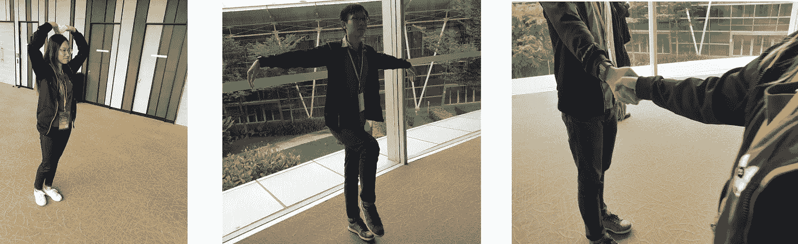
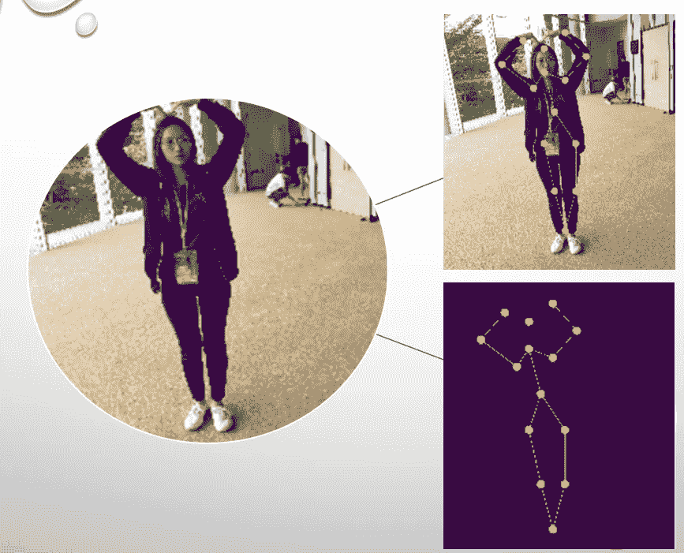
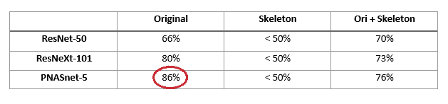
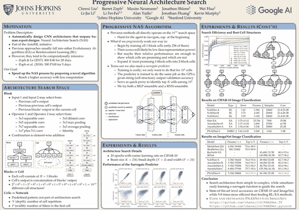

# OpenPose，PNASNet 5 进行姿势分类比赛(Fastai)

> 原文：<https://towardsdatascience.com/openpose-pnasnet-5-for-pose-classification-competition-fastai-dc35709158d0?source=collection_archive---------9----------------------->

我最近参加了一个当地的人工智能比赛，挑战包括 15 个不同类别的人体姿势分类。这是我第一次参加人工智能比赛，这是一次令人羞愧的经历。基于我们的模型准确性、创造力和团队合作，我的团队获得了亚军。我肯定会推荐学习者参加竞赛或黑客马拉松，因为它们是一个很好的网络平台和训练场地，可以磨练你的技术技能。在这里，我将向您介绍我们的模型构建过程，该过程最终帮助我们在最终测试集上实现了 83%的高准确率。

我们面临的挑战是开发一种图像分类算法，可以区分 15 种不同的人类姿势。

姿势是:

椅子式、儿童式、轻拍式、手枪式、握手式、HulkSmash 式、KoreanHeart 式、KungfuCrane 式、KungfuSalute 式、敬礼式、战士式、鹰式、胸部撞击式、高跪式和蜘蛛侠式

根据竞赛条款和条件，我们无权发布数据集。因此，以下所有图片都是我们在比赛期间拍摄的。



Left to Right— KoreanHeart, KungfuCrane, HandShake

训练数据集中的每个类包含大约 100 幅图像，而验证集中的每个类有 25 幅图像。对于 15 个类别的分类任务来说，这是相对少量的数据，说明了我们需要通过拍摄自己的图像来增加数据集。

penPose 是一种人体姿态估计和特征提取步骤，用于检测图像中的人体。使用该模型来标识各个身体部位的关键点，并且可以绘制连接这些关键点的人体骨架。从每幅图像中提取人体姿态作为预处理步骤，以减少数据中的噪声。

通过大量参考这个[站点](https://www.learnopencv.com/deep-learning-based-human-pose-estimation-using-opencv-cpp-python/)，我们使用预先训练好的 MPII 模型生成了每张图像的关键点。

```
cwd = os.getcwd()# Specify the paths for the 2 files
 protoFile = "{}/pose_deploy_linevec_faster_4_stages.prototxt".format(cwd)
 weightsFile = "{}/pose_iter_160000.caffemodel".format(cwd)
 nPoints = 15
 POSE_PAIRS = [[0,1], [1,2], [2,3], [3,4], [1,5], [5,6], [6,7], [1,14], [14,8], [8,9], [9,10], [14,11], [11,12], [12,13] ]

 # Read the network into Memory
 net = cv2.dnn.readNetFromCaffe(protoFile, weightsFile)frameWidth = 640
 frameHeight = 480
 threshold = 0.1# Forward training set into OpenPose model to generate outputinWidth = 299
 inHeight = 299m = train_images.shape[0]
 train_outputs = np.zeros((1,44,38,38))for i in range(m):
   inpBlob = cv2.dnn.blobFromImage(train_images[i], 1.0/255,    (inWidth, inHeight),(0, 0, 0), swapRB=True, crop=False)net.setInput(inpBlob)
   output = net.forward()
   train_outputs = np.vstack((train_outputs,output))

 outputs = np.delete(train_outputs,(0),axis=0)
 H = train_outputs.shape[2]
 W = train_outputs.shape[3]
 print(train_outputs.shape)# Generate keypoints for training set
 m = 973
 H = 38
 W = 38train_points = np.zeros((m,15,2))for sample in range(m):
   for i in range(nPoints):
       # confidence map of corresponding body's part.
       probMap = train_outputs[sample, i, :, :]# Find global maxima of the probMap.
       minVal, prob, minLoc, point = cv2.minMaxLoc(probMap)# Scale the point to fit on the original image
       x = (frameWidth * point[0]) / W
       y = (frameHeight * point[1]) / H
       if prob > threshold :
           train_points[sample,i,0] = int(x)
           train_points[sample,i,1] = int(y)
```

接下来，使用存储在变量 train_points 中的关键点，在每幅图像上绘制一个人体骨架。

```
# Processed images with sticks on original image
 train_processed = np.copy(train_images).astype(np.uint8)for sample in range(m):
   for point in range(nPoints):
     if train_points[sample,point,0] !=0 and train_points[sample,point,1] !=0 :
       cv2.circle(train_processed[sample], (int(train_points[sample,point,0]), int(train_points[sample,point,1])), 10, (255,255,0), thickness=-1, lineType=cv2.FILLED)

     # draw lines 
     for pair in POSE_PAIRS:
       partA = pair[0]
       partB = pair[1]if train_points[sample,partA,0] != 0 and train_points[sample,partA,1] != 0 and train_points[sample,partB,0] != 0 and train_points[sample,partB,1] != 0:
          cv2.line(train_processed[sample], (int(train_points[sample,partA,0]),int(train_points[sample,partA,1]))
                   , (int(train_points[sample,partB,0]),int(train_points[sample,partB,1])), (255,255,0), 3)# Processed images with sticks on a black backgroundtrain_processed_grey = np.zeros((m,train_images.shape[1],train_images.shape[2],1)).astype(np.uint8)for sample in range(m):
   for point in range(nPoints):
     if train_points[sample,point,0] !=0 and train_points[sample,point,1] !=0 :
       cv2.circle(train_processed_grey[sample], (int(train_points[sample,point,0]), int(train_points[sample,point,1])), 10, (1), thickness=50, lineType=cv2.FILLED)

     # draw lines 
     for pair in POSE_PAIRS:
       partA = pair[0]
       partB = pair[1]if train_points[sample,partA,0] != 0 and train_points[sample,partA,1] != 0 and train_points[sample,partB,0] != 0 and train_points[sample,partB,1] != 0:
          cv2.line(train_processed_grey[sample], (int(train_points[sample,partA,0]),int(train_points[sample,partA,1]))
                   , (int(train_points[sample,partB,0]),int(train_points[sample,partB,1])), (1), 3)
```

通过这一步，我们获得了 3 个不同的数据集；

1.  原象
2.  原始图像+骨架叠加
3.  背景空白的骨架



T 转移学习允许我们使用比从头开始训练算法所需的数据少得多的数据来训练深度神经网络。它还经常导致更高精度的模型，因为来自大数据集的信息被转移和训练以适合我们的数据。对于这次比赛，我的团队决定测试 3 个预训练模型的性能，即 ResNet-50、ResNeXt-101 和 PNASnet-5。所有模型都是使用 fastai 库构建的。

```
import fastai
 from fastai.metrics import error_ratefrom torchvision.models import *
 import pretrainedmodels
 from fastai.callbacks.tracker import SaveModelCallback
 from fastai.vision import *
 from fastai.vision.models import *
 from fastai.vision.learner import model_metabs = 8# Importing of datasetdata = ImageDataBunch.from_folder(base_dir,train='train',valid='val', ds_tfms = get_transforms(), size =299, bs=bs).normalize(imagenet_stats)#ResNet-50
 models.resnet50#ResNeXt-101def resnext101_64x4d(pretrained=True):
     pretrained = 'imagenet' if pretrained else None
     model = pretrainedmodels.resnext101_64x4d(pretrained=pretrained)
     all_layers = list(model.children())
     return nn.Sequential(*all_layers[0], *all_layers[1:])#PASNet-5def identity(x): return xdef pnasnet5large(pretrained=True):    
     pretrained = 'imagenet' if pretrained else None
     model = pretrainedmodels.pnasnet5large(pretrained=pretrained, num_classes=1000) 
     model.logits = identity
     return nn.Sequential(model)# Training of modellearn = cnn_learner(data, model, metrics = accuracy)learn.fit(20,callbacks=[SaveModelCallback(learn,monitor='accuracy',every="improvement",name ="top_acc")])learn.lr_find()
 learn.recorder.plot()learn.unfreeze()
 learn.fit_one_cycle(5,callbacks=[SaveModelCallback(learn,monitor='accuracy',every="improvement",name="top_acc_1")])
```

我们总共构建了 9 个模型，每个模型都用我们生成的数据集进行了预训练。以下是结果；



对于最终的测试集，我们使用在原始模型上训练的 PNASnet-5 模型预测了未知数据集的分类，并获得了 83%的准确率，使我们在比赛中获得了第三名。

这就是使用 PNASnet-5 预训练模型的人体姿势分类。令人失望的是，OpenPose 特征提取没有提高模型的准确性，但我相信在比赛的时间限制下，我们做得很好。对于那些想知道 PNASnet-5 如何比其他预训练模型表现得更好的人，下面是作者对算法的总结。



[https://cs.jhu.edu/~cxliu/posters/pnas_poster.pdf](https://cs.jhu.edu/~cxliu/posters/pnas_poster.pdf)