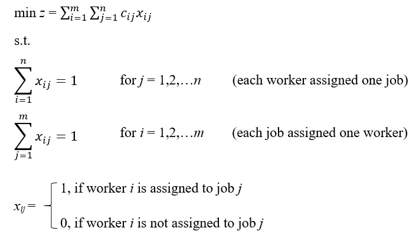
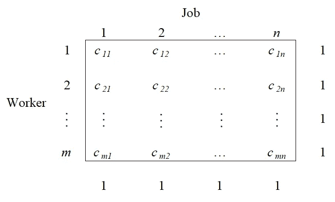
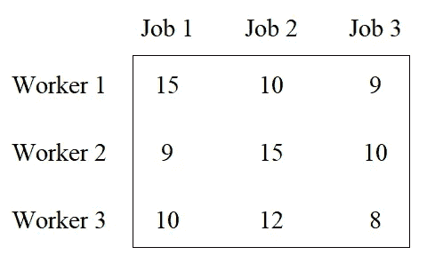
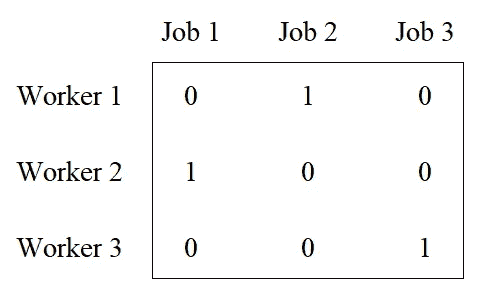

# R-指派问题的运筹学

> 原文：<https://towardsdatascience.com/operations-research-in-r-assignment-problem-4a1f92a09ab?source=collection_archive---------15----------------------->

## r 代表工业工程师

## 探索“LP solve”*R*包

Image by Momentista available at [Unsplash](https://unsplash.com/photos/IbsJgYPxE4k)

# **分配问题**

指派问题是线性规划问题的特例；它是数学中最优化或运筹学分支中的基本组合优化问题之一。它的目标在于将 *m* 资源(通常是工人)一对一地分配给 *n* 任务(通常是工作),同时最小化分配成本。一般来说，所有的工作都必须由一个工人来完成，并且每个工人都必须被指派专门的工作。任何工人都可以被指派执行任何工作，产生一些费用，这些费用可能因工作任务的不同而不同。

**基本符号:**

*   *m* =职工人数( *i* = 1 … *m*
*   *n* =工作数量( *j* = 1 … *n*
*   *c i，j* =将工人 *i* 分配到工作 *j* 的单位成本
*   *x i，j* =分配给作业 *j* 的工人 *i* (如果分配则为 1，否则为 0)

注: *m* (工作人数)必须等于 *n* (工作人数)。

**配方:**

LP Assignment Problem — Formulation

LP Assignment Problem — Diagram

来自 R 的 *lpSolve* 包包含了解决线性规划指派问题的特定函数。对于下面的例子，让我们考虑下面要求解的数学模型:

LP Assignment Problem — Example

我们来看看 R 代码！

Assignment Problem R Code

**解决方案:**

LP Assignment Problem — Solution

总分配成本:27 美元

上表显示了在满足约束条件的情况下，分配给工作 *j* 的工人 *i* 的最佳组合。必须分别将员工 1 分配给职务 2，将员工 2 分配给职务 1，将员工 3 分配给职务 3。没有其他可能的分配组合会导致更低的分配成本。

# 总结想法

指派问题代表了用于以最佳方式分配资源(主要是劳动力)的线性规划问题的特殊情况；对于运营和项目经理来说，这是优化成本的一个非常有用的工具。LP solve R 包允许我们只用很少几行代码就能解决 LP 赋值问题。虽然有其他免费的优化软件(如 GAMS、AMPL、TORA、LINDO)，但在您的个人代码库中存储 LP 分配问题 R 代码可以节省您大量的时间，因为您不必从头开始编写公式，而只需更改相应矩阵的系数和符号。

*— —*

*如果你觉得这篇文章有用，欢迎在* [*GitHub*](https://github.com/rsalaza4/R-for-industrial-engineering/blob/master/Operations%20Research/Assignment%20Problem.R) *上下载我的个人代码。你也可以直接在 rsalaza4@binghamton.edu 给我发邮件，在*[*LinkedIn*](https://www.linkedin.com/in/roberto-salazar-reyna/)*上找到我。有兴趣了解工程领域的数据分析、数据科学和机器学习应用的更多信息吗？通过访问我的媒体* [*个人资料*](https://robertosalazarr.medium.com/) *来探索我以前的文章。感谢阅读。*

罗伯特